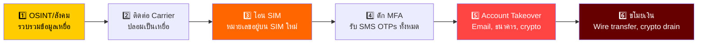
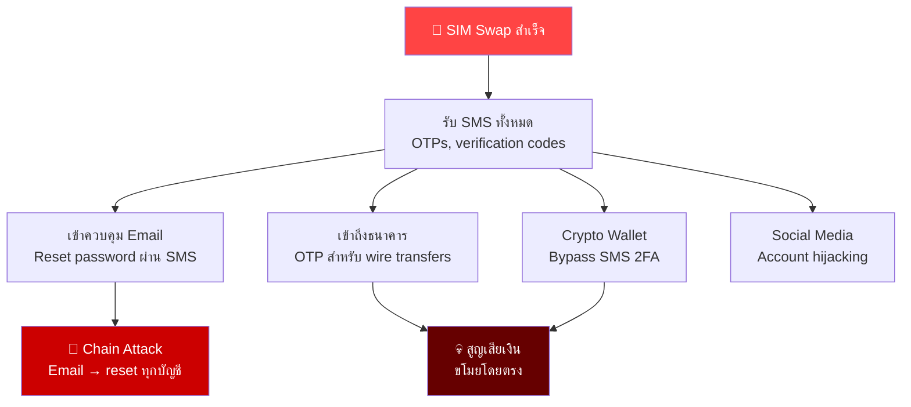
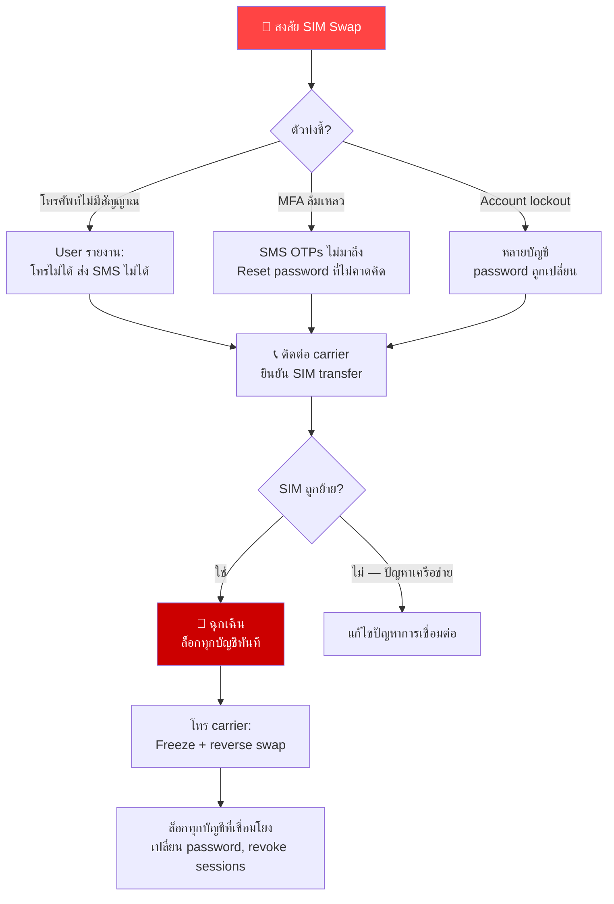
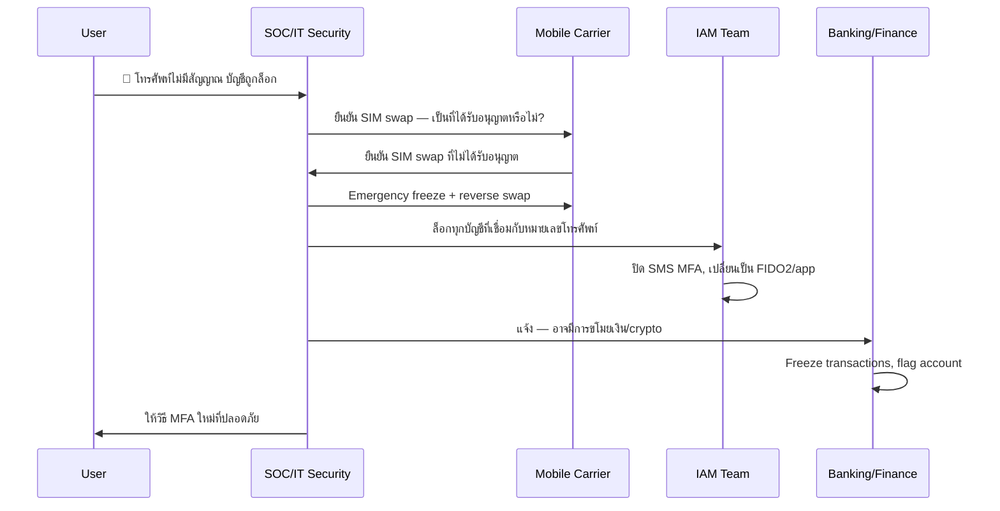
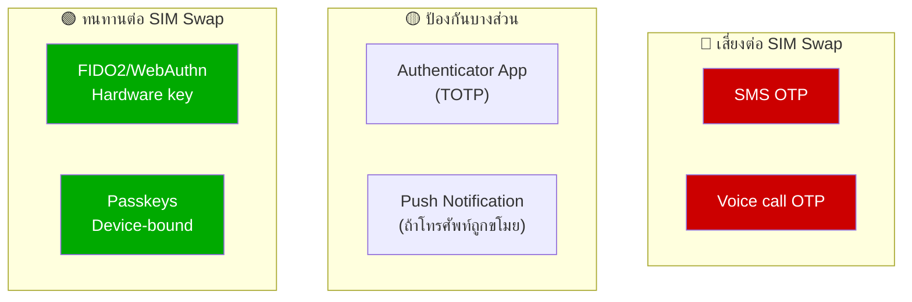

# Playbook: การตอบสนอง SIM Swap / SIM Hijacking

**ID**: PB-46
**ความรุนแรง**: วิกฤต | **ประเภท**: Credential Access / Social Engineering
**MITRE ATT&CK**: [T1111](https://attack.mitre.org/techniques/T1111/) (MFA Interception), [T1078](https://attack.mitre.org/techniques/T1078/) (Valid Accounts)
**Trigger**: User รายงาน (โทรศัพท์ไม่มีสัญญาณ), MFA SMS ล้มเหลว, carrier แจ้งเตือนฉ้อโกง, account takeover หลังโอนหมายเลขโทรศัพท์

> ⚠️ **วิกฤต**: SIM swap bypass SMS-based MFA ทั้งหมด ผู้โจมตีเอาหมายเลขโทรศัพท์ไป รับ OTPs ทั้งหมด และเข้าควบคุม email, ธนาคาร, และ crypto

### SIM Swap Attack Chain



### แผนผังผลกระทบ SIM Swap



---

## Decision Flow



### การประสานงานตอบสนอง



### เปรียบเทียบความเสี่ยง MFA



### Timeline

```mermaid
gantt
    title SIM Swap Response Timeline
    dateFormat HH:mm
    axisFormat %H:%M
    section Detection
        User รายงานปัญหา      :a1, 00:00, 5min
        ยืนยันกับ carrier      :a2, after a1, 15min
    section Containment
        Freeze หมายเลขโทรศัพท์ :a3, after a2, 10min
        ล็อกทุกบัญชี           :a4, after a3, 15min
    section Recovery
        Reverse SIM swap       :a5, after a4, 30min
        Reset passwords ทั้งหมด :a6, after a5, 60min
        เปลี่ยน MFA เป็น FIDO2 :a7, after a6, 30min
    section Investigation
        ประเมินความเสียหายทางเงิน :a8, after a7, 120min
```



---

## 1. การดำเนินการทันที (15 นาทีแรก)

| # | การดำเนินการ | ผู้รับผิดชอบ |
|:---|:---|:---|
| 1 | ติดต่อ mobile carrier — ยืนยัน SIM swap ที่ไม่ได้รับอนุญาต | User / SOC |
| 2 | ขอ carrier freeze หมายเลขและ reverse swap | SOC |
| 3 | ล็อกทุกบัญชีที่ใช้หมายเลขโทรศัพท์สำหรับ MFA | IAM Team |
| 4 | ตรวจ email สำหรับ password reset notifications | SOC T1 |
| 5 | แจ้งธนาคาร/การเงินสำหรับ potential fraud | Finance |
| 6 | เปลี่ยน passwords บนทุกบัญชีสำคัญ | User / IAM |

## 2. รายการตรวจสอบ

### สืบสวนผ่าน Carrier
- [ ] SIM swap เกิดขึ้นเมื่อไหร่? (timestamp ที่แน่นอน)
- [ ] ร้าน/ช่องทางไหนที่ดำเนินการ swap?
- [ ] เอกสารยืนยันตัวตนอะไรถูกใช้?
- [ ] เป็นช่องทาง in-person, online, หรือโทรศัพท์?

### ประเมินผลกระทบบัญชี
- [ ] บัญชีไหนใช้ SMS MFA เชื่อมกับหมายเลขนี้?
- [ ] มี password resets ที่ถูก trigger ระหว่างช่วง swap หรือไม่?
- [ ] ตรวจธนาคาร/crypto สำหรับ transactions ที่ไม่ได้รับอนุญาต
- [ ] ตรวจ social media สำหรับ posts/messages ที่ไม่ได้รับอนุญาต

## 3. การควบคุม (Containment)

| ขอบเขต | การดำเนินการ |
|:---|:---|
| **หมายเลขโทรศัพท์** | Carrier freeze + reverse swap |
| **Email** | เปลี่ยน password + revoke sessions |
| **ธนาคาร** | Freeze account + รายงาน fraud |
| **Crypto** | โอนไป cold wallet ถ้ายังเข้าถึงได้ |
| **MFA** | เปลี่ยนทุกบัญชีจาก SMS เป็น FIDO2/app |

## 4. หลังเหตุการณ์ (Post-Incident)

| คำถาม | คำตอบ |
|:---|:---|
| ผู้โจมตีได้ข้อมูลเหยื่ออย่างไร? | [OSINT/phishing/breach] |
| การยืนยันตัวตนของ carrier เพียงพอหรือไม่? | [ประเมิน] |
| บัญชีไหนถูกโจมตี? | [รายการ] |
| สูญเสียเงินเท่าไหร่? | [จำนวน] |
| SMS MFA ถูกเลิกใช้หรือยัง? | [สถานะ] |

## 6. Detection Rules (Sigma)

```yaml
title: Multiple MFA SMS Delivery Failures
logsource:
    product: iam
    service: authentication
detection:
    selection:
        event_type: 'mfa_sms_delivery_failed'
    timeframe: 15m
    condition: selection | count(target_user) > 3
    level: high
```

## เอกสารที่เกี่ยวข้อง
- [Account Compromise Playbook](Account_Compromise.th.md)
- [MFA Bypass Playbook](MFA_Bypass.th.md)
- [BEC Playbook](BEC.th.md)

## References
- [FBI — SIM Swap Alert](https://www.ic3.gov/Media/Y2022/PSA220208)
- [NIST — MFA Guidance](https://pages.nist.gov/800-63-3/)
