# Playbook: การตอบสนอง SIM Swap / SIM Hijacking

**ID**: PB-46
**ความรุนแรง**: วิกฤต | **ประเภท**: Credential Access / Social Engineering
**MITRE ATT&CK**: [T1111](https://attack.mitre.org/techniques/T1111/) (MFA Interception), [T1078](https://attack.mitre.org/techniques/T1078/) (Valid Accounts)
**Trigger**: User รายงาน (โทรศัพท์ไม่มีสัญญาณ), MFA SMS ล้มเหลว, carrier แจ้งเตือนฉ้อโกง, account takeover หลังโอนหมายเลขโทรศัพท์

> ⚠️ **วิกฤต**: SIM swap bypass SMS-based MFA ทั้งหมด ผู้โจมตีเอาหมายเลขโทรศัพท์ไป รับ OTPs ทั้งหมด และเข้าควบคุม email, ธนาคาร, และ crypto

### SIM Swap Attack Chain

```mermaid
graph LR
    A["1️⃣ OSINT/สังคม\nรวบรวมข้อมูลเหยื่อ"] --> B["2️⃣ ติดต่อ Carrier\nปลอมเป็นเหยื่อ"]
    B --> C["3️⃣ โอน SIM\nหมายเลขอยู่บน SIM ใหม่"]
    C --> D["4️⃣ ดัก MFA\nรับ SMS OTPs ทั้งหมด"]
    D --> E["5️⃣ Account Takeover\nEmail, ธนาคาร, crypto"]
    E --> F["6️⃣ ขโมยเงิน\nWire transfer, crypto drain"]
    style A fill:#ffcc00,color:#000
    style C fill:#ff6600,color:#fff
    style E fill:#ff4444,color:#fff
    style F fill:#660000,color:#fff
```



### แผนผังผลกระทบ SIM Swap

```mermaid
graph TD
    SIM["📱 SIM Swap สำเร็จ"] --> SMS["รับ SMS ทั้งหมด\nOTPs, verification codes"]
    SMS --> Email["เข้าควบคุม Email\nReset password ผ่าน SMS"]
    SMS --> Bank["เข้าถึงธนาคาร\nOTP สำหรับ wire transfers"]
    SMS --> Crypto["Crypto Wallet\nBypass SMS 2FA"]
    SMS --> Social["Social Media\nAccount hijacking"]
    Email --> Chain["🔴 Chain Attack\nEmail → reset ทุกบัญชี"]
    Bank --> Loss["💀 สูญเสียเงิน\nขโมยโดยตรง"]
    Crypto --> Loss
    style SIM fill:#ff4444,color:#fff
    style Chain fill:#cc0000,color:#fff
    style Loss fill:#660000,color:#fff
```



---

## Decision Flow

```mermaid
graph TD
    Alert["🚨 สงสัย SIM Swap"] --> Indicator{"ตัวบ่งชี้?"}
    Indicator -->|"โทรศัพท์ไม่มีสัญญาณ"| Phone["User รายงาน:\nโทรไม่ได้ ส่ง SMS ไม่ได้"]
    Indicator -->|"MFA ล้มเหลว"| MFA["SMS OTPs ไม่มาถึง\nReset password ที่ไม่คาดคิด"]
    Indicator -->|"Account lockout"| Lockout["หลายบัญชี\npassword ถูกเปลี่ยน"]
    Phone --> Verify["📞 ติดต่อ carrier\nยืนยัน SIM transfer"]
    MFA --> Verify
    Lockout --> Verify
    Verify --> Confirmed{"SIM ถูกย้าย?"}
    Confirmed -->|ใช่| Emergency["🔴 ฉุกเฉิน\nล็อกทุกบัญชีทันที"]
    Confirmed -->|"ไม่ — ปัญหาเครือข่าย"| Network["แก้ไขปัญหาการเชื่อมต่อ"]
    Emergency --> Carrier["โทร carrier:\nFreeze + reverse swap"]
    Carrier --> Accounts["ล็อกทุกบัญชีที่เชื่อมโยง\nเปลี่ยน password, revoke sessions"]
    style Alert fill:#ff4444,color:#fff
    style Emergency fill:#cc0000,color:#fff
```



### การประสานงานตอบสนอง

```mermaid
sequenceDiagram
    participant User
    participant SOC as SOC/IT Security
    participant Carrier as Mobile Carrier
    participant IAM as IAM Team
    participant Bank as Banking/Finance

    User->>SOC: 🚨 โทรศัพท์ไม่มีสัญญาณ บัญชีถูกล็อก
    SOC->>Carrier: ยืนยัน SIM swap — เป็นที่ได้รับอนุญาตหรือไม่?
    Carrier->>SOC: ยืนยัน SIM swap ที่ไม่ได้รับอนุญาต
    SOC->>Carrier: Emergency freeze + reverse swap
    SOC->>IAM: ล็อกทุกบัญชีที่เชื่อมกับหมายเลขโทรศัพท์
    IAM->>IAM: ปิด SMS MFA, เปลี่ยนเป็น FIDO2/app
    SOC->>Bank: แจ้ง — อาจมีการขโมยเงิน/crypto
    Bank->>Bank: Freeze transactions, flag account
    SOC->>User: ให้วิธี MFA ใหม่ที่ปลอดภัย
```



### เปรียบเทียบความเสี่ยง MFA

```mermaid
graph TD
    subgraph "🔴 เสี่ยงต่อ SIM Swap"
        SMS["SMS OTP"]
        Voice["Voice call OTP"]
    end
    subgraph "🟡 ป้องกันบางส่วน"
        TOTP["Authenticator App\n(TOTP)"]
        Push["Push Notification\n(ถ้าโทรศัพท์ถูกขโมย)"]
    end
    subgraph "🟢 ทนทานต่อ SIM Swap"
        FIDO["FIDO2/WebAuthn\nHardware key"]
        Passkey["Passkeys\nDevice-bound"]
    end
    style SMS fill:#cc0000,color:#fff
    style Voice fill:#cc0000,color:#fff
    style FIDO fill:#00aa00,color:#fff
    style Passkey fill:#00aa00,color:#fff
```



### Timeline

```mermaid
gantt
    title SIM Swap Response Timeline
    dateFormat HH:mm
    axisFormat %H:%M
    section Detection
        User รายงานปัญหา      :a1, 00:00, 5min
        ยืนยันกับ carrier      :a2, after a1, 15min
    section Containment
        Freeze หมายเลขโทรศัพท์ :a3, after a2, 10min
        ล็อกทุกบัญชี           :a4, after a3, 15min
    section Recovery
        Reverse SIM swap       :a5, after a4, 30min
        Reset passwords ทั้งหมด :a6, after a5, 60min
        เปลี่ยน MFA เป็น FIDO2 :a7, after a6, 30min
    section Investigation
        ประเมินความเสียหายทางเงิน :a8, after a7, 120min
```



---

## 1. การดำเนินการทันที (15 นาทีแรก)

| # | การดำเนินการ | ผู้รับผิดชอบ |
|:---|:---|:---|
| 1 | ติดต่อ mobile carrier — ยืนยัน SIM swap ที่ไม่ได้รับอนุญาต | User / SOC |
| 2 | ขอ carrier freeze หมายเลขและ reverse swap | SOC |
| 3 | ล็อกทุกบัญชีที่ใช้หมายเลขโทรศัพท์สำหรับ MFA | IAM Team |
| 4 | ตรวจ email สำหรับ password reset notifications | SOC T1 |
| 5 | แจ้งธนาคาร/การเงินสำหรับ potential fraud | Finance |
| 6 | เปลี่ยน passwords บนทุกบัญชีสำคัญ | User / IAM |

## 2. รายการตรวจสอบ

### สืบสวนผ่าน Carrier
- [ ] SIM swap เกิดขึ้นเมื่อไหร่? (timestamp ที่แน่นอน)
- [ ] ร้าน/ช่องทางไหนที่ดำเนินการ swap?
- [ ] เอกสารยืนยันตัวตนอะไรถูกใช้?
- [ ] เป็นช่องทาง in-person, online, หรือโทรศัพท์?

### ประเมินผลกระทบบัญชี
- [ ] บัญชีไหนใช้ SMS MFA เชื่อมกับหมายเลขนี้?
- [ ] มี password resets ที่ถูก trigger ระหว่างช่วง swap หรือไม่?
- [ ] ตรวจธนาคาร/crypto สำหรับ transactions ที่ไม่ได้รับอนุญาต
- [ ] ตรวจ social media สำหรับ posts/messages ที่ไม่ได้รับอนุญาต

## 3. การควบคุม (Containment)

| ขอบเขต | การดำเนินการ |
|:---|:---|
| **หมายเลขโทรศัพท์** | Carrier freeze + reverse swap |
| **Email** | เปลี่ยน password + revoke sessions |
| **ธนาคาร** | Freeze account + รายงาน fraud |
| **Crypto** | โอนไป cold wallet ถ้ายังเข้าถึงได้ |
| **MFA** | เปลี่ยนทุกบัญชีจาก SMS เป็น FIDO2/app |

## 4. หลังเหตุการณ์ (Post-Incident)

| คำถาม | คำตอบ |
|:---|:---|
| ผู้โจมตีได้ข้อมูลเหยื่ออย่างไร? | [OSINT/phishing/breach] |
| การยืนยันตัวตนของ carrier เพียงพอหรือไม่? | [ประเมิน] |
| บัญชีไหนถูกโจมตี? | [รายการ] |
| สูญเสียเงินเท่าไหร่? | [จำนวน] |
| SMS MFA ถูกเลิกใช้หรือยัง? | [สถานะ] |

## 6. Detection Rules (Sigma)

```yaml
title: Multiple MFA SMS Delivery Failures
logsource:
    product: iam
    service: authentication
detection:
    selection:
        event_type: 'mfa_sms_delivery_failed'
    timeframe: 15m
    condition: selection | count(target_user) > 3
    level: high
```

## เอกสารที่เกี่ยวข้อง
- [Account Compromise Playbook](Account_Compromise.th.md)
- [MFA Bypass Playbook](MFA_Bypass.th.md)
- [BEC Playbook](BEC.th.md)

## References
- [FBI — SIM Swap Alert](https://www.ic3.gov/Media/Y2022/PSA220208)
- [NIST — MFA Guidance](https://pages.nist.gov/800-63-3/)
