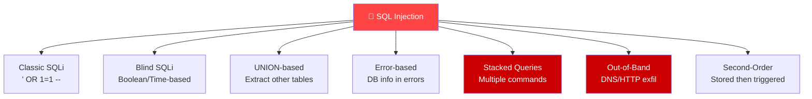
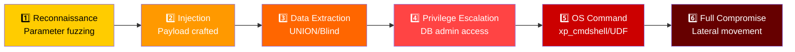
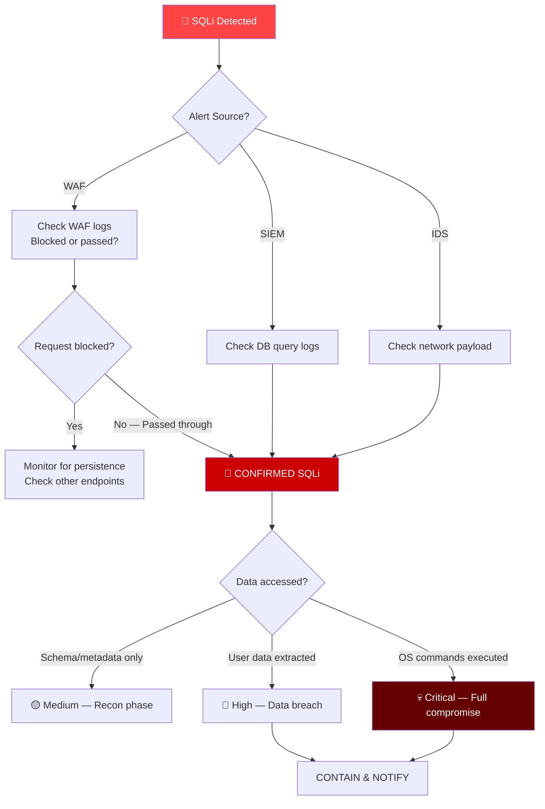
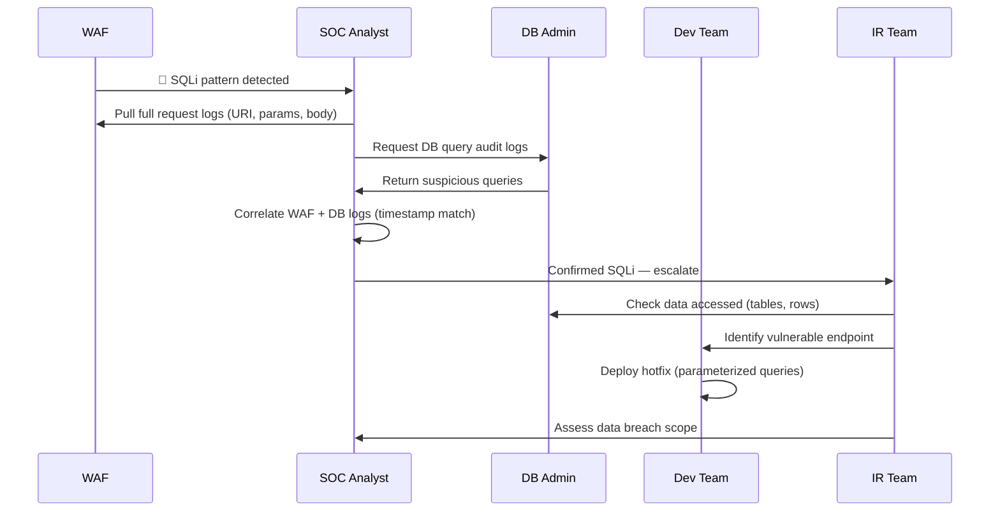
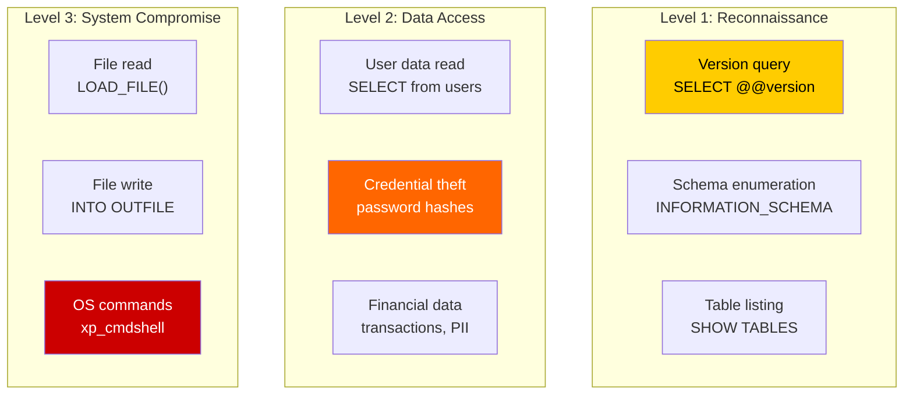
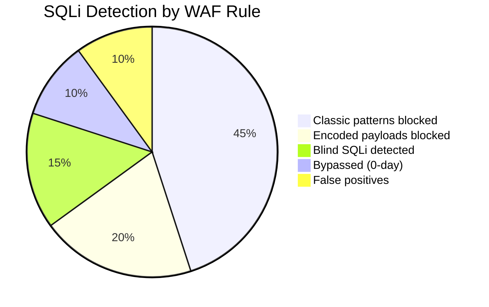

# Playbook: SQL Injection Response

**ID**: PB-37
**Severity**: High | **Category**: Initial Access / Web Application
**MITRE ATT&CK**: [T1190](https://attack.mitre.org/techniques/T1190/) (Exploit Public-Facing Application)
**Trigger**: WAF alert, SIEM correlation (suspicious SQL patterns), IDS signature, application error spike

> ⚠️ **CRITICAL**: SQL injection may lead to full database compromise, data exfiltration, or even OS-level command execution via `xp_cmdshell` or `LOAD_FILE()`.

### SQL Injection Attack Types


```mermaid
graph TD
    SQLi["🔴 SQL Injection"] --> Classic["Classic SQLi\n' OR 1=1 --"]
    SQLi --> Blind["Blind SQLi\nBoolean/Time-based"]
    SQLi --> Union["UNION-based\nExtract other tables"]
    SQLi --> Error["Error-based\nDB info in errors"]
    SQLi --> Stacked["Stacked Queries\nMultiple commands"]
    SQLi --> OOB["Out-of-Band\nDNS/HTTP exfil"]
    SQLi --> Second["Second-Order\nStored then triggered"]
    style SQLi fill:#ff4444,color:#fff
    style Stacked fill:#cc0000,color:#fff
    style OOB fill:#cc0000,color:#fff
```

### Attack Progression Flow


```mermaid
graph LR
    A["1️⃣ Reconnaissance\nParameter fuzzing"] --> B["2️⃣ Injection\nPayload crafted"]
    B --> C["3️⃣ Data Extraction\nUNION/Blind"]
    C --> D["4️⃣ Privilege Escalation\nDB admin access"]
    D --> E["5️⃣ OS Command\nxp_cmdshell/UDF"]
    E --> F["6️⃣ Full Compromise\nLateral movement"]
    style A fill:#ffcc00,color:#000
    style B fill:#ff9900,color:#fff
    style C fill:#ff6600,color:#fff
    style D fill:#ff4444,color:#fff
    style E fill:#cc0000,color:#fff
    style F fill:#660000,color:#fff
```

---

## Decision Flow


```mermaid
graph TD
    Alert["🚨 SQLi Detected"] --> Source{"Alert Source?"}
    Source -->|WAF| WAF["Check WAF logs\nBlocked or passed?"]
    Source -->|SIEM| SIEM["Check DB query logs"]
    Source -->|IDS| IDS["Check network payload"]
    WAF --> Blocked{"Request blocked?"}
    Blocked -->|Yes| Monitor["Monitor for persistence\nCheck other endpoints"]
    Blocked -->|"No — Passed through"| Confirm["🔴 CONFIRMED SQLi"]
    SIEM --> Confirm
    IDS --> Confirm
    Confirm --> Assess{"Data accessed?"}
    Assess -->|"Schema/metadata only"| Medium["🟡 Medium — Recon phase"]
    Assess -->|"User data extracted"| High["🔴 High — Data breach"]
    Assess -->|"OS commands executed"| Critical["💀 Critical — Full compromise"]
    High --> Contain["CONTAIN & NOTIFY"]
    Critical --> Contain
    style Alert fill:#ff4444,color:#fff
    style Confirm fill:#cc0000,color:#fff
    style Critical fill:#660000,color:#fff
```

### Investigation Process


```mermaid
sequenceDiagram
    participant WAF
    participant SOC as SOC Analyst
    participant DBA as DB Admin
    participant Dev as Dev Team
    participant IR as IR Team

    WAF->>SOC: 🚨 SQLi pattern detected
    SOC->>WAF: Pull full request logs (URI, params, body)
    SOC->>DBA: Request DB query audit logs
    DBA->>SOC: Return suspicious queries
    SOC->>SOC: Correlate WAF + DB logs (timestamp match)
    SOC->>IR: Confirmed SQLi — escalate
    IR->>DBA: Check data accessed (tables, rows)
    IR->>Dev: Identify vulnerable endpoint
    Dev->>Dev: Deploy hotfix (parameterized queries)
    IR->>SOC: Assess data breach scope
```

### Database Impact Assessment


```mermaid
graph TD
    subgraph "Level 1: Reconnaissance"
        L1A["Version query\nSELECT @@version"]
        L1B["Schema enumeration\nINFORMATION_SCHEMA"]
        L1C["Table listing\nSHOW TABLES"]
    end
    subgraph "Level 2: Data Access"
        L2A["User data read\nSELECT from users"]
        L2B["Credential theft\npassword hashes"]
        L2C["Financial data\ntransactions, PII"]
    end
    subgraph "Level 3: System Compromise"
        L3A["File read\nLOAD_FILE()"]
        L3B["File write\nINTO OUTFILE"]
        L3C["OS commands\nxp_cmdshell"]
    end
    style L1A fill:#ffcc00,color:#000
    style L2B fill:#ff6600,color:#fff
    style L3C fill:#cc0000,color:#fff
```

### WAF Rule Effectiveness


```mermaid
pie title SQLi Detection by WAF Rule
    "Classic patterns blocked" : 45
    "Encoded payloads blocked" : 20
    "Blind SQLi detected" : 15
    "Bypassed (0-day)" : 10
    "False positives" : 10
```

### Response Timeline


```mermaid
gantt
    title SQL Injection Response Timeline
    dateFormat HH:mm
    axisFormat %H:%M
    section Detection
        WAF/IDS alert          :a1, 00:00, 5min
        Log correlation        :a2, after a1, 15min
    section Containment
        Block attacker IP      :a3, after a2, 5min
        WAF emergency rules    :a4, after a3, 10min
    section Investigation
        Request analysis       :a5, after a4, 30min
        DB impact assessment   :a6, after a5, 60min
        Data breach scope      :a7, after a6, 60min
    section Recovery
        Deploy code fix        :a8, after a7, 120min
        WAF rule hardening     :a9, after a8, 60min
```

---

## 1. Immediate Actions (First 15 Minutes)

| # | Action | Owner |
|:---|:---|:---|
| 1 | Block attacker IP at WAF/firewall | SOC T1 |
| 2 | Enable enhanced WAF rules for SQLi | SOC T1 |
| 3 | Capture full HTTP request logs (headers, body, params) | SOC T2 |
| 4 | Request database query audit logs from DBA | SOC T2 |
| 5 | Identify the vulnerable application endpoint | Dev Team |
| 6 | Check if data was exfiltrated (response sizes, timing) | SOC T2 |

## 2. Investigation Checklist

### WAF/Web Server Analysis
- [ ] Full HTTP requests with SQLi patterns (URI, params, POST body)
- [ ] Attacker IP(s), User-Agent, geographic origin
- [ ] Request frequency and timing patterns
- [ ] Check for encoding bypasses (URL, Unicode, hex, double encoding)
- [ ] Check if requests were blocked or passed through

### Database Analysis
- [ ] Enable and review query audit logs
- [ ] Check for `UNION SELECT`, `INFORMATION_SCHEMA`, `@@version` queries
- [ ] Review for `xp_cmdshell`, `LOAD_FILE()`, `INTO OUTFILE`
- [ ] Check database user privileges (was it running as DBA/root?)
- [ ] Assess which tables/rows were accessed
- [ ] Look for new database users or privilege changes

### Application Analysis
- [ ] Identify the vulnerable code (lack of parameterized queries)
- [ ] Check if ORM is used correctly
- [ ] Review input validation and sanitization
- [ ] Check for stored procedures with dynamic SQL

## 3. Containment

| Scope | Action | Details |
|:---|:---|:---|
| **Network** | Block attacker IPs | WAF + Firewall rules |
| **WAF** | Emergency SQLi rules | Block common payloads |
| **Application** | Disable vulnerable endpoint | Temporary maintenance page |
| **Database** | Revoke excessive privileges | Least-privilege for app accounts |
| **Credentials** | Rotate DB passwords | All application DB connections |

## 4. Eradication & Recovery

### Code Fixes (Priority Order)
1. **Parameterized queries** — Replace all string concatenation in SQL
2. **Input validation** — Whitelist allowed characters per field
3. **WAF rules** — Deploy custom SQLi signatures
4. **DB hardening** — Remove `xp_cmdshell`, disable `LOAD_FILE()`
5. **Least privilege** — App DB accounts with minimal permissions

### SIEM Detection Queries
```sql
-- Splunk: Detect SQLi patterns in web logs
index=web sourcetype=access_combined
| regex uri_query="(?i)(union\s+select|information_schema|or\s+1\s*=\s*1|waitfor\s+delay|benchmark\s*\(|sleep\s*\()"
| stats count by src_ip, uri_path, uri_query
| where count > 5
```

## 5. Evidence Checklist

| Evidence Type | What to Collect | Source | Why It Matters |
|:---|:---|:---|:---|
| Request evidence | Full URI, parameters, headers, body, encoding style, timestamps | WAF / web logs | Reconstructs the injection path and bypass technique |
| Database evidence | Query logs, targeted tables, DB user privileges, error traces | DB audit / DBA logs | Confirms whether exploitation reached the database and what was exposed |
| Application evidence | Vulnerable code path, stack traces, release/version context | App logs / APM / code review | Ties the attack to the software defect that must be fixed |
| Response evidence | Returned rows, response sizes, timing anomalies, error pages | Access logs / app metrics | Shows whether data extraction or blind SQLi likely succeeded |
| Infrastructure evidence | WAF actions, firewall blocks, temporary endpoint changes | WAF / firewall / change tickets | Supports containment timeline and lessons learned |

---

## 6. Minimum Telemetry Required

| Telemetry Source | Required For | Priority | Blind Spot If Missing |
|:---|:---|:---:|:---|
| WAF and web access logs | Payload pattern, source IP, target endpoint, block/pass status | Required | Cannot identify the injection vector or source behavior |
| Database audit logs | Query abuse, table access, privilege abuse, data extraction | Required | Cannot determine whether data exposure occurred |
| Application and APM logs | Error conditions, vulnerable code path, auth/session context | Required | Cannot tell whether the payload reached exploitable logic |
| Change and release records | Recent code changes or config regressions | Recommended | Root cause analysis slows and false blame increases |
| DLP or data classification context | Sensitivity of extracted records | Recommended | Notification impact remains vague |

---

## 7. False Positive and Tuning Guide

| Scenario | Why It Looks Suspicious | How to Validate | Tuning Action | Escalate If |
|:---|:---|:---|:---|:---|
| Security scan or DAST run | Test payloads intentionally resemble SQLi | Confirm scanner source, schedule, and endpoint scope | Allowlist scanner ranges and test headers only within approved window | Requests appear outside the window or hit production data paths unexpectedly |
| Encoded but valid business input | Search syntax or special characters may look like payloads | Reproduce with application owner and inspect server-side handling | Tune exact parameter exceptions instead of global rule relaxations | Same source escalates to schema probing or timing-based payloads |
| QA or pre-release validation | Test automation may generate error-heavy query strings | Confirm release/testing window and environment | Lower severity for approved QA identities and paths only | Traffic hits production unexpectedly or causes DB-side indicators |
| WAF normalization gap | Double-encoding can trigger noisy partial matches | Validate decoded payload and downstream app behavior | Tune normalization and decoding consistency before suppressing rules | Decoded content still probes schema, delays, or data extraction patterns |

---

## 8. Post-Incident

### Lessons Learned
| Question | Answer |
|:---|:---|
| Was the application using parameterized queries? | [Document] |
| Did WAF detect and block the attack? | [Yes/No — rule gap?] |
| Were database privileges properly scoped? | [Document gaps] |
| Was data exfiltrated? PDPA notification required? | [Assessment] |

## 9. Detection Rules (Sigma)

```yaml
title: SQL Injection Attempt in Web Logs
logsource:
    category: webserver
detection:
    selection:
        cs-uri-query|contains:
            - 'UNION SELECT'
            - 'INFORMATION_SCHEMA'
            - 'xp_cmdshell'
            - "' OR 1=1"
            - 'WAITFOR DELAY'
            - 'BENCHMARK('
    condition: selection
    level: high
```

## Related Documents
- [IR Framework](../Framework.en.md)
- [Sigma Rules Index](../../08_Detection_Engineering/README.md)
- [Web Attack Playbook](Web_Attack.en.md)
- [Data Exfiltration Playbook](Data_Exfiltration.en.md)
- [Exploit Playbook](Exploit.en.md)
- [Tier 2 Runbook](../Runbooks/Tier2_Runbook.en.md)

## References
- [OWASP SQL Injection](https://owasp.org/www-community/attacks/SQL_Injection)
- [MITRE T1190](https://attack.mitre.org/techniques/T1190/)
- [SQLi Cheat Sheet — PortSwigger](https://portswigger.net/web-security/sql-injection/cheat-sheet)
