# Playbook: SQL Injection Response

**ID**: PB-37
**Severity**: High | **Category**: Initial Access / Web Application
**MITRE ATT&CK**: [T1190](https://attack.mitre.org/techniques/T1190/) (Exploit Public-Facing Application)
**Trigger**: WAF alert, SIEM correlation (suspicious SQL patterns), IDS signature, application error spike

> ⚠️ **CRITICAL**: SQL injection may lead to full database compromise, data exfiltration, or even OS-level command execution via `xp_cmdshell` or `LOAD_FILE()`.

### SQL Injection Attack Types


### Attack Progression Flow

```mermaid
graph LR
    A["1️⃣ Reconnaissance\nParameter fuzzing"] --> B["2️⃣ Injection\nPayload crafted"]
    B --> C["3️⃣ Data Extraction\nUNION/Blind"]
    C --> D["4️⃣ Privilege Escalation\nDB admin access"]
    D --> E["5️⃣ OS Command\nxp_cmdshell/UDF"]
    E --> F["6️⃣ Full Compromise\nLateral movement"]
    style A fill:#ffcc00,color:#000
    style B fill:#ff9900,color:#fff
    style C fill:#ff6600,color:#fff
    style D fill:#ff4444,color:#fff
    style E fill:#cc0000,color:#fff
    style F fill:#660000,color:#fff
```



---

## Decision Flow


### Investigation Process

```mermaid
sequenceDiagram
    participant WAF
    participant SOC as SOC Analyst
    participant DBA as DB Admin
    participant Dev as Dev Team
    participant IR as IR Team

    WAF->>SOC: 🚨 SQLi pattern detected
    SOC->>WAF: Pull full request logs (URI, params, body)
    SOC->>DBA: Request DB query audit logs
    DBA->>SOC: Return suspicious queries
    SOC->>SOC: Correlate WAF + DB logs (timestamp match)
    SOC->>IR: Confirmed SQLi — escalate
    IR->>DBA: Check data accessed (tables, rows)
    IR->>Dev: Identify vulnerable endpoint
    Dev->>Dev: Deploy hotfix (parameterized queries)
    IR->>SOC: Assess data breach scope
```



### Database Impact Assessment


### WAF Rule Effectiveness


### Response Timeline


---

## 1. Immediate Actions (First 15 Minutes)

| # | Action | Owner |
|:---|:---|:---|
| 1 | Block attacker IP at WAF/firewall | SOC T1 |
| 2 | Enable enhanced WAF rules for SQLi | SOC T1 |
| 3 | Capture full HTTP request logs (headers, body, params) | SOC T2 |
| 4 | Request database query audit logs from DBA | SOC T2 |
| 5 | Identify the vulnerable application endpoint | Dev Team |
| 6 | Check if data was exfiltrated (response sizes, timing) | SOC T2 |

## 2. Investigation Checklist

### WAF/Web Server Analysis
- [ ] Full HTTP requests with SQLi patterns (URI, params, POST body)
- [ ] Attacker IP(s), User-Agent, geographic origin
- [ ] Request frequency and timing patterns
- [ ] Check for encoding bypasses (URL, Unicode, hex, double encoding)
- [ ] Check if requests were blocked or passed through

### Database Analysis
- [ ] Enable and review query audit logs
- [ ] Check for `UNION SELECT`, `INFORMATION_SCHEMA`, `@@version` queries
- [ ] Review for `xp_cmdshell`, `LOAD_FILE()`, `INTO OUTFILE`
- [ ] Check database user privileges (was it running as DBA/root?)
- [ ] Assess which tables/rows were accessed
- [ ] Look for new database users or privilege changes

### Application Analysis
- [ ] Identify the vulnerable code (lack of parameterized queries)
- [ ] Check if ORM is used correctly
- [ ] Review input validation and sanitization
- [ ] Check for stored procedures with dynamic SQL

## 3. Containment

| Scope | Action | Details |
|:---|:---|:---|
| **Network** | Block attacker IPs | WAF + Firewall rules |
| **WAF** | Emergency SQLi rules | Block common payloads |
| **Application** | Disable vulnerable endpoint | Temporary maintenance page |
| **Database** | Revoke excessive privileges | Least-privilege for app accounts |
| **Credentials** | Rotate DB passwords | All application DB connections |

## 4. Eradication & Recovery

### Code Fixes (Priority Order)
1. **Parameterized queries** — Replace all string concatenation in SQL
2. **Input validation** — Whitelist allowed characters per field
3. **WAF rules** — Deploy custom SQLi signatures
4. **DB hardening** — Remove `xp_cmdshell`, disable `LOAD_FILE()`
5. **Least privilege** — App DB accounts with minimal permissions

### SIEM Detection Queries
```sql
-- Splunk: Detect SQLi patterns in web logs
index=web sourcetype=access_combined
| regex uri_query="(?i)(union\s+select|information_schema|or\s+1\s*=\s*1|waitfor\s+delay|benchmark\s*\(|sleep\s*\()"
| stats count by src_ip, uri_path, uri_query
| where count > 5
```

## 5. Post-Incident

### Lessons Learned
| Question | Answer |
|:---|:---|
| Was the application using parameterized queries? | [Document] |
| Did WAF detect and block the attack? | [Yes/No — rule gap?] |
| Were database privileges properly scoped? | [Document gaps] |
| Was data exfiltrated? PDPA notification required? | [Assessment] |

## 6. Detection Rules (Sigma)

```yaml
title: SQL Injection Attempt in Web Logs
logsource:
    category: webserver
detection:
    selection:
        cs-uri-query|contains:
            - 'UNION SELECT'
            - 'INFORMATION_SCHEMA'
            - 'xp_cmdshell'
            - "' OR 1=1"
            - 'WAITFOR DELAY'
            - 'BENCHMARK('
    condition: selection
    level: high
```

## Related Documents
- [IR Framework](../Framework.en.md)
- [Sigma Rules Index](../../08_Detection_Engineering/sigma_rules/)
- [Web Attack Playbook](Web_Attack.en.md)
- [Data Exfiltration Playbook](Data_Exfiltration.en.md)
- [Exploit Playbook](Exploit.en.md)
- [Tier 2 Runbook](../Runbooks/Tier2_Runbook.en.md)

## References
- [OWASP SQL Injection](https://owasp.org/www-community/attacks/SQL_Injection)
- [MITRE T1190](https://attack.mitre.org/techniques/T1190/)
- [SQLi Cheat Sheet — PortSwigger](https://portswigger.net/web-security/sql-injection/cheat-sheet)
