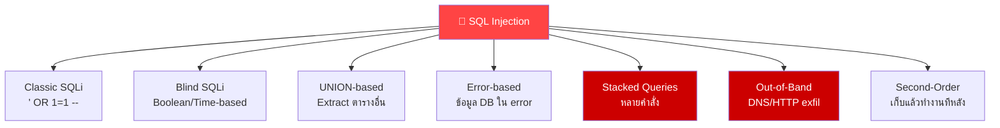
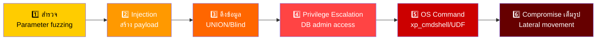
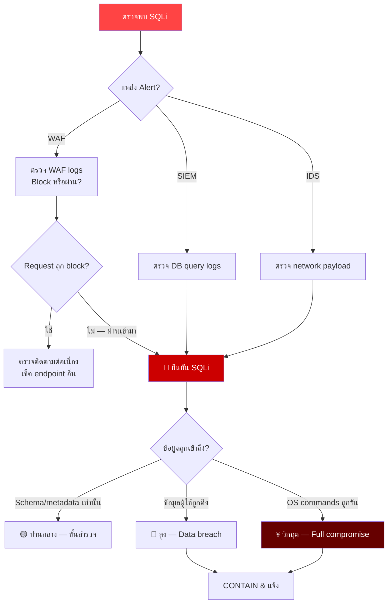
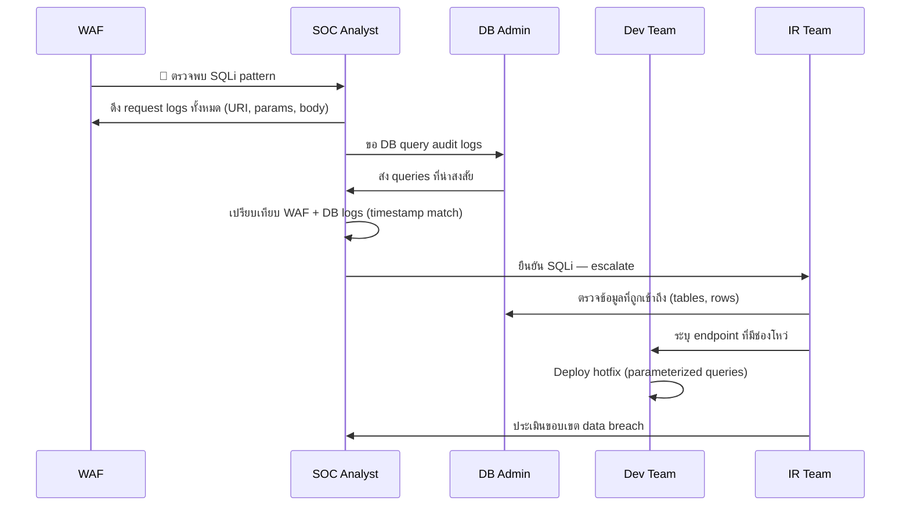
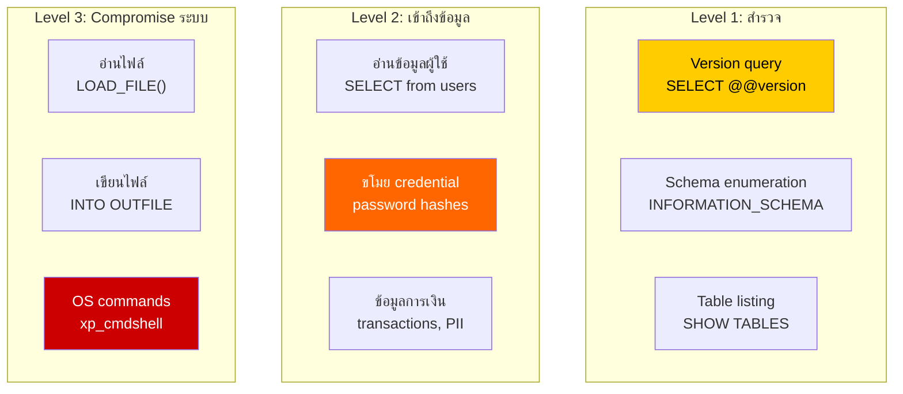
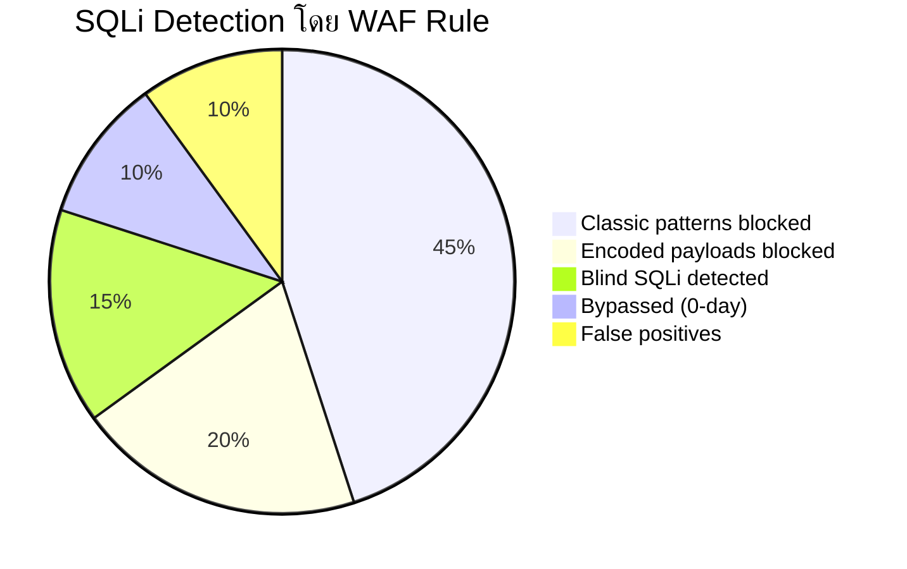

# Playbook: การตอบสนอง SQL Injection

**ID**: PB-37
**ความรุนแรง**: สูง | **ประเภท**: Initial Access / Web Application
**MITRE ATT&CK**: [T1190](https://attack.mitre.org/techniques/T1190/) (Exploit Public-Facing Application)
**Trigger**: WAF alert, SIEM correlation (SQL patterns ผิดปกติ), IDS signature, application error spike

> ⚠️ **วิกฤต**: SQL injection อาจนำไปสู่การโจมตี database ทั้งหมด, ขโมยข้อมูล, หรือรัน OS command ผ่าน `xp_cmdshell` หรือ `LOAD_FILE()`

### ประเภท SQL Injection



### ลำดับการโจมตี



---

## Decision Flow



### ขั้นตอนการสืบสวน



### การประเมินผลกระทบ Database



### ประสิทธิภาพ WAF Rules



### Timeline การตอบสนอง

```mermaid
gantt
    title SQL Injection Response Timeline
    dateFormat HH:mm
    axisFormat %H:%M
    section Detection
        WAF/IDS alert          :a1, 00:00, 5min
        Log correlation        :a2, after a1, 15min
    section Containment
        Block attacker IP      :a3, after a2, 5min
        WAF emergency rules    :a4, after a3, 10min
    section Investigation
        วิเคราะห์ request      :a5, after a4, 30min
        ประเมินผลกระทบ DB     :a6, after a5, 60min
        ขอบเขต data breach    :a7, after a6, 60min
    section Recovery
        Deploy code fix        :a8, after a7, 120min
        WAF rule hardening     :a9, after a8, 60min
```



---

## 1. การดำเนินการทันที (15 นาทีแรก)

| # | การดำเนินการ | ผู้รับผิดชอบ |
|:---|:---|:---|
| 1 | Block IP ผู้โจมตีที่ WAF/firewall | SOC T1 |
| 2 | เปิด WAF rules เข้มงวดสำหรับ SQLi | SOC T1 |
| 3 | เก็บ HTTP request logs เต็มรูปแบบ (headers, body, params) | SOC T2 |
| 4 | ขอ database query audit logs จาก DBA | SOC T2 |
| 5 | ระบุ application endpoint ที่มีช่องโหว่ | Dev Team |
| 6 | ตรวจว่าข้อมูลถูกนำออกหรือไม่ (response sizes, timing) | SOC T2 |

## 2. รายการตรวจสอบการสืบสวน

### วิเคราะห์ WAF/Web Server
- [ ] HTTP requests ที่มี SQLi patterns ทั้งหมด (URI, params, POST body)
- [ ] IP ผู้โจมตี, User-Agent, ที่ตั้งทางภูมิศาสตร์
- [ ] ความถี่และรูปแบบเวลาของ requests
- [ ] ตรวจ encoding bypasses (URL, Unicode, hex, double encoding)
- [ ] ตรวจว่า requests ถูก block หรือผ่านเข้ามา

### วิเคราะห์ Database
- [ ] เปิดและตรวจ query audit logs
- [ ] ตรวจ `UNION SELECT`, `INFORMATION_SCHEMA`, `@@version`
- [ ] ตรวจ `xp_cmdshell`, `LOAD_FILE()`, `INTO OUTFILE`
- [ ] ตรวจ privileges ของ database user (รันเป็น DBA/root หรือไม่?)
- [ ] ประเมิน tables/rows ที่ถูกเข้าถึง
- [ ] ตรวจ database users ใหม่หรือการเปลี่ยนแปลง privileges

### วิเคราะห์ Application
- [ ] ระบุ code ที่มีช่องโหว่ (ไม่ใช้ parameterized queries)
- [ ] ตรวจว่า ORM ใช้ถูกต้องหรือไม่
- [ ] ตรวจ input validation และ sanitization
- [ ] ตรวจ stored procedures ที่มี dynamic SQL

## 3. การควบคุม (Containment)

| ขอบเขต | การดำเนินการ | รายละเอียด |
|:---|:---|:---|
| **เครือข่าย** | Block IP ผู้โจมตี | WAF + Firewall rules |
| **WAF** | Emergency SQLi rules | Block payloads ทั่วไป |
| **Application** | ปิด endpoint ที่มีช่องโหว่ | หน้า maintenance ชั่วคราว |
| **Database** | เพิกถอน privileges เกิน | Least-privilege สำหรับ app accounts |
| **Credentials** | หมุนเวียน DB passwords | ทุก application DB connections |

## 4. การกำจัดและกู้คืน

### Code Fixes (ลำดับความสำคัญ)
1. **Parameterized queries** — แทนที่ string concatenation ใน SQL ทั้งหมด
2. **Input validation** — Whitelist ตัวอักษรที่อนุญาตต่อ field
3. **WAF rules** — Deploy SQLi signatures เฉพาะ
4. **DB hardening** — ลบ `xp_cmdshell`, ปิด `LOAD_FILE()`
5. **Least privilege** — App DB accounts มี permissions น้อยที่สุด

### SIEM Detection Queries
```sql
-- Splunk: ตรวจจับ SQLi patterns ใน web logs
index=web sourcetype=access_combined
| regex uri_query="(?i)(union\s+select|information_schema|or\s+1\s*=\s*1|waitfor\s+delay|benchmark\s*\(|sleep\s*\()"
| stats count by src_ip, uri_path, uri_query
| where count > 5
```

## 5. หลังเหตุการณ์ (Post-Incident)

### บทเรียน
| คำถาม | คำตอบ |
|:---|:---|
| Application ใช้ parameterized queries หรือไม่? | [บันทึก] |
| WAF ตรวจจับและ block ได้หรือไม่? | [ใช่/ไม่ — rule gap?] |
| Database privileges กำหนดถูกต้องหรือไม่? | [บันทึกช่องว่าง] |
| ข้อมูลถูกนำออกหรือไม่? ต้องแจ้ง PDPA? | [ประเมิน] |

## 6. Detection Rules (Sigma)

```yaml
title: SQL Injection Attempt in Web Logs
logsource:
    category: webserver
detection:
    selection:
        cs-uri-query|contains:
            - 'UNION SELECT'
            - 'INFORMATION_SCHEMA'
            - 'xp_cmdshell'
            - "' OR 1=1"
            - 'WAITFOR DELAY'
            - 'BENCHMARK('
    condition: selection
    level: high
```

## เอกสารที่เกี่ยวข้อง
- [Web Attack Playbook](Web_Attack.th.md)
- [Data Exfiltration Playbook](Data_Exfiltration.th.md)
- [Exploit Playbook](Exploit.th.md)
- [คู่มือ Tier 2](../Runbooks/Tier2_Runbook.th.md)

## References
- [OWASP SQL Injection](https://owasp.org/www-community/attacks/SQL_Injection)
- [MITRE T1190](https://attack.mitre.org/techniques/T1190/)
- [SQLi Cheat Sheet — PortSwigger](https://portswigger.net/web-security/sql-injection/cheat-sheet)
