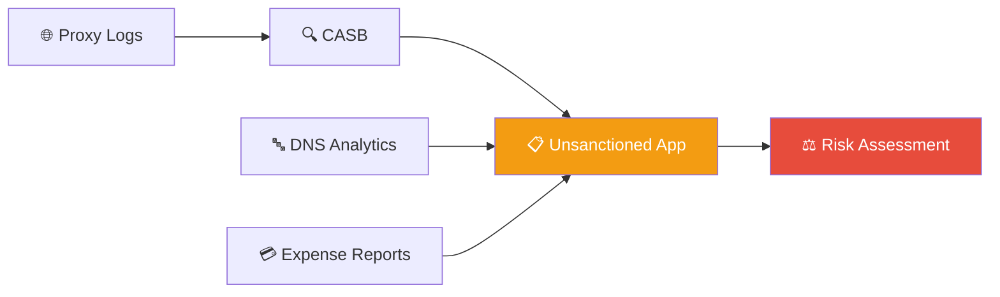
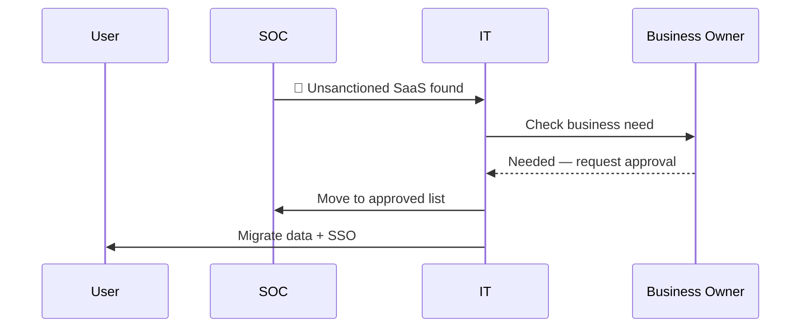
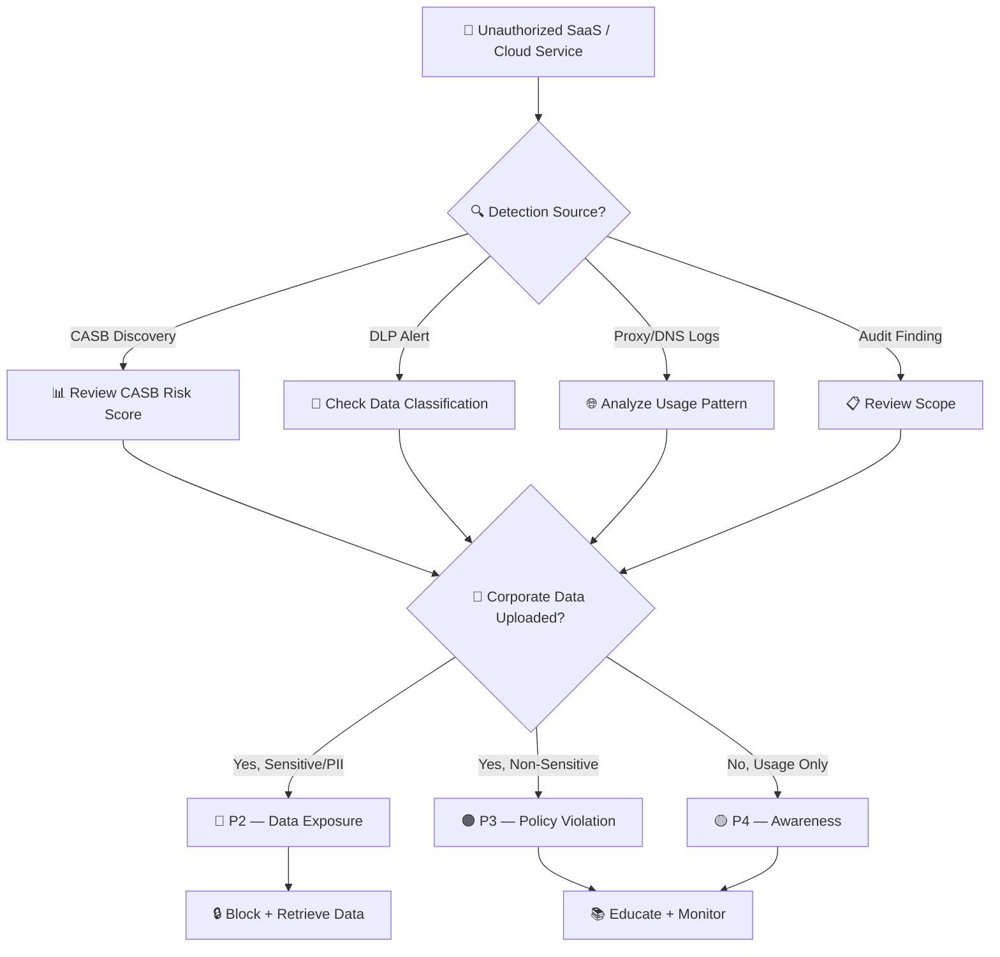
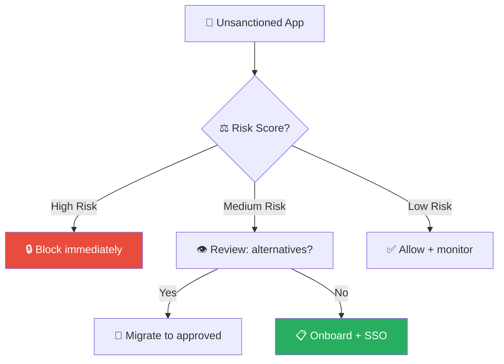
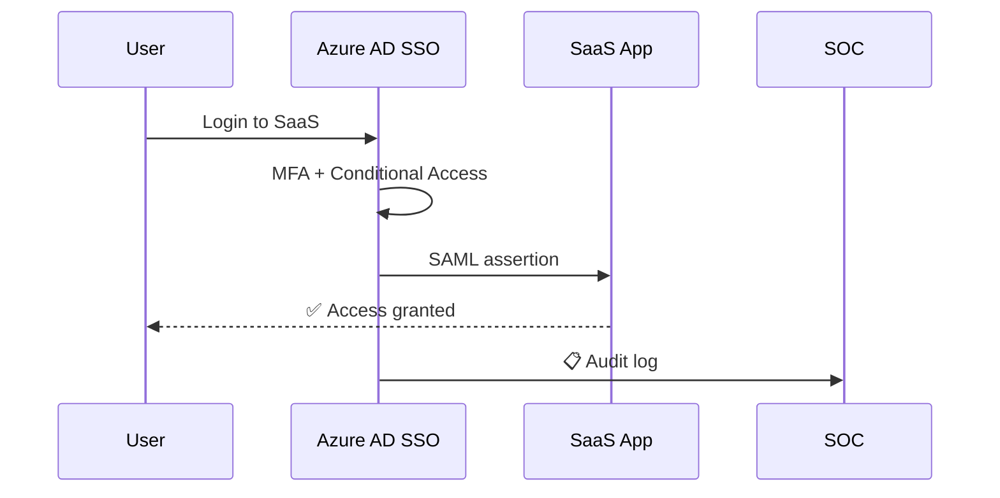

# Playbook: Shadow IT / Unauthorized SaaS

**ID**: PB-29
**Severity**: Medium/High | **Category**: Governance & Compliance
**MITRE ATT&CK**: [T1567](https://attack.mitre.org/techniques/T1567/) (Exfiltration Over Web Service), [T1537](https://attack.mitre.org/techniques/T1537/) (Transfer Data to Cloud Account)
**Trigger**: CASB alert, Proxy log anomaly, User report, SaaS audit, Network anomaly

### Shadow IT Discovery

### SaaS Governance

---

## Decision Flow

---

## 1. Analysis

### 1.1 Service Risk Assessment

| Category | Examples | Data Risk | Priority |
|:---|:---|:---|:---|
| **File sharing** | WeTransfer, Google Drive (personal), Dropbox | 🔴 High — data exposure | P2 |
| **AI/LLM tools** | ChatGPT, Copilot (unapproved), Bard | 🔴 High — data in prompts | P2 |
| **Project management** | Notion, Trello, Asana (personal) | 🟠 Medium — IP exposure | P3 |
| **Communication** | WhatsApp, Telegram, Discord | 🟠 Medium — conversation leaks | P3 |
| **Development** | GitHub (personal), Replit, Codespaces | 🔴 High — source code | P2 |
| **Email** | Personal Gmail, ProtonMail | 🔴 High — data forward | P2 |
| **Design/Docs** | Canva, Figma (personal), Google Docs | 🟡 Low-Medium | P3-P4 |

### 1.2 Investigation Checklist

| Check | How | Done |
|:---|:---|:---:|
| What service is being used? | CASB / Proxy logs | ☐ |
| How many users? (individual or department-wide) | CASB discovery | ☐ |
| How long has it been used? | Historical proxy logs | ☐ |
| Was corporate data uploaded? What type? | DLP / CASB | ☐ |
| Did users sign up with corporate email? | Service registration, CASB | ☐ |
| Were corporate credentials reused? | User interview | ☐ |
| Is OAuth/SSO connected to corporate IdP? | Enterprise apps audit | ☐ |
| Is there a legitimate business need? | Business unit inquiry | ☐ |

### 1.3 Data Exposure Assessment

| Data Category | Exposed? | Classification | Action Required |
|:---|:---|:---|:---|
| Customer PII | ☐ Yes ☐ No | L4 | PDPA notification |
| Source code / IP | ☐ Yes ☐ No | L3-L4 | Immediate retrieval |
| Financial data | ☐ Yes ☐ No | L4 | Legal review |
| Internal communications | ☐ Yes ☐ No | L2-L3 | Assess impact |
| AI prompt data | ☐ Yes ☐ No | Varies | Review content |

---

## 2. Containment

### 2.1 High Risk (Data Uploaded)

| # | Action | Tool | Done |
|:---:|:---|:---|:---:|
| 1 | **Block service** at proxy/firewall | Proxy / Firewall | ☐ |
| 2 | **Revoke OAuth** connections to corporate IdP | Enterprise Apps | ☐ |
| 3 | **Enable DLP** to prevent further uploads | CASB / DLP | ☐ |
| 4 | **Capture evidence** — CASB/proxy logs, data transfer details | CASB | ☐ |
| 5 | Notify user's manager | Email / Chat | ☐ |

### 2.2 Medium/Low Risk (Usage Only)

| # | Action | Done |
|:---:|:---|:---:|
| 1 | Send awareness notification to user(s) | ☐ |
| 2 | Log the service in Shadow IT register | ☐ |
| 3 | Add to CASB monitoring (don't block yet) | ☐ |
| 4 | Assess if sanctioning the tool is appropriate | ☐ |

---

## 3. Remediation

| # | Action | Owner | Done |
|:---:|:---|:---|:---:|
| 1 | **Export / delete** corporate data from unauthorized service | User + IT | ☐ |
| 2 | **Delete accounts** or change passwords if corporate creds reused | User | ☐ |
| 3 | **Evaluate business need** — consider sanctioning with security controls | IT + Security | ☐ |
| 4 | **Update AUP** (Acceptable Use Policy) with explicit guidance | Security | ☐ |
| 5 | If PII was exposed, initiate PDPA notification process | Legal / DPO | ☐ |

---

## 4. Recovery

| # | Action | Done |
|:---:|:---|:---:|
| 1 | Provide sanctioned alternatives that meet the business need | ☐ |
| 2 | Tune CASB policies for continuous Shadow IT discovery | ☐ |
| 3 | Implement SaaS governance framework (request/approve/review cycle) | ☐ |
| 4 | Monthly review of unsanctioned SaaS from proxy/DNS logs | ☐ |
| 5 | Conduct awareness training on data security risks of unauthorized cloud | ☐ |

---

## 5. Escalation Criteria

| Condition | Escalate To |
|:---|:---|
| PII or customer data uploaded | Legal + DPO (PDPA 72h) |
| Source code uploaded to public service | CISO + Engineering Lead |
| Data uploaded to AI/LLM service | CISO + Privacy team |
| Executive found using unauthorized service | CISO + HR |
| Department-wide usage (>10 users) | SOC Lead + IT Director |
| OAuth connected to corporate directory | Identity team urgently |

---

### SaaS Risk Scoring

### SSO Integration Flow

## Related Documents

- [IR Framework](../Framework.en.md)
- [Incident Report](../../templates/incident_report.en.md)
- [PB-08 Data Exfiltration](Data_Exfiltration.en.md)
- [Data Governance Policy](../../07_Compliance_Privacy/Data_Governance_Policy.en.md)
- [PDPA Compliance](../../07_Compliance_Privacy/PDPA_Compliance.en.md)

## References

- [MITRE ATT&CK T1567 — Exfiltration Over Web Service](https://attack.mitre.org/techniques/T1567/)
- [NIST SP 800-144 — Cloud Computing Guidelines](https://csrc.nist.gov/publications/detail/sp/800-144/final)
