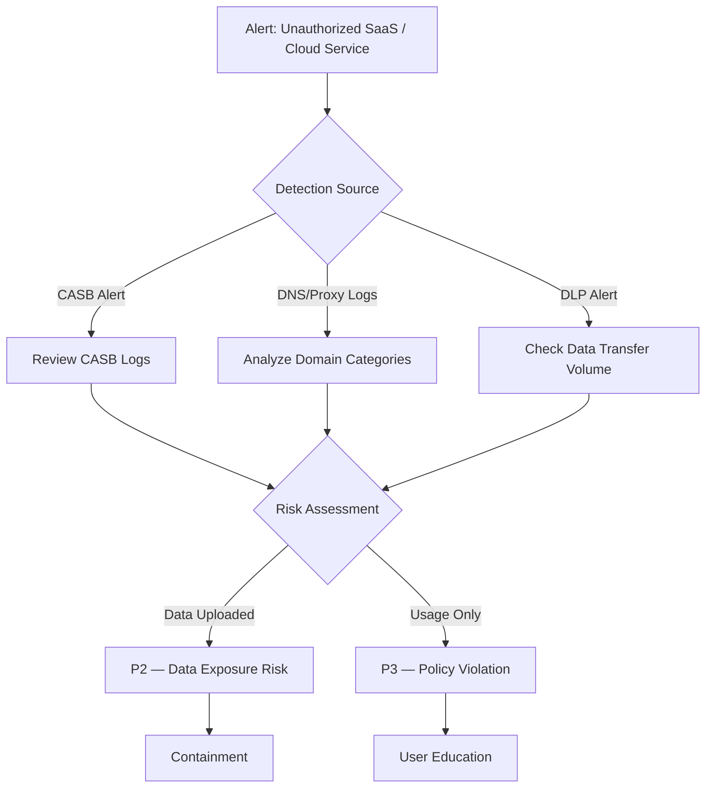

# Playbook: Shadow IT / Unauthorized SaaS (PB-29)

**Severity**: Medium | **Category**: Governance & Compliance | **MITRE**: T1567, T1537

## 1. Analysis (Triage)

-   **Identify the Service**: What unauthorized SaaS/cloud service is being used (file sharing, AI tools, project management, etc.).
-   **User Scope**: How many users are using it? Single user or department-wide.
-   **Data Classification**: Has corporate data been uploaded? What classification level?
-   **Authentication**: Did users sign up with corporate email? Are corporate credentials at risk?

## 2. Containment
-   **Block Service**: Add domain to proxy/firewall blocklist (if risk warrants blocking).
-   **Revoke OAuth**: If the SaaS was connected via OAuth to corporate identity, revoke access.
-   **DLP Enforcement**: Enable DLP to prevent data upload to uncategorized cloud services.
-   **Preserve Evidence**: Capture CASB/proxy logs showing data transfer details.

## 3. Remediation
-   **Data Retrieval**: Export and delete corporate data from unauthorized service.
-   **Account Cleanup**: Users delete accounts or change passwords if corporate credentials were reused.
-   **Evaluate Need**: Assess if there is a legitimate business need — consider sanctioning the tool with proper security controls.
-   **Policy Update**: Update acceptable use policy with explicit guidance on unauthorized SaaS.

## 4. Recovery
-   **Approved Alternatives**: Provide sanctioned alternatives that meet business needs.
-   **CASB Enhancement**: Tune CASB policies for continuous shadow IT discovery.
-   **Regular Audits**: Monthly review of unsanctioned SaaS usage from proxy/DNS logs.

## 5. Lessons Learned
-   Shadow IT often emerges because approved tools don't meet user needs — address root cause.
-   Implement SaaS governance framework with clear request/approval process.
-   Awareness training on data security risks of unauthorized cloud services.

## References
-   [MITRE ATT&CK T1567 — Exfiltration Over Web Service](https://attack.mitre.org/techniques/T1567/)
-   [NIST SP 800-144 — Cloud Computing Guidelines](https://csrc.nist.gov/publications/detail/sp/800-144/final)
