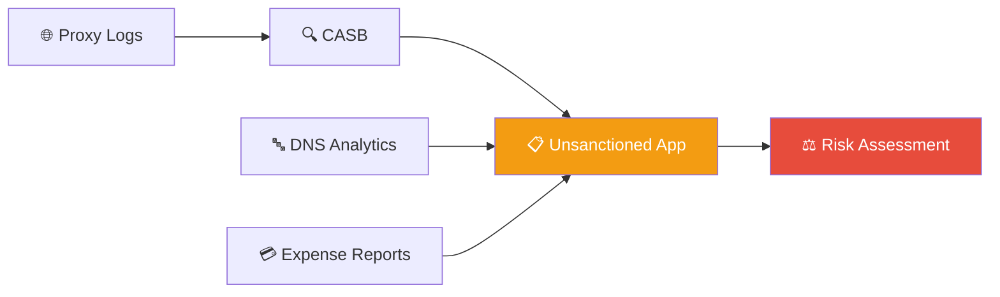
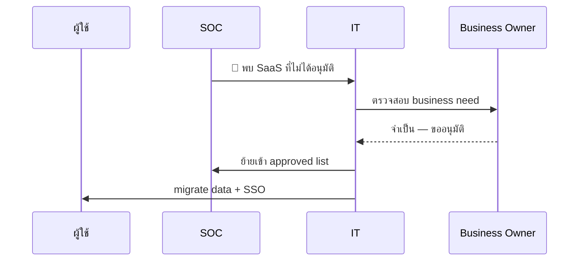
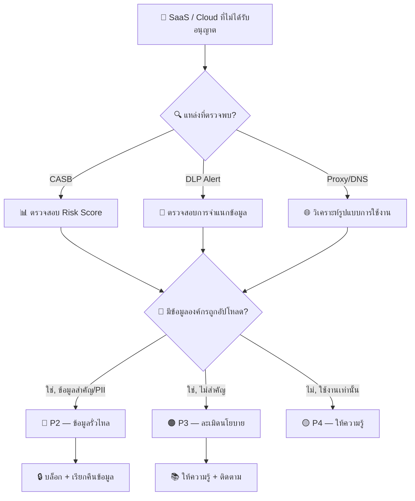
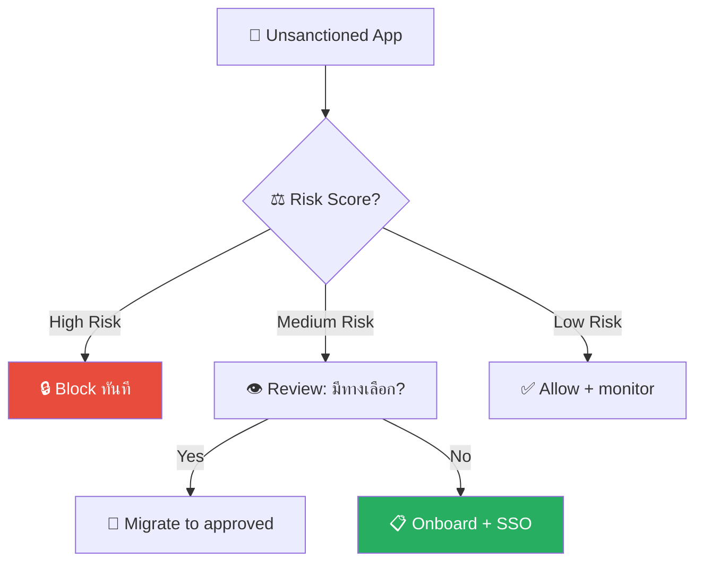
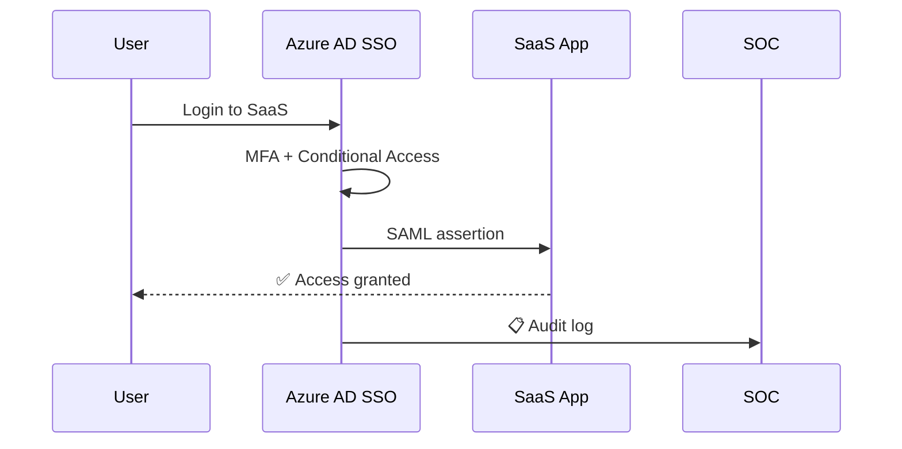

# Playbook: Shadow IT / SaaS ที่ไม่ได้รับอนุญาต

**ID**: PB-29
**ระดับความรุนแรง**: ปานกลาง/สูง | **หมวดหมู่**: ธรรมาภิบาลและการปฏิบัติตามกฎระเบียบ
**MITRE ATT&CK**: [T1567](https://attack.mitre.org/techniques/T1567/) (การนำข้อมูลออกผ่านบริการเว็บ), [T1537](https://attack.mitre.org/techniques/T1537/) (โอนข้อมูลไปยังบัญชีคลาวด์)
**ทริกเกอร์**: CASB alert, proxy log anomaly, ผู้ใช้รายงาน, SaaS audit, network anomaly

### ผังการค้นพบ Shadow IT

### ผังขั้นตอน SaaS Governance

---

## ผังการตัดสินใจ

---

## 1. การวิเคราะห์

### 1.1 การประเมินความเสี่ยงของบริการ

| หมวดหมู่ | ตัวอย่าง | ความเสี่ยงข้อมูล | ลำดับความสำคัญ |
|:---|:---|:---|:---|
| **แชร์ไฟล์** | WeTransfer, Google Drive (ส่วนตัว), Dropbox | 🔴 สูง | P2 |
| **AI/LLM** | ChatGPT, Copilot (ไม่ได้รับอนุมัติ) | 🔴 สูง — ข้อมูลใน prompt | P2 |
| **จัดการโปรเจกต์** | Notion, Trello, Asana (ส่วนตัว) | 🟠 ปานกลาง | P3 |
| **สื่อสาร** | WhatsApp, Telegram, Discord | 🟠 ปานกลาง | P3 |
| **พัฒนาซอฟต์แวร์** | GitHub (ส่วนตัว), Replit | 🔴 สูง — ซอร์สโค้ด | P2 |
| **อีเมล** | Gmail ส่วนตัว, ProtonMail | 🔴 สูง | P2 |

### 1.2 รายการตรวจสอบ

| รายการ | วิธีตรวจสอบ | เสร็จ |
|:---|:---|:---:|
| บริการอะไรถูกใช้? | CASB / Proxy logs | ☐ |
| มีผู้ใช้กี่คน? (เดี่ยวหรือทั้งแผนก) | CASB discovery | ☐ |
| มีข้อมูลองค์กรถูกอัปโหลดหรือไม่? | DLP / CASB | ☐ |
| ผู้ใช้ลงทะเบียนด้วยอีเมลองค์กรหรือไม่? | CASB, การสอบถาม | ☐ |
| มี OAuth เชื่อมต่อกับ IdP องค์กรหรือไม่? | Enterprise Apps | ☐ |
| มีความจำเป็นทางธุรกิจจริงหรือไม่? | สอบถามหน่วยงาน | ☐ |

### 1.3 การประเมินข้อมูลที่เปิดเผย

| ประเภทข้อมูล | รั่วไหล? | ระดับ | การดำเนินการ |
|:---|:---|:---|:---|
| PII ลูกค้า | ☐ ใช่ ☐ ไม่ | L4 | แจ้ง PDPA |
| ซอร์สโค้ด / IP | ☐ ใช่ ☐ ไม่ | L3-L4 | เรียกคืนทันที |
| ข้อมูลการเงิน | ☐ ใช่ ☐ ไม่ | L4 | ทบทวนกฎหมาย |
| ข้อมูลใน AI prompt | ☐ ใช่ ☐ ไม่ | แล้วแต่ | ตรวจสอบเนื้อหา |

---

## 2. การควบคุม

### 2.1 ความเสี่ยงสูง (มีข้อมูลถูกอัปโหลด)

| # | การดำเนินการ | เครื่องมือ | เสร็จ |
|:---:|:---|:---|:---:|
| 1 | **บล็อกบริการ** ที่ proxy/firewall | Proxy / Firewall | ☐ |
| 2 | **เพิกถอน OAuth** ที่เชื่อมต่อ IdP | Enterprise Apps | ☐ |
| 3 | **เปิด DLP** ป้องกันการอัปโหลดเพิ่ม | CASB / DLP | ☐ |
| 4 | **บันทึกหลักฐาน** | CASB | ☐ |
| 5 | แจ้งผู้จัดการ | อีเมล / แชท | ☐ |

---

## 3. การแก้ไข

| # | การดำเนินการ | เสร็จ |
|:---:|:---|:---:|
| 1 | **ส่งออก / ลบ** ข้อมูลองค์กรจากบริการที่ไม่ได้รับอนุญาต | ☐ |
| 2 | **ลบบัญชี** หรือเปลี่ยนรหัสผ่านหากใช้ credential ซ้ำ | ☐ |
| 3 | **ประเมินความจำเป็น** — พิจารณาอนุมัติพร้อม security controls | ☐ |
| 4 | **อัปเดต AUP** (Acceptable Use Policy) | ☐ |
| 5 | หาก PII รั่วไหล → เริ่มกระบวนการแจ้ง PDPA | ☐ |

---

## 4. การฟื้นฟู

| # | การดำเนินการ | เสร็จ |
|:---:|:---|:---:|
| 1 | จัดหาทางเลือกที่ได้รับอนุมัติ | ☐ |
| 2 | ปรับนโยบาย CASB สำหรับ Shadow IT discovery | ☐ |
| 3 | สร้าง SaaS governance framework | ☐ |
| 4 | ตรวจสอบ SaaS ที่ไม่ได้รับอนุญาตรายเดือน | ☐ |
| 5 | จัดอบรมด้านความปลอดภัยข้อมูล | ☐ |

---

## 5. เกณฑ์การยกระดับ

| เงื่อนไข | ยกระดับไปยัง |
|:---|:---|
| PII / ข้อมูลลูกค้าถูกอัปโหลด | Legal + DPO (PDPA 72 ชม.) |
| ซอร์สโค้ดถูกอัปไปบริการสาธารณะ | CISO + หัวหน้าวิศวกรรม |
| ข้อมูลถูกอัปไป AI/LLM | CISO + ทีม Privacy |
| ใช้งานทั้งแผนก (>10 คน) | SOC Lead + IT Director |
| OAuth เชื่อมต่อ corporate directory | ทีม Identity ด่วน |

---

### ผัง SaaS Risk Scoring

### ผัง SSO Integration Flow

## เอกสารที่เกี่ยวข้อง

- [กรอบการตอบสนองต่อเหตุการณ์](../Framework.th.md)
- [แม่แบบรายงานเหตุการณ์](../../templates/incident_report.th.md)
- [PB-08 การนำข้อมูลออก](Data_Exfiltration.th.md)
- [นโยบายธรรมาภิบาลข้อมูล](../../07_Compliance_Privacy/Data_Governance_Policy.th.md)

## อ้างอิง

- [MITRE ATT&CK T1567 — Exfiltration Over Web Service](https://attack.mitre.org/techniques/T1567/)
- [NIST SP 800-144 — Cloud Computing Guidelines](https://csrc.nist.gov/publications/detail/sp/800-144/final)
