# Playbook: Shadow IT / SaaS ที่ไม่ได้รับอนุญาต

**ID**: PB-29
**ระดับความรุนแรง**: ปานกลาง/สูง | **หมวดหมู่**: ธรรมาภิบาลและการปฏิบัติตามกฎระเบียบ
**MITRE ATT&CK**: [T1567](https://attack.mitre.org/techniques/T1567/) (การนำข้อมูลออกผ่านบริการเว็บ), [T1537](https://attack.mitre.org/techniques/T1537/) (โอนข้อมูลไปยังบัญชีคลาวด์)
**ทริกเกอร์**: CASB alert, proxy log anomaly, ผู้ใช้รายงาน, SaaS audit, network anomaly

### ผังการค้นพบ Shadow IT

```mermaid
graph LR
    Proxy["🌐 Proxy Logs"] --> CASB["🔍 CASB"]
    CASB --> Discover["📋 Unsanctioned App"]
    DNS["🔤 DNS Analytics"] --> Discover
    Expense["💳 Expense Reports"] --> Discover
    Discover --> Assess["⚖️ Risk Assessment"]
    style Discover fill:#f39c12,color:#fff
    style Assess fill:#e74c3c,color:#fff
```

### ผังขั้นตอน SaaS Governance

```mermaid
sequenceDiagram
    participant User as ผู้ใช้
    participant SOC
    participant IT
    participant Owner as Business Owner
    SOC->>IT: 🚨 พบ SaaS ที่ไม่ได้อนุมัติ
    IT->>Owner: ตรวจสอบ business need
    Owner-->>IT: จำเป็น — ขออนุมัติ
    IT->>SOC: ย้ายเข้า approved list
    IT->>User: migrate data + SSO
```

---

## ผังการตัดสินใจ

```mermaid
graph TD
    Alert["🚨 SaaS / Cloud ที่ไม่ได้รับอนุญาต"] --> Source{"🔍 แหล่งที่ตรวจพบ?"}
    Source -->|CASB| CASB["📊 ตรวจสอบ Risk Score"]
    Source -->|DLP Alert| DLP["📄 ตรวจสอบการจำแนกข้อมูล"]
    Source -->|Proxy/DNS| Proxy["🌐 วิเคราะห์รูปแบบการใช้งาน"]
    CASB --> Data{"📁 มีข้อมูลองค์กรถูกอัปโหลด?"}
    DLP --> Data
    Proxy --> Data
    Data -->|ใช่, ข้อมูลสำคัญ/PII| High["🔴 P2 — ข้อมูลรั่วไหล"]
    Data -->|ใช่, ไม่สำคัญ| Medium["🟠 P3 — ละเมิดนโยบาย"]
    Data -->|ไม่, ใช้งานเท่านั้น| Low["🟡 P4 — ให้ความรู้"]
    High --> Contain["🔒 บล็อก + เรียกคืนข้อมูล"]
    Medium --> Educate["📚 ให้ความรู้ + ติดตาม"]
```

---

## 1. การวิเคราะห์

### 1.1 การประเมินความเสี่ยงของบริการ

| หมวดหมู่ | ตัวอย่าง | ความเสี่ยงข้อมูล | ลำดับความสำคัญ |
|:---|:---|:---|:---|
| **แชร์ไฟล์** | WeTransfer, Google Drive (ส่วนตัว), Dropbox | 🔴 สูง | P2 |
| **AI/LLM** | ChatGPT, Copilot (ไม่ได้รับอนุมัติ) | 🔴 สูง — ข้อมูลใน prompt | P2 |
| **จัดการโปรเจกต์** | Notion, Trello, Asana (ส่วนตัว) | 🟠 ปานกลาง | P3 |
| **สื่อสาร** | WhatsApp, Telegram, Discord | 🟠 ปานกลาง | P3 |
| **พัฒนาซอฟต์แวร์** | GitHub (ส่วนตัว), Replit | 🔴 สูง — ซอร์สโค้ด | P2 |
| **อีเมล** | Gmail ส่วนตัว, ProtonMail | 🔴 สูง | P2 |

### 1.2 รายการตรวจสอบ

| รายการ | วิธีตรวจสอบ | เสร็จ |
|:---|:---|:---:|
| บริการอะไรถูกใช้? | CASB / Proxy logs | ☐ |
| มีผู้ใช้กี่คน? (เดี่ยวหรือทั้งแผนก) | CASB discovery | ☐ |
| มีข้อมูลองค์กรถูกอัปโหลดหรือไม่? | DLP / CASB | ☐ |
| ผู้ใช้ลงทะเบียนด้วยอีเมลองค์กรหรือไม่? | CASB, การสอบถาม | ☐ |
| มี OAuth เชื่อมต่อกับ IdP องค์กรหรือไม่? | Enterprise Apps | ☐ |
| มีความจำเป็นทางธุรกิจจริงหรือไม่? | สอบถามหน่วยงาน | ☐ |

### 1.3 การประเมินข้อมูลที่เปิดเผย

| ประเภทข้อมูล | รั่วไหล? | ระดับ | การดำเนินการ |
|:---|:---|:---|:---|
| PII ลูกค้า | ☐ ใช่ ☐ ไม่ | L4 | แจ้ง PDPA |
| ซอร์สโค้ด / IP | ☐ ใช่ ☐ ไม่ | L3-L4 | เรียกคืนทันที |
| ข้อมูลการเงิน | ☐ ใช่ ☐ ไม่ | L4 | ทบทวนกฎหมาย |
| ข้อมูลใน AI prompt | ☐ ใช่ ☐ ไม่ | แล้วแต่ | ตรวจสอบเนื้อหา |

---

## 2. การควบคุม

### 2.1 ความเสี่ยงสูง (มีข้อมูลถูกอัปโหลด)

| # | การดำเนินการ | เครื่องมือ | เสร็จ |
|:---:|:---|:---|:---:|
| 1 | **บล็อกบริการ** ที่ proxy/firewall | Proxy / Firewall | ☐ |
| 2 | **เพิกถอน OAuth** ที่เชื่อมต่อ IdP | Enterprise Apps | ☐ |
| 3 | **เปิด DLP** ป้องกันการอัปโหลดเพิ่ม | CASB / DLP | ☐ |
| 4 | **บันทึกหลักฐาน** | CASB | ☐ |
| 5 | แจ้งผู้จัดการ | อีเมล / แชท | ☐ |

---

## 3. การแก้ไข

| # | การดำเนินการ | เสร็จ |
|:---:|:---|:---:|
| 1 | **ส่งออก / ลบ** ข้อมูลองค์กรจากบริการที่ไม่ได้รับอนุญาต | ☐ |
| 2 | **ลบบัญชี** หรือเปลี่ยนรหัสผ่านหากใช้ credential ซ้ำ | ☐ |
| 3 | **ประเมินความจำเป็น** — พิจารณาอนุมัติพร้อม security controls | ☐ |
| 4 | **อัปเดต AUP** (Acceptable Use Policy) | ☐ |
| 5 | หาก PII รั่วไหล → เริ่มกระบวนการแจ้ง PDPA | ☐ |

---

## 4. การฟื้นฟู

| # | การดำเนินการ | เสร็จ |
|:---:|:---|:---:|
| 1 | จัดหาทางเลือกที่ได้รับอนุมัติ | ☐ |
| 2 | ปรับนโยบาย CASB สำหรับ Shadow IT discovery | ☐ |
| 3 | สร้าง SaaS governance framework | ☐ |
| 4 | ตรวจสอบ SaaS ที่ไม่ได้รับอนุญาตรายเดือน | ☐ |
| 5 | จัดอบรมด้านความปลอดภัยข้อมูล | ☐ |

---

## 5. เกณฑ์การยกระดับ

| เงื่อนไข | ยกระดับไปยัง |
|:---|:---|
| PII / ข้อมูลลูกค้าถูกอัปโหลด | Legal + DPO (PDPA 72 ชม.) |
| ซอร์สโค้ดถูกอัปไปบริการสาธารณะ | CISO + หัวหน้าวิศวกรรม |
| ข้อมูลถูกอัปไป AI/LLM | CISO + ทีม Privacy |
| ใช้งานทั้งแผนก (>10 คน) | SOC Lead + IT Director |
| OAuth เชื่อมต่อ corporate directory | ทีม Identity ด่วน |

---

### ผัง SaaS Risk Scoring

```mermaid
graph TD
    App["📱 Unsanctioned App"] --> Score{"⚖️ Risk Score?"}
    Score -->|High Risk| Block["🔒 Block ทันที"]
    Score -->|Medium Risk| Review["👁️ Review: มีทางเลือก?"]
    Score -->|Low Risk| Allow["✅ Allow + monitor"]
    Review -->|Yes| Migrate["🔄 Migrate to approved"]
    Review -->|No| Onboard["📋 Onboard + SSO"]
    style Block fill:#e74c3c,color:#fff
    style Onboard fill:#27ae60,color:#fff
```

### ผัง SSO Integration Flow

## เอกสารที่เกี่ยวข้อง

- [กรอบการตอบสนองต่อเหตุการณ์](../Framework.th.md)
- [แม่แบบรายงานเหตุการณ์](../../templates/incident_report.th.md)
- [PB-08 การนำข้อมูลออก](Data_Exfiltration.th.md)
- [นโยบายธรรมาภิบาลข้อมูล](../../07_Compliance_Privacy/Data_Governance_Policy.th.md)

## อ้างอิง

- [MITRE ATT&CK T1567 — Exfiltration Over Web Service](https://attack.mitre.org/techniques/T1567/)
- [NIST SP 800-144 — Cloud Computing Guidelines](https://csrc.nist.gov/publications/detail/sp/800-144/final)
