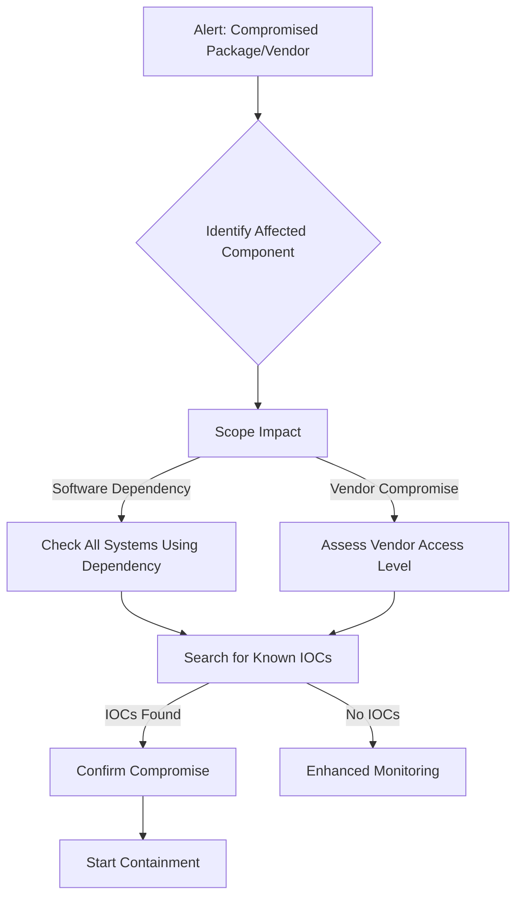

# Playbook: Supply Chain Attack Response

**Severity**: Critical | **Category**: Software Supply Chain

## 1. Analysis (Triage)

-   **Identify the Component**: Determine the compromised library, package, update, or vendor integration (CVE advisory, vendor notification, threat intel feed).
-   **Impact Assessment**: Enumerate all systems, servers, and applications using the compromised component. Use SBOM (Software Bill of Materials) if available.
-   **IOC Search**: Check for known IOCs from vendor advisories or CERTs — malicious hashes, C2 domains, backdoor indicators.
-   **Timeline**: Determine when the compromised version was installed and for how long it was active.

## 2. Containment
-   **Isolate Affected Systems**: Network-isolate servers running the compromised component.
-   **Block C2**: Add known C2 IPs/domains from advisories to Firewall/Proxy blocklist.
-   **Disable Vendor Access**: Revoke API keys, OAuth tokens, VPN credentials, and service accounts granted to the compromised vendor.
-   **Freeze Deployments**: Halt all CI/CD pipelines until the compromised dependency is removed.
-   **Snapshot**: Take forensic images of affected systems before remediation.

## 3. Remediation
-   **Patch/Rollback**: Update to a clean version of the dependency, or rollback to a known-good version.
-   **Credential Rotation**: Rotate all secrets, API keys, and certificates that were accessible to the compromised component.
-   **SBOM Review**: Audit Software Bill of Materials for other potentially vulnerable dependencies.
-   **Vendor Assessment**: Request the vendor's incident report and remediation evidence before restoring access.

## 4. Recovery
-   **Staged Restoration**: Restore systems in phases, monitoring closely for residual compromise.
-   **Enhanced Monitoring**: Increase detection rules for the specific TTPs associated with the supply chain attack (e.g., unusual outbound connections, new scheduled tasks).
-   **Validate Integrity**: Compare file hashes of critical binaries against known-good baselines.

## 5. Lessons Learned
-   **SBOM Implementation**: Ensure an up-to-date SBOM exists for all applications.
-   **Vendor Security Assessment**: Establish or strengthen third-party risk management.
-   **Dependency Pinning**: Pin dependency versions and verify checksums in CI/CD.
-   **Detection Gap**: Add detection rules for compromised update mechanisms (T1195).

## Related Documents
-   [Incident Response Framework](../Framework.en.md)
-   [Malware Infection Playbook](Malware_Infection.en.md)
-   [Data Exfiltration Playbook](Data_Exfiltration.en.md)
-   [Incident Report Template](../../templates/incident_report.en.md)
-   [Shift Handover Log](../../templates/shift_handover.en.md)

## References
-   [MITRE ATT&CK T1195 — Supply Chain Compromise](https://attack.mitre.org/techniques/T1195/)
-   [NIST SP 800-161 — Cybersecurity Supply Chain Risk Management](https://csrc.nist.gov/publications/detail/sp/800-161/rev-1/final)
-   [CISA — Defending Against Software Supply Chain Attacks](https://www.cisa.gov/sites/default/files/publications/defending_against_software_supply_chain_attacks_508.pdf)
-   [SLSA Framework (Supply-chain Levels for Software Artifacts)](https://slsa.dev/)
