# Playbook: Supply Chain Attack Response

**ID**: PB-32
**Severity**: Critical | **Category**: Software Supply Chain
**MITRE ATT&CK**: [T1195](https://attack.mitre.org/techniques/T1195/) (Supply Chain Compromise), [T1195.001](https://attack.mitre.org/techniques/T1195/001/) (Compromise Software Dependencies), [T1195.002](https://attack.mitre.org/techniques/T1195/002/) (Compromise Software Supply Chain)
**Trigger**: Vendor security advisory, CISA/CERT alert, Threat intel feed, Anomaly detection on vendor-supplied component

> ⚠️ **CRITICAL**: Supply chain attacks can affect thousands of organizations simultaneously. Time-to-containment directly impacts blast radius.

---

## Decision Flow

```mermaid
graph TD
    Alert["🚨 Supply Chain Alert"] --> Source{"📢 Alert Source?"}
    Source -->|Vendor Advisory / CVE| Advisory["📄 Review Advisory"]
    Source -->|CISA/CERT Alert| CERT["🏛️ Review CERT Details"]
    Source -->|Internal Detection| Internal["🔍 Anomaly on Vendor Component"]
    Source -->|Threat Intel / News| TI["📰 Emerging Threat"]
    Advisory --> Scope["📊 Scope Impact"]
    CERT --> Scope
    Internal --> Scope
    TI --> Scope
    Scope --> Used{"🖥️ We Use This Component?"}
    Used -->|Yes| Inventory["📋 Enumerate Affected Systems"]
    Used -->|No| Monitor["👁️ Monitor — No Action"]
    Inventory --> IOC{"🔍 IoCs Found?"}
    IOC -->|Yes| Compromised["🔴 Confirmed Compromise"]
    IOC -->|No| Mitigate["🟠 Preventive Mitigation"]
    Compromised --> FullIR["🔒 Full IR Response"]
```

---

## 1. Analysis

### 1.1 Supply Chain Attack Types

| Type | Example | Detection |
|:---|:---|:---|
| **Compromised software update** | SolarWinds Orion (SUNBURST) | Update contains backdoor |
| **Compromised dependency** | npm/PyPI malicious package | Typosquatting, dependency confusion |
| **Compromised build system** | Codecov CI script | CI/CD pipeline injection |
| **Compromised vendor access** | MSP/MSSP credential compromise | Vendor account misuse |
| **Compromised hardware/firmware** | Pre-installed malware | Firmware integrity check |
| **Compromised container image** | Docker Hub malicious image | Image scanning |

### 1.2 Investigation Checklist

| Check | How | Done |
|:---|:---|:---:|
| Identify the compromised component (library, update, vendor) | Advisory, TI | ☐ |
| Affected versions | Advisory / CVE details | ☐ |
| Enumerate ALL systems using the component | SBOM, package managers, CMDB | ☐ |
| When was the compromised version installed? | Package manager logs, change history | ☐ |
| How long was it active? | Timeline analysis | ☐ |
| Search for advisory-provided IoCs | SIEM, EDR, network logs | ☐ |
| Were any IoCs found? | Search results | ☐ |
| Did the compromised component have network access? | Firewall rules, traffic logs | ☐ |
| Did the compromised component have credentials/secrets access? | Config, env vars | ☐ |

### 1.3 SBOM Assessment

| Question | Answer | Done |
|:---|:---|:---:|
| Do we have an SBOM for affected applications? | | ☐ |
| Are dependency versions pinned? | | ☐ |
| Are checksums verified in CI/CD? | | ☐ |
| Do we use a private package registry? | | ☐ |

---

## 2. Containment

### 2.1 Immediate Actions

| # | Action | Done |
|:---:|:---|:---:|
| 1 | **Isolate** affected systems from network | ☐ |
| 2 | **Block C2** — add advisory-provided IoCs to blocklists | ☐ |
| 3 | **Disable vendor access** — revoke API keys, OAuth, VPN, service accounts | ☐ |
| 4 | **Freeze CI/CD** — halt all deployments until compromised dependency removed | ☐ |
| 5 | **Snapshot** affected systems for forensics | ☐ |

### 2.2 Vendor Access Revocation

| Access Type | How to Revoke | Done |
|:---|:---|:---:|
| API keys | Rotate in API management | ☐ |
| OAuth tokens | Enterprise Apps / IdP | ☐ |
| VPN credentials | VPN management | ☐ |
| Service accounts | AD / IAM | ☐ |
| SSH keys / certificates | Key management | ☐ |

---

## 3. Eradication

| # | Action | Done |
|:---:|:---|:---:|
| 1 | **Patch/rollback** to clean version of compromised component | ☐ |
| 2 | **Rotate ALL secrets** accessible to the compromised component | ☐ |
| 3 | **Audit SBOM** for additional vulnerable dependencies | ☐ |
| 4 | **Rebuild** affected applications from clean dependencies | ☐ |
| 5 | **Verify file integrity** — compare binaries against known-good hashes | ☐ |
| 6 | Hunt for backdoors, web shells, or persistence created by attacker | ☐ |

---

## 4. Recovery

| # | Action | Done |
|:---:|:---|:---:|
| 1 | **Staged restoration** — restore systems in phases with monitoring | ☐ |
| 2 | **Validate integrity** of all restored systems | ☐ |
| 3 | **Request vendor's incident report** before restoring vendor access | ☐ |
| 4 | **Implement SBOM** — maintain for all applications | ☐ |
| 5 | **Pin dependency versions** and verify checksums in CI/CD | ☐ |
| 6 | **Private registry** — mirror dependencies in private package registry | ☐ |
| 7 | **Vendor assessment** — update third-party risk management program | ☐ |
| 8 | Monitor for 30 days | ☐ |

---

## 5. IoC Collection

| Type | Value | Source |
|:---|:---|:---|
| Compromised component name/version | | Advisory |
| Malicious file hashes | | Advisory / EDR |
| C2 domains/IPs | | Advisory / TI |
| Backdoor indicators | | Advisory / Forensics |
| Affected systems | | SBOM / Inventory |
| Vendor access logs | | IAM / VPN |

---

## 6. Escalation Criteria

| Condition | Escalate To |
|:---|:---|
| Production systems confirmed compromised | CISO + Major Incident |
| Data exfiltration via supply chain backdoor | Legal + DPO (PDPA 72h) |
| CI/CD pipeline compromised | Engineering Lead + CISO |
| Vendor confirmed breached | Legal + Procurement + CISO |
| Multiple organizations affected (industry-wide) | ISAC sharing (TLP:AMBER) |
| Credentials accessed by compromised component | IAM team + Full secret rotation |

---

## Related Documents

- [IR Framework](../Framework.en.md)
- [Incident Report](../../templates/incident_report.en.md)
- [PB-03 Malware Infection](Malware_Infection.en.md)
- [PB-08 Data Exfiltration](Data_Exfiltration.en.md)
- [PB-18 Exploit](Exploit.en.md)

## References

- [MITRE ATT&CK T1195 — Supply Chain Compromise](https://attack.mitre.org/techniques/T1195/)
- [NIST SP 800-161r1 — Cybersecurity Supply Chain Risk Management](https://csrc.nist.gov/publications/detail/sp/800-161/rev-1/final)
- [CISA — Defending Against Software Supply Chain Attacks](https://www.cisa.gov/sites/default/files/publications/defending_against_software_supply_chain_attacks_508.pdf)
- [SLSA Framework](https://slsa.dev/)
