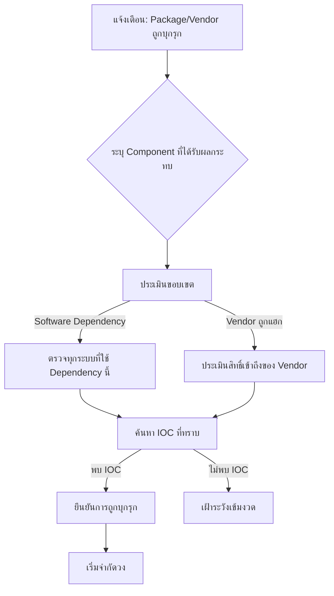

# Playbook: การตอบสนองต่อ Supply Chain Attack (การโจมตีห่วงโซ่อุปทาน)

**ความรุนแรง**: วิกฤต | **หมวดหมู่**: Software Supply Chain

## 1. การวิเคราะห์ (Triage)

-   **ระบุ Component**: ตรวจสอบว่า Library, Package, Update หรือ Vendor Integration ใดถูก Compromise (จาก CVE Advisory, แจ้งเตือนจาก Vendor, Threat Intel Feed)
-   **ประเมินผลกระทบ**: นับทุกระบบ เซิร์ฟเวอร์ และแอปพลิเคชันที่ใช้ Component ที่ถูก Compromise — ใช้ SBOM (Software Bill of Materials) ถ้ามี
-   **ค้นหา IOC**: ตรวจสอบ IOC จาก Advisory ต่างๆ — Hash อันตราย, C2 Domain, ตัวบ่งชี้ Backdoor
-   **ไทม์ไลน์**: ระบุว่าเวอร์ชันที่ถูก Compromise ถูกติดตั้งเมื่อไหร่ และใช้งานมานานเท่าไหร่

## 2. การจำกัดวง (Containment)
-   **แยกระบบ**: Network-isolate เซิร์ฟเวอร์ที่รัน Component ที่ถูก Compromise
-   **บล็อก C2**: เพิ่ม IP/Domain C2 จาก Advisory เข้า Blocklist ใน Firewall/Proxy
-   **ปิดการเข้าถึง Vendor**: ยกเลิก API Key, OAuth Token, VPN Credential และ Service Account ที่ให้ Vendor
-   **หยุด Deployment**: หยุด CI/CD Pipeline ทั้งหมดจนกว่าจะลบ Dependency ที่ถูก Compromise ออก
-   **Snapshot**: เก็บ Forensic Image ของระบบที่ได้รับผลกระทบก่อนทำ Remediation

## 3. การแก้ไข (Remediation)
-   **Patch/Rollback**: อัปเดตเป็นเวอร์ชันสะอาด หรือ Rollback ไปเวอร์ชันที่ปลอดภัย
-   **หมุนเวียนรหัส**: เปลี่ยน Secret, API Key และ Certificate ทั้งหมดที่ Component ที่ถูก Compromise เข้าถึงได้
-   **ตรวจ SBOM**: ตรวจสอบ Software Bill of Materials หา Dependency อื่นที่อาจมีช่องโหว่
-   **ประเมิน Vendor**: ร้องขอรายงาน Incident และหลักฐานการแก้ไขจาก Vendor ก่อนคืนสิทธิ์

## 4. การกู้คืน (Recovery)
-   **กู้คืนเป็นขั้น**: กู้คืนระบบทีละเฟส เฝ้าดูอย่างใกล้ชิดว่ามีเศษของการ Compromise เหลืออยู่
-   **เฝ้าระวังเข้มงวด**: เพิ่ม Detection Rule สำหรับ TTP เฉพาะที่เกี่ยวข้อง (เช่น Outbound Connection ผิดปกติ, Scheduled Task ใหม่)
-   **ตรวจสอบความสมบูรณ์**: เปรียบเทียบ Hash ของไฟล์สำคัญกับ Baseline ที่ปลอดภัย

## 5. บทเรียน (Lessons Learned)
-   **เริ่มใช้ SBOM**: ให้มี Software Bill of Materials ที่อัปเดตสำหรับทุกแอปพลิเคชัน
-   **ประเมินความปลอดภัย Vendor**: สร้างหรือเสริมโปรแกรม Third-Party Risk Management
-   **Pin Dependency**: ล็อกเวอร์ชัน Dependency และตรวจ Checksum ใน CI/CD
-   **ช่องว่างการตรวจจับ**: เพิ่ม Detection Rule สำหรับกลไก Update ที่ถูก Compromise (T1195)

## เอกสารที่เกี่ยวข้อง (Related Documents)
-   [กรอบ Incident Response](../Framework.th.md)
-   [Playbook: Malware Infection](Malware_Infection.th.md)
-   [Playbook: Data Exfiltration](Data_Exfiltration.th.md)
-   [แบบฟอร์มรายงาน Incident](../../templates/incident_report.th.md)
-   [แบบฟอร์มส่งมอบกะ](../../templates/shift_handover.th.md)

## References
-   [MITRE ATT&CK T1195 — Supply Chain Compromise](https://attack.mitre.org/techniques/T1195/)
-   [NIST SP 800-161 — Cybersecurity Supply Chain Risk Management](https://csrc.nist.gov/publications/detail/sp/800-161/rev-1/final)
-   [CISA — Defending Against Software Supply Chain Attacks](https://www.cisa.gov/sites/default/files/publications/defending_against_software_supply_chain_attacks_508.pdf)
-   [SLSA Framework](https://slsa.dev/)
