# Playbook: Supply Chain Attack / การโจมตีห่วงโซ่อุปทาน

**ID**: PB-32
**ระดับความรุนแรง**: วิกฤต | **หมวดหมู่**: ภัยคุกคามจากภายนอก
**MITRE ATT&CK**: [T1195](https://attack.mitre.org/techniques/T1195/) (Supply Chain Compromise)
**ทริกเกอร์**: Vendor advisory, TI alert, EDR detection (compromised update), dependency vulnerability scan

### ผังเวกเตอร์ Supply Chain

```mermaid
graph TD
    SC["🔗 Supply Chain"] --> Type{"📋 ประเภท?"}
    Type -->|Software Update| Update["📦 Trojanized Update"]
    Type -->|Open Source| OSS["🔓 Malicious Package"]
    Type -->|Hardware| HW["🔧 Firmware Implant"]
    Type -->|MSP/Vendor| MSP["🏢 Vendor Compromise"]
    Update --> Impact["💥 Impact Assessment"]
    OSS --> Impact
    HW --> Impact
    MSP --> Impact
```

### ผังขั้นตอน SBOM Verification

```mermaid
sequenceDiagram
    participant SOC
    participant SCA as SCA Tool
    participant Dev as Dev Team
    participant Vendor
    SOC->>SCA: สแกน dependencies
    SCA-->>SOC: พบ compromised package!
    SOC->>Dev: 🚨 หยุดใช้ package
    Dev->>Dev: Pin ไปเวอร์ชันปลอดภัย
    SOC->>Vendor: แจ้ง + ขอ advisory
    Dev->>SOC: ✅ Remediated
```

---

## ผังการตัดสินใจ

```mermaid
graph TD
    Alert["🚨 Supply Chain Alert"] --> Type{"📦 ประเภท?"}
    Type -->|Software Update| SW["💿 Compromised Update"]
    Type -->|Open-Source Dep| OSS["📦 Malicious Package"]
    Type -->|Vendor/MSP Access| Vendor["🏢 Vendor Compromise"]
    Type -->|Container Image| Container["🐳 Compromised Image"]
    Type -->|Hardware/Firmware| HW["🔌 Hardware Backdoor"]
    SW --> SBOM["📋 ตรวจ SBOM"]
    OSS --> SBOM
    Vendor --> Access["🔑 ตรวจ Vendor Access"]
    Container --> SBOM
    HW --> Isolate["🔒 Isolate Hardware"]
    SBOM --> Scope{"📊 กี่ระบบ?"}
    Scope -->|มาก| Major["🔴 Major Incident"]
    Scope -->|น้อย| Contain["🟠 Contain + Patch"]
```

---

## 1. การวิเคราะห์

### 1.1 ประเภทการโจมตี Supply Chain

| ประเภท | ตัวอย่างจริง | ความรุนแรง |
|:---|:---|:---|
| **Software Update** | SolarWinds SUNBURST | 🔴 วิกฤต |
| **Open-Source Package** | event-stream (npm), ua-parser-js | 🔴 สูง |
| **Vendor/MSP Access** | Kaseya VSA, MoveIT | 🔴 วิกฤต |
| **Container Image** | Docker Hub compromised images | 🟠 สูง |
| **CI/CD Pipeline** | Codecov bash uploader | 🔴 วิกฤต |
| **Hardware/Firmware** | Pre-installed backdoor | 🔴 วิกฤต |

### 1.2 รายการตรวจสอบ

| รายการ | วิธีตรวจสอบ | เสร็จ |
|:---|:---|:---:|
| ซอฟต์แวร์/component/library ที่ได้รับผลกระทบ | Advisory / SCA | ☐ |
| เวอร์ชันที่มีปัญหา (affected versions) | Advisory | ☐ |
| SBOM — ใช้ที่ไหนในองค์กร? | SBOM / SCA scan | ☐ |
| มี IoC จาก advisory? | TI platform | ☐ |
| Vendor แจ้งวิธี remediate? | Vendor contact | ☐ |
| มี patched version แล้ว? | Advisory | ☐ |
| ระบบที่ใช้ component นี้เป็น internet-facing? | CMDB | ☐ |

---

## 2. การควบคุม

| # | การดำเนินการ | เครื่องมือ | เสร็จ |
|:---:|:---|:---|:---:|
| 1 | **Block** เวอร์ชันที่มีปัญหา (ห้ามติดตั้ง/อัปเดต) | Package mgr / SCA | ☐ |
| 2 | **Isolate** ระบบที่ได้รับผลกระทบ | EDR / Network | ☐ |
| 3 | **ตัด vendor access** ชั่วคราว | VPN / PAM | ☐ |
| 4 | **Scan IoC** ทั้งองค์กร | SIEM / EDR | ☐ |
| 5 | **Freeze deployments** ที่ใช้ affected component | CI/CD | ☐ |

### 2.1 การจัดการ Vendor Access

| Vendor Type | การดำเนินการ | เสร็จ |
|:---|:---|:---:|
| MSP (managed service) | ปิด VPN / ลบ access ทันที | ☐ |
| SaaS vendor | ตรวจ OAuth tokens, ปิด API access | ☐ |
| On-site vendor | ปิด network access, แจ้ง vendor | ☐ |

---

## 3. การกำจัด

| # | การดำเนินการ | เสร็จ |
|:---:|:---|:---:|
| 1 | **Rollback / uninstall** เวอร์ชันที่มีปัญหา | ☐ |
| 2 | **อัปเดต** เป็นเวอร์ชันที่ปลอดภัย (ถ้ามี) | ☐ |
| 3 | ลบ backdoor / persistence ที่ inserted | ☐ |
| 4 | หมุนเวียน credentials ที่เข้าถึงได้จาก affected system | ☐ |
| 5 | **Rebuild** affected systems จาก clean state | ☐ |

---

## 4. การฟื้นฟู

| # | การดำเนินการ | เสร็จ |
|:---:|:---|:---:|
| 1 | ใช้ **private registry** สำหรับ packages/images | ☐ |
| 2 | ใช้ **SCA** (Software Composition Analysis) ใน CI/CD | ☐ |
| 3 | สร้าง **SBOM** สำหรับทุกแอปพลิเคชัน | ☐ |
| 4 | ใช้ **dependency pinning** (lock files) | ☐ |
| 5 | ตรวจสอบ **vendor security** ทุกปี (SOC 2, ISO 27001) | ☐ |
| 6 | เปิด **Dependabot / Renovate** automated alerts | ☐ |

---

## 5. เกณฑ์การยกระดับ

| เงื่อนไข | ยกระดับไปยัง |
|:---|:---|
| SolarWinds/Kaseya-scale compromise | CISO + Major Incident |
| ข้อมูลลูกค้าถูกเข้าถึง | Legal + DPO (PDPA 72 ชม.) |
| Critical infrastructure ได้รับผลกระทบ | Regulator |
| การแจ้งสาธารณะจำเป็น | PR + Executive |
| Nation-state indicators | National CERT + Law Enforcement |

---

### ผัง SBOM Management

```mermaid
graph LR
    Build["🔨 CI/CD Build"] --> SBOM["📋 Generate SBOM"]
    SBOM --> Scan["🔍 Scan vulnerabilities"]
    Scan --> CVE{"🔓 CVE found?"}
    CVE -->|Yes| Block["❌ Block deployment"]
    CVE -->|No| Deploy["✅ Deploy"]
    Block --> Fix["🔧 Update dependency"]
    style Block fill:#e74c3c,color:#fff
    style Deploy fill:#27ae60,color:#fff
```

### ผัง Vendor Risk Assessment

```mermaid
sequenceDiagram
    participant Security
    participant Vendor
    participant Legal
    participant CISO
    Security->>Vendor: 📋 Security questionnaire
    Vendor-->>Security: ตอบแบบสอบถาม
    Security->>Security: ⚖️ ประเมิน risk score
    Security->>Legal: ตรวจสอบ contract
    Security->>CISO: 📊 Risk report
    CISO->>CISO: Approve / Reject
```

## เอกสารที่เกี่ยวข้อง

- [กรอบการตอบสนองต่อเหตุการณ์](../Framework.th.md)
- [PB-03 มัลแวร์](Malware_Infection.th.md)
- [PB-18 Exploit](Exploit.th.md)

## อ้างอิง

- [MITRE ATT&CK T1195 — Supply Chain Compromise](https://attack.mitre.org/techniques/T1195/)
- [CISA — ICT Supply Chain Risk Management](https://www.cisa.gov/supply-chain)
