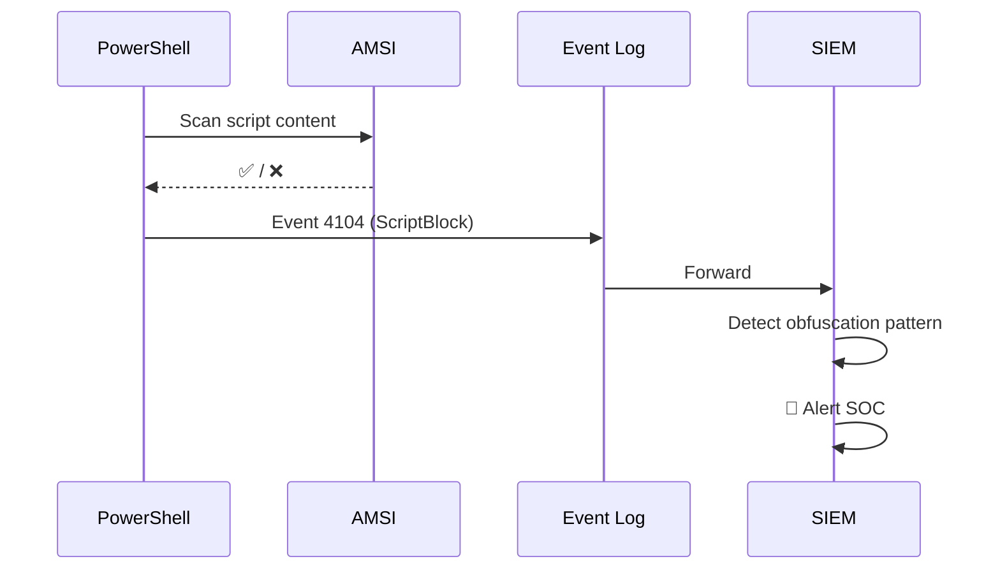
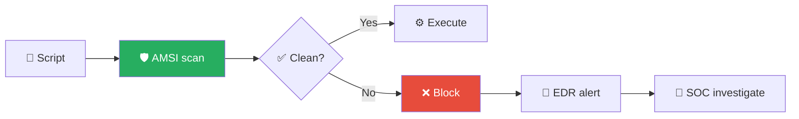
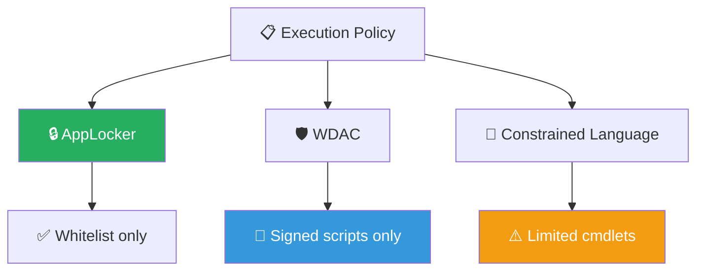

# Playbook: Suspicious Script Execution

**ID**: PB-11
**Severity**: High | **Category**: Endpoint / Execution
**MITRE ATT&CK**: [T1059](https://attack.mitre.org/techniques/T1059/) (Command & Scripting Interpreter), [T1059.001](https://attack.mitre.org/techniques/T1059/001/) (PowerShell), [T1059.005](https://attack.mitre.org/techniques/T1059/005/) (Visual Basic)
**Trigger**: EDR alert ("PowerShell EncodedCommand", "WScript suspicious execution"), AMSI detection, Sysmon Event ID 1

### Script Analysis Pipeline


### PowerShell Logging Detection



---

## Decision Flow

```mermaid
graph TD
    Alert["🚨 Script Execution Alert"] --> Engine{"⚙️ Script Engine?"}
    Engine -->|PowerShell| PS["🔵 PowerShell Analysis"]
    Engine -->|VBScript/JScript| VBS["🟠 WScript/CScript Analysis"]
    Engine -->|Python/Bash| Other["🟡 Other Script"]
    Engine -->|Macro (VBA)| Macro["🔴 Office Macro"]
    PS --> Encoded{"🔍 Encoded/Obfuscated?"}
    Encoded -->|Yes -enc / IEX| Decode["Decode + Sandbox"]
    Encoded -->|No, Cleartext| Analyze{"Malicious Content?"}
    VBS --> Parent{"Parent Process?"}
    Macro --> Parent
    Other --> Analyze
    Decode --> Analyze
    Parent -->|Word/Excel/Outlook| Phishing["🔴 Phishing Delivery"]
    Parent -->|explorer/cmd| UserRun["⚠️ User Initiated"]
    Analyze -->|Download cradle / C2| Confirmed["🔴 Malicious"]
    Analyze -->|Admin script / IT tool| FP["✅ False Positive"]
    Phishing --> Kill["🔌 Kill + Isolate"]
    Confirmed --> Kill
```

---

## 1. Analysis

### 1.1 Script Engine Identification

| Engine | File Extensions | Process Name | Parent (Suspicious) |
|:---|:---|:---|:---|
| **PowerShell** | `.ps1`, `.psm1` | `powershell.exe`, `pwsh.exe` | Word, Excel, WMI, cmd |
| **VBScript** | `.vbs`, `.vbe` | `wscript.exe`, `cscript.exe` | Explorer, Outlook |
| **JScript** | `.js`, `.jse` | `wscript.exe`, `cscript.exe` | Browser, Explorer |
| **VBA Macro** | embedded | `WINWORD.EXE`, `EXCEL.EXE` | N/A (spawns child) |
| **Python** | `.py`, `.pyc` | `python.exe`, `python3` | Depends on context |
| **Batch/CMD** | `.bat`, `.cmd` | `cmd.exe` | Word, PowerShell |
| **Bash/Shell** | `.sh` | `bash`, `sh` | Cron, web server |

### 1.2 Suspicious Indicators

| Indicator | Example | Risk |
|:---|:---|:---|
| `-EncodedCommand` / `-enc` | `powershell -enc SQBFAFgA...` | 🔴 High |
| `Invoke-Expression` / `IEX` | `IEX(New-Object Net.WebClient).DownloadString(...)` | 🔴 High |
| Download cradle | `Net.WebClient`, `Invoke-WebRequest`, `curl` | 🔴 High |
| Memory-only execution | `Reflection.Assembly::Load`, `.NET in-memory` | 🔴 High |
| AMSI bypass | `AmsiUtils`, `amsiInitFailed` | 🔴 Critical |
| Execution policy bypass | `-ExecutionPolicy Bypass` | 🟠 Medium |
| Obfuscation | String concatenation, char codes, `^` escaping | 🟠 Medium |
| Scheduled task creation | `schtasks /create`, `Register-ScheduledTask` | 🔴 High |
| Registry modification | `Set-ItemProperty`, `reg add` | 🟠 Medium |

### 1.3 Investigation Checklist

| Check | How | Done |
|:---|:---|:---:|
| Decode the command (Base64, URL encoding) | CyberChef, `[System.Text.Encoding]::Unicode` | ☐ |
| What did the script DO? | Decoded content analysis | ☐ |
| Parent process chain | EDR process tree | ☐ |
| User context (admin/standard, SYSTEM?) | Process details | ☐ |
| Did it download anything? | Proxy / DNS logs, EDR network | ☐ |
| Did it create files? | File creation events, Sysmon | ☐ |
| Was AMSI triggered? | AMSI logs, Event ID 1116 | ☐ |
| Did it establish persistence? | Registry, scheduled tasks, services | ☐ |

---

## 2. Containment

### 2.1 Immediate Actions

| # | Action | Tool | Done |
|:---:|:---|:---|:---:|
| 1 | **Kill** the script engine process | EDR | ☐ |
| 2 | **Isolate** the host | EDR | ☐ |
| 3 | **Block** downloaded payload hash | EDR global blacklist | ☐ |
| 4 | **Block** C2/download URL at proxy | Proxy / DNS | ☐ |
| 5 | **Disable** user account (if macro phishing) | AD / IdP | ☐ |

### 2.2 If Macro-Based Delivery (Phishing)

| # | Action | Done |
|:---:|:---|:---:|
| 1 | Search all mailboxes for same attachment | ☐ |
| 2 | Delete phishing emails from all mailboxes | ☐ |
| 3 | Block sender domain at email gateway | ☐ |
| 4 | Check if any other users opened the attachment | ☐ |

---

## 3. Eradication

| # | Action | Done |
|:---:|:---|:---:|
| 1 | Delete the malicious script file (`.ps1`, `.vbs`, `.js`) | ☐ |
| 2 | Remove downloaded payloads | ☐ |
| 3 | Remove persistence (scheduled tasks, registry Run keys, services) | ☐ |
| 4 | Clear PowerShell command history if attacker used console | ☐ |
| 5 | Full AV/EDR scan of the host | ☐ |

---

## 4. Recovery

| # | Action | Done |
|:---:|:---|:---:|
| 1 | Reconnect host after verified clean | ☐ |
| 2 | Enforce Constrained Language Mode for PowerShell | ☐ |
| 3 | Deploy/verify AppLocker or WDAC script restrictions | ☐ |
| 4 | Enable Script Block Logging (Event ID 4104) | ☐ |
| 5 | Enable Module Logging for PowerShell | ☐ |
| 6 | Monitor host for 72 hours | ☐ |

---

## 5. IoC Collection

| Type | Value | Source |
|:---|:---|:---|
| Script file hash | | EDR |
| Decoded command content | | Analysis |
| Download URL | | Proxy / EDR |
| Downloaded payload hash | | EDR |
| C2 domain/IP | | DNS / Proxy |
| Parent process | | EDR |
| Persistence location | | Registry / Sysmon |

---

## 6. Escalation Criteria

| Condition | Escalate To |
|:---|:---|
| AMSI bypass detected | Tier 2 + Threat Hunt |
| Download cradle connecting to C2 | [PB-13 C2](C2_Communication.en.md) |
| Macro phishing hitting multiple users | [PB-01 Phishing](Phishing.en.md) — Major |
| Credential dumping via script | [PB-07 PrivEsc](Privilege_Escalation.en.md) |
| Ransomware payload downloaded | [PB-02 Ransomware](Ransomware.en.md) |
| Script ran as SYSTEM | SOC Lead immediately |

---

### AMSI Detection Pipeline



### Script Execution Policy



## Related Documents

- [IR Framework](../Framework.en.md)
- [Incident Report](../../templates/incident_report.en.md)
- [PB-01 Phishing](Phishing.en.md)
- [PB-03 Malware Infection](Malware_Infection.en.md)
- [PB-13 C2 Communication](C2_Communication.en.md)

## References

- [MITRE ATT&CK T1059 — Command and Scripting Interpreter](https://attack.mitre.org/techniques/T1059/)
- [Red Canary: PowerShell Threat Detection](https://redcanary.com/threat-detection-report/techniques/powershell/)
- [Microsoft Script Block Logging](https://learn.microsoft.com/en-us/powershell/module/microsoft.powershell.core/about/about_logging_windows)
