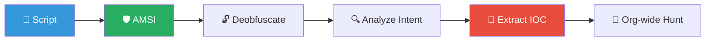
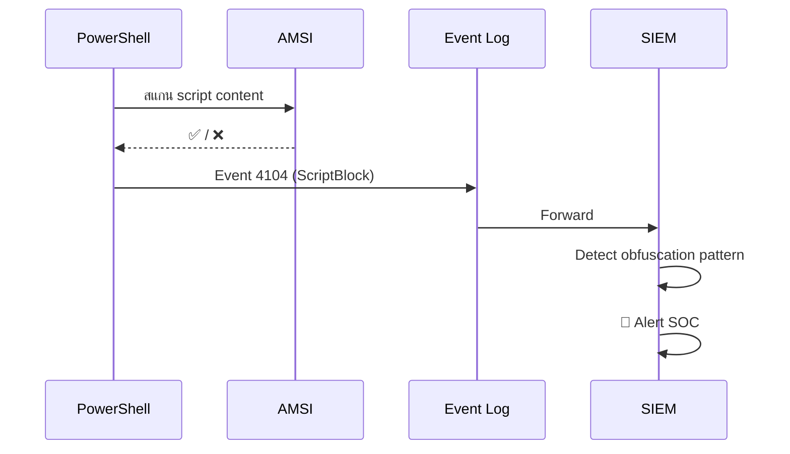
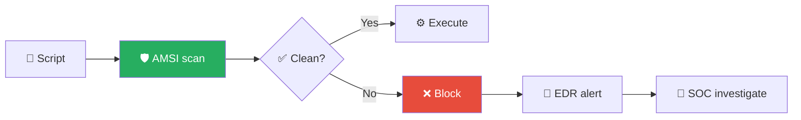
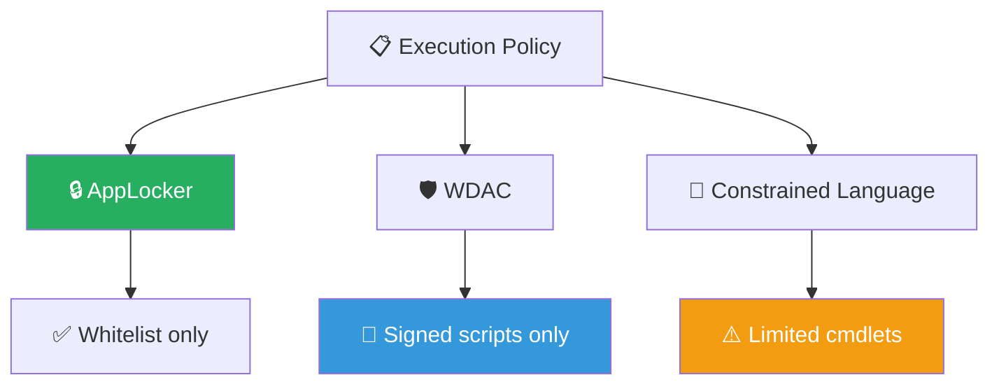

# Playbook: การรัน Script ที่น่าสงสัย (Suspicious Script Execution)

**ID**: PB-11
**ระดับความรุนแรง**: สูง | **หมวดหมู่**: Endpoint / Execution
**MITRE ATT&CK**: [T1059](https://attack.mitre.org/techniques/T1059/) (Command & Scripting Interpreter)
**ทริกเกอร์**: EDR alert (script execution), SIEM (Event 4104/4688), AMSI detection, email attachment filter

### ผัง Script Analysis Pipeline



### ผังตรวจจับ PowerShell Logging



---

## ผังการตัดสินใจ

```mermaid
graph TD
    Alert["🚨 Suspicious Script"] --> Engine{"⚙️ Script Engine?"}
    Engine -->|PowerShell| PS["🔵 PowerShell"]
    Engine -->|VBScript/JScript| VB["🟠 WSH"]
    Engine -->|Bash/Python| Unix["🟢 Unix Shell"]
    Engine -->|Office Macro| Macro["📄 VBA Macro"]
    PS --> Encoded{"🔤 Encoded?"}
    VB --> Parent["👆 Parent Process?"]
    Unix --> Parent
    Macro --> Parent
    Encoded -->|ใช่| Decode["🔓 Decode + วิเคราะห์"]
    Encoded -->|ไม่| Content["📋 วิเคราะห์ Content"]
    Decode --> Malicious{"🦠 อันตราย?"}
    Content --> Malicious
    Parent --> Malicious
    Malicious -->|ใช่| Isolate["🔒 Isolate Host"]
    Malicious -->|ไม่ (FP)| Close["✅ False Positive"]
```

---

## 1. การวิเคราะห์

### 1.1 Script Engines และตัวบ่งชี้

| Engine | Binary | ตัวบ่งชี้อันตราย | ความเสี่ยง |
|:---|:---|:---|:---|
| **PowerShell** | powershell.exe, pwsh.exe | `-EncodedCommand`, `-NoProfile`, `-Bypass`, AMSI bypass, `IEX`, `DownloadString` | 🔴 สูง |
| **VBScript** | wscript.exe, cscript.exe | child process (cmd, powershell), ActiveXObject | 🟠 สูง |
| **Python** | python.exe, python3 | unexpected execution, subprocess, urllib | 🟠 สูง |
| **Bash/Shell** | bash, sh | `curl \| bash`, `wget + chmod +x`, reverse shell | 🔴 สูง |
| **Office Macro** | WINWORD.EXE → child | cmd.exe/powershell.exe spawn | 🔴 สูง |
| **MSHTA** | mshta.exe | inline VBScript, remote HTA | 🔴 สูง |

### 1.2 รายการตรวจสอบ

| รายการ | วิธีตรวจสอบ | เสร็จ |
|:---|:---|:---:|
| Script engine ที่ใช้ | EDR process details | ☐ |
| Full command line ที่รัน | EDR / Sysmon Event 1 | ☐ |
| Decoded content (ถ้า encoded) | CyberChef / EDR decode | ☐ |
| Parent process (ใคร/อะไรเรียก?) | EDR process tree | ☐ |
| มีการเชื่อมต่อเครือข่าย? (C2 callback) | EDR / Sysmon Event 3 | ☐ |
| มีไฟล์ถูกสร้างหรือแก้ไข? | EDR / Sysmon Event 11 | ☐ |
| มี persistence สร้าง? (registry, task) | EDR / Autoruns | ☐ |
| มี host อื่นรัน script เดียวกัน? | SIEM pivot | ☐ |
| AMSI blocked หรือ bypass สำเร็จ? | AMSI logs / Event 4104 | ☐ |

### 1.3 Obfuscation Patterns ที่น่าสงสัย

| Pattern | ตัวอย่าง |
|:---|:---|
| Base64 encoded | `-EncodedCommand`, `base64 -d` |
| String concatenation | `"Down" + "loadS" + "tring"` |
| XOR/char code | `[char]0x49 + [char]0x45 + [char]0x58` |
| Compression + encode | `IO.Compression.DeflateStream` |

---

## 2. การควบคุม

| # | การดำเนินการ | เครื่องมือ | เสร็จ |
|:---:|:---|:---|:---:|
| 1 | **Kill** process ที่รัน script | EDR | ☐ |
| 2 | **Isolate** host (network quarantine) | EDR | ☐ |
| 3 | **Block** script hash ที่ EDR ทั้งองค์กร | EDR policy | ☐ |
| 4 | **Block** C2 domain/IP (ถ้ามีการเชื่อมต่อ) | Firewall/DNS | ☐ |
| 5 | ค้นหา script hash / command pattern ใน host อื่น | SIEM | ☐ |

---

## 3. การกำจัด

| # | การดำเนินการ | เสร็จ |
|:---:|:---|:---:|
| 1 | ลบ script file + payload ที่ดาวน์โหลดมา | ☐ |
| 2 | ลบ persistence (scheduled task, registry run key, cron) | ☐ |
| 3 | หมุนเวียน credentials ถ้าสงสัยว่าถูก harvest | ☐ |
| 4 | สแกน AV/EDR เต็มรูปแบบ | ☐ |
| 5 | ตรวจ parent process — แก้ entry vector (macro, phishing) | ☐ |

---

## 4. การฟื้นฟู

| # | การดำเนินการ | เสร็จ |
|:---:|:---|:---:|
| 1 | เปิด **Script Block Logging** (PowerShell Event 4104) | ☐ |
| 2 | บังคับ **Constrained Language Mode** (PowerShell) | ☐ |
| 3 | ใช้ **AppLocker / WDAC** จำกัด script execution | ☐ |
| 4 | ปิด **WSH** (wscript/cscript) สำหรับผู้ใช้ทั่วไป | ☐ |
| 5 | บล็อก **Office Macros** จาก internet (Mark of the Web) | ☐ |

---

## 5. เกณฑ์การยกระดับ

| เงื่อนไข | ยกระดับไปยัง |
|:---|:---|
| Malware payload ถูกดาวน์โหลด | [PB-03 Malware](Malware_Infection.th.md) |
| C2 callback ยืนยัน | [PB-13 C2](C2_Communication.th.md) |
| หลาย host ถูกรัน script เดียวกัน | Major Incident |
| AMSI bypass สำเร็จ + persistence | Tier 2 escalation |
| Credential theft (Mimikatz-style) | [PB-09 Lateral Movement](Lateral_Movement.th.md) |

---

### ผัง AMSI Detection Pipeline



### ผัง Script Execution Policy



## เอกสารที่เกี่ยวข้อง

- [กรอบการตอบสนองต่อเหตุการณ์](../Framework.th.md)
- [PB-03 มัลแวร์](Malware_Infection.th.md)
- [PB-13 C2 Communication](C2_Communication.th.md)

## อ้างอิง

- [MITRE ATT&CK T1059 — Command & Scripting Interpreter](https://attack.mitre.org/techniques/T1059/)
