# Playbook: Typosquatting / Domain Impersonation Response

**ID**: PB-49
**Severity**: High | **Category**: Resource Development / Initial Access
**MITRE ATT&CK**: [T1583.001](https://attack.mitre.org/techniques/T1583/001/) (Acquire Infrastructure: Domains), [T1608.005](https://attack.mitre.org/techniques/T1608/005/) (Link Target)
**Trigger**: Brand monitoring alert (lookalike domain registered), user report (suspicious email from similar domain), threat intel (phishing campaign using typosquat domain)

> ⚠️ **WARNING**: Typosquatting domains are used for phishing, credential harvesting, and supply chain attacks. Attackers register domains that look like yours — one character off — and target your customers, partners, and employees.

### Typosquatting Attack Methods


### Attack Use Cases

```mermaid
graph TD
    Domain["Typosquat Domain"] --> Phish["📧 Phishing Emails\nFrom: admin@exampel.com"]
    Domain --> Web["🌐 Fake Website\nClone of real login page"]
    Domain --> BEC["💼 BEC Attack\ncfo@exampel.com → wire"]
    Domain --> Supply["📦 Supply Chain\nFake vendor emails"]
    Domain --> SEO["🔍 SEO Poisoning\nFake site in search results"]
    Domain --> Malware["💀 Malware\nDrive-by download"]
    style Domain fill:#ff6600,color:#fff
    style BEC fill:#cc0000,color:#fff
    style Malware fill:#660000,color:#fff
```



---

## Decision Flow


### Investigation Workflow

```mermaid
sequenceDiagram
    participant Monitor as Brand Monitor
    participant SOC as SOC Analyst
    participant Legal as Legal Team
    participant IT as IT / DNS
    participant Registrar

    Monitor->>SOC: 🚨 Lookalike domain registered
    SOC->>SOC: Analyze domain (WHOIS, DNS, content)
    SOC->>SOC: Check — is it hosting phishing content?
    SOC->>IT: Block domain at DNS/proxy/email gateway
    SOC->>Legal: Request domain takedown
    Legal->>Registrar: Submit abuse report + UDRP
    Registrar->>Legal: Domain suspended
    SOC->>SOC: Sweep email logs for messages from domain
```



### Domain Analysis Checklist

```mermaid
graph TD
    subgraph "Domain Intelligence"
        D1["WHOIS — registration date, registrant"]
        D2["DNS — A record, MX record, nameservers"]
        D3["Content — clone of real site?"]
        D4["SSL cert — who issued?"]
        D5["VirusTotal — reputation"]
        D6["URLScan — page screenshot"]
    end
    subgraph "Email Intelligence"
        E1["SPF/DKIM/DMARC — configured?"]
        E2["Email gateway — messages from this domain?"]
        E3["Users who received/clicked"]
    end
    style D3 fill:#cc0000,color:#fff
    style E1 fill:#ff6600,color:#fff
```



### Takedown Process

```mermaid
graph TD
    Detect["Detect typosquat domain"] --> Evidence["Collect evidence\nScreenshots, WHOIS, content"]
    Evidence --> Block["Block internally\nDNS, proxy, email"]
    Block --> Report["Report to registrar\nAbuse complaint"]
    Report --> UDRP{"Need UDRP/legal?"}
    UDRP -->|"Yes — disputed"| Legal["File UDRP dispute\nor legal action"]
    UDRP -->|"No — clear abuse"| Suspend["Registrar suspends\nwithin 24-72h"]
    Legal --> Resolve["Domain transferred\nor deleted"]
    Suspend --> Resolve
    style Detect fill:#ff6600,color:#fff
    style Report fill:#ffcc00,color:#000
```



### Response Timeline


---

## 1. Immediate Actions (First 30 Minutes)

| # | Action | Owner |
|:---|:---|:---|
| 1 | Analyze domain (WHOIS, DNS, content, SSL) | SOC T2 |
| 2 | Block domain at DNS resolver and web proxy | IT / SOC |
| 3 | Block domain at email gateway (inbound/outbound) | IT |
| 4 | Check email logs for messages from/to the domain | SOC |
| 5 | Screenshot all hosted content as evidence | SOC |
| 6 | Submit abuse report to domain registrar | Legal / SOC |

## 2. Investigation Checklist

### Domain Analysis
- [ ] WHOIS: registration date, registrant info, registrar
- [ ] DNS records: A, MX, NS, TXT (SPF/DKIM)
- [ ] Content: is it a clone of our website?
- [ ] SSL certificate: issuing CA, subject
- [ ] VirusTotal: detection by security vendors
- [ ] URLScan.io: page screenshot and analysis

### Email Impact
- [ ] Inbound emails from the typosquat domain
- [ ] Users who received emails from the domain
- [ ] Users who clicked links in emails from the domain
- [ ] Outbound emails to the typosquat domain (data leak risk)

### Broader Campaign
- [ ] Are there other similar domains registered?
- [ ] Is this part of a phishing campaign?
- [ ] Are partners/customers being targeted?

## 3. Containment

| Scope | Action |
|:---|:---|
| **DNS** | Sinkhole / block the domain |
| **Proxy** | URL category block |
| **Email** | Block inbound + outbound |
| **Users** | Notify anyone who interacted |
| **External** | Alert customers/partners |

## 4. Post-Incident

| Question | Answer |
|:---|:---|
| How was the typosquat domain detected? | [Brand monitoring/user report] |
| Was brand monitoring in place? | [Yes/No] |
| Were DMARC reject policies configured? | [Yes/No] |
| Was domain takedown successful? | [Status + timeline] |

## 6. Detection Rules (Sigma)

```yaml
title: Email From Typosquat Domain
logsource:
    product: email_gateway
detection:
    selection:
        sender_domain|re: '(examp1e|exampel|exmple|exampl)\.(com|org|net)'
    condition: selection
    level: high
```

## Related Documents
- [Phishing Playbook](Phishing.en.md)
- [BEC Playbook](BEC.en.md)
- [Brand Abuse Playbook](Brand_Abuse.en.md)

## References
- [MITRE T1583.001 — Domains](https://attack.mitre.org/techniques/T1583/001/)
- [ICANN — UDRP Policy](https://www.icann.org/resources/pages/help/dndr/udrp-en)
