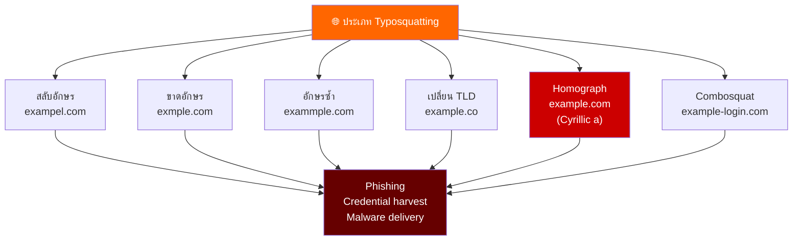
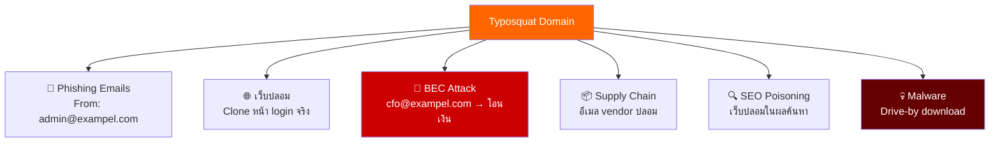
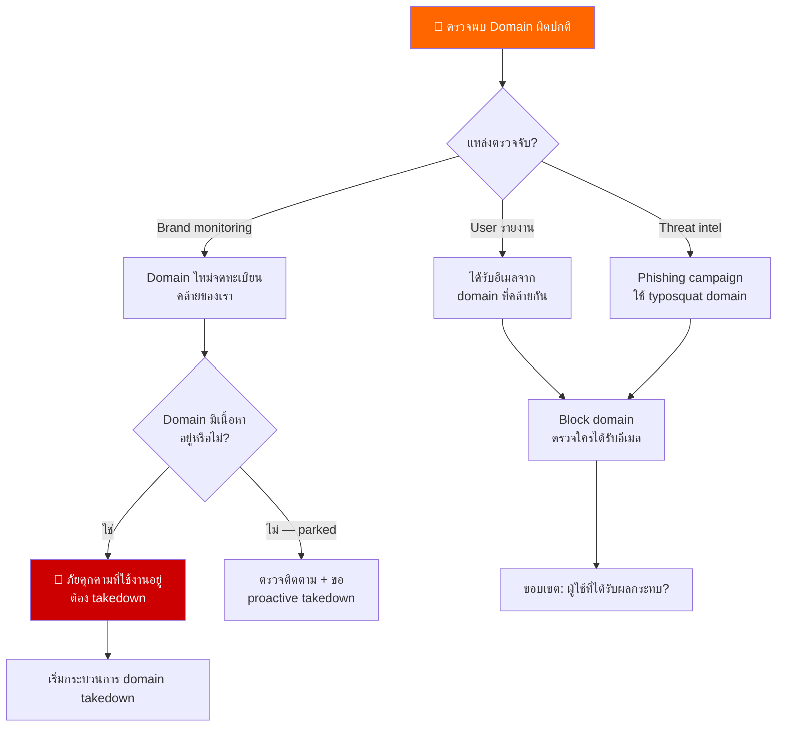
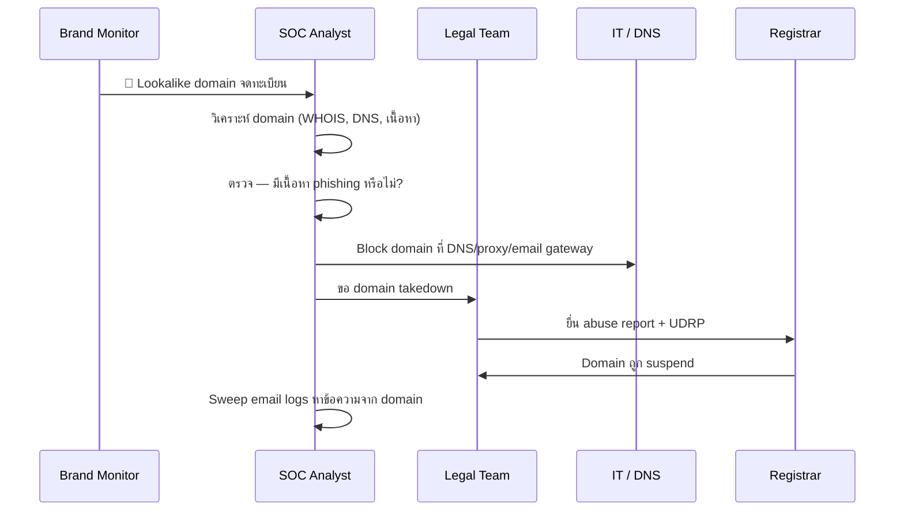
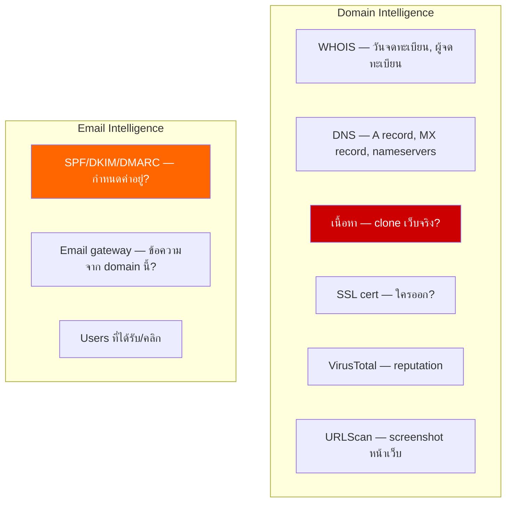
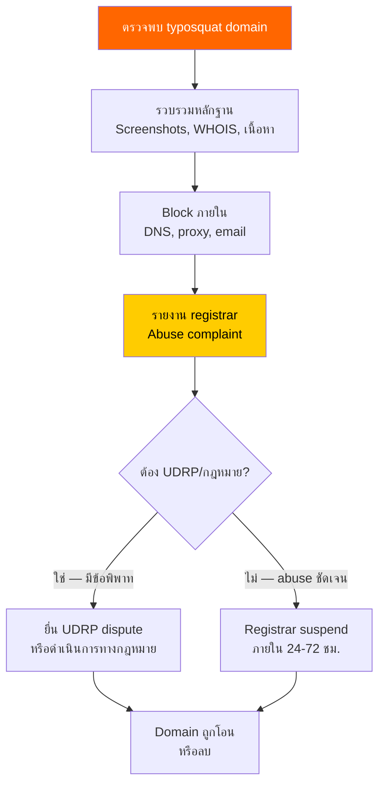

# Playbook: การตอบสนอง Typosquatting / Domain Impersonation

**ID**: PB-49
**ความรุนแรง**: สูง | **ประเภท**: Resource Development / Initial Access
**MITRE ATT&CK**: [T1583.001](https://attack.mitre.org/techniques/T1583/001/) (Acquire Infrastructure: Domains), [T1608.005](https://attack.mitre.org/techniques/T1608/005/) (Link Target)
**Trigger**: Brand monitoring alert (domain คล้ายคลึง), user รายงาน (อีเมลจาก domain คล้ายกัน), threat intel (phishing campaign ใช้ typosquat domain)

> ⚠️ **คำเตือน**: Typosquatting domains ใช้สำหรับ phishing, credential harvesting, และ supply chain attacks ผู้โจมตีจดทะเบียน domain ที่เหมือนของคุณ — ต่างอักษรเดียว — และเล็งเป้า customers, partners, และพนักงาน

### วิธีการ Typosquatting



### กรณีการใช้เชิงโจมตี



---

## Decision Flow



### ขั้นตอนการสืบสวน



### รายการตรวจสอบ Domain



### กระบวนการ Takedown



### Timeline การตอบสนอง

```mermaid
gantt
    title Typosquatting Response Timeline
    dateFormat HH:mm
    axisFormat %H:%M
    section Detection
        Brand monitoring alert  :a1, 00:00, 5min
        วิเคราะห์ domain        :a2, after a1, 30min
    section Containment
        Block ที่ DNS/proxy     :a3, after a2, 15min
        Block ที่ email gateway :a4, after a3, 15min
    section Takedown
        ยื่น abuse report       :a5, after a4, 30min
        Registrar ตอบกลับ       :a6, after a5, 1440min
    section Investigation
        Sweep email logs        :a7, after a3, 60min
```



---

## 1. การดำเนินการทันที (30 นาทีแรก)

| # | การดำเนินการ | ผู้รับผิดชอบ |
|:---|:---|:---|
| 1 | วิเคราะห์ domain (WHOIS, DNS, เนื้อหา, SSL) | SOC T2 |
| 2 | Block domain ที่ DNS resolver และ web proxy | IT / SOC |
| 3 | Block domain ที่ email gateway (inbound/outbound) | IT |
| 4 | ตรวจ email logs หาข้อความจาก/ไปยัง domain | SOC |
| 5 | Screenshot เนื้อหาที่ host ทั้งหมดเป็นหลักฐาน | SOC |
| 6 | ยื่น abuse report ไปยัง registrar | Legal / SOC |

## 2. รายการตรวจสอบ

### วิเคราะห์ Domain
- [ ] WHOIS: วันจดทะเบียน, ข้อมูลผู้จดทะเบียน, registrar
- [ ] DNS records: A, MX, NS, TXT (SPF/DKIM)
- [ ] เนื้อหา: clone ของเว็บไซต์เราหรือไม่?
- [ ] SSL certificate: CA ที่ออก, subject
- [ ] VirusTotal: การตรวจจับโดย security vendors

### ผลกระทบ Email
- [ ] Inbound emails จาก typosquat domain
- [ ] Users ที่ได้รับอีเมลจาก domain
- [ ] Users ที่คลิก links ในอีเมลจาก domain
- [ ] Outbound emails ไปยัง typosquat domain (ความเสี่ยง data leak)

## 3. การควบคุม (Containment)

| ขอบเขต | การดำเนินการ |
|:---|:---|
| **DNS** | Sinkhole / block domain |
| **Proxy** | URL category block |
| **Email** | Block inbound + outbound |
| **Users** | แจ้งทุกคนที่มีปฏิสัมพันธ์ |
| **ภายนอก** | แจ้ง customers/partners |

## 4. หลังเหตุการณ์ (Post-Incident)

| คำถาม | คำตอบ |
|:---|:---|
| Typosquat domain ถูกตรวจจับอย่างไร? | [Brand monitoring/user report] |
| มี brand monitoring หรือไม่? | [ใช่/ไม่] |
| DMARC reject policies กำหนดค่าอยู่หรือไม่? | [ใช่/ไม่] |
| Domain takedown สำเร็จหรือไม่? | [สถานะ + timeline] |

## 6. Detection Rules (Sigma)

```yaml
title: Email From Typosquat Domain
logsource:
    product: email_gateway
detection:
    selection:
        sender_domain|re: '(examp1e|exampel|exmple)\.(com|org|net)'
    condition: selection
    level: high
```

## เอกสารที่เกี่ยวข้อง
- [Phishing Playbook](Phishing.th.md)
- [BEC Playbook](BEC.th.md)

## References
- [MITRE T1583.001 — Domains](https://attack.mitre.org/techniques/T1583/001/)
- [ICANN — UDRP Policy](https://www.icann.org/resources/pages/help/dndr/udrp-en)
