# Playbook: การตอบสนอง Typosquatting / Domain Impersonation

**ID**: PB-49
**ความรุนแรง**: สูง | **ประเภท**: Resource Development / Initial Access
**MITRE ATT&CK**: [T1583.001](https://attack.mitre.org/techniques/T1583/001/) (Acquire Infrastructure: Domains), [T1608.005](https://attack.mitre.org/techniques/T1608/005/) (Link Target)
**Trigger**: Brand monitoring alert (domain คล้ายคลึง), user รายงาน (อีเมลจาก domain คล้ายกัน), threat intel (phishing campaign ใช้ typosquat domain)

> ⚠️ **คำเตือน**: Typosquatting domains ใช้สำหรับ phishing, credential harvesting, และ supply chain attacks ผู้โจมตีจดทะเบียน domain ที่เหมือนของคุณ — ต่างอักษรเดียว — และเล็งเป้า customers, partners, และพนักงาน

### วิธีการ Typosquatting

```mermaid
graph TD
    TS["🌐 ประเภท Typosquatting"] --> Typo["สลับอักษร\nexampel.com"]
    TS --> Missing["ขาดอักษร\nexmple.com"]
    TS --> Double["อักษรซ้ำ\nexammple.com"]
    TS --> TLD["เปลี่ยน TLD\nexample.co"]
    TS --> Homo["Homograph\nexаmple.com\n(Cyrillic а)"]
    TS --> Combo["Combosquat\nexample-login.com"]
    
    Typo --> Use["Phishing\nCredential harvest\nMalware delivery"]
    Missing --> Use
    Double --> Use
    TLD --> Use
    Homo --> Use
    Combo --> Use
    
    style TS fill:#ff6600,color:#fff
    style Homo fill:#cc0000,color:#fff
    style Use fill:#660000,color:#fff
```



### กรณีการใช้เชิงโจมตี

```mermaid
graph TD
    Domain["Typosquat Domain"] --> Phish["📧 Phishing Emails\nFrom: admin@exampel.com"]
    Domain --> Web["🌐 เว็บปลอม\nClone หน้า login จริง"]
    Domain --> BEC["💼 BEC Attack\ncfo@exampel.com → โอนเงิน"]
    Domain --> Supply["📦 Supply Chain\nอีเมล vendor ปลอม"]
    Domain --> SEO["🔍 SEO Poisoning\nเว็บปลอมในผลค้นหา"]
    Domain --> Malware["💀 Malware\nDrive-by download"]
    style Domain fill:#ff6600,color:#fff
    style BEC fill:#cc0000,color:#fff
    style Malware fill:#660000,color:#fff
```



---

## Decision Flow

```mermaid
graph TD
    Alert["🚨 ตรวจพบ Domain ผิดปกติ"] --> Source{"แหล่งตรวจจับ?"}
    Source -->|"Brand monitoring"| Brand["Domain ใหม่จดทะเบียน\nคล้ายของเรา"]
    Source -->|"User รายงาน"| User["ได้รับอีเมลจาก\ndomain ที่คล้ายกัน"]
    Source -->|"Threat intel"| TI["Phishing campaign\nใช้ typosquat domain"]
    Brand --> Active{"Domain มีเนื้อหา\nอยู่หรือไม่?"}
    Active -->|ใช่| Hostile["🔴 ภัยคุกคามที่ใช้งานอยู่\nต้อง takedown"]
    Active -->|"ไม่ — parked"| Monitor["ตรวจติดตาม + ขอ\nproactive takedown"]
    User --> Block["Block domain\nตรวจใครได้รับอีเมล"]
    TI --> Block
    Hostile --> Takedown["เริ่มกระบวนการ domain takedown"]
    Block --> Scope["ขอบเขต: ผู้ใช้ที่ได้รับผลกระทบ?"]
    style Alert fill:#ff6600,color:#fff
    style Hostile fill:#cc0000,color:#fff
```



### ขั้นตอนการสืบสวน

```mermaid
sequenceDiagram
    participant Monitor as Brand Monitor
    participant SOC as SOC Analyst
    participant Legal as Legal Team
    participant IT as IT / DNS
    participant Registrar

    Monitor->>SOC: 🚨 Lookalike domain จดทะเบียน
    SOC->>SOC: วิเคราะห์ domain (WHOIS, DNS, เนื้อหา)
    SOC->>SOC: ตรวจ — มีเนื้อหา phishing หรือไม่?
    SOC->>IT: Block domain ที่ DNS/proxy/email gateway
    SOC->>Legal: ขอ domain takedown
    Legal->>Registrar: ยื่น abuse report + UDRP
    Registrar->>Legal: Domain ถูก suspend
    SOC->>SOC: Sweep email logs หาข้อความจาก domain
```



### รายการตรวจสอบ Domain

```mermaid
graph TD
    subgraph "Domain Intelligence"
        D1["WHOIS — วันจดทะเบียน, ผู้จดทะเบียน"]
        D2["DNS — A record, MX record, nameservers"]
        D3["เนื้อหา — clone เว็บจริง?"]
        D4["SSL cert — ใครออก?"]
        D5["VirusTotal — reputation"]
        D6["URLScan — screenshot หน้าเว็บ"]
    end
    subgraph "Email Intelligence"
        E1["SPF/DKIM/DMARC — กำหนดค่าอยู่?"]
        E2["Email gateway — ข้อความจาก domain นี้?"]
        E3["Users ที่ได้รับ/คลิก"]
    end
    style D3 fill:#cc0000,color:#fff
    style E1 fill:#ff6600,color:#fff
```



### กระบวนการ Takedown

```mermaid
graph TD
    Detect["ตรวจพบ typosquat domain"] --> Evidence["รวบรวมหลักฐาน\nScreenshots, WHOIS, เนื้อหา"]
    Evidence --> Block["Block ภายใน\nDNS, proxy, email"]
    Block --> Report["รายงาน registrar\nAbuse complaint"]
    Report --> UDRP{"ต้อง UDRP/กฎหมาย?"}
    UDRP -->|"ใช่ — มีข้อพิพาท"| Legal["ยื่น UDRP dispute\nหรือดำเนินการทางกฎหมาย"]
    UDRP -->|"ไม่ — abuse ชัดเจน"| Suspend["Registrar suspend\nภายใน 24-72 ชม."]
    Legal --> Resolve["Domain ถูกโอน\nหรือลบ"]
    Suspend --> Resolve
    style Detect fill:#ff6600,color:#fff
    style Report fill:#ffcc00,color:#000
```



### Timeline การตอบสนอง

```mermaid
gantt
    title Typosquatting Response Timeline
    dateFormat HH:mm
    axisFormat %H:%M
    section Detection
        Brand monitoring alert  :a1, 00:00, 5min
        วิเคราะห์ domain        :a2, after a1, 30min
    section Containment
        Block ที่ DNS/proxy     :a3, after a2, 15min
        Block ที่ email gateway :a4, after a3, 15min
    section Takedown
        ยื่น abuse report       :a5, after a4, 30min
        Registrar ตอบกลับ       :a6, after a5, 1440min
    section Investigation
        Sweep email logs        :a7, after a3, 60min
```



---

## 1. การดำเนินการทันที (30 นาทีแรก)

| # | การดำเนินการ | ผู้รับผิดชอบ |
|:---|:---|:---|
| 1 | วิเคราะห์ domain (WHOIS, DNS, เนื้อหา, SSL) | SOC T2 |
| 2 | Block domain ที่ DNS resolver และ web proxy | IT / SOC |
| 3 | Block domain ที่ email gateway (inbound/outbound) | IT |
| 4 | ตรวจ email logs หาข้อความจาก/ไปยัง domain | SOC |
| 5 | Screenshot เนื้อหาที่ host ทั้งหมดเป็นหลักฐาน | SOC |
| 6 | ยื่น abuse report ไปยัง registrar | Legal / SOC |

## 2. รายการตรวจสอบ

### วิเคราะห์ Domain
- [ ] WHOIS: วันจดทะเบียน, ข้อมูลผู้จดทะเบียน, registrar
- [ ] DNS records: A, MX, NS, TXT (SPF/DKIM)
- [ ] เนื้อหา: clone ของเว็บไซต์เราหรือไม่?
- [ ] SSL certificate: CA ที่ออก, subject
- [ ] VirusTotal: การตรวจจับโดย security vendors

### ผลกระทบ Email
- [ ] Inbound emails จาก typosquat domain
- [ ] Users ที่ได้รับอีเมลจาก domain
- [ ] Users ที่คลิก links ในอีเมลจาก domain
- [ ] Outbound emails ไปยัง typosquat domain (ความเสี่ยง data leak)

## 3. การควบคุม (Containment)

| ขอบเขต | การดำเนินการ |
|:---|:---|
| **DNS** | Sinkhole / block domain |
| **Proxy** | URL category block |
| **Email** | Block inbound + outbound |
| **Users** | แจ้งทุกคนที่มีปฏิสัมพันธ์ |
| **ภายนอก** | แจ้ง customers/partners |

## 4. หลังเหตุการณ์ (Post-Incident)

| คำถาม | คำตอบ |
|:---|:---|
| Typosquat domain ถูกตรวจจับอย่างไร? | [Brand monitoring/user report] |
| มี brand monitoring หรือไม่? | [ใช่/ไม่] |
| DMARC reject policies กำหนดค่าอยู่หรือไม่? | [ใช่/ไม่] |
| Domain takedown สำเร็จหรือไม่? | [สถานะ + timeline] |

## 6. Detection Rules (Sigma)

```yaml
title: Email From Typosquat Domain
logsource:
    product: email_gateway
detection:
    selection:
        sender_domain|re: '(examp1e|exampel|exmple)\.(com|org|net)'
    condition: selection
    level: high
```

## เอกสารที่เกี่ยวข้อง
- [Phishing Playbook](Phishing.th.md)
- [BEC Playbook](BEC.th.md)

## References
- [MITRE T1583.001 — Domains](https://attack.mitre.org/techniques/T1583/001/)
- [ICANN — UDRP Policy](https://www.icann.org/resources/pages/help/dndr/udrp-en)
