# Playbook: USB / Removable Media Incident Response

**ID**: PB-40
**Severity**: Medium–High | **Category**: Initial Access / Exfiltration
**MITRE ATT&CK**: [T1091](https://attack.mitre.org/techniques/T1091/) (Replication Through Removable Media), [T1052.001](https://attack.mitre.org/techniques/T1052/001/) (Exfiltration over USB), [T1200](https://attack.mitre.org/techniques/T1200/) (Hardware Additions)
**Trigger**: DLP alert (USB copy), EDR (autorun execution), physical security (unauthorized USB device), SIEM (mass file copy to removable drive)

> ⚠️ **WARNING**: USB devices can deliver malware (Rubber Ducky, BadUSB), exfiltrate data, or bridge air-gapped networks. Never plug unknown USBs into corporate systems.

### USB Threat Landscape


### USB Attack Scenarios


---

## Decision Flow

```mermaid
graph TD
    Alert["🚨 USB Activity Detected"] --> Type{"Type of activity?"}
    Type -->|"Unknown device plugged in"| Unknown["Check device type\nHID? Storage? Network?"]
    Type -->|"Mass file copy to USB"| DLP["Check DLP policy\nAuthorized transfer?"]
    Type -->|"Autorun/execution from USB"| Exec["🔴 Potential malware\nIsolate immediately"]
    Unknown --> HID{"HID device?"}
    HID -->|Yes| Rubber["🔴 Possible Rubber Ducky\nPull USB immediately"]
    HID -->|"No — Storage"| Authorized{"Authorized user & device?"}
    Authorized -->|Yes| Policy["Log & monitor"]
    Authorized -->|No| Block["Block & investigate"]
    DLP --> Sensitive{"Sensitive data?"}
    Sensitive -->|Yes| DLPBlock["🔴 Block transfer\nAlert Data Protection"]
    Sensitive -->|No| Review["Review purpose\nLog for audit"]
    Exec --> Isolate["Isolate endpoint\nPreserve evidence"]
    style Alert fill:#ff6600,color:#fff
    style Rubber fill:#cc0000,color:#fff
    style DLPBlock fill:#cc0000,color:#fff
```



### Investigation Workflow

```mermaid
sequenceDiagram
    participant DLP
    participant SOC as SOC Analyst
    participant IT as IT Security
    participant HR
    participant IR as IR Team

    DLP->>SOC: 🚨 USB mass copy alert
    SOC->>SOC: Check: who, what files, when
    SOC->>IT: Pull USB device registry (VID/PID)
    IT->>SOC: Device info: personal USB drive
    SOC->>SOC: Classify data sensitivity
    SOC->>HR: Alert — potential data theft
    SOC->>IR: Escalate if sensitive data confirmed
    IR->>IT: Review all USB activity for this user (30 days)
```



### USB Device Classification


### Data Exfiltration Detection

```mermaid
graph TD
    Monitor["USB Monitoring"] --> Volume{"Data volume transferred?"}
    Volume -->|"< 100MB"| Low["🟢 Low risk\nLog and review"]
    Volume -->|"100MB - 1GB"| Med["🟡 Medium risk\nReview file types"]
    Volume -->|"> 1GB"| High["🔴 High risk\nPotential mass exfil"]
    High --> FileType{"File types?"}
    FileType -->|"Source code, DB dumps"| Critical["💀 Critical\nIP theft"]
    FileType -->|"Documents, spreadsheets"| Breach["🔴 Data breach\nCheck PII/PDPA"]
    FileType -->|"Media, presentations"| Review2["🟡 Review with user"]
    style Monitor fill:#333,color:#fff
    style Critical fill:#660000,color:#fff
```



### Response Timeline


---

## 1. Immediate Actions (First 15 Minutes)

| # | Action | Owner |
|:---|:---|:---|
| 1 | Identify the USB device (VID/PID, device type) | SOC T1 |
| 2 | Identify the user and timestamp | SOC T1 |
| 3 | If malware execution — isolate endpoint immediately | SOC T1 |
| 4 | If data exfiltration — preserve DLP logs | SOC T2 |
| 5 | Confiscate the USB device (chain of custody) | Physical Security |
| 6 | Check if the device was authorized per policy | SOC T2 |

## 2. Investigation Checklist

### Device Analysis
- [ ] USB device VID/PID (registry: `USBSTOR`)
- [ ] Device serial number and manufacturer
- [ ] First connection timestamp
- [ ] Is it a known/authorized device?
- [ ] Check Windows Event ID 6416 (new device connected)

### Data Transfer Analysis
- [ ] What files were copied TO the USB?
- [ ] What files were copied FROM the USB?
- [ ] Total volume of data transferred
- [ ] Were any files classified as sensitive/confidential?
- [ ] DLP logs for the transfer

### Malware Analysis (if applicable)
- [ ] Check for autorun.inf on the USB
- [ ] Scan USB content with multiple AV engines
- [ ] Check for hidden/system files
- [ ] Look for malicious .lnk or .hta files
- [ ] Check if any executables ran from the USB

## 3. Containment

| Scope | Action | Details |
|:---|:---|:---|
| **Device** | Confiscate USB | Chain of custody documentation |
| **Endpoint** | Isolate if malware suspected | EDR network isolation |
| **Account** | Disable if insider threat suspected | Pending investigation |
| **Policy** | Block USB class on affected endpoint | GPO or EDR |

## 4. Eradication & Recovery

### If Malware Delivered
1. Reimage endpoint
2. Scan all connected file shares for propagation
3. Block USB device class on all endpoints
4. Deploy updated EDR signatures

### If Data Exfiltrated
1. Classify all exfiltrated data
2. Assess PDPA/regulatory notification requirements
3. Preserve USB content as evidence
4. Review and strengthen DLP policies

## 5. Post-Incident

### Lessons Learned
| Question | Answer |
|:---|:---|
| Was USB device policy enforced? | [Yes/No] |
| Did DLP detect the transfer? | [Yes/No — gap?] |
| Was the user trained on USB risks? | [Status] |
| Are USB ports disabled on sensitive systems? | [Status] |

### Prevention Measures
- [ ] Deploy USB device control (whitelist only approved devices)
- [ ] Enable DLP for removable media
- [ ] Disable autorun/autoplay via GPO
- [ ] Disable USB mass storage on sensitive workstations
- [ ] Conduct USB drop test (security awareness exercise)
- [ ] Deploy USB device auditing (Sysmon Event ID 1 + registry)

## 6. Detection Rules (Sigma)

```yaml
title: USB Mass Storage Device Connected
logsource:
    product: windows
    service: security
detection:
    selection:
        EventID: 6416
        ClassName: 'DiskDrive'
    condition: selection
    level: medium
```

```yaml
title: Mass File Copy to Removable Drive
logsource:
    product: windows
    category: file_event
detection:
    selection:
        TargetFilename|startswith:
            - 'D:\'
            - 'E:\'
            - 'F:\'
    timeframe: 5m
    condition: selection | count() > 50
    level: high
```

## Related Documents
- [Data Exfiltration Playbook](Data_Exfiltration.en.md)
- [Insider Threat Playbook](Insider_Threat.en.md)
- [Lost Device Playbook](Lost_Device.en.md)
- [Data Handling Protocol](../../06_Operations_Management/Data_Handling_Protocol.en.md)

## References
- [MITRE T1091 — Replication Through Removable Media](https://attack.mitre.org/techniques/T1091/)
- [USB Attack Taxonomy](https://www.usenix.org/conference/usenixsecurity16/technical-sessions/presentation/tischer)
- [NIST SP 800-53 — Media Protection](https://csrc.nist.gov/publications/detail/sp/800-53/rev-5/final)
