# Playbook: การตอบสนอง USB / สื่อถอดได้

**ID**: PB-40
**ความรุนแรง**: ปานกลาง–สูง | **ประเภท**: Initial Access / Exfiltration
**MITRE ATT&CK**: [T1091](https://attack.mitre.org/techniques/T1091/) (Replication Through Removable Media), [T1052.001](https://attack.mitre.org/techniques/T1052/001/) (Exfiltration over USB), [T1200](https://attack.mitre.org/techniques/T1200/) (Hardware Additions)
**Trigger**: DLP alert (USB copy), EDR (autorun execution), physical security (USB device ไม่ได้รับอนุญาต), SIEM (mass file copy ไปยัง removable drive)

> ⚠️ **คำเตือน**: อุปกรณ์ USB สามารถส่ง malware (Rubber Ducky, BadUSB), ขโมยข้อมูล, หรือเชื่อมเครือข่าย air-gapped ได้ อย่าเสียบ USB ที่ไม่รู้จักเข้าระบบองค์กร

### ภาพรวมภัยคุกคาม USB

```mermaid
graph TD
    USB["🔌 ภัยคุกคาม USB"] --> Malware["ส่ง Malware"]
    USB --> Exfil["ขโมยข้อมูล"]
    USB --> HW["โจมตี Hardware"]
    USB --> Bridge["เชื่อม Air-Gap"]
    
    Malware --> Autorun["Autorun malware\nT1091"]
    Malware --> Rubber["Rubber Ducky\nHID injection"]
    Malware --> BadUSB["BadUSB\nFirmware exploit"]
    
    Exfil --> Copy["คัดลอกไฟล์จำนวนมาก\nT1052.001"]
    Exfil --> Encrypt["Encrypted container\nVeraCrypt"]
    
    HW --> Killer["USB Killer\nทำลาย hardware"]
    HW --> Keylogger["USB Keylogger\nจับ keystroke"]
    
    Bridge --> Stuxnet["แบบ Stuxnet\nเชื่อม OT network"]
    
    style USB fill:#ff6600,color:#fff
    style Rubber fill:#cc0000,color:#fff
    style BadUSB fill:#cc0000,color:#fff
    style Killer fill:#660000,color:#fff
```



### สถานการณ์การโจมตี USB

```mermaid
graph LR
    A["1️⃣ Social Engineering\nวาง USB ในที่จอดรถ"] --> B["2️⃣ เสียบอุปกรณ์\nความอยากรู้"]
    B --> C["3️⃣ Payload ทำงาน\nAutorun/HID inject"]
    C --> D["4️⃣ Malware ติดตั้ง\nสร้าง persistence"]
    D --> E["5️⃣ C2 Connection\nBeacon ไปหาผู้โจมตี"]
    E --> F["6️⃣ Lateral Movement\nCompromise เครือข่าย"]
    style A fill:#ffcc00,color:#000
    style C fill:#ff4444,color:#fff
    style F fill:#660000,color:#fff
```



---

## Decision Flow

```mermaid
graph TD
    Alert["🚨 ตรวจพบกิจกรรม USB"] --> Type{"ประเภทกิจกรรม?"}
    Type -->|"อุปกรณ์ไม่รู้จักเสียบ"| Unknown["ตรวจประเภทอุปกรณ์\nHID? Storage? Network?"]
    Type -->|"คัดลอกไฟล์จำนวนมาก"| DLP["ตรวจ DLP policy\nการโอนที่ได้รับอนุญาต?"]
    Type -->|"Autorun/execution จาก USB"| Exec["🔴 อาจเป็น malware\nแยกทันที"]
    Unknown --> HID{"HID device?"}
    HID -->|ใช่| Rubber["🔴 อาจเป็น Rubber Ducky\nถอด USB ทันที"]
    HID -->|"ไม่ — Storage"| Authorized{"User & device ได้รับอนุญาต?"}
    Authorized -->|ใช่| Policy["บันทึก & ตรวจติดตาม"]
    Authorized -->|ไม่| Block["Block & สืบสวน"]
    DLP --> Sensitive{"ข้อมูลสำคัญ?"}
    Sensitive -->|ใช่| DLPBlock["🔴 Block การโอน\nแจ้ง Data Protection"]
    Sensitive -->|ไม่| Review["ตรวจวัตถุประสงค์\nบันทึกสำหรับ audit"]
    Exec --> Isolate["แยก endpoint\nเก็บหลักฐาน"]
    style Alert fill:#ff6600,color:#fff
    style Rubber fill:#cc0000,color:#fff
    style DLPBlock fill:#cc0000,color:#fff
```



### ขั้นตอนการสืบสวน

```mermaid
sequenceDiagram
    participant DLP
    participant SOC as SOC Analyst
    participant IT as IT Security
    participant HR
    participant IR as IR Team

    DLP->>SOC: 🚨 USB mass copy alert
    SOC->>SOC: ตรวจ: ใคร คัดลอกไฟล์อะไร เมื่อไหร่
    SOC->>IT: ดึงข้อมูล USB device registry (VID/PID)
    IT->>SOC: ข้อมูลอุปกรณ์: USB drive ส่วนตัว
    SOC->>SOC: จำแนกระดับความสำคัญของข้อมูล
    SOC->>HR: แจ้ง — อาจมีการขโมยข้อมูล
    SOC->>IR: Escalate ถ้ายืนยันข้อมูลสำคัญ
    IR->>IT: ตรวจกิจกรรม USB ทั้งหมดของ user นี้ (30 วัน)
```



### การจำแนกอุปกรณ์ USB

```mermaid
graph TD
    subgraph "🟢 ความเสี่ยงต่ำ"
        Mouse["USB Mouse\nStandard HID"]
        Keyboard["USB Keyboard\nStandard HID"]
        Headset["USB Headset\nAudio device"]
    end
    subgraph "🟡 ความเสี่ยงปานกลาง"
        Storage["USB Flash Drive\nMass storage"]
        ExtHDD["External HDD\nMass storage"]
        Phone["Smartphone\nMTP/PTP"]
    end
    subgraph "🔴 ความเสี่ยงสูง"
        RubberDuck["Rubber Ducky\nHID + scripting"]
        BadUSBDev["BadUSB Device\nFirmware exploit"]
        WiFiPineapple["WiFi Pineapple\nNetwork bridge"]
        USBKiller["USB Killer\nPower surge"]
    end
    style RubberDuck fill:#cc0000,color:#fff
    style BadUSBDev fill:#cc0000,color:#fff
    style USBKiller fill:#660000,color:#fff
```



### การตรวจจับ Data Exfiltration

```mermaid
graph TD
    Monitor["USB Monitoring"] --> Volume{"ปริมาณข้อมูลที่โอน?"}
    Volume -->|"< 100MB"| Low["🟢 ความเสี่ยงต่ำ\nบันทึกและตรวจสอบ"]
    Volume -->|"100MB - 1GB"| Med["🟡 ปานกลาง\nตรวจประเภทไฟล์"]
    Volume -->|"> 1GB"| High["🔴 ความเสี่ยงสูง\nอาจขโมยข้อมูลจำนวนมาก"]
    High --> FileType{"ประเภทไฟล์?"}
    FileType -->|"Source code, DB dumps"| Critical["💀 วิกฤต\nขโมย IP"]
    FileType -->|"Documents, spreadsheets"| Breach["🔴 Data breach\nตรวจ PII/PDPA"]
    FileType -->|"Media, presentations"| Review2["🟡 ตรวจสอบกับ user"]
    style Monitor fill:#333,color:#fff
    style Critical fill:#660000,color:#fff
```



### Timeline การตอบสนอง

```mermaid
gantt
    title USB Incident Response Timeline
    dateFormat HH:mm
    axisFormat %H:%M
    section Detection
        DLP/EDR alert          :a1, 00:00, 5min
        ระบุอุปกรณ์ & user    :a2, after a1, 10min
    section Containment
        Block USB device       :a3, after a2, 5min
        ยึดอุปกรณ์            :a4, after a3, 30min
    section Investigation
        วิเคราะห์ไฟล์ที่คัดลอก :a5, after a4, 60min
        ตรวจประวัติ user      :a6, after a5, 60min
        จำแนกข้อมูล           :a7, after a6, 30min
    section Recovery
        บังคับ policy          :a8, after a7, 60min
        อบรม user             :a9, after a8, 30min
```



---

## 1. การดำเนินการทันที (15 นาทีแรก)

| # | การดำเนินการ | ผู้รับผิดชอบ |
|:---|:---|:---|
| 1 | ระบุอุปกรณ์ USB (VID/PID, ประเภท) | SOC T1 |
| 2 | ระบุ user และ timestamp | SOC T1 |
| 3 | ถ้า malware execution — แยก endpoint ทันที | SOC T1 |
| 4 | ถ้าขโมยข้อมูล — เก็บ DLP logs | SOC T2 |
| 5 | ยึดอุปกรณ์ USB (chain of custody) | Physical Security |
| 6 | ตรวจว่าอุปกรณ์ได้รับอนุญาตตาม policy หรือไม่ | SOC T2 |

## 2. รายการตรวจสอบ

### วิเคราะห์อุปกรณ์
- [ ] USB device VID/PID (registry: `USBSTOR`)
- [ ] หมายเลขซีเรียลและผู้ผลิต
- [ ] Timestamp การเชื่อมต่อครั้งแรก
- [ ] เป็นอุปกรณ์ที่รู้จัก/ได้รับอนุญาตหรือไม่?
- [ ] ตรวจ Windows Event ID 6416 (อุปกรณ์ใหม่เชื่อมต่อ)

### วิเคราะห์การโอนข้อมูล
- [ ] ไฟล์อะไรถูกคัดลอกไปยัง USB?
- [ ] ไฟล์อะไรถูกคัดลอกจาก USB?
- [ ] ปริมาณข้อมูลที่โอนทั้งหมด
- [ ] มีไฟล์ที่จัดเป็น sensitive/confidential หรือไม่?
- [ ] DLP logs สำหรับการโอน

### วิเคราะห์ Malware (ถ้ามี)
- [ ] ตรวจ autorun.inf บน USB
- [ ] สแกนเนื้อหา USB ด้วย AV หลายตัว
- [ ] ตรวจไฟล์ hidden/system
- [ ] ตรวจไฟล์ .lnk หรือ .hta อันตราย
- [ ] ตรวจว่ามี executables รันจาก USB หรือไม่

## 3. การควบคุม (Containment)

| ขอบเขต | การดำเนินการ | รายละเอียด |
|:---|:---|:---|
| **อุปกรณ์** | ยึด USB | เอกสาร chain of custody |
| **Endpoint** | แยกถ้าสงสัย malware | EDR network isolation |
| **บัญชี** | ปิดถ้าสงสัย insider threat | รอการสืบสวน |
| **Policy** | Block USB class บน endpoint | GPO หรือ EDR |

## 4. การกำจัดและกู้คืน

### ถ้าส่ง Malware
1. Reimage endpoint
2. สแกน file shares ที่เชื่อมต่อสำหรับการแพร่กระจาย
3. Block USB device class บนทุก endpoints
4. Deploy EDR signatures ที่อัปเดต

### ถ้าขโมยข้อมูล
1. จำแนกข้อมูลทั้งหมดที่ถูกขโมย
2. ประเมินข้อกำหนดแจ้ง PDPA/กฎหมาย
3. เก็บเนื้อหา USB เป็นหลักฐาน
4. ตรวจสอบและเสริม DLP policies

## 5. หลังเหตุการณ์ (Post-Incident)

### บทเรียน
| คำถาม | คำตอบ |
|:---|:---|
| USB device policy บังคับใช้อยู่หรือไม่? | [ใช่/ไม่] |
| DLP ตรวจจับการโอนได้หรือไม่? | [ใช่/ไม่ — ช่องว่าง?] |
| User ได้รับการอบรมเรื่อง USB risks หรือไม่? | [สถานะ] |
| USB ports ปิดบนระบบสำคัญหรือไม่? | [สถานะ] |

### มาตรการป้องกัน
- [ ] Deploy USB device control (whitelist เฉพาะอุปกรณ์ที่อนุมัติ)
- [ ] เปิด DLP สำหรับ removable media
- [ ] ปิด autorun/autoplay ผ่าน GPO
- [ ] ปิด USB mass storage บน workstations สำคัญ
- [ ] จัดทดสอบ USB drop test (security awareness)
- [ ] Deploy USB device auditing (Sysmon Event ID 1 + registry)

## 6. Detection Rules (Sigma)

```yaml
title: USB Mass Storage Device Connected
logsource:
    product: windows
    service: security
detection:
    selection:
        EventID: 6416
        ClassName: 'DiskDrive'
    condition: selection
    level: medium
```

```yaml
title: Mass File Copy to Removable Drive
logsource:
    product: windows
    category: file_event
detection:
    selection:
        TargetFilename|startswith:
            - 'D:\'
            - 'E:\'
            - 'F:\'
    timeframe: 5m
    condition: selection | count() > 50
    level: high
```

## เอกสารที่เกี่ยวข้อง
- [Data Exfiltration Playbook](Data_Exfiltration.th.md)
- [Insider Threat Playbook](Insider_Threat.th.md)
- [Lost Device Playbook](Lost_Device.th.md)
- [Data Handling Protocol](../../06_Operations_Management/Data_Handling_Protocol.th.md)

## References
- [MITRE T1091 — Replication Through Removable Media](https://attack.mitre.org/techniques/T1091/)
- [USB Attack Taxonomy](https://www.usenix.org/conference/usenixsecurity16/technical-sessions/presentation/tischer)
- [NIST SP 800-53 — Media Protection](https://csrc.nist.gov/publications/detail/sp/800-53/rev-5/final)
