# Playbook: Unauthorized Scanning / Reconnaissance Response

**ID**: PB-50
**Severity**: Medium | **Category**: Reconnaissance / Discovery
**MITRE ATT&CK**: [T1046](https://attack.mitre.org/techniques/T1046/) (Network Service Discovery), [T1595](https://attack.mitre.org/techniques/T1595/) (Active Scanning)
**Trigger**: IDS/IPS (port scan detection), firewall (repeated connection attempts), SIEM (network sweep from internal host), honeypot alert, external scan report

> ⚠️ **NOTE**: Scanning is often the first phase of an attack. While scanning alone is not an incident, it indicates adversary interest and should drive proactive defense.

### Reconnaissance Attack Position

```mermaid
graph LR
    A["1️⃣ Scanning\nPort/service discovery"] --> B["2️⃣ Enumeration\nService versions/banners"]
    B --> C["3️⃣ Vulnerability Scan\nCVE identification"]
    C --> D["4️⃣ Exploitation\nGain access"]
    D --> E["5️⃣ Post-Exploit\nPersistence + lateral"]
    style A fill:#ffcc00,color:#000
    style C fill:#ff6600,color:#fff
    style D fill:#ff4444,color:#fff
    style E fill:#660000,color:#fff
```



### Scan Types and Risk


---

## Decision Flow


### Investigation Workflow

```mermaid
sequenceDiagram
    participant IDS as IDS/Firewall
    participant SOC as SOC Analyst
    participant NetOps as Network Ops
    participant IT as IT Team
    participant IR as IR Team

    IDS->>SOC: 🚨 Port scan detected from 10.1.2.50
    SOC->>SOC: Check: is this an authorized scan?
    SOC->>IT: Who owns 10.1.2.50? Any scheduled scans?
    IT->>SOC: Not authorized — desktop PC
    SOC->>NetOps: Isolate host at switch level
    SOC->>IR: Potential compromised host
    IR->>IR: EDR check for malware/C2
    IR->>SOC: Worm spreading via SMB — contain
```



### Common Scanning Tools


### Scan Pattern Analysis

```mermaid
graph TD
    Pattern["Scan Pattern"] --> Horizontal["Horizontal Scan\nSame port, many hosts\n→ Worm/mass exploit"]
    Pattern --> Vertical["Vertical Scan\nMany ports, one host\n→ Targeted recon"]
    Pattern --> Sweep["Network Sweep\nMany ports, many hosts\n→ Internal recon"]
    Horizontal --> HRisk["🔴 Likely automated\nMalware/worm"]
    Vertical --> VRisk["🟠 Likely targeted\nAttacker profiling host"]
    Sweep --> SRisk["🔴 Compromised host\nLateral movement prep"]
    style HRisk fill:#cc0000,color:#fff
    style SRisk fill:#cc0000,color:#fff
    style VRisk fill:#ff6600,color:#fff
```



### Response Timeline


---

## 1. Immediate Actions (First 15 Minutes)

| # | Action | Owner |
|:---|:---|:---|
| 1 | Identify scanning source (IP address, hostname) | SOC T1 |
| 2 | Determine: internal or external? Authorized or not? | SOC T1 |
| 3 | If unauthorized internal — isolate host immediately | NetOps |
| 4 | If external — block source IP at firewall | NetOps |
| 5 | Check what was scanned (ports, services, responses) | SOC T2 |
| 6 | Verify targeted services are patched | IT |

## 2. Investigation Checklist

### Scan Analysis
- [ ] Source IP address and geolocation/hostname
- [ ] Scan type: port scan, vulnerability scan, web scan?
- [ ] Scan pattern: horizontal, vertical, or sweep?
- [ ] Ports/services targeted
- [ ] Duration and volume of scan traffic
- [ ] Was any exploitation attempted after scanning?

### Internal Source
- [ ] What host is performing the scan?
- [ ] Is it an authorized security scan/pentest?
- [ ] Check EDR for malware or C2 on the scanning host
- [ ] Was the host recently compromised?
- [ ] Are other hosts in the same segment also scanning?

### External Source
- [ ] IP reputation check (AbuseIPDB, VirusTotal)
- [ ] Is it a known scanner (Shodan, Censys, legitimate)?
- [ ] Was exploration attempted after scanning?
- [ ] Are vulnerable services exposed?

## 3. Containment

| Scope | Action |
|:---|:---|
| **External source** | Block at firewall, report to ISP |
| **Internal source** | Isolate host, investigate for compromise |
| **Targeted services** | Verify patches, close unnecessary ports |
| **Network** | Review firewall rules, close gaps |

## 4. Post-Incident

| Question | Answer |
|:---|:---|
| Was the scan internal or external? | [Source] |
| Was it authorized (pentest/IT scan)? | [Yes/No] |
| Were any vulnerable services discovered? | [List] |
| Were exposed services patched? | [Status] |
| Are IDS scan detection rules tuned? | [Status] |

## 6. Detection Rules (Sigma)

```yaml
title: Internal Port Scan Detected
logsource:
    product: firewall
detection:
    selection:
        action: 'deny'
        direction: 'internal'
    timeframe: 5m
    condition: selection | count(dst_port) by src_ip > 20
    level: high
```

## Related Documents
- [IR Framework](../Framework.en.md)
- [Sigma Rules Index](../../08_Detection_Engineering/sigma_rules/)
- [Exploit Playbook](Exploit.en.md)
- [Lateral Movement Playbook](Lateral_Movement.en.md)
- [Malware Infection Playbook](Malware_Infection.en.md)

## References
- [MITRE T1046 — Network Service Discovery](https://attack.mitre.org/techniques/T1046/)
- [MITRE T1595 — Active Scanning](https://attack.mitre.org/techniques/T1595/)
