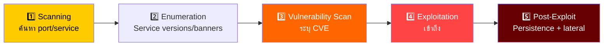
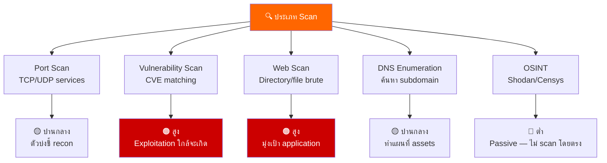
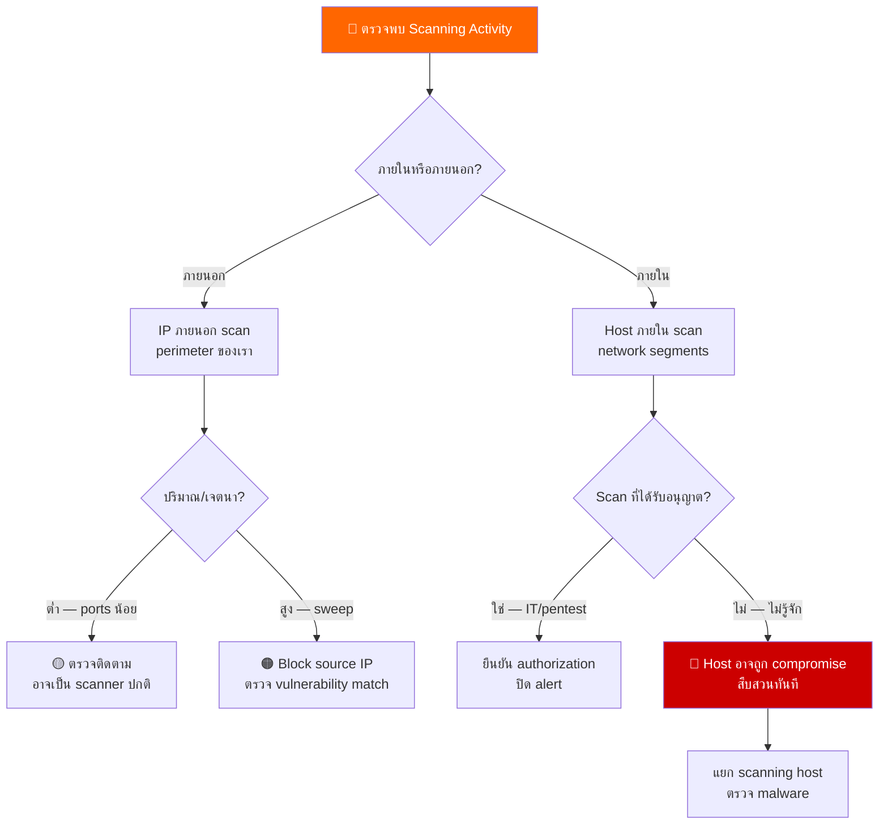
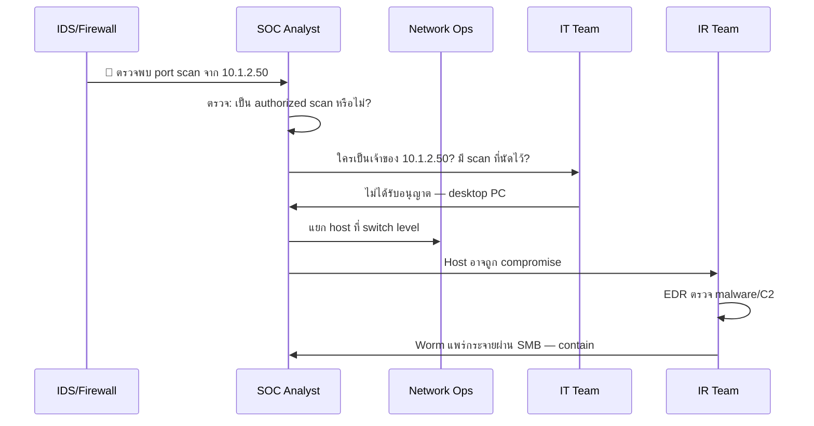
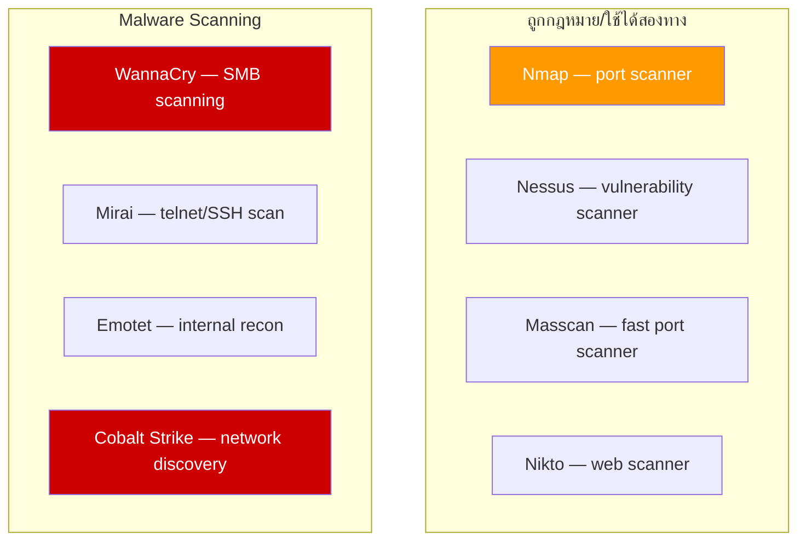
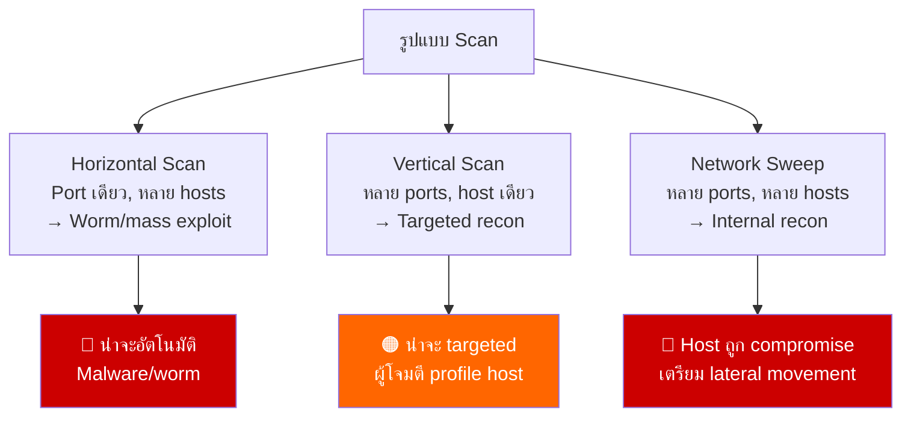

# Playbook: การตอบสนอง Unauthorized Scanning / Reconnaissance

**ID**: PB-50
**ความรุนแรง**: ปานกลาง | **ประเภท**: Reconnaissance / Discovery
**MITRE ATT&CK**: [T1046](https://attack.mitre.org/techniques/T1046/) (Network Service Discovery), [T1595](https://attack.mitre.org/techniques/T1595/) (Active Scanning)
**Trigger**: IDS/IPS (ตรวจจับ port scan), firewall (connection attempts ซ้ำๆ), SIEM (network sweep จาก internal host), honeypot alert, รายงาน scan ภายนอก

> ⚠️ **หมายเหตุ**: Scanning มักเป็นขั้นตอนแรกของการโจมตี แม้ scanning เพียงอย่างเดียวไม่ใช่เหตุการณ์ แต่บ่งชี้ถึงความสนใจของผู้โจมตีและควรกระตุ้นการป้องกันเชิงรุก

### ตำแหน่งการโจมตี Reconnaissance



### ประเภท Scan และความเสี่ยง



---

## Decision Flow



### ขั้นตอนการสืบสวน



### เครื่องมือ Scanning ที่พบบ่อย



### วิเคราะห์รูปแบบ Scan



### Timeline การตอบสนอง

```mermaid
gantt
    title Unauthorized Scanning Response
    dateFormat HH:mm
    axisFormat %H:%M
    section Detection
        IDS/FW alert           :a1, 00:00, 5min
        ยืนยัน authorization   :a2, after a1, 10min
    section Assessment
        จำแนกประเภท scan       :a3, after a2, 10min
        ตรวจ source host       :a4, after a3, 15min
    section Response
        Block/แยก source       :a5, after a4, 5min
        Hunt for compromise    :a6, after a5, 60min
    section Remediation
        Patch exposed services :a7, after a6, 120min
```



---

## 1. การดำเนินการทันที (15 นาทีแรก)

| # | การดำเนินการ | ผู้รับผิดชอบ |
|:---|:---|:---|
| 1 | ระบุแหล่ง scanning (IP address, hostname) | SOC T1 |
| 2 | ตรวจ: ภายในหรือภายนอก? ได้รับอนุญาตหรือไม่? | SOC T1 |
| 3 | ถ้าภายในไม่ได้รับอนุญาต — แยก host ทันที | NetOps |
| 4 | ถ้าภายนอก — block source IP ที่ firewall | NetOps |
| 5 | ตรวจว่า scan อะไร (ports, services, responses) | SOC T2 |
| 6 | ยืนยัน targeted services ได้ patch แล้ว | IT |

## 2. รายการตรวจสอบ

### วิเคราะห์ Scan
- [ ] Source IP address และ geolocation/hostname
- [ ] ประเภท: port scan, vulnerability scan, web scan?
- [ ] รูปแบบ: horizontal, vertical, หรือ sweep?
- [ ] Ports/services ที่เป็นเป้าหมาย
- [ ] ระยะเวลาและปริมาณ scan traffic
- [ ] มีการพยายาม exploit หลัง scanning หรือไม่?

### แหล่ง Internal
- [ ] Host ไหนทำ scan?
- [ ] เป็น security scan/pentest ที่ได้รับอนุญาตหรือไม่?
- [ ] ตรวจ EDR สำหรับ malware หรือ C2 บน scanning host
- [ ] Host ถูก compromise เร็วๆ นี้หรือไม่?

## 3. การควบคุม (Containment)

| ขอบเขต | การดำเนินการ |
|:---|:---|
| **แหล่งภายนอก** | Block ที่ firewall, รายงาน ISP |
| **แหล่งภายใน** | แยก host, สืบสวน compromise |
| **Services เป้าหมาย** | ยืนยัน patches, ปิด ports ที่ไม่จำเป็น |
| **เครือข่าย** | ทบทวน firewall rules, ปิดช่องโหว่ |

### การ Harden เครือข่าย
- [ ] ปิด ports และ services ที่ไม่จำเป็น
- [ ] เปิดใช้ rate limiting บน firewall
- [ ] Deploy network-level IPS สำหรับ scan detection
- [ ] ตรวจ default credentials บนอุปกรณ์เครือข่าย
- [ ] ใช้ port knocking สำหรับ management interfaces
- [ ] เปิด flow logging สำหรับ baseline traffic analysis
- [ ] กำหนด allowlists สำหรับ scanning IP ที่ได้รับอนุญาต

## 4. หลังเหตุการณ์ (Post-Incident)

| คำถาม | คำตอบ |
|:---|:---|
| Scan เป็นภายในหรือภายนอก? | [แหล่ง] |
| ได้รับอนุญาต (pentest/IT scan) หรือไม่? | [ใช่/ไม่] |
| พบ vulnerable services หรือไม่? | [รายการ] |
| Exposed services ได้ patch แล้วหรือไม่? | [สถานะ] |

## 6. Detection Rules (Sigma)

```yaml
title: Internal Port Scan Detected
logsource:
    product: firewall
detection:
    selection:
        action: 'deny'
        direction: 'internal'
    timeframe: 5m
    condition: selection | count(dst_port) by src_ip > 20
    level: high
```

## เอกสารที่เกี่ยวข้อง
- [Exploit Playbook](Exploit.th.md)
- [Lateral Movement Playbook](Lateral_Movement.th.md)
- [Malware Infection Playbook](Malware_Infection.th.md)

## References
- [MITRE T1046 — Network Service Discovery](https://attack.mitre.org/techniques/T1046/)
- [MITRE T1595 — Active Scanning](https://attack.mitre.org/techniques/T1595/)
