# Playbook: การตอบสนอง Unauthorized Scanning / Reconnaissance

**ID**: PB-50
**ความรุนแรง**: ปานกลาง | **ประเภท**: Reconnaissance / Discovery
**MITRE ATT&CK**: [T1046](https://attack.mitre.org/techniques/T1046/) (Network Service Discovery), [T1595](https://attack.mitre.org/techniques/T1595/) (Active Scanning)
**Trigger**: IDS/IPS (ตรวจจับ port scan), firewall (connection attempts ซ้ำๆ), SIEM (network sweep จาก internal host), honeypot alert, รายงาน scan ภายนอก

> ⚠️ **หมายเหตุ**: Scanning มักเป็นขั้นตอนแรกของการโจมตี แม้ scanning เพียงอย่างเดียวไม่ใช่เหตุการณ์ แต่บ่งชี้ถึงความสนใจของผู้โจมตีและควรกระตุ้นการป้องกันเชิงรุก

### ตำแหน่งการโจมตี Reconnaissance

```mermaid
graph LR
    A["1️⃣ Scanning\nค้นหา port/service"] --> B["2️⃣ Enumeration\nService versions/banners"]
    B --> C["3️⃣ Vulnerability Scan\nระบุ CVE"]
    C --> D["4️⃣ Exploitation\nเข้าถึง"]
    D --> E["5️⃣ Post-Exploit\nPersistence + lateral"]
    style A fill:#ffcc00,color:#000
    style C fill:#ff6600,color:#fff
    style D fill:#ff4444,color:#fff
    style E fill:#660000,color:#fff
```



### ประเภท Scan และความเสี่ยง

```mermaid
graph TD
    Scan["🔍 ประเภท Scan"] --> Port["Port Scan\nTCP/UDP services"]
    Scan --> Vuln["Vulnerability Scan\nCVE matching"]
    Scan --> Web["Web Scan\nDirectory/file brute"]
    Scan --> DNS["DNS Enumeration\nค้นหา subdomain"]
    Scan --> OSINT["OSINT\nShodan/Censys"]
    
    Port --> Risk1["🟡 ปานกลาง\nตัวบ่งชี้ recon"]
    Vuln --> Risk2["🟠 สูง\nExploitation ใกล้จะเกิด"]
    Web --> Risk3["🟠 สูง\nมุ่งเป้า application"]
    DNS --> Risk4["🟡 ปานกลาง\nทำแผนที่ assets"]
    OSINT --> Risk5["🔵 ต่ำ\nPassive — ไม่ scan โดยตรง"]
    
    style Scan fill:#ff6600,color:#fff
    style Risk2 fill:#cc0000,color:#fff
    style Risk3 fill:#cc0000,color:#fff
```



---

## Decision Flow

```mermaid
graph TD
    Alert["🚨 ตรวจพบ Scanning Activity"] --> Source{"ภายในหรือภายนอก?"}
    Source -->|"ภายนอก"| Ext["IP ภายนอก scan\nperimeter ของเรา"]
    Source -->|"ภายใน"| Int["Host ภายใน scan\nnetwork segments"]
    Ext --> Volume{"ปริมาณ/เจตนา?"}
    Volume -->|"ต่ำ — ports น้อย"| ExtLow["🟡 ตรวจติดตาม\nอาจเป็น scanner ปกติ"]
    Volume -->|"สูง — sweep"| ExtHigh["🟠 Block source IP\nตรวจ vulnerability match"]
    Int --> Authorized{"Scan ที่ได้รับอนุญาต?"}
    Authorized -->|"ใช่ — IT/pentest"| Close["ยืนยัน authorization\nปิด alert"]
    Authorized -->|"ไม่ — ไม่รู้จัก"| Compromise["🔴 Host อาจถูก compromise\nสืบสวนทันที"]
    Compromise --> Isolate["แยก scanning host\nตรวจ malware"]
    style Alert fill:#ff6600,color:#fff
    style Compromise fill:#cc0000,color:#fff
```



### ขั้นตอนการสืบสวน

```mermaid
sequenceDiagram
    participant IDS as IDS/Firewall
    participant SOC as SOC Analyst
    participant NetOps as Network Ops
    participant IT as IT Team
    participant IR as IR Team

    IDS->>SOC: 🚨 ตรวจพบ port scan จาก 10.1.2.50
    SOC->>SOC: ตรวจ: เป็น authorized scan หรือไม่?
    SOC->>IT: ใครเป็นเจ้าของ 10.1.2.50? มี scan ที่นัดไว้?
    IT->>SOC: ไม่ได้รับอนุญาต — desktop PC
    SOC->>NetOps: แยก host ที่ switch level
    SOC->>IR: Host อาจถูก compromise
    IR->>IR: EDR ตรวจ malware/C2
    IR->>SOC: Worm แพร่กระจายผ่าน SMB — contain
```



### เครื่องมือ Scanning ที่พบบ่อย

```mermaid
graph TD
    subgraph "ถูกกฎหมาย/ใช้ได้สองทาง"
        T1["Nmap — port scanner"]
        T2["Nessus — vulnerability scanner"]
        T3["Masscan — fast port scanner"]
        T4["Nikto — web scanner"]
    end
    subgraph "Malware Scanning"
        M1["WannaCry — SMB scanning"]
        M2["Mirai — telnet/SSH scan"]
        M3["Emotet — internal recon"]
        M4["Cobalt Strike — network discovery"]
    end
    style M1 fill:#cc0000,color:#fff
    style M4 fill:#cc0000,color:#fff
    style T1 fill:#ff9900,color:#fff
```



### วิเคราะห์รูปแบบ Scan

```mermaid
graph TD
    Pattern["รูปแบบ Scan"] --> Horizontal["Horizontal Scan\nPort เดียว, หลาย hosts\n→ Worm/mass exploit"]
    Pattern --> Vertical["Vertical Scan\nหลาย ports, host เดียว\n→ Targeted recon"]
    Pattern --> Sweep["Network Sweep\nหลาย ports, หลาย hosts\n→ Internal recon"]
    Horizontal --> HRisk["🔴 น่าจะอัตโนมัติ\nMalware/worm"]
    Vertical --> VRisk["🟠 น่าจะ targeted\nผู้โจมตี profile host"]
    Sweep --> SRisk["🔴 Host ถูก compromise\nเตรียม lateral movement"]
    style HRisk fill:#cc0000,color:#fff
    style SRisk fill:#cc0000,color:#fff
    style VRisk fill:#ff6600,color:#fff
```



### Timeline การตอบสนอง

```mermaid
gantt
    title Unauthorized Scanning Response
    dateFormat HH:mm
    axisFormat %H:%M
    section Detection
        IDS/FW alert           :a1, 00:00, 5min
        ยืนยัน authorization   :a2, after a1, 10min
    section Assessment
        จำแนกประเภท scan       :a3, after a2, 10min
        ตรวจ source host       :a4, after a3, 15min
    section Response
        Block/แยก source       :a5, after a4, 5min
        Hunt for compromise    :a6, after a5, 60min
    section Remediation
        Patch exposed services :a7, after a6, 120min
```



---

## 1. การดำเนินการทันที (15 นาทีแรก)

| # | การดำเนินการ | ผู้รับผิดชอบ |
|:---|:---|:---|
| 1 | ระบุแหล่ง scanning (IP address, hostname) | SOC T1 |
| 2 | ตรวจ: ภายในหรือภายนอก? ได้รับอนุญาตหรือไม่? | SOC T1 |
| 3 | ถ้าภายในไม่ได้รับอนุญาต — แยก host ทันที | NetOps |
| 4 | ถ้าภายนอก — block source IP ที่ firewall | NetOps |
| 5 | ตรวจว่า scan อะไร (ports, services, responses) | SOC T2 |
| 6 | ยืนยัน targeted services ได้ patch แล้ว | IT |

## 2. รายการตรวจสอบ

### วิเคราะห์ Scan
- [ ] Source IP address และ geolocation/hostname
- [ ] ประเภท: port scan, vulnerability scan, web scan?
- [ ] รูปแบบ: horizontal, vertical, หรือ sweep?
- [ ] Ports/services ที่เป็นเป้าหมาย
- [ ] ระยะเวลาและปริมาณ scan traffic
- [ ] มีการพยายาม exploit หลัง scanning หรือไม่?

### แหล่ง Internal
- [ ] Host ไหนทำ scan?
- [ ] เป็น security scan/pentest ที่ได้รับอนุญาตหรือไม่?
- [ ] ตรวจ EDR สำหรับ malware หรือ C2 บน scanning host
- [ ] Host ถูก compromise เร็วๆ นี้หรือไม่?

## 3. การควบคุม (Containment)

| ขอบเขต | การดำเนินการ |
|:---|:---|
| **แหล่งภายนอก** | Block ที่ firewall, รายงาน ISP |
| **แหล่งภายใน** | แยก host, สืบสวน compromise |
| **Services เป้าหมาย** | ยืนยัน patches, ปิด ports ที่ไม่จำเป็น |
| **เครือข่าย** | ทบทวน firewall rules, ปิดช่องโหว่ |

### การ Harden เครือข่าย
- [ ] ปิด ports และ services ที่ไม่จำเป็น
- [ ] เปิดใช้ rate limiting บน firewall
- [ ] Deploy network-level IPS สำหรับ scan detection
- [ ] ตรวจ default credentials บนอุปกรณ์เครือข่าย
- [ ] ใช้ port knocking สำหรับ management interfaces
- [ ] เปิด flow logging สำหรับ baseline traffic analysis
- [ ] กำหนด allowlists สำหรับ scanning IP ที่ได้รับอนุญาต

## 4. หลังเหตุการณ์ (Post-Incident)

| คำถาม | คำตอบ |
|:---|:---|
| Scan เป็นภายในหรือภายนอก? | [แหล่ง] |
| ได้รับอนุญาต (pentest/IT scan) หรือไม่? | [ใช่/ไม่] |
| พบ vulnerable services หรือไม่? | [รายการ] |
| Exposed services ได้ patch แล้วหรือไม่? | [สถานะ] |

## 6. Detection Rules (Sigma)

```yaml
title: Internal Port Scan Detected
logsource:
    product: firewall
detection:
    selection:
        action: 'deny'
        direction: 'internal'
    timeframe: 5m
    condition: selection | count(dst_port) by src_ip > 20
    level: high
```

## เอกสารที่เกี่ยวข้อง
- [Exploit Playbook](Exploit.th.md)
- [Lateral Movement Playbook](Lateral_Movement.th.md)
- [Malware Infection Playbook](Malware_Infection.th.md)

## References
- [MITRE T1046 — Network Service Discovery](https://attack.mitre.org/techniques/T1046/)
- [MITRE T1595 — Active Scanning](https://attack.mitre.org/techniques/T1595/)
