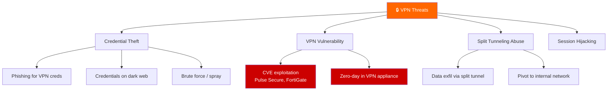
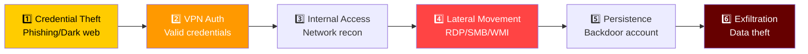
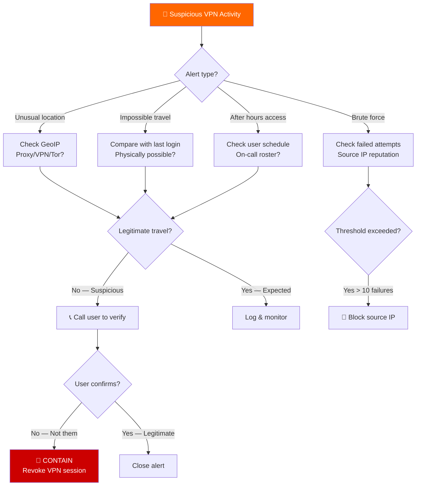
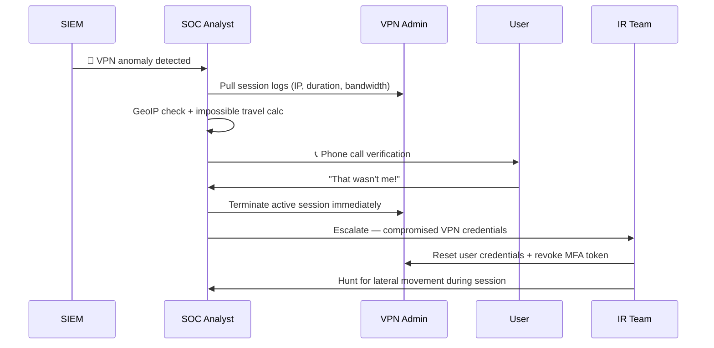
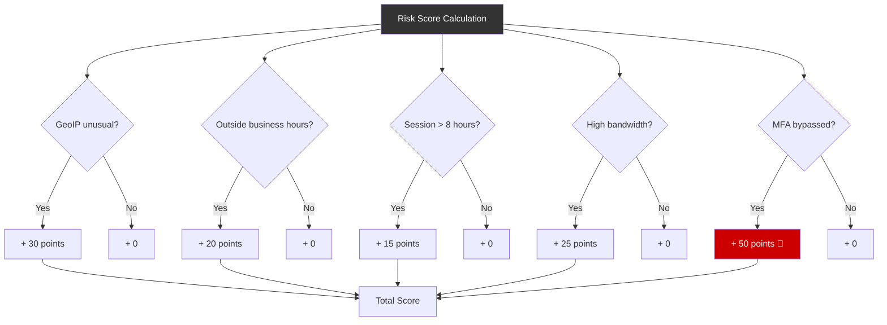
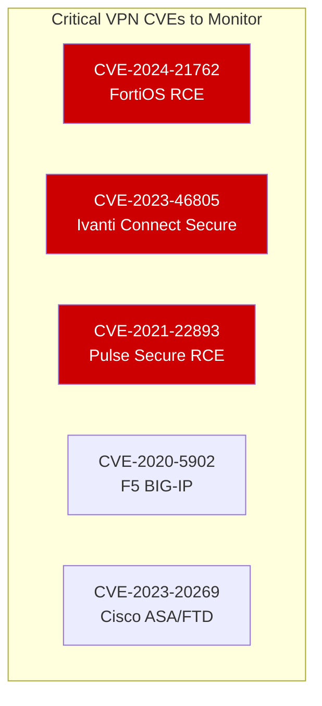

# Playbook: VPN Abuse / Unauthorized VPN Access

**ID**: PB-41
**Severity**: High | **Category**: Initial Access / Persistence
**MITRE ATT&CK**: [T1133](https://attack.mitre.org/techniques/T1133/) (External Remote Services), [T1078](https://attack.mitre.org/techniques/T1078/) (Valid Accounts)
**Trigger**: SIEM alert (VPN login from unusual location), impossible travel, brute force on VPN portal, compromised VPN credentials on dark web

> ⚠️ **WARNING**: VPN access provides direct internal network access. A compromised VPN session is equivalent to an attacker sitting on your LAN.

### VPN Threat Landscape


```mermaid
graph TD
    VPN["🔒 VPN Threats"] --> CredTheft["Credential Theft"]
    VPN --> Vuln["VPN Vulnerability"]
    VPN --> Split["Split Tunneling Abuse"]
    VPN --> Session["Session Hijacking"]
    
    CredTheft --> Phish["Phishing for VPN creds"]
    CredTheft --> Dark["Credentials on dark web"]
    CredTheft --> Brute["Brute force / spray"]
    
    Vuln --> CVE["CVE exploitation\nPulse Secure, FortiGate"]
    Vuln --> ZeroDay["Zero-day in VPN appliance"]
    
    Split --> Exfil["Data exfil via split tunnel"]
    Split --> Pivot["Pivot to internal network"]
    
    style VPN fill:#ff6600,color:#fff
    style CVE fill:#cc0000,color:#fff
    style ZeroDay fill:#cc0000,color:#fff
```

### VPN Attack Chain


```mermaid
graph LR
    A["1️⃣ Credential Theft\nPhishing/Dark web"] --> B["2️⃣ VPN Auth\nValid credentials"]
    B --> C["3️⃣ Internal Access\nNetwork recon"]
    C --> D["4️⃣ Lateral Movement\nRDP/SMB/WMI"]
    D --> E["5️⃣ Persistence\nBackdoor account"]
    E --> F["6️⃣ Exfiltration\nData theft"]
    style A fill:#ffcc00,color:#000
    style B fill:#ff9900,color:#fff
    style D fill:#ff4444,color:#fff
    style F fill:#660000,color:#fff
```

---

## Decision Flow


```mermaid
graph TD
    Alert["🚨 Suspicious VPN Activity"] --> Type{"Alert type?"}
    Type -->|"Unusual location"| Geo["Check GeoIP\nProxy/VPN/Tor?"]
    Type -->|"Impossible travel"| Travel["Compare with last login\nPhysically possible?"]
    Type -->|"Brute force"| BF["Check failed attempts\nSource IP reputation"]
    Type -->|"After hours access"| Hours["Check user schedule\nOn-call roster?"]
    Geo --> Legit{"Legitimate travel?"}
    Travel --> Legit
    BF --> Threshold{"Threshold exceeded?"}
    Hours --> Legit
    Legit -->|"No — Suspicious"| Verify["📞 Call user to verify"]
    Legit -->|"Yes — Expected"| Log["Log & monitor"]
    Threshold -->|"Yes > 10 failures"| Block["🔴 Block source IP"]
    Verify --> Confirmed{"User confirms?"}
    Confirmed -->|"No — Not them"| Contain["🔴 CONTAIN\nRevoke VPN session"]
    Confirmed -->|"Yes — Legitimate"| Close["Close alert"]
    style Alert fill:#ff6600,color:#fff
    style Contain fill:#cc0000,color:#fff
```

### Investigation Process


```mermaid
sequenceDiagram
    participant SIEM
    participant SOC as SOC Analyst
    participant VPN as VPN Admin
    participant User
    participant IR as IR Team

    SIEM->>SOC: 🚨 VPN anomaly detected
    SOC->>VPN: Pull session logs (IP, duration, bandwidth)
    SOC->>SOC: GeoIP check + impossible travel calc
    SOC->>User: 📞 Phone call verification
    User->>SOC: "That wasn't me!"
    SOC->>VPN: Terminate active session immediately
    SOC->>IR: Escalate — compromised VPN credentials
    IR->>VPN: Reset user credentials + revoke MFA token
    IR->>SOC: Hunt for lateral movement during session
```

### VPN Session Risk Scoring


```mermaid
graph TD
    Score["Risk Score Calculation"] --> Geo{"GeoIP unusual?"}
    Geo -->|Yes| G["+ 30 points"]
    Geo -->|No| G0["+ 0"]
    Score --> Time{"Outside business hours?"}
    Time -->|Yes| T["+ 20 points"]
    Time -->|No| T0["+ 0"]
    Score --> Duration{"Session > 8 hours?"}
    Duration -->|Yes| D["+ 15 points"]
    Duration -->|No| D0["+ 0"]
    Score --> BW{"High bandwidth?"}
    BW -->|Yes| B["+ 25 points"]
    BW -->|No| B0["+ 0"]
    Score --> MFA{"MFA bypassed?"}
    MFA -->|Yes| M["+ 50 points 🔴"]
    MFA -->|No| M0["+ 0"]
    G --> Total["Total Score"]
    T --> Total
    D --> Total
    B --> Total
    M --> Total
    style Score fill:#333,color:#fff
    style M fill:#cc0000,color:#fff
```

### Response Timeline


```mermaid
gantt
    title VPN Abuse Response Timeline
    dateFormat HH:mm
    axisFormat %H:%M
    section Detection
        SIEM alert              :a1, 00:00, 5min
        GeoIP + travel analysis :a2, after a1, 10min
    section Verification
        Contact user            :a3, after a2, 15min
        Confirm unauthorized    :a4, after a3, 5min
    section Containment
        Kill VPN session        :a5, after a4, 2min
        Reset credentials       :a6, after a5, 10min
    section Investigation
        Session activity audit  :a7, after a6, 60min
        Lateral movement hunt   :a8, after a7, 120min
    section Recovery
        New credentials         :a9, after a8, 30min
```

### VPN Appliance Vulnerability Check


```mermaid
graph TD
    subgraph "Critical VPN CVEs to Monitor"
        CVE1["CVE-2024-21762\nFortiOS RCE"]
        CVE2["CVE-2023-46805\nIvanti Connect Secure"]
        CVE3["CVE-2021-22893\nPulse Secure RCE"]
        CVE4["CVE-2020-5902\nF5 BIG-IP"]
        CVE5["CVE-2023-20269\nCisco ASA/FTD"]
    end
    style CVE1 fill:#cc0000,color:#fff
    style CVE2 fill:#cc0000,color:#fff
    style CVE3 fill:#cc0000,color:#fff
```

---

## 1. Immediate Actions (First 15 Minutes)

| # | Action | Owner |
|:---|:---|:---|
| 1 | Identify suspicious VPN session (user, IP, duration) | SOC T1 |
| 2 | GeoIP + impossible travel analysis | SOC T1 |
| 3 | Contact user via phone for verification | SOC T1 |
| 4 | If unauthorized — kill VPN session immediately | VPN Admin |
| 5 | Reset user password and revoke MFA token | IAM Team |
| 6 | Check for activity during unauthorized session | SOC T2 |

## 2. Investigation Checklist

### VPN Session Analysis
- [ ] Source IP address and GeoIP location
- [ ] Session start/end time and duration
- [ ] Bandwidth consumed (unusual data transfer?)
- [ ] VPN client version and device fingerprint
- [ ] MFA method used (was it bypassed?)
- [ ] Concurrent sessions (user logged in from 2 locations?)

### Network Activity During Session
- [ ] Internal hosts accessed during VPN session
- [ ] File shares mounted or accessed
- [ ] RDP/SSH sessions initiated
- [ ] DNS queries made (internal reconnaissance?)
- [ ] Data volume transferred (exfiltration indicator)

### Credential Investigation
- [ ] Check dark web/paste sites for credential exposure
- [ ] Review password change history
- [ ] Check if same credentials used elsewhere (password reuse)
- [ ] Review MFA enrollment/changes

## 2.1 Evidence Checklist

| Evidence Type | What to Collect | Source | Why It Matters |
|:---|:---|:---|:---|
| Session evidence | Source IP, GeoIP, session start/end, duration, bandwidth, device fingerprint | VPN logs / SIEM | Confirms whether the session behavior fits expected user behavior |
| Identity evidence | Username, group membership, MFA method, token changes, lockout/reset history | IAM / IdP | Determines privilege level and whether identity controls failed |
| Network activity evidence | Internal hosts accessed, RDP/SSH, DNS, file-share activity, transfer volume | Firewall / VPN / NDR / DNS / NetFlow | Shows what the attacker did after access was granted |
| Appliance evidence | VPN admin actions, config changes, patch level, exploit indicators | VPN admin console / syslog | Determines whether abuse was credential-based or appliance-based |
| User verification evidence | Call notes, travel context, business justification, device ownership | Ticket / call log | Supports false-positive closure and defensible escalation |

## 2.2 Minimum Telemetry Required

| Telemetry Source | Required For | Priority | Blind Spot If Missing |
|:---|:---|:---:|:---|
| VPN authentication and session logs | User, source IP, duration, concurrent sessions, protocol details | Required | Cannot confirm the suspicious session or attribute it correctly |
| IAM and MFA telemetry | Token resets, MFA changes, account state, risk signals | Required | Cannot tell whether identity protections were bypassed or changed |
| Network and DNS telemetry | Internal access, lateral movement, exfiltration indicators | Required | Post-login attacker activity remains largely invisible |
| VPN appliance logs and vulnerability state | Admin changes, exploit traces, version/CVE exposure | Required | Cannot distinguish credential abuse from VPN appliance compromise |
| Asset, user schedule, and ticket context | On-call status, travel, approved remote work exceptions | Recommended | Benign after-hours or travel events may be over-escalated |

## 2.3 False Positive and Tuning Guide

| Scenario | Why It Looks Suspicious | How to Validate | Tuning Action | Escalate If |
|:---|:---|:---|:---|:---|
| Legitimate user travel or remote work | New country or after-hours access may resemble session theft | Confirm itinerary, manager approval, device compliance, and MFA success | Tune geo and time-of-day logic for approved travel/remote-work patterns | Concurrent sessions, high-risk geo, or unusual internal activity follows |
| Corporate VPN exit or roaming carrier change | Source IP changes quickly and breaks simple location logic | Validate carrier/VPN ASN and normal device fingerprint | Tune ASN-aware impossible-travel logic instead of raw country checks | MFA changes or different device fingerprint appears |
| On-call or emergency access | Night/weekend login can look malicious | Confirm on-call roster, incident ticket, and accessed systems | Lower severity for approved on-call identities and windows | Access scope exceeds job need or includes privileged movement |
| Security or network testing | Scanner or red-team use of VPN may look abusive | Validate source, window, and owner | Allowlist approved test accounts and source ranges only | Activity reaches production data or uses stolen user credentials |

## 3. Containment

| Scope | Action | Details |
|:---|:---|:---|
| **VPN Session** | Terminate immediately | Kill active session |
| **Credentials** | Reset password + MFA | New token enrollment |
| **Source IP** | Block at perimeter | Firewall rule |
| **Internal access** | Review and revoke | File shares, RDP |

## 4. Eradication & Recovery

1. Force password reset for affected account
2. Re-enroll MFA (new device/token)
3. Review all systems accessed during unauthorized session
4. Check for persistence (new accounts, scheduled tasks, backdoors)
5. Patch VPN appliance if vulnerability exploited

## 5. Post-Incident

### Lessons Learned
| Question | Answer |
|:---|:---|
| How were VPN credentials compromised? | [Phishing/dark web/reuse] |
| Was MFA enabled and enforced? | [Yes/No] |
| Did anomaly detection trigger promptly? | [Time to detect] |
| Was split tunneling policy appropriate? | [Review] |

## 6. Detection Rules (Sigma)

```yaml
title: VPN Login from Unusual Country
logsource:
    product: vpn
detection:
    selection:
        action: 'login_success'
    filter:
        src_country|contains:
            - 'TH'
            - 'US'
            - 'SG'
    condition: selection and not filter
    level: high
```

## Related Documents
- [IR Framework](../Framework.en.md)
- [Sigma Rules Index](../../08_Detection_Engineering/README.md)
- [Account Compromise Playbook](Account_Compromise.en.md)
- [Impossible Travel Playbook](Impossible_Travel.en.md)
- [Brute Force Playbook](Brute_Force.en.md)
- [Tier 1 Runbook](../Runbooks/Tier1_Runbook.en.md)

## References
- [MITRE T1133 — External Remote Services](https://attack.mitre.org/techniques/T1133/)
- [CISA — VPN Security](https://www.cisa.gov/news-events/cybersecurity-advisories)
