# Playbook: VPN Abuse / Unauthorized VPN Access

**ID**: PB-41
**Severity**: High | **Category**: Initial Access / Persistence
**MITRE ATT&CK**: [T1133](https://attack.mitre.org/techniques/T1133/) (External Remote Services), [T1078](https://attack.mitre.org/techniques/T1078/) (Valid Accounts)
**Trigger**: SIEM alert (VPN login from unusual location), impossible travel, brute force on VPN portal, compromised VPN credentials on dark web

> ⚠️ **WARNING**: VPN access provides direct internal network access. A compromised VPN session is equivalent to an attacker sitting on your LAN.

### VPN Threat Landscape


### VPN Attack Chain

```mermaid
graph LR
    A["1️⃣ Credential Theft\nPhishing/Dark web"] --> B["2️⃣ VPN Auth\nValid credentials"]
    B --> C["3️⃣ Internal Access\nNetwork recon"]
    C --> D["4️⃣ Lateral Movement\nRDP/SMB/WMI"]
    D --> E["5️⃣ Persistence\nBackdoor account"]
    E --> F["6️⃣ Exfiltration\nData theft"]
    style A fill:#ffcc00,color:#000
    style B fill:#ff9900,color:#fff
    style D fill:#ff4444,color:#fff
    style F fill:#660000,color:#fff
```



---

## Decision Flow

```mermaid
graph TD
    Alert["🚨 Suspicious VPN Activity"] --> Type{"Alert type?"}
    Type -->|"Unusual location"| Geo["Check GeoIP\nProxy/VPN/Tor?"]
    Type -->|"Impossible travel"| Travel["Compare with last login\nPhysically possible?"]
    Type -->|"Brute force"| BF["Check failed attempts\nSource IP reputation"]
    Type -->|"After hours access"| Hours["Check user schedule\nOn-call roster?"]
    Geo --> Legit{"Legitimate travel?"}
    Travel --> Legit
    BF --> Threshold{"Threshold exceeded?"}
    Hours --> Legit
    Legit -->|"No — Suspicious"| Verify["📞 Call user to verify"]
    Legit -->|"Yes — Expected"| Log["Log & monitor"]
    Threshold -->|"Yes > 10 failures"| Block["🔴 Block source IP"]
    Verify --> Confirmed{"User confirms?"}
    Confirmed -->|"No — Not them"| Contain["🔴 CONTAIN\nRevoke VPN session"]
    Confirmed -->|"Yes — Legitimate"| Close["Close alert"]
    style Alert fill:#ff6600,color:#fff
    style Contain fill:#cc0000,color:#fff
```



### Investigation Process

```mermaid
sequenceDiagram
    participant SIEM
    participant SOC as SOC Analyst
    participant VPN as VPN Admin
    participant User
    participant IR as IR Team

    SIEM->>SOC: 🚨 VPN anomaly detected
    SOC->>VPN: Pull session logs (IP, duration, bandwidth)
    SOC->>SOC: GeoIP check + impossible travel calc
    SOC->>User: 📞 Phone call verification
    User->>SOC: "That wasn't me!"
    SOC->>VPN: Terminate active session immediately
    SOC->>IR: Escalate — compromised VPN credentials
    IR->>VPN: Reset user credentials + revoke MFA token
    IR->>SOC: Hunt for lateral movement during session
```



### VPN Session Risk Scoring

```mermaid
graph TD
    Score["Risk Score Calculation"] --> Geo{"GeoIP unusual?"}
    Geo -->|Yes| G["+ 30 points"]
    Geo -->|No| G0["+ 0"]
    Score --> Time{"Outside business hours?"}
    Time -->|Yes| T["+ 20 points"]
    Time -->|No| T0["+ 0"]
    Score --> Duration{"Session > 8 hours?"}
    Duration -->|Yes| D["+ 15 points"]
    Duration -->|No| D0["+ 0"]
    Score --> BW{"High bandwidth?"}
    BW -->|Yes| B["+ 25 points"]
    BW -->|No| B0["+ 0"]
    Score --> MFA{"MFA bypassed?"}
    MFA -->|Yes| M["+ 50 points 🔴"]
    MFA -->|No| M0["+ 0"]
    G --> Total["Total Score"]
    T --> Total
    D --> Total
    B --> Total
    M --> Total
    style Score fill:#333,color:#fff
    style M fill:#cc0000,color:#fff
```



### Response Timeline


### VPN Appliance Vulnerability Check


---

## 1. Immediate Actions (First 15 Minutes)

| # | Action | Owner |
|:---|:---|:---|
| 1 | Identify suspicious VPN session (user, IP, duration) | SOC T1 |
| 2 | GeoIP + impossible travel analysis | SOC T1 |
| 3 | Contact user via phone for verification | SOC T1 |
| 4 | If unauthorized — kill VPN session immediately | VPN Admin |
| 5 | Reset user password and revoke MFA token | IAM Team |
| 6 | Check for activity during unauthorized session | SOC T2 |

## 2. Investigation Checklist

### VPN Session Analysis
- [ ] Source IP address and GeoIP location
- [ ] Session start/end time and duration
- [ ] Bandwidth consumed (unusual data transfer?)
- [ ] VPN client version and device fingerprint
- [ ] MFA method used (was it bypassed?)
- [ ] Concurrent sessions (user logged in from 2 locations?)

### Network Activity During Session
- [ ] Internal hosts accessed during VPN session
- [ ] File shares mounted or accessed
- [ ] RDP/SSH sessions initiated
- [ ] DNS queries made (internal reconnaissance?)
- [ ] Data volume transferred (exfiltration indicator)

### Credential Investigation
- [ ] Check dark web/paste sites for credential exposure
- [ ] Review password change history
- [ ] Check if same credentials used elsewhere (password reuse)
- [ ] Review MFA enrollment/changes

## 3. Containment

| Scope | Action | Details |
|:---|:---|:---|
| **VPN Session** | Terminate immediately | Kill active session |
| **Credentials** | Reset password + MFA | New token enrollment |
| **Source IP** | Block at perimeter | Firewall rule |
| **Internal access** | Review and revoke | File shares, RDP |

## 4. Eradication & Recovery

1. Force password reset for affected account
2. Re-enroll MFA (new device/token)
3. Review all systems accessed during unauthorized session
4. Check for persistence (new accounts, scheduled tasks, backdoors)
5. Patch VPN appliance if vulnerability exploited

## 5. Post-Incident

### Lessons Learned
| Question | Answer |
|:---|:---|
| How were VPN credentials compromised? | [Phishing/dark web/reuse] |
| Was MFA enabled and enforced? | [Yes/No] |
| Did anomaly detection trigger promptly? | [Time to detect] |
| Was split tunneling policy appropriate? | [Review] |

## 6. Detection Rules (Sigma)

```yaml
title: VPN Login from Unusual Country
logsource:
    product: vpn
detection:
    selection:
        action: 'login_success'
    filter:
        src_country|contains:
            - 'TH'
            - 'US'
            - 'SG'
    condition: selection and not filter
    level: high
```

## Related Documents
- [IR Framework](../Framework.en.md)
- [Sigma Rules Index](../../08_Detection_Engineering/sigma_rules/)
- [Account Compromise Playbook](Account_Compromise.en.md)
- [Impossible Travel Playbook](Impossible_Travel.en.md)
- [Brute Force Playbook](Brute_Force.en.md)
- [Tier 1 Runbook](../Runbooks/Tier1_Runbook.en.md)

## References
- [MITRE T1133 — External Remote Services](https://attack.mitre.org/techniques/T1133/)
- [CISA — VPN Security](https://www.cisa.gov/news-events/cybersecurity-advisories)
