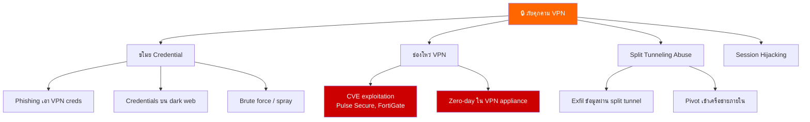
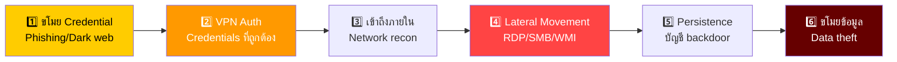
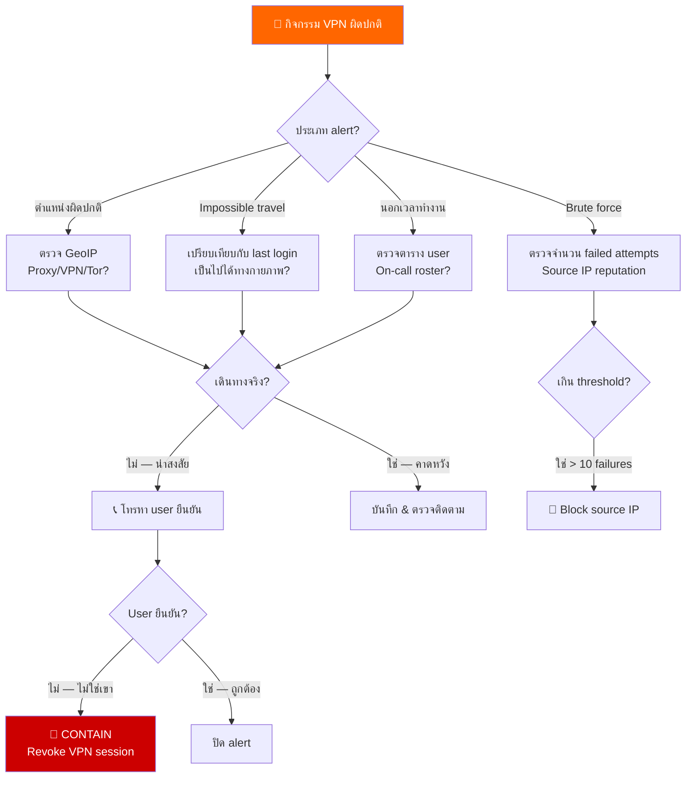
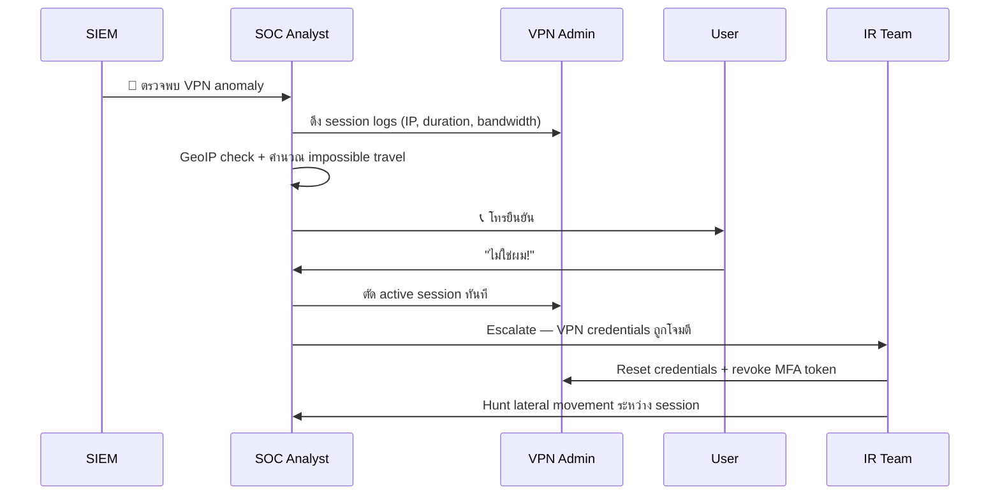
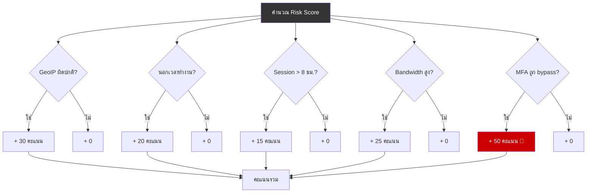
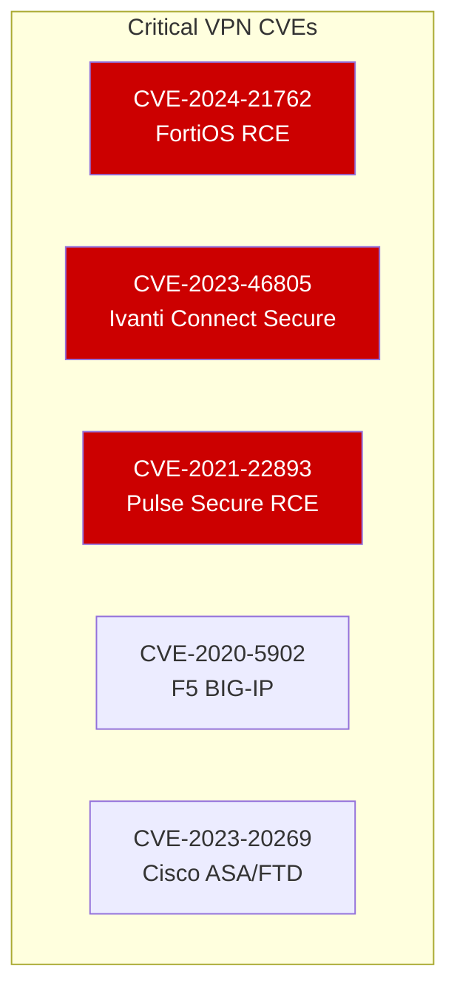

# Playbook: การตอบสนอง VPN Abuse / การเข้าถึง VPN ไม่ได้รับอนุญาต

**ID**: PB-41
**ความรุนแรง**: สูง | **ประเภท**: Initial Access / Persistence
**MITRE ATT&CK**: [T1133](https://attack.mitre.org/techniques/T1133/) (External Remote Services), [T1078](https://attack.mitre.org/techniques/T1078/) (Valid Accounts)
**Trigger**: SIEM alert (VPN login จากตำแหน่งผิดปกติ), impossible travel, brute force บน VPN portal, VPN credentials ถูกเปิดเผยบน dark web

> ⚠️ **คำเตือน**: VPN access ให้สิทธิ์เข้าถึงเครือข่ายภายในโดยตรง VPN session ที่ถูกโจมตีเท่ากับผู้โจมตีนั่งอยู่บน LAN ขององค์กร

### ภาพรวมภัยคุกคาม VPN



### VPN Attack Chain



---

## Decision Flow



### ขั้นตอนการสืบสวน



### VPN Session Risk Scoring



### Timeline การตอบสนอง

```mermaid
gantt
    title VPN Abuse Response Timeline
    dateFormat HH:mm
    axisFormat %H:%M
    section Detection
        SIEM alert              :a1, 00:00, 5min
        GeoIP + travel analysis :a2, after a1, 10min
    section Verification
        ติดต่อ user             :a3, after a2, 15min
        ยืนยันไม่ได้รับอนุญาต   :a4, after a3, 5min
    section Containment
        Kill VPN session        :a5, after a4, 2min
        Reset credentials       :a6, after a5, 10min
    section Investigation
        ตรวจ session activity   :a7, after a6, 60min
        Hunt lateral movement   :a8, after a7, 120min
    section Recovery
        Credentials ใหม่        :a9, after a8, 30min
```



### ช่องโหว่ VPN Appliance ที่ต้องตรวจ



---

## 1. การดำเนินการทันที (15 นาทีแรก)

| # | การดำเนินการ | ผู้รับผิดชอบ |
|:---|:---|:---|
| 1 | ระบุ VPN session ที่น่าสงสัย (user, IP, duration) | SOC T1 |
| 2 | วิเคราะห์ GeoIP + impossible travel | SOC T1 |
| 3 | ติดต่อ user ทางโทรศัพท์เพื่อยืนยัน | SOC T1 |
| 4 | ถ้าไม่ได้รับอนุญาต — ตัด VPN session ทันที | VPN Admin |
| 5 | Reset password + revoke MFA token | IAM Team |
| 6 | ตรวจกิจกรรมระหว่าง unauthorized session | SOC T2 |

## 2. รายการตรวจสอบ

### วิเคราะห์ VPN Session
- [ ] Source IP address และ GeoIP location
- [ ] เวลาเริ่ม/สิ้นสุด session และ duration
- [ ] Bandwidth ที่ใช้ (data transfer ผิดปกติ?)
- [ ] VPN client version และ device fingerprint
- [ ] MFA method ที่ใช้ (bypass ได้หรือไม่?)
- [ ] Sessions พร้อมกัน (user login จาก 2 ตำแหน่ง?)

### กิจกรรมเครือข่ายระหว่าง Session
- [ ] Hosts ภายในที่เข้าถึงระหว่าง VPN session
- [ ] File shares ที่ mount หรือเข้าถึง
- [ ] RDP/SSH sessions ที่เริ่ม
- [ ] DNS queries (internal reconnaissance?)
- [ ] ปริมาณข้อมูลที่โอน (ตัวบ่งชี้ exfiltration)

## 3. การควบคุม (Containment)

### ตรวจสอบ Credentials
- [ ] ตรวจ dark web/paste sites สำหรับ credentials ที่หลุด
- [ ] ตรวจประวัติการเปลี่ยน password
- [ ] ตรวจว่า credentials เดียวกันใช้ที่อื่นหรือไม่ (password reuse)
- [ ] ตรวจ MFA enrollment/การเปลี่ยนแปลง

| ขอบเขต | การดำเนินการ | รายละเอียด |
|:---|:---|:---|
| **VPN Session** | ตัดทันที | Kill active session |
| **Credentials** | Reset password + MFA | Enroll token ใหม่ |
| **Source IP** | Block ที่ perimeter | Firewall rule |
| **Internal access** | ตรวจสอบและเพิกถอน | File shares, RDP |

## 4. การกำจัดและกู้คืน

1. บังคับ reset password สำหรับบัญชีที่ได้รับผลกระทบ
2. Enroll MFA ใหม่ (อุปกรณ์/token ใหม่)
3. ตรวจทุกระบบที่เข้าถึงระหว่าง unauthorized session
4. ตรวจ persistence (บัญชีใหม่, scheduled tasks, backdoors)
5. Patch VPN appliance ถ้าใช้ช่องโหว่

## 5. หลังเหตุการณ์ (Post-Incident)

### บทเรียน
| คำถาม | คำตอบ |
|:---|:---|
| VPN credentials ถูกโจมตีอย่างไร? | [Phishing/dark web/reuse] |
| MFA เปิดและบังคับใช้อยู่หรือไม่? | [ใช่/ไม่] |
| Anomaly detection trigger ทันเวลาหรือไม่? | [เวลาที่ตรวจจับ] |
| นโยบาย split tunneling เหมาะสมหรือไม่? | [ทบทวน] |

## 6. Detection Rules (Sigma)

```yaml
title: VPN Login from Unusual Country
logsource:
    product: vpn
detection:
    selection:
        action: 'login_success'
    filter:
        src_country|contains:
            - 'TH'
            - 'US'
            - 'SG'
    condition: selection and not filter
    level: high
```

## เอกสารที่เกี่ยวข้อง
- [Account Compromise Playbook](Account_Compromise.th.md)
- [Impossible Travel Playbook](Impossible_Travel.th.md)
- [Brute Force Playbook](Brute_Force.th.md)
- [คู่มือ Tier 1](../Runbooks/Tier1_Runbook.th.md)

## References
- [MITRE T1133 — External Remote Services](https://attack.mitre.org/techniques/T1133/)
- [CISA — VPN Security](https://www.cisa.gov/news-events/cybersecurity-advisories)
