# Playbook: การตอบสนอง VPN Abuse / การเข้าถึง VPN ไม่ได้รับอนุญาต

**ID**: PB-41
**ความรุนแรง**: สูง | **ประเภท**: Initial Access / Persistence
**MITRE ATT&CK**: [T1133](https://attack.mitre.org/techniques/T1133/) (External Remote Services), [T1078](https://attack.mitre.org/techniques/T1078/) (Valid Accounts)
**Trigger**: SIEM alert (VPN login จากตำแหน่งผิดปกติ), impossible travel, brute force บน VPN portal, VPN credentials ถูกเปิดเผยบน dark web

> ⚠️ **คำเตือน**: VPN access ให้สิทธิ์เข้าถึงเครือข่ายภายในโดยตรง VPN session ที่ถูกโจมตีเท่ากับผู้โจมตีนั่งอยู่บน LAN ขององค์กร

### ภาพรวมภัยคุกคาม VPN

```mermaid
graph TD
    VPN["🔒 ภัยคุกคาม VPN"] --> CredTheft["ขโมย Credential"]
    VPN --> Vuln["ช่องโหว่ VPN"]
    VPN --> Split["Split Tunneling Abuse"]
    VPN --> Session["Session Hijacking"]
    
    CredTheft --> Phish["Phishing เอา VPN creds"]
    CredTheft --> Dark["Credentials บน dark web"]
    CredTheft --> Brute["Brute force / spray"]
    
    Vuln --> CVE["CVE exploitation\nPulse Secure, FortiGate"]
    Vuln --> ZeroDay["Zero-day ใน VPN appliance"]
    
    Split --> Exfil["Exfil ข้อมูลผ่าน split tunnel"]
    Split --> Pivot["Pivot เข้าเครือข่ายภายใน"]
    
    style VPN fill:#ff6600,color:#fff
    style CVE fill:#cc0000,color:#fff
    style ZeroDay fill:#cc0000,color:#fff
```



### VPN Attack Chain

```mermaid
graph LR
    A["1️⃣ ขโมย Credential\nPhishing/Dark web"] --> B["2️⃣ VPN Auth\nCredentials ที่ถูกต้อง"]
    B --> C["3️⃣ เข้าถึงภายใน\nNetwork recon"]
    C --> D["4️⃣ Lateral Movement\nRDP/SMB/WMI"]
    D --> E["5️⃣ Persistence\nบัญชี backdoor"]
    E --> F["6️⃣ ขโมยข้อมูล\nData theft"]
    style A fill:#ffcc00,color:#000
    style B fill:#ff9900,color:#fff
    style D fill:#ff4444,color:#fff
    style F fill:#660000,color:#fff
```



---

## Decision Flow

```mermaid
graph TD
    Alert["🚨 กิจกรรม VPN ผิดปกติ"] --> Type{"ประเภท alert?"}
    Type -->|"ตำแหน่งผิดปกติ"| Geo["ตรวจ GeoIP\nProxy/VPN/Tor?"]
    Type -->|"Impossible travel"| Travel["เปรียบเทียบกับ last login\nเป็นไปได้ทางกายภาพ?"]
    Type -->|"Brute force"| BF["ตรวจจำนวน failed attempts\nSource IP reputation"]
    Type -->|"นอกเวลาทำงาน"| Hours["ตรวจตาราง user\nOn-call roster?"]
    Geo --> Legit{"เดินทางจริง?"}
    Travel --> Legit
    BF --> Threshold{"เกิน threshold?"}
    Hours --> Legit
    Legit -->|"ไม่ — น่าสงสัย"| Verify["📞 โทรหา user ยืนยัน"]
    Legit -->|"ใช่ — คาดหวัง"| Log["บันทึก & ตรวจติดตาม"]
    Threshold -->|"ใช่ > 10 failures"| Block["🔴 Block source IP"]
    Verify --> Confirmed{"User ยืนยัน?"}
    Confirmed -->|"ไม่ — ไม่ใช่เขา"| Contain["🔴 CONTAIN\nRevoke VPN session"]
    Confirmed -->|"ใช่ — ถูกต้อง"| Close["ปิด alert"]
    style Alert fill:#ff6600,color:#fff
    style Contain fill:#cc0000,color:#fff
```



### ขั้นตอนการสืบสวน

```mermaid
sequenceDiagram
    participant SIEM
    participant SOC as SOC Analyst
    participant VPN as VPN Admin
    participant User
    participant IR as IR Team

    SIEM->>SOC: 🚨 ตรวจพบ VPN anomaly
    SOC->>VPN: ดึง session logs (IP, duration, bandwidth)
    SOC->>SOC: GeoIP check + คำนวณ impossible travel
    SOC->>User: 📞 โทรยืนยัน
    User->>SOC: "ไม่ใช่ผม!"
    SOC->>VPN: ตัด active session ทันที
    SOC->>IR: Escalate — VPN credentials ถูกโจมตี
    IR->>VPN: Reset credentials + revoke MFA token
    IR->>SOC: Hunt lateral movement ระหว่าง session
```



### VPN Session Risk Scoring

```mermaid
graph TD
    Score["คำนวณ Risk Score"] --> Geo{"GeoIP ผิดปกติ?"}
    Geo -->|ใช่| G["+ 30 คะแนน"]
    Geo -->|ไม่| G0["+ 0"]
    Score --> Time{"นอกเวลาทำงาน?"}
    Time -->|ใช่| T["+ 20 คะแนน"]
    Time -->|ไม่| T0["+ 0"]
    Score --> Duration{"Session > 8 ชม.?"}
    Duration -->|ใช่| D["+ 15 คะแนน"]
    Duration -->|ไม่| D0["+ 0"]
    Score --> BW{"Bandwidth สูง?"}
    BW -->|ใช่| B["+ 25 คะแนน"]
    BW -->|ไม่| B0["+ 0"]
    Score --> MFA{"MFA ถูก bypass?"}
    MFA -->|ใช่| M["+ 50 คะแนน 🔴"]
    MFA -->|ไม่| M0["+ 0"]
    G --> Total["คะแนนรวม"]
    T --> Total
    D --> Total
    B --> Total
    M --> Total
    style Score fill:#333,color:#fff
    style M fill:#cc0000,color:#fff
```



### Timeline การตอบสนอง

```mermaid
gantt
    title VPN Abuse Response Timeline
    dateFormat HH:mm
    axisFormat %H:%M
    section Detection
        SIEM alert              :a1, 00:00, 5min
        GeoIP + travel analysis :a2, after a1, 10min
    section Verification
        ติดต่อ user             :a3, after a2, 15min
        ยืนยันไม่ได้รับอนุญาต   :a4, after a3, 5min
    section Containment
        Kill VPN session        :a5, after a4, 2min
        Reset credentials       :a6, after a5, 10min
    section Investigation
        ตรวจ session activity   :a7, after a6, 60min
        Hunt lateral movement   :a8, after a7, 120min
    section Recovery
        Credentials ใหม่        :a9, after a8, 30min
```



### ช่องโหว่ VPN Appliance ที่ต้องตรวจ


---

## 1. การดำเนินการทันที (15 นาทีแรก)

| # | การดำเนินการ | ผู้รับผิดชอบ |
|:---|:---|:---|
| 1 | ระบุ VPN session ที่น่าสงสัย (user, IP, duration) | SOC T1 |
| 2 | วิเคราะห์ GeoIP + impossible travel | SOC T1 |
| 3 | ติดต่อ user ทางโทรศัพท์เพื่อยืนยัน | SOC T1 |
| 4 | ถ้าไม่ได้รับอนุญาต — ตัด VPN session ทันที | VPN Admin |
| 5 | Reset password + revoke MFA token | IAM Team |
| 6 | ตรวจกิจกรรมระหว่าง unauthorized session | SOC T2 |

## 2. รายการตรวจสอบ

### วิเคราะห์ VPN Session
- [ ] Source IP address และ GeoIP location
- [ ] เวลาเริ่ม/สิ้นสุด session และ duration
- [ ] Bandwidth ที่ใช้ (data transfer ผิดปกติ?)
- [ ] VPN client version และ device fingerprint
- [ ] MFA method ที่ใช้ (bypass ได้หรือไม่?)
- [ ] Sessions พร้อมกัน (user login จาก 2 ตำแหน่ง?)

### กิจกรรมเครือข่ายระหว่าง Session
- [ ] Hosts ภายในที่เข้าถึงระหว่าง VPN session
- [ ] File shares ที่ mount หรือเข้าถึง
- [ ] RDP/SSH sessions ที่เริ่ม
- [ ] DNS queries (internal reconnaissance?)
- [ ] ปริมาณข้อมูลที่โอน (ตัวบ่งชี้ exfiltration)

## 3. การควบคุม (Containment)

### ตรวจสอบ Credentials
- [ ] ตรวจ dark web/paste sites สำหรับ credentials ที่หลุด
- [ ] ตรวจประวัติการเปลี่ยน password
- [ ] ตรวจว่า credentials เดียวกันใช้ที่อื่นหรือไม่ (password reuse)
- [ ] ตรวจ MFA enrollment/การเปลี่ยนแปลง

| ขอบเขต | การดำเนินการ | รายละเอียด |
|:---|:---|:---|
| **VPN Session** | ตัดทันที | Kill active session |
| **Credentials** | Reset password + MFA | Enroll token ใหม่ |
| **Source IP** | Block ที่ perimeter | Firewall rule |
| **Internal access** | ตรวจสอบและเพิกถอน | File shares, RDP |

## 4. การกำจัดและกู้คืน

1. บังคับ reset password สำหรับบัญชีที่ได้รับผลกระทบ
2. Enroll MFA ใหม่ (อุปกรณ์/token ใหม่)
3. ตรวจทุกระบบที่เข้าถึงระหว่าง unauthorized session
4. ตรวจ persistence (บัญชีใหม่, scheduled tasks, backdoors)
5. Patch VPN appliance ถ้าใช้ช่องโหว่

## 5. หลังเหตุการณ์ (Post-Incident)

### บทเรียน
| คำถาม | คำตอบ |
|:---|:---|
| VPN credentials ถูกโจมตีอย่างไร? | [Phishing/dark web/reuse] |
| MFA เปิดและบังคับใช้อยู่หรือไม่? | [ใช่/ไม่] |
| Anomaly detection trigger ทันเวลาหรือไม่? | [เวลาที่ตรวจจับ] |
| นโยบาย split tunneling เหมาะสมหรือไม่? | [ทบทวน] |

## 6. Detection Rules (Sigma)

```yaml
title: VPN Login from Unusual Country
logsource:
    product: vpn
detection:
    selection:
        action: 'login_success'
    filter:
        src_country|contains:
            - 'TH'
            - 'US'
            - 'SG'
    condition: selection and not filter
    level: high
```

## เอกสารที่เกี่ยวข้อง
- [Account Compromise Playbook](Account_Compromise.th.md)
- [Impossible Travel Playbook](Impossible_Travel.th.md)
- [Brute Force Playbook](Brute_Force.th.md)
- [คู่มือ Tier 1](../Runbooks/Tier1_Runbook.th.md)

## References
- [MITRE T1133 — External Remote Services](https://attack.mitre.org/techniques/T1133/)
- [CISA — VPN Security](https://www.cisa.gov/news-events/cybersecurity-advisories)
