# Playbook: Watering Hole Attack Response

**ID**: PB-43
**Severity**: High | **Category**: Initial Access
**MITRE ATT&CK**: [T1189](https://attack.mitre.org/techniques/T1189/) (Drive-by Compromise), [T1587.001](https://attack.mitre.org/techniques/T1587/001/) (Exploit Development)
**Trigger**: Threat intel (sector-specific compromise), EDR (exploit after browsing), IDS (redirect to exploit kit), user report (unusual behavior after visiting known site)

> ⚠️ **WARNING**: Watering hole attacks target entire industries by compromising trusted websites. The attacker waits for victims to visit — no phishing email required.

### Watering Hole Attack Chain

```mermaid
graph LR
    A["1️⃣ Reconnaissance\nIdentify target org"] --> B["2️⃣ Compromise Website\nInject exploit code"]
    B --> C["3️⃣ Visitor Profiling\nFilter by IP/org"]
    C --> D["4️⃣ Exploit Delivery\nBrowser/plugin exploit"]
    D --> E["5️⃣ Payload Install\nBackdoor on victim"]
    E --> F["6️⃣ C2 & Exfil\nData theft"]
    style A fill:#ffcc00,color:#000
    style B fill:#ff9900,color:#fff
    style D fill:#ff4444,color:#fff
    style F fill:#660000,color:#fff
```



### Watering Hole vs Phishing


---

## Decision Flow

```mermaid
graph TD
    Alert["🚨 Potential Watering Hole"] --> Source{"Alert source?"}
    Source -->|"Threat Intel"| TI["Industry alert:\ntrusted site compromised"]
    Source -->|"EDR"| EDR["Exploit chain detected\nafter web browsing"]
    Source -->|"IDS/Proxy"| Net["Redirect to exploit kit\nor suspicious JS injection"]
    TI --> Block["Block site at proxy/DNS"]
    EDR --> Isolate["Isolate endpoint\nCapture artifacts"]
    Net --> Analyze["Analyze traffic\nExtract IOCs"]
    Block --> Check["Check logs: who visited site?"]
    Isolate --> Triage["Triage endpoint for compromise"]
    Analyze --> IOC["Extract IOCs\nHash, domain, IP"]
    Check --> Scope{"Any endpoints compromised?"}
    Scope -->|Yes| Contain["🔴 CONTAIN all visited endpoints"]
    Scope -->|No| Monitor["Enhanced monitoring"]
    style Alert fill:#ff6600,color:#fff
    style Contain fill:#cc0000,color:#fff
```



### Investigation Process

```mermaid
sequenceDiagram
    participant TI as Threat Intel
    participant SOC as SOC Analyst
    participant Proxy as Proxy/DNS
    participant EDR
    participant IR as IR Team

    TI->>SOC: 🚨 Industry site compromised
    SOC->>Proxy: Block compromised site immediately
    SOC->>Proxy: Pull access logs — who visited?
    Proxy->>SOC: List of users who accessed site
    SOC->>EDR: Check endpoints for exploitation
    EDR->>SOC: 3 endpoints show post-exploit activity
    SOC->>IR: Escalate — confirmed watering hole
    IR->>EDR: Isolate affected endpoints
    IR->>SOC: Sweep all endpoints for IOCs
```



### Targeted Industry Assessment


### Exploit Kit Detection Flow


### Response Timeline


---

## 1. Immediate Actions (First 15 Minutes)

| # | Action | Owner |
|:---|:---|:---|
| 1 | Block compromised website at proxy/DNS | SOC T1 |
| 2 | Pull proxy logs: list all users who visited the site | SOC T1 |
| 3 | Check EDR for exploitation indicators on visitors | SOC T2 |
| 4 | Alert IT to distribute IOCs to all security tools | SOC T2 |
| 5 | Contact threat intel sources for additional IOCs | TI Team |
| 6 | Notify affected site owner (if possible) | SOC Manager |

## 2. Investigation Checklist

### Web Traffic Analysis
- [ ] Proxy logs: all visits to compromised site (30+ days)
- [ ] Look for redirects to exploit kit domains
- [ ] Check for injected JavaScript or iframe on the site
- [ ] Analyze any files downloaded during visits
- [ ] Check for unusual POST requests (data exfiltration)

### Endpoint Analysis (for visitors)
- [ ] EDR: process creation after browser exploitation
- [ ] Check for new services, scheduled tasks, or registry changes
- [ ] Look for suspicious child processes of browser
- [ ] Memory analysis for exploit shellcode
- [ ] Network connections to C2 infrastructure

### Threat Intelligence
- [ ] Cross-reference with known APT campaigns
- [ ] Check if exploit targets specific browser/plugin version
- [ ] Submit samples to sandbox (Any.Run, Hybrid Analysis)
- [ ] Share IOCs with industry ISAC

## 3. Containment

| Scope | Action |
|:---|:---|
| **Website** | Block at proxy, DNS sinkhole, firewall |
| **Endpoints** | Isolate confirmed compromised hosts |
| **Network** | Block C2 domains/IPs |
| **Browser** | Force-update browsers + disable vulnerable plugins |

## 4. Post-Incident

| Question | Answer |
|:---|:---|
| Which site was compromised and how? | [Site + method] |
| How many employees visited during the compromise window? | [Count] |
| Were any endpoints fully compromised? | [Count + details] |
| Were browser and plugins up to date? | [Status] |

## 6. Detection Rules (Sigma)

```yaml
title: Browser Child Process Spawning Suspicious Executable
logsource:
    product: windows
    category: process_creation
detection:
    selection:
        ParentImage|endswith:
            - '\chrome.exe'
            - '\msedge.exe'
            - '\firefox.exe'
        Image|endswith:
            - '\cmd.exe'
            - '\powershell.exe'
            - '\rundll32.exe'
    condition: selection
    level: high
```

## Related Documents
- [IR Framework](../Framework.en.md)
- [Sigma Rules Index](../../08_Detection_Engineering/sigma_rules/)
- [Drive-By Download Playbook](Drive_By_Download.en.md)
- [Exploit Playbook](Exploit.en.md)
- [Malware Infection Playbook](Malware_Infection.en.md)
- [Web Attack Playbook](Web_Attack.en.md)

## References
- [MITRE T1189 — Drive-by Compromise](https://attack.mitre.org/techniques/T1189/)
- [CISA — Watering Hole Advisories](https://www.cisa.gov/news-events/cybersecurity-advisories)
