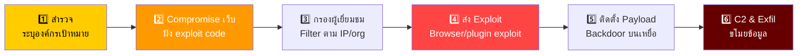
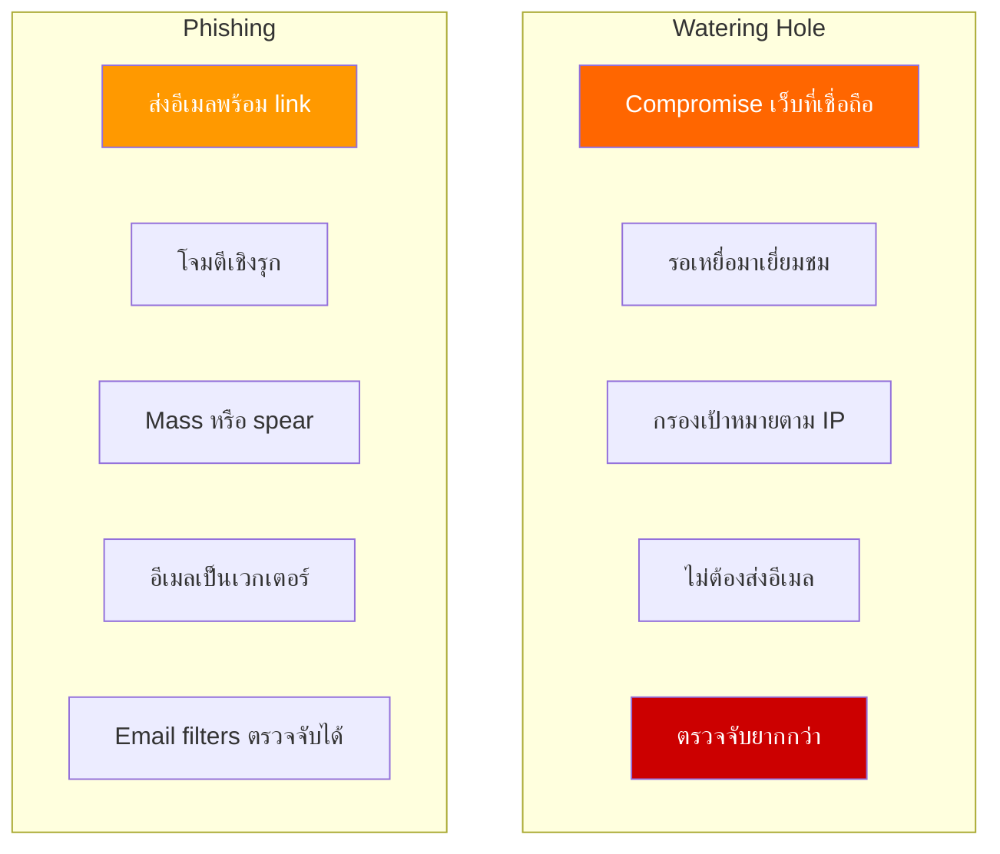
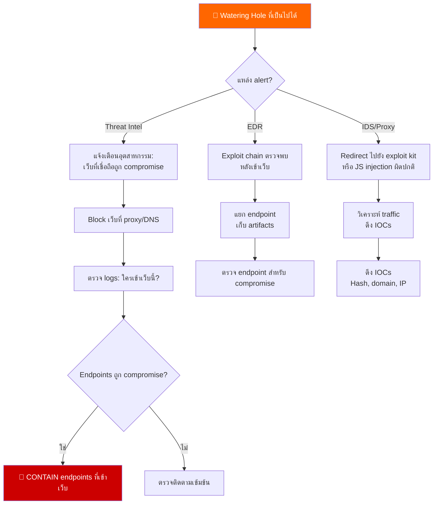
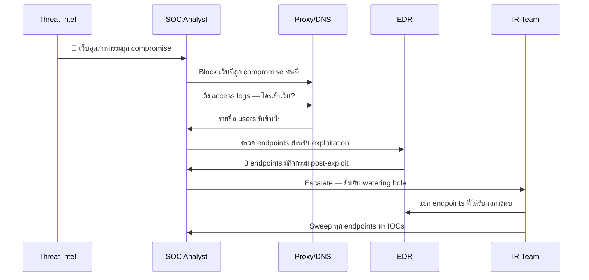
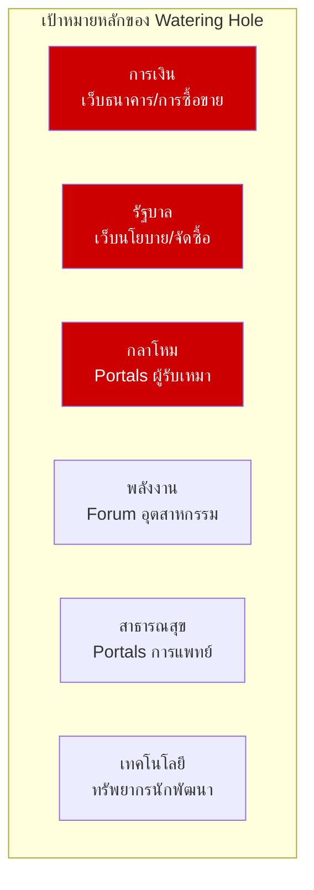
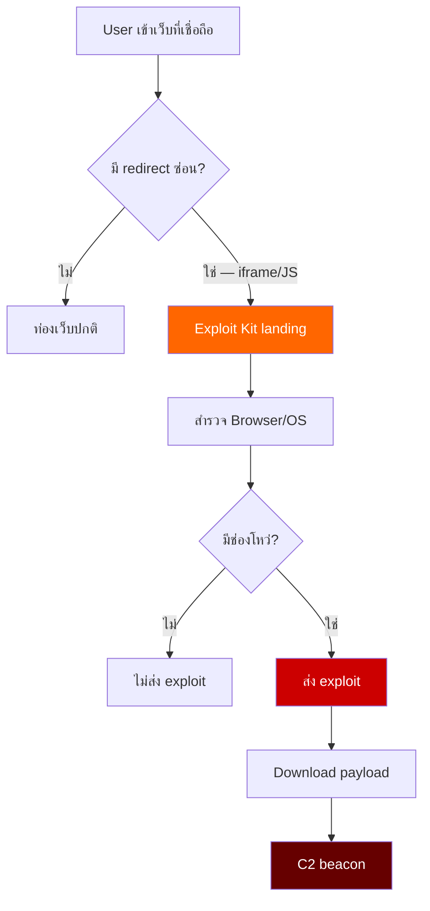

# Playbook: การตอบสนอง Watering Hole Attack

**ID**: PB-43
**ความรุนแรง**: สูง | **ประเภท**: Initial Access
**MITRE ATT&CK**: [T1189](https://attack.mitre.org/techniques/T1189/) (Drive-by Compromise), [T1587.001](https://attack.mitre.org/techniques/T1587/001/) (Exploit Development)
**Trigger**: Threat intel (การโจมตีเฉพาะอุตสาหกรรม), EDR (exploit หลังเข้าเว็บ), IDS (redirect ไปยัง exploit kit), user รายงาน (พฤติกรรมผิดปกติ)

> ⚠️ **คำเตือน**: Watering hole โจมตีทั้งอุตสาหกรรมโดยการ compromise เว็บไซต์ที่เชื่อถือ ผู้โจมตีรอเหยื่อมาเยี่ยมชม — ไม่ต้องส่ง phishing email

### Watering Hole Attack Chain



### Watering Hole vs Phishing



---

## Decision Flow



### ขั้นตอนการสืบสวน



### อุตสาหกรรมเป้าหมาย



### Exploit Kit Detection Flow



### Timeline การตอบสนอง

```mermaid
gantt
    title Watering Hole Response Timeline
    dateFormat HH:mm
    axisFormat %H:%M
    section Detection
        ได้รับ threat intel     :a1, 00:00, 5min
        Block เว็บที่ proxy     :a2, after a1, 10min
    section Scoping
        ดึง proxy access logs  :a3, after a2, 15min
        ระบุผู้เยี่ยมชม        :a4, after a3, 30min
    section Investigation
        ตรวจ EDR for exploits  :a5, after a4, 60min
        IOC sweep ทุก endpoints:a6, after a5, 120min
    section Recovery
        แก้ไขเครื่องที่ compromise :a7, after a6, 120min
```



---

## 1. การดำเนินการทันที (15 นาทีแรก)

| # | การดำเนินการ | ผู้รับผิดชอบ |
|:---|:---|:---|
| 1 | Block เว็บที่ถูก compromise ที่ proxy/DNS | SOC T1 |
| 2 | ดึง proxy logs: รายชื่อ users ทั้งหมดที่เข้าเว็บ | SOC T1 |
| 3 | ตรวจ EDR สำหรับ exploitation indicators บน visitors | SOC T2 |
| 4 | แจ้ง IT ส่ง IOCs ไปยัง security tools ทั้งหมด | SOC T2 |
| 5 | ติดต่อแหล่ง threat intel สำหรับ IOCs เพิ่มเติม | TI Team |
| 6 | แจ้งเจ้าของเว็บไซต์ (ถ้าเป็นไปได้) | SOC Manager |

## 2. รายการตรวจสอบ

### วิเคราะห์ Web Traffic
- [ ] Proxy logs: ทุกการเข้าเว็บที่ compromise (30+ วัน)
- [ ] ตรวจ redirects ไปยัง exploit kit domains
- [ ] ตรวจ JavaScript หรือ iframe ที่ฝังในเว็บ
- [ ] วิเคราะห์ไฟล์ที่ download ระหว่างเข้าเว็บ
- [ ] ตรวจ POST requests ผิดปกติ (data exfiltration)

### วิเคราะห์ Endpoint (สำหรับ visitors)
- [ ] EDR: process creation หลัง browser exploitation
- [ ] ตรวจ services, scheduled tasks, หรือ registry ใหม่
- [ ] ตรวจ child processes ผิดปกติของ browser
- [ ] Memory analysis สำหรับ exploit shellcode
- [ ] Network connections ไปยัง C2

## 3. การควบคุม (Containment)

| ขอบเขต | การดำเนินการ |
|:---|:---|
| **เว็บไซต์** | Block ที่ proxy, DNS sinkhole, firewall |
| **Endpoints** | แยกเครื่องที่ยืนยัน compromise |
| **เครือข่าย** | Block C2 domains/IPs |
| **Browser** | บังคับอัปเดต browsers + ปิด plugins ที่มีช่องโหว่ |

### มาตรการป้องกัน
- [ ] เปิด browser isolation สำหรับเว็บไซต์ที่เสี่ยง
- [ ] Deploy DNS filtering ในระดับองค์กร
- [ ] ใช้ virtual browser สำหรับเว็บไซต์ที่ไม่ไว้วางใจ
- [ ] ตรวจ browser extensions ที่ได้รับอนุญาต
- [ ] อัปเดต browser และ plugins ทุก endpoints ทันที
- [ ] เปิด Enhanced Safe Browsing (Chrome/Edge)

## 4. หลังเหตุการณ์ (Post-Incident)

| คำถาม | คำตอบ |
|:---|:---|
| เว็บไหนถูก compromise และอย่างไร? | [เว็บ + วิธี] |
| พนักงานกี่คนเข้าเว็บระหว่างช่วง compromise? | [จำนวน] |
| มี endpoints ถูก compromise จริงหรือไม่? | [จำนวน + รายละเอียด] |
| Browser และ plugins อัปเดตหรือไม่? | [สถานะ] |

## 6. Detection Rules (Sigma)

```yaml
title: Browser Child Process Spawning Suspicious Executable
logsource:
    product: windows
    category: process_creation
detection:
    selection:
        ParentImage|endswith:
            - '\chrome.exe'
            - '\msedge.exe'
            - '\firefox.exe'
        Image|endswith:
            - '\cmd.exe'
            - '\powershell.exe'
            - '\rundll32.exe'
    condition: selection
    level: high
```

## เอกสารที่เกี่ยวข้อง
- [Drive-By Download Playbook](Drive_By_Download.th.md)
- [Exploit Playbook](Exploit.th.md)
- [Malware Infection Playbook](Malware_Infection.th.md)

## References
- [MITRE T1189 — Drive-by Compromise](https://attack.mitre.org/techniques/T1189/)
- [CISA — Watering Hole Advisories](https://www.cisa.gov/news-events/cybersecurity-advisories)
