# Playbook: การตอบสนอง Watering Hole Attack

**ID**: PB-43
**ความรุนแรง**: สูง | **ประเภท**: Initial Access
**MITRE ATT&CK**: [T1189](https://attack.mitre.org/techniques/T1189/) (Drive-by Compromise), [T1587.001](https://attack.mitre.org/techniques/T1587/001/) (Exploit Development)
**Trigger**: Threat intel (การโจมตีเฉพาะอุตสาหกรรม), EDR (exploit หลังเข้าเว็บ), IDS (redirect ไปยัง exploit kit), user รายงาน (พฤติกรรมผิดปกติ)

> ⚠️ **คำเตือน**: Watering hole โจมตีทั้งอุตสาหกรรมโดยการ compromise เว็บไซต์ที่เชื่อถือ ผู้โจมตีรอเหยื่อมาเยี่ยมชม — ไม่ต้องส่ง phishing email

### Watering Hole Attack Chain

```mermaid
graph LR
    A["1️⃣ สำรวจ\nระบุองค์กรเป้าหมาย"] --> B["2️⃣ Compromise เว็บ\nฝัง exploit code"]
    B --> C["3️⃣ กรองผู้เยี่ยมชม\nFilter ตาม IP/org"]
    C --> D["4️⃣ ส่ง Exploit\nBrowser/plugin exploit"]
    D --> E["5️⃣ ติดตั้ง Payload\nBackdoor บนเหยื่อ"]
    E --> F["6️⃣ C2 & Exfil\nขโมยข้อมูล"]
    style A fill:#ffcc00,color:#000
    style B fill:#ff9900,color:#fff
    style D fill:#ff4444,color:#fff
    style F fill:#660000,color:#fff
```



### Watering Hole vs Phishing

```mermaid
graph TD
    subgraph "Watering Hole"
        WH1["Compromise เว็บที่เชื่อถือ"]
        WH2["รอเหยื่อมาเยี่ยมชม"]
        WH3["กรองเป้าหมายตาม IP"]
        WH4["ไม่ต้องส่งอีเมล"]
        WH5["ตรวจจับยากกว่า"]
    end
    subgraph "Phishing"
        PH1["ส่งอีเมลพร้อม link"]
        PH2["โจมตีเชิงรุก"]
        PH3["Mass หรือ spear"]
        PH4["อีเมลเป็นเวกเตอร์"]
        PH5["Email filters ตรวจจับได้"]
    end
    style WH1 fill:#ff6600,color:#fff
    style WH5 fill:#cc0000,color:#fff
    style PH1 fill:#ff9900,color:#fff
```



---

## Decision Flow

```mermaid
graph TD
    Alert["🚨 Watering Hole ที่เป็นไปได้"] --> Source{"แหล่ง alert?"}
    Source -->|"Threat Intel"| TI["แจ้งเตือนอุตสาหกรรม:\nเว็บที่เชื่อถือถูก compromise"]
    Source -->|"EDR"| EDR["Exploit chain ตรวจพบ\nหลังเข้าเว็บ"]
    Source -->|"IDS/Proxy"| Net["Redirect ไปยัง exploit kit\nหรือ JS injection ผิดปกติ"]
    TI --> Block["Block เว็บที่ proxy/DNS"]
    EDR --> Isolate["แยก endpoint\nเก็บ artifacts"]
    Net --> Analyze["วิเคราะห์ traffic\nดึง IOCs"]
    Block --> Check["ตรวจ logs: ใครเข้าเว็บนี้?"]
    Isolate --> Triage["ตรวจ endpoint สำหรับ compromise"]
    Analyze --> IOC["ดึง IOCs\nHash, domain, IP"]
    Check --> Scope{"Endpoints ถูก compromise?"}
    Scope -->|ใช่| Contain["🔴 CONTAIN endpoints ที่เข้าเว็บ"]
    Scope -->|ไม่| Monitor["ตรวจติดตามเข้มข้น"]
    style Alert fill:#ff6600,color:#fff
    style Contain fill:#cc0000,color:#fff
```



### ขั้นตอนการสืบสวน

```mermaid
sequenceDiagram
    participant TI as Threat Intel
    participant SOC as SOC Analyst
    participant Proxy as Proxy/DNS
    participant EDR
    participant IR as IR Team

    TI->>SOC: 🚨 เว็บอุตสาหกรรมถูก compromise
    SOC->>Proxy: Block เว็บที่ถูก compromise ทันที
    SOC->>Proxy: ดึง access logs — ใครเข้าเว็บ?
    Proxy->>SOC: รายชื่อ users ที่เข้าเว็บ
    SOC->>EDR: ตรวจ endpoints สำหรับ exploitation
    EDR->>SOC: 3 endpoints มีกิจกรรม post-exploit
    SOC->>IR: Escalate — ยืนยัน watering hole
    IR->>EDR: แยก endpoints ที่ได้รับผลกระทบ
    IR->>SOC: Sweep ทุก endpoints หา IOCs
```



### อุตสาหกรรมเป้าหมาย

```mermaid
graph TD
    subgraph "เป้าหมายหลักของ Watering Hole"
        F1["การเงิน\nเว็บธนาคาร/การซื้อขาย"]
        F2["รัฐบาล\nเว็บนโยบาย/จัดซื้อ"]
        F3["กลาโหม\nPortals ผู้รับเหมา"]
        F4["พลังงาน\nForum อุตสาหกรรม"]
        F5["สาธารณสุข\nPortals การแพทย์"]
        F6["เทคโนโลยี\nทรัพยากรนักพัฒนา"]
    end
    style F1 fill:#cc0000,color:#fff
    style F2 fill:#cc0000,color:#fff
    style F3 fill:#cc0000,color:#fff
```



### Exploit Kit Detection Flow

```mermaid
graph TD
    Visit["User เข้าเว็บที่เชื่อถือ"] --> Redirect{"มี redirect ซ่อน?"}
    Redirect -->|ไม่| Safe["ท่องเว็บปกติ"]
    Redirect -->|"ใช่ — iframe/JS"| EK["Exploit Kit landing"]
    EK --> Profile["สำรวจ Browser/OS"]
    Profile --> Vuln{"มีช่องโหว่?"}
    Vuln -->|ไม่| Benign["ไม่ส่ง exploit"]
    Vuln -->|ใช่| Exploit["ส่ง exploit"]
    Exploit --> Payload["Download payload"]
    Payload --> C2["C2 beacon"]
    style EK fill:#ff6600,color:#fff
    style Exploit fill:#cc0000,color:#fff
    style C2 fill:#660000,color:#fff
```



### Timeline การตอบสนอง

```mermaid
gantt
    title Watering Hole Response Timeline
    dateFormat HH:mm
    axisFormat %H:%M
    section Detection
        ได้รับ threat intel     :a1, 00:00, 5min
        Block เว็บที่ proxy     :a2, after a1, 10min
    section Scoping
        ดึง proxy access logs  :a3, after a2, 15min
        ระบุผู้เยี่ยมชม        :a4, after a3, 30min
    section Investigation
        ตรวจ EDR for exploits  :a5, after a4, 60min
        IOC sweep ทุก endpoints:a6, after a5, 120min
    section Recovery
        แก้ไขเครื่องที่ compromise :a7, after a6, 120min
```



---

## 1. การดำเนินการทันที (15 นาทีแรก)

| # | การดำเนินการ | ผู้รับผิดชอบ |
|:---|:---|:---|
| 1 | Block เว็บที่ถูก compromise ที่ proxy/DNS | SOC T1 |
| 2 | ดึง proxy logs: รายชื่อ users ทั้งหมดที่เข้าเว็บ | SOC T1 |
| 3 | ตรวจ EDR สำหรับ exploitation indicators บน visitors | SOC T2 |
| 4 | แจ้ง IT ส่ง IOCs ไปยัง security tools ทั้งหมด | SOC T2 |
| 5 | ติดต่อแหล่ง threat intel สำหรับ IOCs เพิ่มเติม | TI Team |
| 6 | แจ้งเจ้าของเว็บไซต์ (ถ้าเป็นไปได้) | SOC Manager |

## 2. รายการตรวจสอบ

### วิเคราะห์ Web Traffic
- [ ] Proxy logs: ทุกการเข้าเว็บที่ compromise (30+ วัน)
- [ ] ตรวจ redirects ไปยัง exploit kit domains
- [ ] ตรวจ JavaScript หรือ iframe ที่ฝังในเว็บ
- [ ] วิเคราะห์ไฟล์ที่ download ระหว่างเข้าเว็บ
- [ ] ตรวจ POST requests ผิดปกติ (data exfiltration)

### วิเคราะห์ Endpoint (สำหรับ visitors)
- [ ] EDR: process creation หลัง browser exploitation
- [ ] ตรวจ services, scheduled tasks, หรือ registry ใหม่
- [ ] ตรวจ child processes ผิดปกติของ browser
- [ ] Memory analysis สำหรับ exploit shellcode
- [ ] Network connections ไปยัง C2

## 3. การควบคุม (Containment)

| ขอบเขต | การดำเนินการ |
|:---|:---|
| **เว็บไซต์** | Block ที่ proxy, DNS sinkhole, firewall |
| **Endpoints** | แยกเครื่องที่ยืนยัน compromise |
| **เครือข่าย** | Block C2 domains/IPs |
| **Browser** | บังคับอัปเดต browsers + ปิด plugins ที่มีช่องโหว่ |

### มาตรการป้องกัน
- [ ] เปิด browser isolation สำหรับเว็บไซต์ที่เสี่ยง
- [ ] Deploy DNS filtering ในระดับองค์กร
- [ ] ใช้ virtual browser สำหรับเว็บไซต์ที่ไม่ไว้วางใจ
- [ ] ตรวจ browser extensions ที่ได้รับอนุญาต
- [ ] อัปเดต browser และ plugins ทุก endpoints ทันที
- [ ] เปิด Enhanced Safe Browsing (Chrome/Edge)

## 4. หลังเหตุการณ์ (Post-Incident)

| คำถาม | คำตอบ |
|:---|:---|
| เว็บไหนถูก compromise และอย่างไร? | [เว็บ + วิธี] |
| พนักงานกี่คนเข้าเว็บระหว่างช่วง compromise? | [จำนวน] |
| มี endpoints ถูก compromise จริงหรือไม่? | [จำนวน + รายละเอียด] |
| Browser และ plugins อัปเดตหรือไม่? | [สถานะ] |

## 6. Detection Rules (Sigma)

```yaml
title: Browser Child Process Spawning Suspicious Executable
logsource:
    product: windows
    category: process_creation
detection:
    selection:
        ParentImage|endswith:
            - '\chrome.exe'
            - '\msedge.exe'
            - '\firefox.exe'
        Image|endswith:
            - '\cmd.exe'
            - '\powershell.exe'
            - '\rundll32.exe'
    condition: selection
    level: high
```

## เอกสารที่เกี่ยวข้อง
- [Drive-By Download Playbook](Drive_By_Download.th.md)
- [Exploit Playbook](Exploit.th.md)
- [Malware Infection Playbook](Malware_Infection.th.md)

## References
- [MITRE T1189 — Drive-by Compromise](https://attack.mitre.org/techniques/T1189/)
- [CISA — Watering Hole Advisories](https://www.cisa.gov/news-events/cybersecurity-advisories)
