# Playbook: Web Application Attack

**ID**: PB-10
**Severity**: High/Critical | **Category**: Application Security
**MITRE ATT&CK**: [T1190](https://attack.mitre.org/techniques/T1190/) (Exploit Public-Facing Application), [T1059.007](https://attack.mitre.org/techniques/T1059/007/) (JavaScript)
**Trigger**: WAF alert, IDS/IPS, SIEM correlation, Bug bounty report

### Web Attack Chain

```mermaid
graph LR
    Recon["🔍 Recon"] --> Scan["📡 Vuln Scan"]
    Scan --> Exploit["💥 Exploit"]
    Exploit --> Shell["🐚 Web Shell"]
    Shell --> Pivot["🔀 Pivot"]
    Pivot --> Exfil["📤 Exfiltrate"]
    style Recon fill:#3498db,color:#fff
    style Exploit fill:#e74c3c,color:#fff
    style Shell fill:#c0392b,color:#fff
    style Exfil fill:#8e44ad,color:#fff
```

### Defense in Depth

```mermaid
graph TD
    Traffic["🌐 Web Traffic"] --> WAF["🛡️ WAF"]
    WAF -->|Block| Blocked["❌ Blocked"]
    WAF -->|Pass| App["📱 Application"]
    App --> RASP["🔍 RASP"]
    RASP -->|Alert| SOC["🚨 SOC"]
    RASP -->|Clean| DB["🗄️ Database"]
    style WAF fill:#27ae60,color:#fff
    style RASP fill:#f39c12,color:#fff
    style SOC fill:#e74c3c,color:#fff
```

---

## Decision Flow

```mermaid
graph TD
    Alert["🚨 WAF / IDS Alert"] --> Decode["🔍 Decode Payload"]
    Decode --> Malicious{"Malicious Syntax?"}
    Malicious -->|No| FP["✅ False Positive"]
    Malicious -->|Yes| Response{"📊 Server Response?"}
    Response -->|200 OK + Data| Breach["🔴 Successful Exploitation"]
    Response -->|403 Blocked| Blocked["🟡 Attempt Blocked"]
    Response -->|500 Error| Partial["🟠 Possible Partial Success"]
    Breach --> RCE{"RCE / Shell?"}
    RCE -->|Yes| Offline["🚨 Take App OFFLINE"]
    RCE -->|No, Data Leak| Contain["🛡️ Block + Investigate"]
    Blocked --> Ban["🚫 Ban IP + Monitor"]
    Partial --> Investigate["🔍 Investigate Impact"]
    Offline --> FullIR["Full Incident Response"]
```

---

## 1. Analysis

### 1.1 Attack Classification

| Attack Type | Detection Pattern | OWASP | Severity |
|:---|:---|:---|:---|
| **SQL Injection** | `UNION SELECT`, `' OR 1=1`, `--` | A03:2021 | Critical |
| **XSS (Cross-Site Scripting)** | `<script>`, `onerror=`, `javascript:` | A03:2021 | High |
| **Remote Code Execution** | System commands, reverse shell syntax | A03:2021 | Critical |
| **Local File Inclusion (LFI)** | `../../../etc/passwd`, `php://filter` | A01:2021 | High |
| **Server-Side Request Forgery** | Internal IP requests, metadata URLs | A10:2021 | High |
| **Command Injection** | `; ls`, `| cat`, backtick execution | A03:2021 | Critical |
| **Path Traversal** | `..%2F`, `..%5C` | A01:2021 | High |
| **Authentication Bypass** | Token manipulation, JWT tampering | A07:2021 | Critical |
| **XML External Entity (XXE)** | `<!DOCTYPE`, `ENTITY`, `SYSTEM` | A05:2021 | High |

### 1.2 Assessment Checklist

| Check | How | Done |
|:---|:---|:---:|
| Decode the payload (Base64/URL encoding) | WAF logs, CyberChef | ☐ |
| What was the HTTP response code? | Access logs, WAF | ☐ |
| Was sensitive data returned to the attacker? | Response body analysis | ☐ |
| Automated scanner or manual attack? | Request frequency, User-Agent | ☐ |
| What is the target application and its criticality? | CMDB, business context | ☐ |
| Is the vulnerability known (CVE) or 0-day? | Vulnerability scanner, advisories | ☐ |
| Any evidence of web shell upload? | File system scan, new files | ☐ |

### 1.3 Scope Assessment

- [ ] Was the attack from a single IP or multiple (botnet)?
- [ ] Were multiple endpoints / APIs targeted?
- [ ] Any evidence of data exfiltration from the database?
- [ ] Was a web shell or backdoor uploaded?
- [ ] Were any credentials harvested?

---

## 2. Containment

### 2.1 Immediate Actions

| # | Action | Tool | Done |
|:---:|:---|:---|:---:|
| 1 | **Block attacker IP** at WAF and firewall | WAF, Firewall | ☐ |
| 2 | **Apply virtual patch** (WAF rule for specific exploit pattern) | WAF | ☐ |
| 3 | **If RCE confirmed**: Take application OFFLINE immediately | DevOps | ☐ |
| 4 | **Block User-Agent** if automated scanner | WAF | ☐ |
| 5 | **Enable enhanced WAF logging** (full request/response body) | WAF | ☐ |

### 2.2 If Exploitation Confirmed

| # | Action | Done |
|:---:|:---|:---:|
| 1 | Scan web directories for uploaded web shells | ☐ |
| 2 | Check for new files: `*.php`, `*.jsp`, `*.aspx` in web root | ☐ |
| 3 | Check outbound connections from web server (reverse shell) | ☐ |
| 4 | Disable database access from web server (if SQLi confirmed) | ☐ |
| 5 | Capture memory dump and disk image of web server | ☐ |

---

## 3. Eradication

| # | Action | Done |
|:---:|:---|:---:|
| 1 | Remove web shell or backdoor files | ☐ |
| 2 | **Patch the vulnerability** in source code | ☐ |
| 3 | Apply vendor security patches / updates | ☐ |
| 4 | Reset database credentials (if SQLi) | ☐ |
| 5 | Rotate API keys and session secrets | ☐ |
| 6 | Clear any crontab/scheduled task persistence by attacker | ☐ |

---

## 4. Recovery

| # | Action | Done |
|:---:|:---|:---:|
| 1 | Deploy patched code to production | ☐ |
| 2 | Run vulnerability scan to verify fix | ☐ |
| 3 | Perform penetration test on the fixed endpoint | ☐ |
| 4 | Restore database from backup if data was modified | ☐ |
| 5 | Bring application back online | ☐ |
| 6 | Monitor for attack resumption for 72 hours | ☐ |

---

## 5. IoC Collection

| Type | Value | Source |
|:---|:---|:---|
| Attacker IP(s) | | WAF / Access logs |
| Attack payload | | WAF (decoded) |
| Target URL / Endpoint | | Access logs |
| User-Agent string | | Access logs |
| Web shell path | | File system scan |
| Web shell hash | | Forensics |
| Exfiltrated data type | | DB audit |

---

## 6. Escalation Criteria

| Condition | Escalate To |
|:---|:---|
| RCE confirmed (web shell, reverse shell) | SOC Lead + DevOps + CISO |
| Database breach (SQLi with data extraction) | CISO + Legal + DPO |
| Customer PII exposed | Legal + PDPA notification |
| Zero-day vulnerability | CISO + Vendor + CERT |
| Revenue-generating app taken offline | Business unit + Executive |
| Attacker targeting multiple applications | Major Incident |

---

### Web Security Architecture

```mermaid
graph LR
    User["👤 User"] --> CDN["☁️ CDN"]
    CDN --> WAF["🛡️ WAF"]
    WAF --> LB["⚖️ Load Balancer"]
    LB --> App["📱 App Server"]
    App --> DB["🗄️ DB (parameterized)"]
    style WAF fill:#27ae60,color:#fff
    style DB fill:#3498db,color:#fff
```

### Secure SDLC

```mermaid
graph TD
    Dev["💻 Develop"] --> SAST["🔍 SAST scan"]
    SAST --> PR["📋 Code review"]
    PR --> DAST["🌐 DAST scan"]
    DAST --> Deploy{"✅ Pass?"}
    Deploy -->|Yes| Prod["🚀 Production"]
    Deploy -->|No| Fix["🔧 Fix + rescan"]
    Fix --> SAST
    style SAST fill:#f39c12,color:#fff
    style DAST fill:#3498db,color:#fff
    style Prod fill:#27ae60,color:#fff
```

## Related Documents

- [IR Framework](../Framework.en.md)
- [Incident Report](../../templates/incident_report.en.md)
- [PB-18 Vulnerability Exploitation](Exploit.en.md)
- [PB-08 Data Exfiltration](Data_Exfiltration.en.md)

## References

- [OWASP Top 10 — 2021](https://owasp.org/www-project-top-ten/)
- [MITRE ATT&CK T1190 — Exploit Public-Facing Application](https://attack.mitre.org/techniques/T1190/)
- [OWASP Web Security Testing Guide](https://owasp.org/www-project-web-security-testing-guide/)
