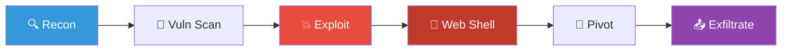
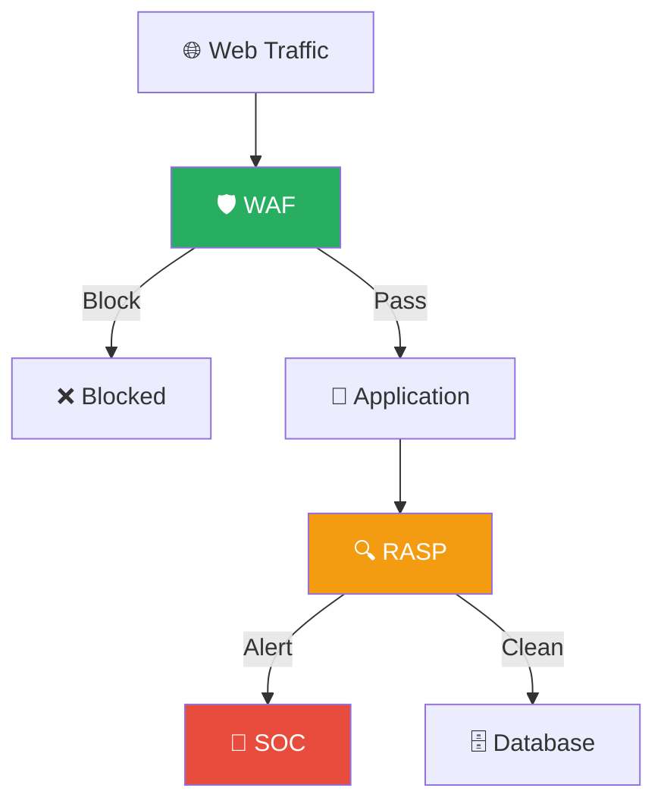
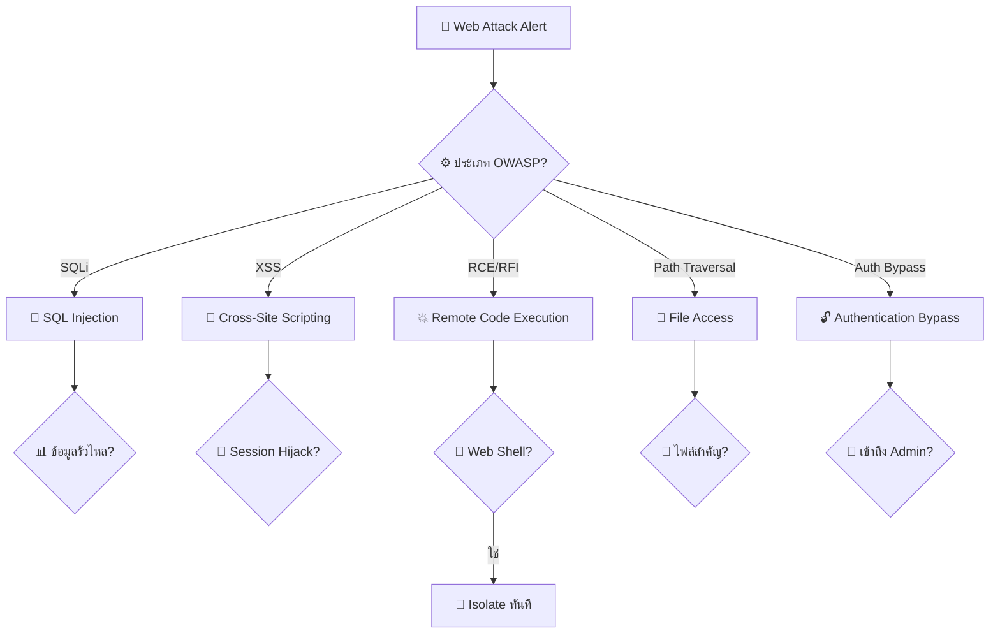
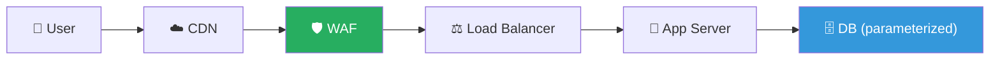
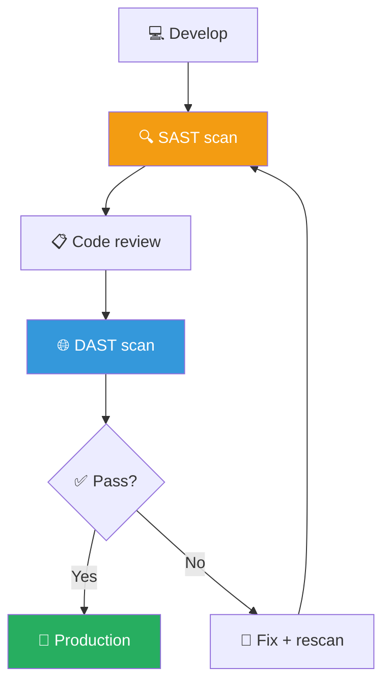

# Playbook: Web Attack / การโจมตีเว็บแอปพลิเคชัน

**ID**: PB-10
**ระดับความรุนแรง**: สูง/วิกฤต | **หมวดหมู่**: ความปลอดภัยแอปพลิเคชัน
**MITRE ATT&CK**: [T1190](https://attack.mitre.org/techniques/T1190/) (Exploit Public-Facing Application)
**ทริกเกอร์**: WAF alert, IDS/IPS, SIEM correlation, Bug bounty report

### ผังเส้นทางการโจมตีเว็บ

### ผังการป้องกันหลายชั้น

---

## ผังการตัดสินใจ

---

## 1. การวิเคราะห์

### 1.1 ประเภท Web Attack (OWASP Top 10 Mapping)

| ประเภท | OWASP | ลักษณะ | ความรุนแรง |
|:---|:---|:---|:---|
| **SQL Injection** | A03 | `' OR 1=1--`, UNION SELECT | 🔴 วิกฤต |
| **Cross-Site Scripting (XSS)** | A03 | `<script>`, stored/reflected | 🟠 สูง |
| **Remote Code Execution (RCE)** | A03 | Command injection, file upload | 🔴 วิกฤต |
| **LFI/RFI** | A01 | `../../etc/passwd`, remote include | 🔴 สูง |
| **SSRF** | A10 | `http://169.254.169.254/` | 🔴 สูง |
| **Authentication Bypass** | A07 | Broken auth, JWT manipulation | 🔴 วิกฤต |
| **Broken Access Control** | A01 | IDOR, privilege escalation | 🔴 สูง |
| **Deserialization** | A08 | Object injection → RCE | 🔴 วิกฤต |

### 1.2 รายการตรวจสอบ

| รายการ | วิธีตรวจสอบ | เสร็จ |
|:---|:---|:---:|
| URL / endpoint ที่ถูกโจมตี | WAF / access logs | ☐ |
| ประเภทการโจมตี (ดูตาราง 1.1) | WAF rule / payload analysis | ☐ |
| โจมตีสำเร็จ หรือถูก WAF block? | WAF logs (block vs detect) | ☐ |
| Source IP | WAF / access logs | ☐ |
| มี web shell ถูกวาง? | File integrity / EDR | ☐ |
| มีข้อมูลรั่วไหล? (SQLi → DB dump) | DB query logs | ☐ |
| มีหลาย endpoint ถูกโจมตี? (automated scan) | WAF | ☐ |
| มี lateral movement ตามมา? | SIEM | ☐ |

### 1.3 Web Shell Indicators

| ตัวบ่งชี้ | เครื่องมือ |
|:---|:---|
| ไฟล์ใหม่ใน web root (*.php, *.aspx, *.jsp) | File integrity monitoring |
| POST requests ไปยังไฟล์ที่ไม่รู้จัก | Access logs |
| Outbound connections จาก web server | Netflow / EDR |
| Process spawn จาก web server (cmd, bash) | EDR / Sysmon |

---

## 2. การควบคุม

### 2.1 Attack Blocked (WAF caught)

| # | การดำเนินการ | เสร็จ |
|:---:|:---|:---:|
| 1 | **Block** source IP ที่ WAF/firewall | ☐ |
| 2 | **ตรวจ** ว่ามี bypass attempts อื่น | ☐ |
| 3 | **เพิ่ม** WAF virtual patch สำหรับ vulnerability | ☐ |

### 2.2 Attack Succeeded

| # | การดำเนินการ | เสร็จ |
|:---:|:---|:---:|
| 1 | **ย้าย** web application ไปหลัง WAF (ถ้ายังไม่มี) | ☐ |
| 2 | **Virtual patch** ที่ WAF สำหรับ attack pattern | ☐ |
| 3 | **ค้นหาและลบ web shell** | ☐ |
| 4 | **Block** source IP + C2 IPs | ☐ |
| 5 | **Isolate** web server (ถ้า RCE confirmed) | ☐ |
| 6 | **หมุนเวียน** DB credentials (SQLi) / API keys | ☐ |

---

## 3. การกำจัด

| # | การดำเนินการ | เสร็จ |
|:---:|:---|:---:|
| 1 | **แก้ไข source code** — fix vulnerability | ☐ |
| 2 | ลบ web shell + backdoor | ☐ |
| 3 | ลบ persistence (cron, scheduled tasks) | ☐ |
| 4 | หมุนเวียน credentials ทั้งหมด (DB, API, session secrets) | ☐ |
| 5 | Rebuild web server จาก clean image (ถ้า RCE) | ☐ |

---

## 4. การฟื้นฟู

| # | การดำเนินการ | เสร็จ |
|:---:|:---|:---:|
| 1 | Deploy **WAF** พร้อม OWASP Core Rule Set | ☐ |
| 2 | สั่ง **SAST/DAST** security scan | ☐ |
| 3 | เปิด **parameterized queries** (prevent SQLi) | ☐ |
| 4 | เปิด **Content-Security-Policy** headers (prevent XSS) | ☐ |
| 5 | เปิด **file integrity monitoring** บน web root | ☐ |
| 6 | ตั้ง **web application pen test** ทุก 6 เดือน | ☐ |

---

## 5. เกณฑ์การยกระดับ

| เงื่อนไข | ยกระดับไปยัง |
|:---|:---|
| Web shell confirmed (RCE) | SOC Lead + CISO |
| SQLi + data exfiltrated | Legal + DPO (PDPA 72 ชม.) |
| หลาย applications ถูกโจมตี | Major Incident |
| Zero-day ใน web framework | [PB-24 Zero-Day](Zero_Day_Exploit.th.md) |
| SSRF → cloud metadata access | [PB-16 Cloud IAM](Cloud_IAM.th.md) |

---

### ผัง Web Security Architecture

### ผัง Secure SDLC

## เอกสารที่เกี่ยวข้อง

- [กรอบการตอบสนองต่อเหตุการณ์](../Framework.th.md)
- [PB-30 API Abuse](API_Abuse.th.md)
- [PB-18 Exploit](Exploit.th.md)

## อ้างอิง

- [OWASP Top 10](https://owasp.org/Top10/)
- [MITRE ATT&CK T1190](https://attack.mitre.org/techniques/T1190/)
