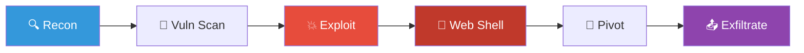
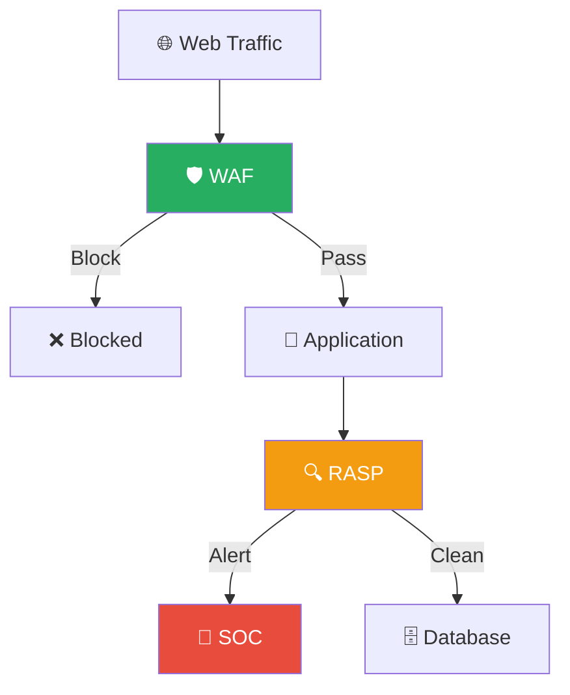
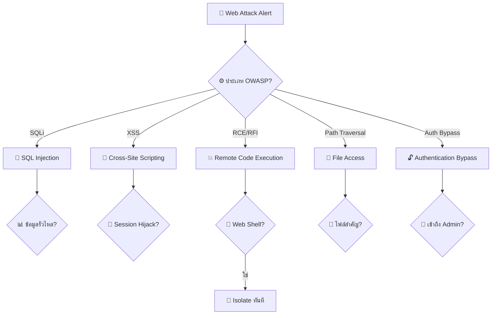
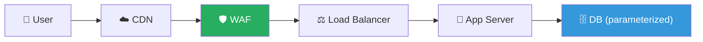
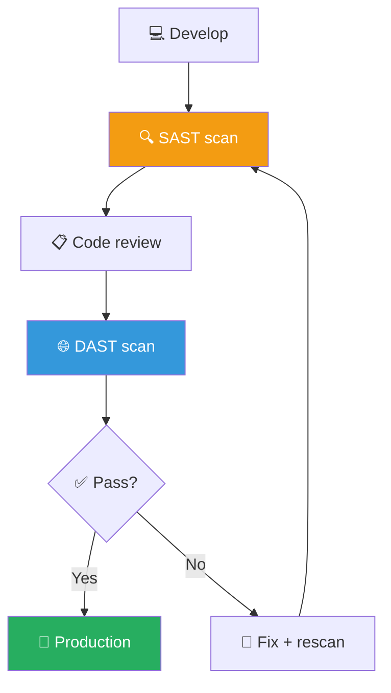

# Playbook: Web Attack / การโจมตีเว็บแอปพลิเคชัน

**ID**: PB-10
**ระดับความรุนแรง**: สูง/วิกฤต | **หมวดหมู่**: ความปลอดภัยแอปพลิเคชัน
**MITRE ATT&CK**: [T1190](https://attack.mitre.org/techniques/T1190/) (Exploit Public-Facing Application)
**ทริกเกอร์**: WAF alert, IDS/IPS, SIEM correlation, Bug bounty report

## หลังเหตุการณ์ (Post-Incident)

- [ ] Patch vulnerability ที่ถูก exploit
- [ ] ทำ code review สำหรับ vulnerability patterns ที่คล้ายกัน
- [ ] อัพเดท WAF rules ด้วย attack signatures ที่พบ
- [ ] รัน DAST/SAST scans
- [ ] ใช้ Content Security Policy (CSP) headers
- [ ] จัดทำ [Incident Report](../../11_Reporting_Templates/incident_report.th.md)

### ผังเส้นทางการโจมตีเว็บ

```mermaid
graph LR
    Recon["🔍 Recon"] --> Scan["📡 Vuln Scan"]
    Scan --> Exploit["💥 Exploit"]
    Exploit --> Shell["🐚 Web Shell"]
    Shell --> Pivot["🔀 Pivot"]
    Pivot --> Exfil["📤 Exfiltrate"]
    style Recon fill:#3498db,color:#fff
    style Exploit fill:#e74c3c,color:#fff
    style Shell fill:#c0392b,color:#fff
    style Exfil fill:#8e44ad,color:#fff
```

### ผังการป้องกันหลายชั้น

```mermaid
graph TD
    Traffic["🌐 Web Traffic"] --> WAF["🛡️ WAF"]
    WAF -->|Block| Blocked["❌ Blocked"]
    WAF -->|Pass| App["📱 Application"]
    App --> RASP["🔍 RASP"]
    RASP -->|Alert| SOC["🚨 SOC"]
    RASP -->|Clean| DB["🗄️ Database"]
    style WAF fill:#27ae60,color:#fff
    style RASP fill:#f39c12,color:#fff
    style SOC fill:#e74c3c,color:#fff
```

---

## ผังการตัดสินใจ

```mermaid
graph TD
    Alert["🚨 Web Attack Alert"] --> Type{"⚙️ ประเภท OWASP?"}
    Type -->|SQLi| SQL["💉 SQL Injection"]
    Type -->|XSS| XSS["📜 Cross-Site Scripting"]
    Type -->|RCE/RFI| RCE["💥 Remote Code Execution"]
    Type -->|Path Traversal| Path["📂 File Access"]
    Type -->|Auth Bypass| Auth["🔓 Authentication Bypass"]
    SQL --> Data{"📊 ข้อมูลรั่วไหล?"}
    XSS --> Session{"🍪 Session Hijack?"}
    RCE --> Shell{"🐚 Web Shell?"}
    Path --> Sensitive{"📁 ไฟล์สำคัญ?"}
    Auth --> Access{"👤 เข้าถึง Admin?"}
    Shell -->|ใช่| Critical["🔴 Isolate ทันที"]
```

---

## 1. การวิเคราะห์

### 1.1 ประเภท Web Attack (OWASP Top 10 Mapping)

| ประเภท | OWASP | ลักษณะ | ความรุนแรง |
|:---|:---|:---|:---|
| **SQL Injection** | A03 | `' OR 1=1--`, UNION SELECT | 🔴 วิกฤต |
| **Cross-Site Scripting (XSS)** | A03 | `<script>`, stored/reflected | 🟠 สูง |
| **Remote Code Execution (RCE)** | A03 | Command injection, file upload | 🔴 วิกฤต |
| **LFI/RFI** | A01 | `../../etc/passwd`, remote include | 🔴 สูง |
| **SSRF** | A10 | `http://169.254.169.254/` | 🔴 สูง |
| **Authentication Bypass** | A07 | Broken auth, JWT manipulation | 🔴 วิกฤต |
| **Broken Access Control** | A01 | IDOR, privilege escalation | 🔴 สูง |
| **Deserialization** | A08 | Object injection → RCE | 🔴 วิกฤต |

### 1.2 รายการตรวจสอบ

| รายการ | วิธีตรวจสอบ | เสร็จ |
|:---|:---|:---:|
| URL / endpoint ที่ถูกโจมตี | WAF / access logs | ☐ |
| ประเภทการโจมตี (ดูตาราง 1.1) | WAF rule / payload analysis | ☐ |
| โจมตีสำเร็จ หรือถูก WAF block? | WAF logs (block vs detect) | ☐ |
| Source IP | WAF / access logs | ☐ |
| มี web shell ถูกวาง? | File integrity / EDR | ☐ |
| มีข้อมูลรั่วไหล? (SQLi → DB dump) | DB query logs | ☐ |
| มีหลาย endpoint ถูกโจมตี? (automated scan) | WAF | ☐ |
| มี lateral movement ตามมา? | SIEM | ☐ |

### 1.3 Web Shell Indicators

| ตัวบ่งชี้ | เครื่องมือ |
|:---|:---|
| ไฟล์ใหม่ใน web root (*.php, *.aspx, *.jsp) | File integrity monitoring |
| POST requests ไปยังไฟล์ที่ไม่รู้จัก | Access logs |
| Outbound connections จาก web server | Netflow / EDR |
| Process spawn จาก web server (cmd, bash) | EDR / Sysmon |

---

## 2. การควบคุม

### 2.1 Attack Blocked (WAF caught)

| # | การดำเนินการ | เสร็จ |
|:---:|:---|:---:|
| 1 | **Block** source IP ที่ WAF/firewall | ☐ |
| 2 | **ตรวจ** ว่ามี bypass attempts อื่น | ☐ |
| 3 | **เพิ่ม** WAF virtual patch สำหรับ vulnerability | ☐ |

### 2.2 Attack Succeeded

| # | การดำเนินการ | เสร็จ |
|:---:|:---|:---:|
| 1 | **ย้าย** web application ไปหลัง WAF (ถ้ายังไม่มี) | ☐ |
| 2 | **Virtual patch** ที่ WAF สำหรับ attack pattern | ☐ |
| 3 | **ค้นหาและลบ web shell** | ☐ |
| 4 | **Block** source IP + C2 IPs | ☐ |
| 5 | **Isolate** web server (ถ้า RCE confirmed) | ☐ |
| 6 | **หมุนเวียน** DB credentials (SQLi) / API keys | ☐ |

---

## 3. การกำจัด

| # | การดำเนินการ | เสร็จ |
|:---:|:---|:---:|
| 1 | **แก้ไข source code** — fix vulnerability | ☐ |
| 2 | ลบ web shell + backdoor | ☐ |
| 3 | ลบ persistence (cron, scheduled tasks) | ☐ |
| 4 | หมุนเวียน credentials ทั้งหมด (DB, API, session secrets) | ☐ |
| 5 | Rebuild web server จาก clean image (ถ้า RCE) | ☐ |

---

## 4. การฟื้นฟู

| # | การดำเนินการ | เสร็จ |
|:---:|:---|:---:|
| 1 | Deploy **WAF** พร้อม OWASP Core Rule Set | ☐ |
| 2 | สั่ง **SAST/DAST** security scan | ☐ |
| 3 | เปิด **parameterized queries** (prevent SQLi) | ☐ |
| 4 | เปิด **Content-Security-Policy** headers (prevent XSS) | ☐ |
| 5 | เปิด **file integrity monitoring** บน web root | ☐ |
| 6 | ตั้ง **web application pen test** ทุก 6 เดือน | ☐ |

---

## 5. เกณฑ์การยกระดับ

| เงื่อนไข | ยกระดับไปยัง |
|:---|:---|
| Web shell confirmed (RCE) | SOC Lead + CISO |
| SQLi + data exfiltrated | Legal + DPO (PDPA 72 ชม.) |
| หลาย applications ถูกโจมตี | Major Incident |
| Zero-day ใน web framework | [PB-24 Zero-Day](Zero_Day_Exploit.th.md) |
| SSRF → cloud metadata access | [PB-16 Cloud IAM](Cloud_IAM.th.md) |

---

## 6. Evidence Checklist

| ประเภทหลักฐาน | สิ่งที่ต้องเก็บ | แหล่งข้อมูล | เหตุผลที่ต้องเก็บ |
|:---|:---|:---|:---|
| หลักฐาน request | full request path, parameter, header, cookie, timestamp, source IP | WAF / access logs | ใช้ reconstruct การโจมตีและ target surface |
| หลักฐานแอปพลิเคชัน | error trace, stack log, session context, พฤติกรรม endpoint | App logs / APM | ใช้ยืนยันว่า exploit สำเร็จถึง code path ใด |
| หลักฐาน persistence | web shell path, file ที่ถูกสร้าง, cron/task, user ใหม่, config change | File integrity / forensics | ใช้ดู post-exploitation foothold |
| หลักฐานผลกระทบข้อมูล | table ที่ถูก query, data export, record ที่ถูกแก้, customer impact | DB audit / app logs | ใช้รองรับ breach และ legal decision |
| หลักฐานโครงสร้างพื้นฐาน | action ของ load balancer, WAF, CDN, server ระหว่างโจมตี | Infra logs / ticketing | ใช้ validate containment และ root cause timeline |

---

## 7. Minimum Telemetry Required

| แหล่ง Telemetry | ใช้เพื่ออะไร | ความสำคัญ | Blind Spot ถ้าไม่มี |
|:---|:---|:---:|:---|
| WAF และ web access logs | ดู payload, source behavior, rate, endpoint targeting | Required | reconstruct exploit sequence และขอบเขตการยิงไม่ได้ |
| Application และ APM logs | ดู error condition, code path, auth/session behavior | Required | บอกไม่ได้ว่า request ไปถึง logic ที่เปราะบางสำเร็จหรือไม่ |
| Host และ file-integrity telemetry | ดู web shell, persistence, process activity, server compromise | Required | มองไม่เห็น RCE หรือ post-exploitation activity |
| Database audit logs | ดู query abuse, extraction, destructive change | Required | พิสูจน์ผลกระทบต่อข้อมูลไม่ได้ |
| Release และ change-management records | ดู code/config change และ rollout timing | Recommended | อาจตี release regression เป็นการโจมตี |

---

## 8. False Positive และ Tuning Guide

| Scenario | ทำไมจึงดูน่าสงสัย | วิธีตรวจสอบ | Tuning Action | ต้องยกระดับเมื่อ |
|:---|:---|:---|:---|:---|
| vulnerability scan หรือ DAST exercise | payload และ request burst ดูเหมือน exploit จริง | ยืนยัน scanner source, target scope, และ schedule | allowlist source range และ header ของ scanner ในช่วงเวลาที่อนุมัติ | scanner โผล่ใน production โดยไม่อนุมัติหรือมีสัญญาณ exploit สำเร็จ |
| search engine crawler หรือ partner integration | request volume สูงหรือ URL traversal แปลก | ยืนยัน user agent, IP range, และ path coverage ที่คาดไว้ | tune profile ของ crawler/partner แบบแคบ | request เข้า admin path, auth endpoint, หรือมี malicious payload |
| QA หรือ release validation หลัง deploy | test payload และ error spike อาจสูงผิดปกติ | ยืนยัน release window, owner, และ endpoint ที่ทดสอบ | ลด severity เฉพาะใน release window และ endpoint scope | error เกิดพร้อม payload เสี่ยง, data access, หรือ shell artifact |
| WAF false positive จาก business input ที่ encode ซับซ้อน | payload ที่ถูกต้องอาจดูเหมือน injection/traversal | reproduce request กับ business owner และดู response อย่างปลอดภัย | tune exception เฉพาะ parameter และ rule ที่ยืนยันแล้ว | payload เปลี่ยนรูปแบบ, ขยาย endpoint, หรือแตะ function สำคัญ |

---

### ผัง Web Security Architecture

```mermaid
graph LR
    User["👤 User"] --> CDN["☁️ CDN"]
    CDN --> WAF["🛡️ WAF"]
    WAF --> LB["⚖️ Load Balancer"]
    LB --> App["📱 App Server"]
    App --> DB["🗄️ DB (parameterized)"]
    style WAF fill:#27ae60,color:#fff
    style DB fill:#3498db,color:#fff
```

### ผัง Secure SDLC

```mermaid
graph TD
    Dev["💻 Develop"] --> SAST["🔍 SAST scan"]
    SAST --> PR["📋 Code review"]
    PR --> DAST["🌐 DAST scan"]
    DAST --> Deploy{"✅ Pass?"}
    Deploy -->|Yes| Prod["🚀 Production"]
    Deploy -->|No| Fix["🔧 Fix + rescan"]
    Fix --> SAST
    style SAST fill:#f39c12,color:#fff
    style DAST fill:#3498db,color:#fff
    style Prod fill:#27ae60,color:#fff
```

## กฎตรวจจับ (Sigma)

| กฎ | ไฟล์ |
|:---|:---|
| SQL Injection Pattern | [web_sqli_pattern.yml](../../08_Detection_Engineering/sigma_rules/web_sqli_pattern.yml) |
| WAF Detected Exploit Attempt | [web_waf_exploit.yml](../../08_Detection_Engineering/sigma_rules/web_waf_exploit.yml) |
| High Web Request Rate | [web_high_rate_limit.yml](../../08_Detection_Engineering/sigma_rules/web_high_rate_limit.yml) |

## เอกสารที่เกี่ยวข้อง

- [กรอบการตอบสนองต่อเหตุการณ์](../Framework.th.md)
- [PB-30 API Abuse](API_Abuse.th.md)
- [PB-18 Exploit](Exploit.th.md)

## OWASP Top 10 Detection Rules

| Attack | WAF Rule | SIEM Correlation |
|:---|:---|:---|
| SQL Injection | Pattern match | DB error spike |
| XSS | Script tag filter | Reflected content |
| SSRF | Internal IP block | Unusual outbound |
| Path Traversal | ../ pattern | File access logs |
| Broken Auth | Rate limiting | Failed login pattern |

### Web Attack Forensics

| Evidence | Location | Collection |
|:---|:---|:---|
| Access logs | Web server | Export + preserve |
| WAF logs | WAF console | API export |
| Application logs | App server | Centralized logging |
| Client-side | Browser console | Screenshot/HAR |

## References

- [OWASP Top 10](https://owasp.org/Top10/)
- [MITRE ATT&CK T1190](https://attack.mitre.org/techniques/T1190/)
