# Playbook: Wiper / Destructive Attack Response

**ID**: PB-38
**Severity**: Critical | **Category**: Impact
**MITRE ATT&CK**: [T1485](https://attack.mitre.org/techniques/T1485/) (Data Destruction), [T1561](https://attack.mitre.org/techniques/T1561/) (Disk Wipe), [T1490](https://attack.mitre.org/techniques/T1490/) (Inhibit System Recovery)
**Trigger**: EDR alert (mass file deletion), SIEM (MBR overwrite pattern), multiple systems offline simultaneously

> ⚠️ **CRITICAL**: Wiper attacks are IRREVERSIBLE. Speed is everything — isolate before the wiper propagates. Do NOT attempt to remediate on infected systems.

### Known Wiper Malware Families


### Wiper Kill Chain


---

## Decision Flow


### Incident Communication

```mermaid
sequenceDiagram
    participant SOC as SOC Analyst
    participant Manager as SOC Manager
    participant CISO
    participant CEO
    participant Legal
    participant BCP as BCP Team

    SOC->>Manager: 🚨 Wiper detected — multiple systems down
    Manager->>CISO: CRITICAL — destructive attack in progress
    CISO->>CEO: BCP activation required
    CISO->>Legal: Assess regulatory notification
    CISO->>BCP: Activate disaster recovery
    BCP->>BCP: Begin rebuild from clean backups
    SOC->>Manager: Status update every 30 minutes
    Manager->>CISO: Scope assessment: X systems affected
```



### Wiper Propagation Methods

```mermaid
graph TD
    Prop["Propagation Methods"] --> SMB["SMB/EternalBlue\nNetwork shares"]
    Prop --> PsExec["PsExec/WMI\nAdmin credentials"]
    Prop --> GPO["Group Policy\nDomain-wide deployment"]
    Prop --> Supply["Supply Chain\nSoftware update mechanism"]
    Prop --> USB["USB/Removable\nAir-gapped networks"]
    SMB --> Wide["🔴 Network-wide impact"]
    PsExec --> Wide
    GPO --> Wide
    style Prop fill:#333,color:#fff
    style Wide fill:#660000,color:#fff
```



### Response Timeline


### Impact Severity Matrix


---

## 1. Immediate Actions (First 10 Minutes)

| # | Action | Owner |
|:---|:---|:---|
| 1 | **ISOLATE** affected network segments immediately | Network Team |
| 2 | Power OFF systems showing wiper activity (preserve evidence) | SOC T1 |
| 3 | Block lateral movement: disable SMB, PsExec, WMI | Network Team |
| 4 | Verify backup integrity BEFORE connecting backup systems | SOC T2 |
| 5 | Alert CISO — activate BCP/DR plan | SOC Manager |
| 6 | Preserve at least ONE infected system for forensics | IR Team |

## 2. Investigation Checklist

### Malware Analysis
- [ ] Capture wiper binary (if system still running)
- [ ] Identify wiper family (hash lookup in VT, MalwareBazaar)
- [ ] Determine propagation mechanism (SMB, PsExec, GPO, scheduled task)
- [ ] Check for self-propagation capabilities
- [ ] Identify kill switch or C2 communication

### Scope Assessment
- [ ] How many systems are affected?
- [ ] Is the wiper still spreading?
- [ ] Are domain controllers compromised?
- [ ] Are backups accessible and clean?
- [ ] Are OT/ICS systems at risk?

### Initial Access
- [ ] How did the wiper enter the network?
- [ ] Check email logs for initial phishing
- [ ] Check VPN/RDP logs for unauthorized access
- [ ] Review supply chain components

## 3. Containment

| Priority | Action | Details |
|:---|:---|:---|
| **P0** | Network segmentation | Block all SMB (445), RDP (3389) between VLANs |
| **P0** | Disable admin shares | `net share C$ /delete` across network |
| **P1** | Disconnect backups | Ensure backup networks are air-gapped |
| **P1** | Disable scheduled tasks | Remove GPO-deployed tasks |
| **P2** | Block C2 domains/IPs | Firewall + DNS sinkhole |

## 4. Eradication & Recovery

### Recovery Priority
1. **Domain Controllers** — Rebuild AD from clean backup
2. **DNS/DHCP** — Restore network services
3. **Backup infrastructure** — Verify and protect
4. **Critical business systems** — ERP, email, file servers
5. **Workstations** — Reimage from gold image

### Recovery Checklist
- [ ] Verify backup integrity before restoration
- [ ] Rebuild systems from clean images (not from infected backups)
- [ ] Reset ALL domain credentials (including KRBTGT twice)
- [ ] Re-deploy EDR agents on rebuilt systems
- [ ] Implement network segmentation before reconnecting

## 5. Post-Incident

### Lessons Learned
| Question | Answer |
|:---|:---|
| Was the wiper detected before execution? | [Timeline] |
| Were backups properly air-gapped? | [Yes/No] |
| How fast was network segmentation? | [Time] |
| Was BCP/DR plan effective? | [Assessment] |

### Recovery Metrics
| Metric | Target | Actual |
|:---|:---|:---|
| Time to detect | < 15 min | [Actual] |
| Time to contain | < 30 min | [Actual] |
| Systems affected | 0 | [Count] |
| Data permanently lost | 0 | [Assessment] |
| Time to full recovery | < 72h | [Actual] |

## 6. Detection Rules (Sigma)

```yaml
title: Volume Shadow Copy Deletion (Wiper Precursor)
logsource:
    product: windows
    category: process_creation
detection:
    selection:
        CommandLine|contains:
            - 'vssadmin delete shadows'
            - 'wmic shadowcopy delete'
            - 'bcdedit /set.*recoveryenabled.*no'
            - 'wbadmin delete catalog'
    condition: selection
    level: critical
```

```yaml
title: Mass File Deletion Pattern
logsource:
    product: windows
    category: file_delete
detection:
    selection:
        TargetFilename|endswith:
            - '.doc'
            - '.xls'
            - '.pdf'
            - '.mdb'
    timeframe: 1m
    condition: selection | count() > 100
    level: critical
```

## Related Documents
- [IR Framework](../Framework.en.md)
- [Sigma Rules Index](../../08_Detection_Engineering/sigma_rules/)
- [Ransomware Playbook](Ransomware.en.md)
- [Malware Infection Playbook](Malware_Infection.en.md)
- [Disaster Recovery & BCP](../Disaster_Recovery_BCP.en.md)
- [Tier 3 Runbook](../Runbooks/Tier3_Runbook.en.md)

## References
- [MITRE T1485 — Data Destruction](https://attack.mitre.org/techniques/T1485/)
- [CISA — Destructive Malware](https://www.cisa.gov/news-events/cybersecurity-advisories)
- [Microsoft — Wiper Malware Analysis](https://www.microsoft.com/en-us/security/blog/)
