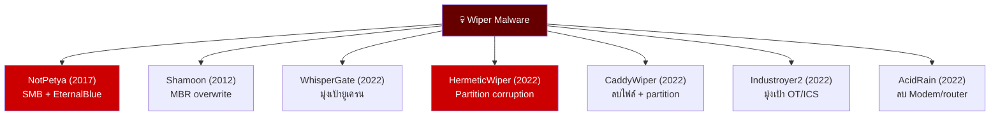
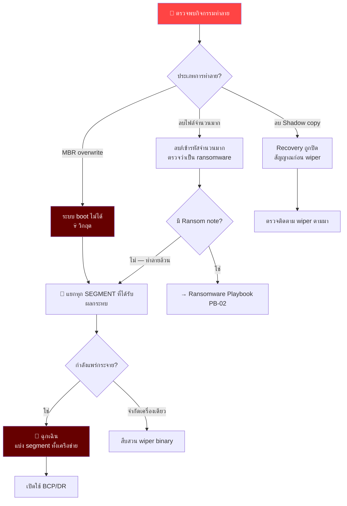
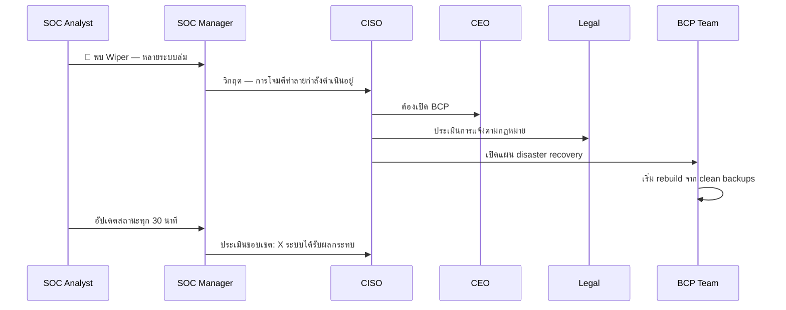
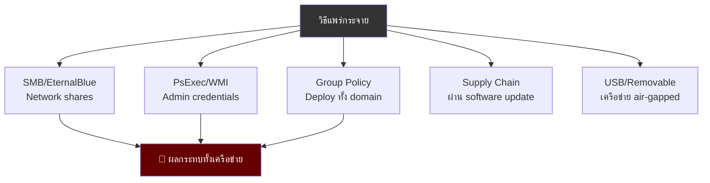
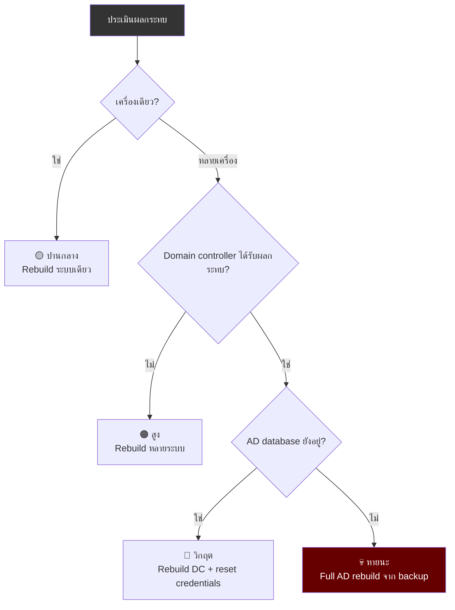

# Playbook: การตอบสนอง Wiper / การโจมตีแบบทำลาย

**ID**: PB-38
**ความรุนแรง**: วิกฤต | **ประเภท**: Impact
**MITRE ATT&CK**: [T1485](https://attack.mitre.org/techniques/T1485/) (Data Destruction), [T1561](https://attack.mitre.org/techniques/T1561/) (Disk Wipe), [T1490](https://attack.mitre.org/techniques/T1490/) (Inhibit System Recovery)
**Trigger**: EDR alert (ลบไฟล์จำนวนมาก), SIEM (MBR overwrite pattern), หลายระบบ offline พร้อมกัน

> ⚠️ **วิกฤต**: Wiper attacks เป็นการทำลายที่ย้อนกลับไม่ได้ ความเร็วคือทุกอย่าง — แยกก่อนที่ wiper จะแพร่กระจาย อย่าพยายาม remediate บนระบบที่ติด

### กลุ่ม Wiper Malware ที่รู้จัก



### Wiper Kill Chain


---

## Decision Flow



### การสื่อสารเหตุการณ์



### วิธีการแพร่กระจายของ Wiper



### Timeline การตอบสนอง

```mermaid
gantt
    title Wiper Attack Response Timeline
    dateFormat HH:mm
    axisFormat %H:%M
    section Detection
        Alert triggered        :a1, 00:00, 5min
        ยืนยันการทำลาย         :a2, after a1, 10min
    section Containment
        Network segmentation   :a3, after a2, 15min
        แยกเครื่องทั้งหมด      :a4, after a3, 30min
    section Recovery
        ตรวจสถานะ backup       :a5, after a4, 60min
        เริ่ม rebuild           :a6, after a5, 180min
        กู้คืนระบบ              :a7, after a6, 480min
    section Hardening
        Root cause analysis    :a8, after a7, 120min
```



### การประเมินผลกระทบ



---

## 1. การดำเนินการทันที (10 นาทีแรก)

| # | การดำเนินการ | ผู้รับผิดชอบ |
|:---|:---|:---|
| 1 | **แยก** network segments ที่ได้รับผลกระทบทันที | Network Team |
| 2 | ปิดเครื่องที่แสดงกิจกรรม wiper (เก็บหลักฐาน) | SOC T1 |
| 3 | Block lateral movement: ปิด SMB, PsExec, WMI | Network Team |
| 4 | ตรวจ backup integrity ก่อนเชื่อมต่อ backup systems | SOC T2 |
| 5 | แจ้ง CISO — เปิดแผน BCP/DR | SOC Manager |
| 6 | เก็บเครื่องที่ติดอย่างน้อย 1 เครื่องสำหรับ forensics | IR Team |

## 2. รายการตรวจสอบการสืบสวน

### วิเคราะห์ Malware
- [ ] เก็บ wiper binary (ถ้าระบบยังทำงาน)
- [ ] ระบุกลุ่ม wiper (hash lookup ใน VT, MalwareBazaar)
- [ ] ระบุวิธีแพร่กระจาย (SMB, PsExec, GPO, scheduled task)
- [ ] ตรวจความสามารถ self-propagation
- [ ] ระบุ kill switch หรือ C2 communication

### ประเมินขอบเขต
- [ ] กี่ระบบได้รับผลกระทบ?
- [ ] Wiper ยังแพร่กระจายอยู่หรือไม่?
- [ ] Domain controllers ถูกโจมตีหรือไม่?
- [ ] Backups เข้าถึงได้และสะอาดหรือไม่?
- [ ] ระบบ OT/ICS มีความเสี่ยงหรือไม่?

## 3. การควบคุม (Containment)

| ลำดับ | การดำเนินการ | รายละเอียด |
|:---|:---|:---|
| **P0** | Network segmentation | Block SMB (445), RDP (3389) ระหว่าง VLANs |
| **P0** | ปิด admin shares | `net share C$ /delete` ทั้งเครือข่าย |
| **P1** | ตัด backups | ให้ backup networks เป็น air-gapped |
| **P1** | ปิด scheduled tasks | ลบ GPO-deployed tasks |
| **P2** | Block C2 domains/IPs | Firewall + DNS sinkhole |

## 4. การกำจัดและกู้คืน

### ลำดับการกู้คืน
1. **Domain Controllers** — Rebuild AD จาก clean backup
2. **DNS/DHCP** — กู้คืน network services
3. **Backup infrastructure** — ตรวจและปกป้อง
4. **ระบบธุรกิจสำคัญ** — ERP, email, file servers
5. **Workstations** — Reimage จาก gold image

## 5. หลังเหตุการณ์ (Post-Incident)

### บทเรียน
| คำถาม | คำตอบ |
|:---|:---|
| Wiper ถูกตรวจจับก่อนทำงานหรือไม่? | [Timeline] |
| Backups เป็น air-gapped อย่างถูกต้องหรือไม่? | [ใช่/ไม่] |
| Network segmentation ทำได้เร็วแค่ไหน? | [เวลา] |
| แผน BCP/DR มีประสิทธิภาพหรือไม่? | [ประเมิน] |

## 6. Detection Rules (Sigma)

```yaml
title: Volume Shadow Copy Deletion (สัญญาณก่อน Wiper)
logsource:
    product: windows
    category: process_creation
detection:
    selection:
        CommandLine|contains:
            - 'vssadmin delete shadows'
            - 'wmic shadowcopy delete'
            - 'bcdedit /set.*recoveryenabled.*no'
            - 'wbadmin delete catalog'
    condition: selection
    level: critical
```

## เอกสารที่เกี่ยวข้อง
- [Ransomware Playbook](Ransomware.th.md)
- [Malware Infection Playbook](Malware_Infection.th.md)
- [Disaster Recovery & BCP](../Disaster_Recovery_BCP.th.md)
- [คู่มือ Tier 3](../Runbooks/Tier3_Runbook.th.md)

## References
- [MITRE T1485 — Data Destruction](https://attack.mitre.org/techniques/T1485/)
- [CISA — Destructive Malware](https://www.cisa.gov/news-events/cybersecurity-advisories)
- [Microsoft — Wiper Malware Analysis](https://www.microsoft.com/en-us/security/blog/)
