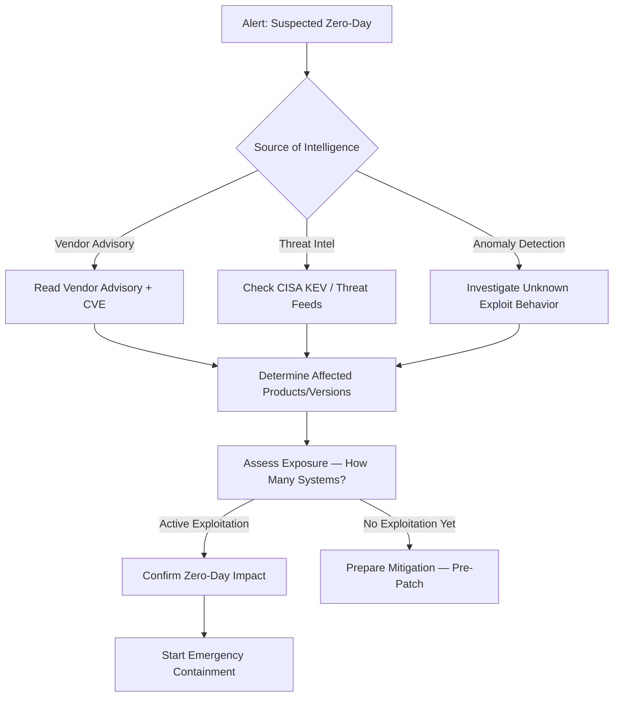

# Playbook: Zero-Day Exploit Response

**Severity**: Critical | **Category**: Vulnerability Exploitation

## 1. Analysis (Triage)

-   **Assess the Vulnerability**: Review CVE details, CVSS score, attack vector (network/local), complexity, and whether authentication is required.
-   **Determine Exposure**: Inventorize all systems, services, and applications running the affected software/version. Use asset management and vulnerability scanning tools.
-   **Check for Exploitation**: Search for IOCs associated with known exploitation — unusual process behavior, unexpected files, web shells, suspicious network connections.
-   **Monitor Advisories**: Track vendor advisories, CISA KEV (Known Exploited Vulnerabilities), and security researchers for updates.

## 2. Containment
-   **Emergency Mitigation**: Apply vendor-recommended workarounds immediately if no patch is available:
    -   Disable vulnerable features/services
    -   Restrict network access to affected systems (ACLs/firewall rules)
    -   Implement WAF rules to block known exploit payloads
-   **Isolate Compromised**: If exploitation is confirmed, network-isolate the compromised systems immediately.
-   **Virtual Patching**: Deploy IPS/WAF signatures from security vendors that detect the exploit attempt.
-   **Increase Monitoring**: Add specific detection rules and enhance logging on affected systems.

## 3. Remediation
-   **Patch Immediately**: Apply the vendor patch as soon as it is released — treat as emergency change (skip standard change window).
-   **Forensic Investigation**: For any confirmed compromise, perform full forensic analysis to determine scope, lateral movement, and data impact.
-   **Credential Rotation**: Reset credentials for any accounts on compromised systems.
-   **Backdoor Hunting**: Search all affected systems for web shells, implants, scheduled tasks, or new user accounts created by the attacker.

## 4. Recovery
-   **Staged Patching**: Patch remaining systems in priority order: internet-facing → internal critical → all others.
-   **Validate Patches**: Confirm patches are applied successfully and the vulnerability is no longer exploitable.
-   **Post-Exploitation Check**: Even after patching, verify no residual compromise exists (attacker may have already established persistence).
-   **Update SBOM**: Document the vulnerability and resolution in the software inventory.

## 5. Special Considerations
-   **Communication**: Notify CISO and executive team immediately for Critical/High CVSS zero-days.
-   **Regulatory**: If data breach is confirmed, initiate PDPA/GDPR notification process within required timeline.
-   **Industry Sharing**: Share IOCs and detection methods with ISACs and peer organizations via TLP:AMBER or TLP:GREEN.
-   **Vendor Coordination**: If you discover a new zero-day, follow Coordinated Vulnerability Disclosure (CVD) protocols.

## Related Documents
-   [Incident Response Framework](../Framework.en.md)
-   [Exploit Playbook](Exploit.en.md)
-   [Supply Chain Attack Playbook](Supply_Chain_Attack.en.md)
-   [Lateral Movement Playbook](Lateral_Movement.en.md)
-   [Incident Report Template](../../templates/incident_report.en.md)
-   [Shift Handover Log](../../templates/shift_handover.en.md)

## References
-   [MITRE ATT&CK T1190 — Exploit Public-Facing Application](https://attack.mitre.org/techniques/T1190/)
-   [MITRE ATT&CK T1203 — Exploitation for Client Execution](https://attack.mitre.org/techniques/T1203/)
-   [CISA Known Exploited Vulnerabilities Catalog (KEV)](https://www.cisa.gov/known-exploited-vulnerabilities-catalog)
-   [NIST NVD — National Vulnerability Database](https://nvd.nist.gov/)
-   [FIRST — Guidelines for Coordinated Vulnerability Disclosure](https://www.first.org/global/sigs/vulnerability-coordination/)
