# Playbook: Zero-Day Exploit Response

**ID**: PB-24
**Severity**: Critical | **Category**: Vulnerability Exploitation
**MITRE ATT&CK**: [T1190](https://attack.mitre.org/techniques/T1190/) (Exploit Public-Facing Application), [T1203](https://attack.mitre.org/techniques/T1203/) (Exploitation for Client Execution)
**Trigger**: Vendor zero-day advisory, CISA KEV addition, threat intel, anomaly detection of unknown exploit behavior

> 🚨 **ZERO-DAY = No Patch Available**. Immediate compensating controls and virtual patching are critical until vendor releases a fix.

---

## Decision Flow

```mermaid
graph TD
    Alert["🚨 Zero-Day Alert"] --> Source{"📢 Source?"}
    Source -->|Vendor Advisory| Vendor["📄 Review CVE + Advisory"]
    Source -->|CISA KEV| KEV["🏛️ In Active Exploitation"]
    Source -->|Threat Intel / News| TI["📰 Emerging Zero-Day"]
    Source -->|Internal Anomaly| Internal["🔍 Unknown Exploit Detected"]
    Vendor --> Exposure["📊 Asset Inventory — Are We Affected?"]
    KEV --> Exposure
    TI --> Exposure
    Internal --> Exposure
    Exposure -->|Yes, We Run Affected Software| Affected["🔴 Assess Exploitation"]
    Exposure -->|No| Safe["✅ Monitor — Not Affected"]
    Affected --> IOC{"🔍 IoCs Found?"}
    IOC -->|Yes — Actively Exploited| Compromised["🔴 Confirmed Compromise"]
    IOC -->|No IoCs Yet| Mitigate["🟠 Apply Emergency Mitigations"]
    Compromised --> FullIR["🔒 Full IR + Emergency Containment"]
    Mitigate --> VPatch["🛡️ Virtual Patch + Monitor"]
```

---

## 1. Analysis

### 1.1 Zero-Day Assessment Framework

| Factor | Assessment | Score |
|:---|:---|:---|
| **CVSS Score** | ___/10 | |
| **Attack Vector** | Network / Adjacent / Local / Physical | |
| **Complexity** | Low / High | |
| **Authentication Required** | None / Low / High | |
| **CISA KEV Listed** | Yes / No | |
| **Active Exploitation Confirmed** | Yes / No | |
| **Public PoC Available** | Yes / No | |
| **Patch Available** | Yes / No (Zero-Day = No) | |
| **Our Exposure** | Internet-facing / Internal / Not affected | |

### 1.2 Investigation Checklist

| Check | How | Done |
|:---|:---|:---:|
| What software/version is affected? | Advisory / CVE | ☐ |
| Inventory ALL systems running affected software | CMDB, vulnerability scanner | ☐ |
| Are any affected systems internet-facing? | Firewall rules, Shodan, ASM | ☐ |
| Search for advisory-provided IoCs | EDR, SIEM, network logs | ☐ |
| Check for web shells, new files, backdoors | EDR, file integrity monitor | ☐ |
| Check for unusual outbound connections | Proxy / firewall / netflow | ☐ |
| Review logs for exploitation attempts | WAF / IDS / application logs | ☐ |
| Are vendor workarounds available? | Advisory | ☐ |

### 1.3 Exposure Priority Matrix

| System Type | Internet-Facing | Severity | Action |
|:---|:---|:---|:---|
| **Production, Internet-facing** | Yes | 🔴 Critical | Immediate mitigation |
| **Production, Internal** | No | 🟠 High | Priority mitigation |
| **Dev/Test, Internet-facing** | Yes | 🟠 High | Take offline or mitigate |
| **Dev/Test, Internal** | No | 🟡 Medium | Schedule mitigation |

---

## 2. Containment

### 2.1 Emergency Mitigations (No Patch Available)

| # | Action | Done |
|:---:|:---|:---:|
| 1 | **Disable vulnerable feature/service** if possible | ☐ |
| 2 | **Restrict network access** to affected systems (ACLs/FW rules) | ☐ |
| 3 | **Virtual patching** — deploy IPS/WAF signatures for exploit attempt | ☐ |
| 4 | **Take offline** internet-facing instances if business allows | ☐ |
| 5 | **Increase logging** on affected systems | ☐ |

### 2.2 If Exploitation Confirmed

| # | Action | Done |
|:---:|:---|:---:|
| 1 | **Isolate** compromised systems from network | ☐ |
| 2 | **Snapshot/image** compromised systems for forensics | ☐ |
| 3 | **Block** C2 IPs/domains from advisory | ☐ |
| 4 | **Disable** compromised user accounts | ☐ |

---

## 3. Eradication

| # | Action | Done |
|:---:|:---|:---:|
| 1 | **Apply vendor patch** as soon as released (emergency change) | ☐ |
| 2 | **Perform forensics** — determine attack scope, lateral movement, data access | ☐ |
| 3 | **Reset credentials** for accounts on compromised systems | ☐ |
| 4 | **Hunt for backdoors** — web shells, implants, scheduled tasks, new users | ☐ |
| 5 | **Remove** all attacker artifacts | ☐ |
| 6 | **Verify integrity** — compare critical files to known-good baseline | ☐ |

---

## 4. Recovery

### 4.1 Patching Priority

| Priority | System Type | Timeline |
|:---|:---|:---|
| **P0** | Internet-facing, exploited | Immediately |
| **P1** | Internet-facing, not yet exploited | Within 24 hours |
| **P2** | Internal, critical | Within 48 hours |
| **P3** | Internal, non-critical | Within 7 days |

### 4.2 Post-Patch Actions

| # | Action | Done |
|:---:|:---|:---:|
| 1 | Validate patch applied successfully | ☐ |
| 2 | Verify vulnerability no longer exploitable | ☐ |
| 3 | Check for residual compromise EVEN after patching | ☐ |
| 4 | Update SBOM with patched versions | ☐ |
| 5 | Monitor for re-exploitation attempts for 30 days | ☐ |

---

## 5. Communication

| Audience | When | What |
|:---|:---|:---|
| **CISO** | Immediately for Critical CVSS | Exposure assessment, mitigation status |
| **Executive team** | If confirmed exploitation | Business impact, remediation timeline |
| **Legal / DPO** | If data breach confirmed | PDPA notification (72h) |
| **Vendor** | If you discover a new zero-day | Coordinated Vulnerability Disclosure (CVD) |
| **ISACs / Peers** | After confirming IoCs | TLP:AMBER or TLP:GREEN sharing |
| **Regulators** | If critical infrastructure affected | Per regulatory requirements |

---

## 6. IoC Collection

| Type | Value | Source |
|:---|:---|:---|
| CVE ID | | Advisory |
| Affected software/version | | Advisory |
| Exploit payload/signature | | Advisory / IDS |
| C2 domains/IPs | | Advisory / TI |
| Web shell / backdoor hashes | | EDR / Forensics |
| Attacker IP | | WAF / IDS / Logs |

---

## 7. Escalation Criteria

| Condition | Escalate To |
|:---|:---|
| Internet-facing system with active exploitation | CISO + Major Incident |
| Public PoC available + we're exposed | SOC Lead urgently |
| Data exfiltration during exploitation | Legal + DPO (PDPA 72h) |
| Multiple systems compromised | Major Incident team |
| Nation-state indicators | Law enforcement + National CERT |
| You discover a new zero-day in our systems | CISO + CVD process |

---

## Related Documents

- [IR Framework](../Framework.en.md)
- [Incident Report](../../templates/incident_report.en.md)
- [PB-18 Exploit](Exploit.en.md)
- [PB-32 Supply Chain](Supply_Chain_Attack.en.md)
- [PB-09 Lateral Movement](Lateral_Movement.en.md)

## References

- [MITRE ATT&CK T1190 — Exploit Public-Facing Application](https://attack.mitre.org/techniques/T1190/)
- [CISA Known Exploited Vulnerabilities (KEV)](https://www.cisa.gov/known-exploited-vulnerabilities-catalog)
- [NIST NVD — National Vulnerability Database](https://nvd.nist.gov/)
- [FIRST — Coordinated Vulnerability Disclosure](https://www.first.org/global/sigs/vulnerability-coordination/)
