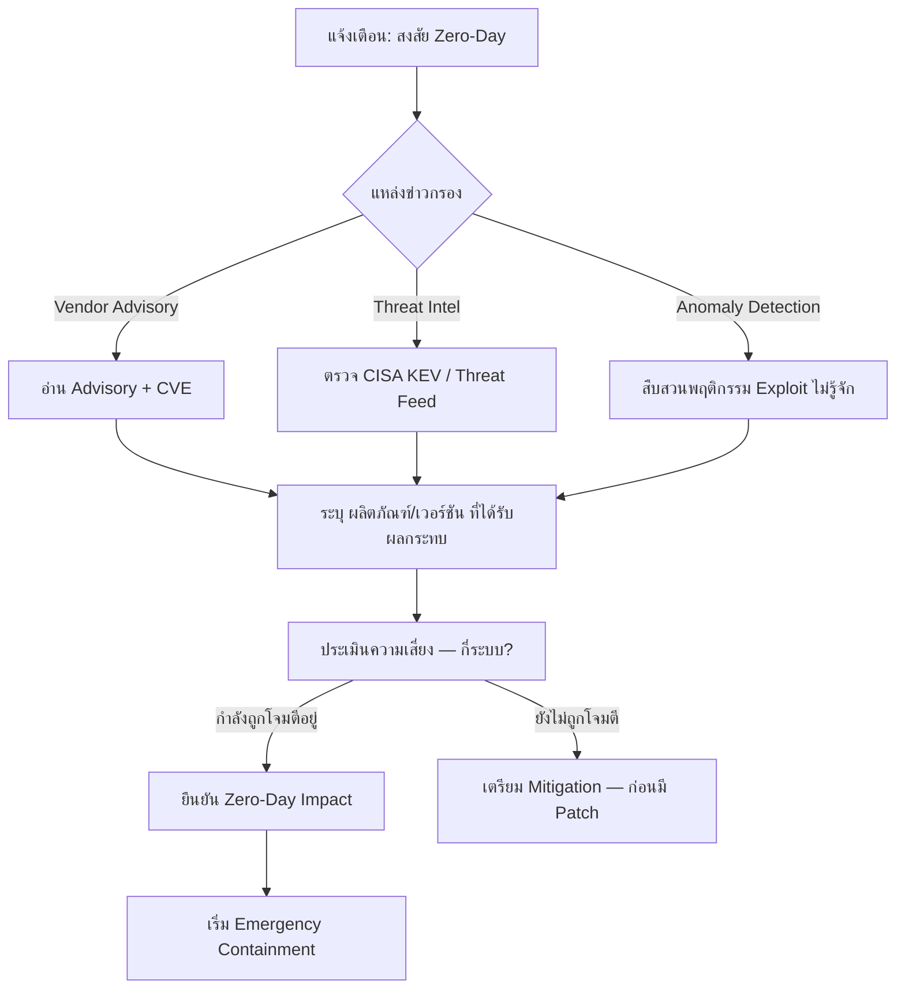

# Playbook: การตอบสนองต่อ Zero-Day Exploit (ช่องโหว่ที่ยังไม่มี Patch)

**ความรุนแรง**: วิกฤต | **หมวดหมู่**: Vulnerability Exploitation

## 1. การวิเคราะห์ (Triage)

-   **ประเมินช่องโหว่**: ดู CVE, CVSS Score, Attack Vector (เครือข่าย/โลคอล), ความซับซ้อน และต้อง Authentication หรือไม่
-   **ระบุระบบเสี่ยง**: นับทุกระบบ บริการ และแอปพลิเคชันที่รันซอฟต์แวร์/เวอร์ชันที่มีช่องโหว่ ใช้ Asset Management และ Vulnerability Scanner
-   **ตรวจการโจมตี**: ค้นหา IOC ที่เกี่ยวข้อง — Process ผิดปกติ, ไฟล์แปลก, Web Shell, Network Connection น่าสงสัย
-   **ติดตาม Advisory**: ติดตาม Vendor Advisory, CISA KEV และนักวิจัยด้านความปลอดภัยอย่างต่อเนื่อง

## 2. การจำกัดวง (Containment)
-   **Mitigation ฉุกเฉิน**: ใช้ Workaround ที่ Vendor แนะนำทันทีถ้ายังไม่มี Patch:
    -   ปิดฟีเจอร์/บริการที่มีช่องโหว่
    -   จำกัดการเข้าถึงเครือข่ายของระบบที่ได้รับผลกระทบ (ACL/Firewall Rule)
    -   ใช้ WAF Rule บล็อก Payload ที่ใช้โจมตี
-   **แยกระบบที่ถูก Compromise**: ถ้ายืนยันว่าถูกโจมตีแล้ว Network-isolate ทันที
-   **Virtual Patching**: Deploy IPS/WAF Signature จาก Security Vendor ที่ตรวจจับการโจมตี
-   **เฝ้าระวังเข้มงวด**: เพิ่ม Detection Rule เฉพาะ และเพิ่ม Logging บนระบบที่เสี่ยง

## 3. การแก้ไข (Remediation)
-   **Patch ทันที**: ติดตั้ง Patch จาก Vendor ทันทีที่ออก — ถือเป็น Emergency Change (ข้ามขั้นตอนปกติ)
-   **สืบสวน Forensic**: สำหรับระบบที่ยืนยันว่าถูก Compromise ให้ทำ Forensic Analysis เต็มรูปแบบ
-   **เปลี่ยนรหัส**: Reset Credential สำหรับทุกบัญชีบนระบบที่ถูก Compromise
-   **ล่า Backdoor**: ค้นหา Web Shell, Implant, Scheduled Task หรือ User Account ใหม่ที่ผู้โจมตีสร้างขึ้น

## 4. การกู้คืน (Recovery)
-   **Patch เป็นขั้น**: Patch ระบบที่เหลือตามลำดับความสำคัญ: Internet-facing → Internal สำคัญ → ทั้งหมด
-   **ตรวจสอบ Patch**: ยืนยันว่า Patch ติดตั้งสำเร็จและช่องโหว่ถูกแก้ไขแล้ว
-   **ตรวจหลัง Patch**: แม้ Patch แล้ว ยังต้องตรวจว่าไม่มี Compromise เหลือ (ผู้โจมตีอาจทำ Persistence ไว้แล้ว)
-   **อัปเดต SBOM**: บันทึกช่องโหว่และการแก้ไขใน Software Inventory

## 5. ข้อพิจารณาพิเศษ
-   **การสื่อสาร**: แจ้ง CISO และผู้บริหารทันทีสำหรับ Zero-Day ระดับ Critical/High CVSS
-   **กฎหมาย**: ถ้ายืนยันว่าข้อมูลรั่ว ให้เริ่มกระบวนการแจ้ง PDPA/GDPR ตามเวลาที่กำหนด
-   **แชร์กับอุตสาหกรรม**: แชร์ IOC และวิธีตรวจจับกับ ISAC และองค์กรในอุตสาหกรรมผ่าน TLP:AMBER หรือ TLP:GREEN
-   **ประสานงาน Vendor**: ถ้าค้นพบ Zero-Day ใหม่เอง ให้ทำตามขั้นตอน Coordinated Vulnerability Disclosure (CVD)

## เอกสารที่เกี่ยวข้อง (Related Documents)
-   [กรอบ Incident Response](../Framework.th.md)
-   [Playbook: Exploit](Exploit.th.md)
-   [Playbook: Supply Chain Attack](Supply_Chain_Attack.th.md)
-   [Playbook: Lateral Movement](Lateral_Movement.th.md)
-   [แบบฟอร์มรายงาน Incident](../../templates/incident_report.th.md)
-   [แบบฟอร์มส่งมอบกะ](../../templates/shift_handover.th.md)

## References
-   [MITRE ATT&CK T1190 — Exploit Public-Facing Application](https://attack.mitre.org/techniques/T1190/)
-   [MITRE ATT&CK T1203 — Exploitation for Client Execution](https://attack.mitre.org/techniques/T1203/)
-   [CISA Known Exploited Vulnerabilities Catalog (KEV)](https://www.cisa.gov/known-exploited-vulnerabilities-catalog)
-   [NIST NVD — National Vulnerability Database](https://nvd.nist.gov/)
-   [FIRST — Guidelines for Coordinated Vulnerability Disclosure](https://www.first.org/global/sigs/vulnerability-coordination/)
