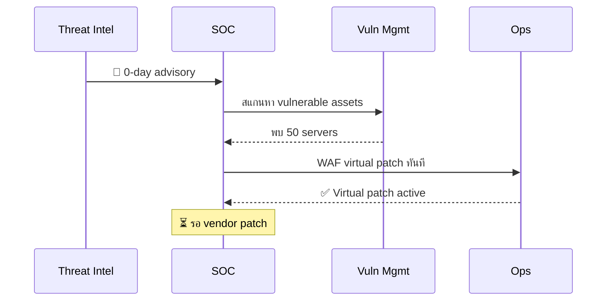
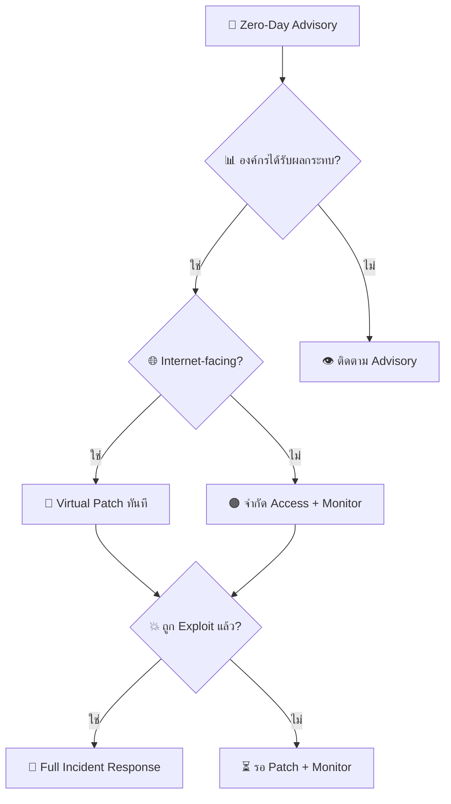
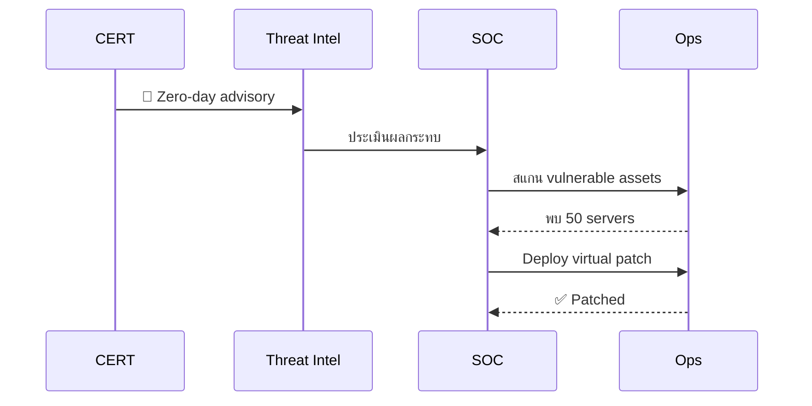
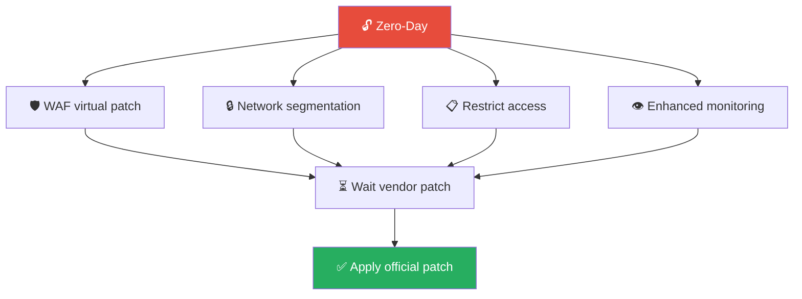

# Playbook: Zero-Day Exploit / การโจมตีช่องโหว่ Zero-Day

**ID**: PB-24
**ระดับความรุนแรง**: วิกฤต | **หมวดหมู่**: การโจมตีช่องโหว่
**MITRE ATT&CK**: [T1190](https://attack.mitre.org/techniques/T1190/) (Exploit Public-Facing App), [T1203](https://attack.mitre.org/techniques/T1203/) (Exploitation for Client Execution)
**ทริกเกอร์**: Vendor advisory (0-day), TI alert, CISA KEV, anomalous behavior without known CVE

### ผัง Zero-Day Response Timeline

### ผังขั้นตอน Vulnerability Triage

> 🚨 **ไม่มี Patch** — ต้องใช้ mitigation ทางเลือกจนกว่า vendor จะออก patch

---

## ผังการตัดสินใจ

---

## 1. การวิเคราะห์

### 1.1 การประเมินช่องโหว่

| รายการ | วิธีตรวจสอบ | เสร็จ |
|:---|:---|:---:|
| CVE ID (ถ้ามี) | Advisory / NVD | ☐ |
| ซอฟต์แวร์/เวอร์ชันที่ได้รับผลกระทบ | Advisory | ☐ |
| CVSS score + attack vector | NVD / Advisory | ☐ |
| มี PoC exploit สาธารณะ? | GitHub / ExploitDB | ☐ |
| มี active exploitation ใน wild? | Advisory / CISA KEV | ☐ |
| อยู่ใน CISA KEV catalog? | [KEV](https://www.cisa.gov/known-exploited-vulnerabilities-catalog) | ☐ |
| กี่ asset ขององค์กรได้รับผลกระทบ? | CMDB / vuln scanner | ☐ |
| Internet-facing หรือ internal only? | Network diagram | ☐ |
| มี IoC จาก advisory? | TI search | ☐ |
| ถูก exploit แล้วหรือยัง? (ตรวจ IoC) | EDR / SIEM / IDS | ☐ |

### 1.2 ลำดับความสำคัญในการ Patch

| ลำดับ | ระบบ | SLA |
|:---|:---|:---|
| 1 | Internet-facing + data สำคัญ | **ทันที** (hours) |
| 2 | Internet-facing ทั่วไป | **24 ชม.** |
| 3 | Internal + data สำคัญ | **72 ชม.** |
| 4 | Internal ทั่วไป | **7 วัน** |

---

## 2. การควบคุม (ไม่มี Patch)

| # | การดำเนินการ | เครื่องมือ | เสร็จ |
|:---:|:---|:---|:---:|
| 1 | **Virtual patch** — IPS/WAF rule | IPS / WAF | ☐ |
| 2 | **จำกัด network access** ไปยังระบบที่มีช่องโหว่ | Firewall / ACL | ☐ |
| 3 | **ปิดฟีเจอร์** ที่เป็นช่องโหว่ (ถ้าทำได้) | App config | ☐ |
| 4 | **Take offline** ถ้าเป็น internet-facing + วิกฤต | Load balancer | ☐ |
| 5 | **เพิ่ม monitoring** — specific detection rules | SIEM / EDR | ☐ |
| 6 | **Scan IoC** จาก advisory ทั้ง environment | SIEM / EDR | ☐ |

### 2.1 หากถูก Exploit แล้ว

| # | การดำเนินการ | เสร็จ |
|:---:|:---|:---:|
| 1 | **Isolate** ระบบที่ถูก exploit | ☐ |
| 2 | **Preserve evidence** (memory dump, logs) | ☐ |
| 3 | **ตรวจ lateral movement** | ☐ |
| 4 | **ตรวจ data exfiltration** | ☐ |
| 5 | ดำเนินการตาม Full IR process | ☐ |

---

## 3. เมื่อ Patch พร้อม

| # | การดำเนินการ | เสร็จ |
|:---:|:---|:---:|
| 1 | Patch ตามลำดับความสำคัญ (ดูตาราง 1.2) | ☐ |
| 2 | Vulnerability scan ยืนยันว่า patch สำเร็จ | ☐ |
| 3 | ลบ virtual patch / workaround (ถ้า patch ครอบคลุม) | ☐ |
| 4 | ตรวจว่าถูก exploit ระหว่าง exposure window | ☐ |

---

## 4. การฟื้นฟู

| # | การดำเนินการ | เสร็จ |
|:---:|:---|:---:|
| 1 | **Patch ทั้งหมด** ยืนยันด้วย vulnerability scan | ☐ |
| 2 | ตรวจ post-exploitation activity ระหว่าง window | ☐ |
| 3 | อัปเดต vulnerability management SLA | ☐ |
| 4 | เพิ่ม IPS rules สำหรับ exploit pattern (defense in depth) | ☐ |
| 5 | ทบทวน asset inventory + patching automation | ☐ |

---

## 5. เกณฑ์การยกระดับ

| เงื่อนไข | ยกระดับไปยัง |
|:---|:---|
| Active exploitation ยืนยัน | CISO + Major Incident |
| Critical infrastructure ได้รับผลกระทบ | Regulator |
| ข้อมูลถูกเข้าถึง | Legal + DPO (PDPA 72 ชม.) |
| ไม่สามารถ mitigate ได้ | Executive decision (risk acceptance) |
| Nation-state indicators | CISO + National CERT |

---

### ผัง Threat Intel Coordination

### ผัง Compensating Controls

## เอกสารที่เกี่ยวข้อง

- [กรอบการตอบสนองต่อเหตุการณ์](../Framework.th.md)
- [PB-18 การใช้ช่องโหว่](Exploit.th.md)

## อ้างอิง

- [CISA Known Exploited Vulnerabilities](https://www.cisa.gov/known-exploited-vulnerabilities-catalog)
- [NIST NVD](https://nvd.nist.gov/)
