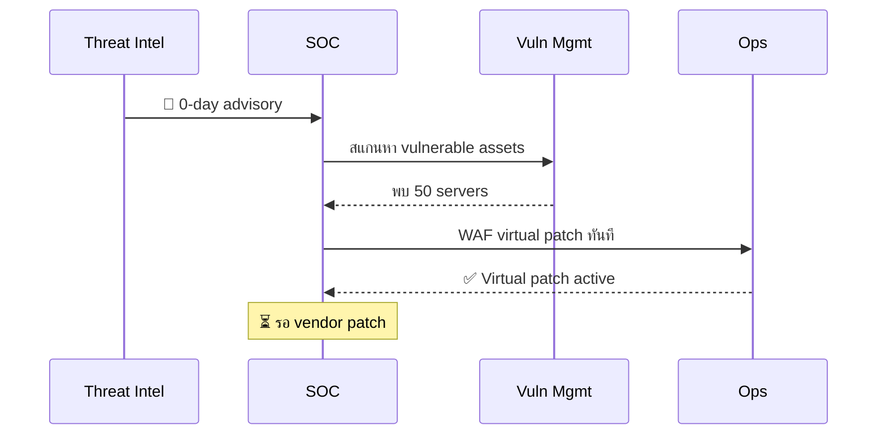
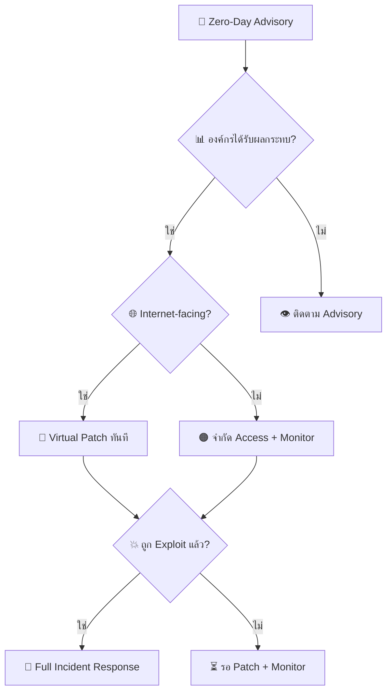
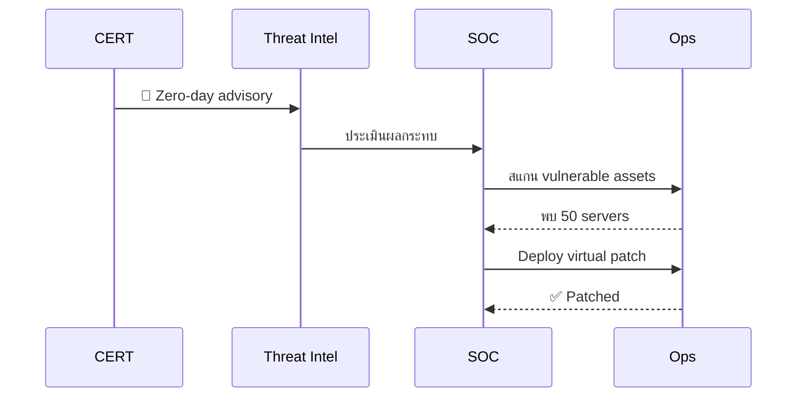
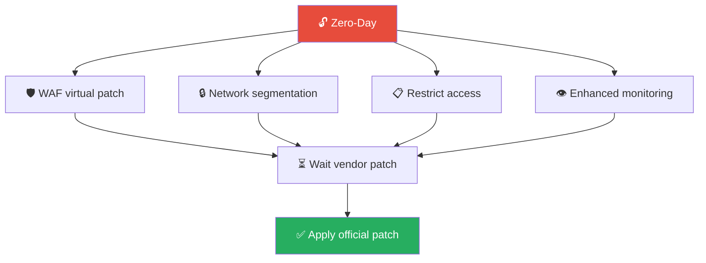

# Playbook: Zero-Day Exploit / การโจมตีช่องโหว่ Zero-Day

**ID**: PB-24
**ระดับความรุนแรง**: วิกฤต | **หมวดหมู่**: การโจมตีช่องโหว่
**MITRE ATT&CK**: [T1190](https://attack.mitre.org/techniques/T1190/) (Exploit Public-Facing App), [T1203](https://attack.mitre.org/techniques/T1203/) (Exploitation for Client Execution)
**ทริกเกอร์**: Vendor advisory (0-day), TI alert, CISA KEV, anomalous behavior without known CVE


## หลังเหตุการณ์ (Post-Incident)

- [ ] ติดตาม vendor patch/advisory อย่างใกล้ชิด
- [ ] ใช้ compensating controls จนกว่าจะมี patch
- [ ] แชร์ indicators กับ ISAC/CERT community
- [ ] ทบทวน threat intel coordination process
- [ ] ตรวจสอบ environment หา exploitation indicators
- [ ] จัดทำ [Incident Report](../../11_Reporting_Templates/incident_report.th.md)

### ผัง Zero-Day Response Timeline


```mermaid
graph LR
    Disc["🔍 ค้นพบ 0-day"] --> Assess["⚖️ ผลกระทบ?"]
    Assess --> Mitigate["🛡️ Virtual Patch"]
    Mitigate --> Monitor["👁️ Monitor"]
    Monitor --> Patch["🩹 Vendor Patch"]
    Patch --> Apply["✅ Deploy"]
    style Disc fill:#e74c3c,color:#fff
    style Mitigate fill:#f39c12,color:#fff
    style Apply fill:#27ae60,color:#fff
```

### ผังขั้นตอน Vulnerability Triage


```mermaid
sequenceDiagram
    participant TI as Threat Intel
    participant SOC
    participant VM as Vuln Mgmt
    participant Ops
    TI->>SOC: 🚨 0-day advisory
    SOC->>VM: สแกนหา vulnerable assets
    VM-->>SOC: พบ 50 servers
    SOC->>Ops: WAF virtual patch ทันที
    Ops-->>SOC: ✅ Virtual patch active
    Note over SOC: ⏳ รอ vendor patch
```

> 🚨 **ไม่มี Patch** — ต้องใช้ mitigation ทางเลือกจนกว่า vendor จะออก patch

---

## ผังการตัดสินใจ


```mermaid
graph TD
    Alert["🚨 Zero-Day Advisory"] --> Assess{"📊 องค์กรได้รับผลกระทบ?"}
    Assess -->|ใช่| Exposure{"🌐 Internet-facing?"}
    Assess -->|ไม่| Monitor["👁️ ติดตาม Advisory"]
    Exposure -->|ใช่| Urgent["🔴 Virtual Patch ทันที"]
    Exposure -->|ไม่| Internal["🟠 จำกัด Access + Monitor"]
    Urgent --> Exploited{"💥 ถูก Exploit แล้ว?"}
    Internal --> Exploited
    Exploited -->|ใช่| IR["🔴 Full Incident Response"]
    Exploited -->|ไม่| Wait["⏳ รอ Patch + Monitor"]
```

---

## 1. การวิเคราะห์

### 1.1 การประเมินช่องโหว่

| รายการ | วิธีตรวจสอบ | เสร็จ |
|:---|:---|:---:|
| CVE ID (ถ้ามี) | Advisory / NVD | ☐ |
| ซอฟต์แวร์/เวอร์ชันที่ได้รับผลกระทบ | Advisory | ☐ |
| CVSS score + attack vector | NVD / Advisory | ☐ |
| มี PoC exploit สาธารณะ? | GitHub / ExploitDB | ☐ |
| มี active exploitation ใน wild? | Advisory / CISA KEV | ☐ |
| อยู่ใน CISA KEV catalog? | [KEV](https://www.cisa.gov/known-exploited-vulnerabilities-catalog) | ☐ |
| กี่ asset ขององค์กรได้รับผลกระทบ? | CMDB / vuln scanner | ☐ |
| Internet-facing หรือ internal only? | Network diagram | ☐ |
| มี IoC จาก advisory? | TI search | ☐ |
| ถูก exploit แล้วหรือยัง? (ตรวจ IoC) | EDR / SIEM / IDS | ☐ |

### 1.2 ลำดับความสำคัญในการ Patch

| ลำดับ | ระบบ | SLA |
|:---|:---|:---|
| 1 | Internet-facing + data สำคัญ | **ทันที** (hours) |
| 2 | Internet-facing ทั่วไป | **24 ชม.** |
| 3 | Internal + data สำคัญ | **72 ชม.** |
| 4 | Internal ทั่วไป | **7 วัน** |

---

## 2. การควบคุม (ไม่มี Patch)

| # | การดำเนินการ | เครื่องมือ | เสร็จ |
|:---:|:---|:---|:---:|
| 1 | **Virtual patch** — IPS/WAF rule | IPS / WAF | ☐ |
| 2 | **จำกัด network access** ไปยังระบบที่มีช่องโหว่ | Firewall / ACL | ☐ |
| 3 | **ปิดฟีเจอร์** ที่เป็นช่องโหว่ (ถ้าทำได้) | App config | ☐ |
| 4 | **Take offline** ถ้าเป็น internet-facing + วิกฤต | Load balancer | ☐ |
| 5 | **เพิ่ม monitoring** — specific detection rules | SIEM / EDR | ☐ |
| 6 | **Scan IoC** จาก advisory ทั้ง environment | SIEM / EDR | ☐ |

### 2.1 หากถูก Exploit แล้ว

| # | การดำเนินการ | เสร็จ |
|:---:|:---|:---:|
| 1 | **Isolate** ระบบที่ถูก exploit | ☐ |
| 2 | **Preserve evidence** (memory dump, logs) | ☐ |
| 3 | **ตรวจ lateral movement** | ☐ |
| 4 | **ตรวจ data exfiltration** | ☐ |
| 5 | ดำเนินการตาม Full IR process | ☐ |

---

## 3. เมื่อ Patch พร้อม

| # | การดำเนินการ | เสร็จ |
|:---:|:---|:---:|
| 1 | Patch ตามลำดับความสำคัญ (ดูตาราง 1.2) | ☐ |
| 2 | Vulnerability scan ยืนยันว่า patch สำเร็จ | ☐ |
| 3 | ลบ virtual patch / workaround (ถ้า patch ครอบคลุม) | ☐ |
| 4 | ตรวจว่าถูก exploit ระหว่าง exposure window | ☐ |

---

## 4. การฟื้นฟู

| # | การดำเนินการ | เสร็จ |
|:---:|:---|:---:|
| 1 | **Patch ทั้งหมด** ยืนยันด้วย vulnerability scan | ☐ |
| 2 | ตรวจ post-exploitation activity ระหว่าง window | ☐ |
| 3 | อัปเดต vulnerability management SLA | ☐ |
| 4 | เพิ่ม IPS rules สำหรับ exploit pattern (defense in depth) | ☐ |
| 5 | ทบทวน asset inventory + patching automation | ☐ |

---

## 5. เกณฑ์การยกระดับ

| เงื่อนไข | ยกระดับไปยัง |
|:---|:---|
| Active exploitation ยืนยัน | CISO + Major Incident |
| Critical infrastructure ได้รับผลกระทบ | Regulator |
| ข้อมูลถูกเข้าถึง | Legal + DPO (PDPA 72 ชม.) |
| ไม่สามารถ mitigate ได้ | Executive decision (risk acceptance) |
| Nation-state indicators | CISO + National CERT |

---

### ผัง Threat Intel Coordination


```mermaid
sequenceDiagram
    participant CERT
    participant TI as Threat Intel
    participant SOC
    participant Ops
    CERT->>TI: 🚨 Zero-day advisory
    TI->>SOC: ประเมินผลกระทบ
    SOC->>Ops: สแกน vulnerable assets
    Ops-->>SOC: พบ 50 servers
    SOC->>Ops: Deploy virtual patch
    Ops-->>SOC: ✅ Patched
```

### ผัง Compensating Controls


```mermaid
graph TD
    ZeroDay["🔓 Zero-Day"] --> WAF["🛡️ WAF virtual patch"]
    ZeroDay --> Segment["🔒 Network segmentation"]
    ZeroDay --> ACL["📋 Restrict access"]
    ZeroDay --> Monitor["👁️ Enhanced monitoring"]
    WAF --> Wait["⏳ Wait vendor patch"]
    Segment --> Wait
    ACL --> Wait
    Monitor --> Wait
    Wait --> Apply["✅ Apply official patch"]
    style ZeroDay fill:#e74c3c,color:#fff
    style Apply fill:#27ae60,color:#fff
```

## กฎตรวจจับ (Sigma)

| กฎ | ไฟล์ |
|:---|:---|
| Zero-Day Exploit Attempt | [web_zero_day_exploit_attempt.yml](../../08_Detection_Engineering/sigma_rules/web_zero_day_exploit_attempt.yml) |
| WAF Detected Exploit Attempt | [web_waf_exploit.yml](../../08_Detection_Engineering/sigma_rules/web_waf_exploit.yml) |

## เอกสารที่เกี่ยวข้อง

- [กรอบการตอบสนองต่อเหตุการณ์](../Framework.th.md)
- [PB-18 การใช้ช่องโหว่](Exploit.th.md)

## Indicators of Zero-Day Exploitation

| Indicator | Detection Method | Priority |
|:---|:---|:---|
| Unknown process behavior | EDR behavioral analysis | Critical |
| Unusual network callbacks | Network flow analysis | Critical |
| Memory corruption signs | Memory forensics | High |
| Privilege escalation chain | SIEM correlation | Critical |
| Vendor-unknown signatures | Sandbox detonation | High |

### Vendor Coordination Workflow

| Step | Action | Timeline | Owner |
|:---|:---|:---|:---|
| 1 | Document exploit details | Immediately | IR Team |
| 2 | Contact vendor PSIRT | < 4 hrs | SOC Manager |
| 3 | Apply compensating controls | < 8 hrs | IT Security |
| 4 | Monitor for variants | Ongoing | SOC |
| 5 | Deploy vendor patch | Per vendor SLA | IT Ops |
| 6 | Validate fix + close | Post-patch | IR Team |

### Temporary Mitigation Options

```
Priority Mitigations:
1. Network segmentation     ████████████  Highest impact
2. Application whitelisting ████████████  High impact
3. WAF/IPS signature        ██████████    Medium-high
4. Disable vulnerable feature ████████    Medium
5. Enhanced monitoring      ██████        Baseline
```

### Patch Management Priority

| Status | Action | Timeline |
|:---|:---|:---|
| Vendor patch available | Test + deploy | 24 hrs |
| No patch yet | Compensating controls | Immediate |
| EOL software | Replace | Plan within 30d |

### Threat Intelligence Sharing

| Platform | Share What | When |
|:---|:---|:---|
| Industry ISAC | IOCs + TTPs | Post-containment |
| CERT/CSIRT | Exploit details | After vendor notified |
| MISP | Structured IOCs | Ongoing |
| Internal TI | Full analysis | Immediate |

## References

- [CISA Known Exploited Vulnerabilities](https://www.cisa.gov/known-exploited-vulnerabilities-catalog)
- [NIST NVD](https://nvd.nist.gov/)
