```mermaid
graph LR
    Start["🕗 Shift Start"] --> Handoff["📋 Read Handoff"]
    Handoff --> Dashboard["📊 Check Dashboards"]
    Dashboard --> Queue["📥 Alert Queue"]
    Queue --> Triage["⚡ Triage"]
    Triage --> Investigate["🔍 Investigate"]
    Investigate --> Decision{TP or FP?}
    Decision -->|TP| Escalate["🚨 Escalate to T2"]
    Decision -->|FP| Close["✅ Close + Document"]
    Escalate --> Queue
    Close --> Queue
    Queue --> EOD["🕓 Shift End → Handoff"]
```

# SOC Tier 1 Analyst Runbook

> **Document ID:** RB-T1-001  
> **Version:** 2.0  
> **Last Updated:** 2026-02-16  
> **Owner:** SOC Manager  
> **Audience:** Tier 1 / Junior SOC Analysts

---

## 🆕 Your First Day — Setup Checklist

Before you process your first alert, make sure you have:

```
□ SIEM access (read + search) — Splunk / Elastic / Sentinel
□ EDR console access (read-only minimum)
□ Ticketing system account (create + update tickets)
□ SOC chat channel joined (Slack/Teams #soc-alerts, #soc-general)
□ VPN + jump box access configured
□ Bookmarks saved:
    - VirusTotal, AbuseIPDB, URLhaus, Shodan
    - Internal wiki / FP runbook
    - This runbook (keep it open!)
□ Shift calendar reviewed — know your hours and rotation
□ Emergency contacts saved (T2 Lead, IR Lead, SOC Manager)
□ Read: IR Framework, Severity Matrix, Escalation Matrix
□ Shadow a senior analyst for at least 1 full shift
```

---

## Your Daily Workflow

```
08:00  Shift start → Read handoff notes → Check dashboards
08:15  Review overnight alerts queue → Triage by severity
08:30  Begin alert processing (target: 12–15 alerts/hour)
       ↓ Continuous cycle ↓
       Triage → Investigate → Escalate or Close
12:00  Midday review with T2 lead
16:00  Prepare shift handoff notes
16:30  Handoff to next shift
```



---

## Alert Triage — The First 5 Minutes

### Step 1: Read the Alert
| Check | What to Look For |
|:---|:---|
| **Source** | Which tool generated this? (EDR, SIEM, IDS, email gateway) |
| **Severity** | How did the tool classify it? (Critical/High/Medium/Low) |
| **Asset** | What system is affected? (server, workstation, cloud resource) |
| **User** | Who is associated? (employee, service account, admin) |
| **Timestamp** | When did it happen? (business hours? weekend?) |

### Step 2: Quick Context Check (2 min)
```
□ Is this a known false positive? → Check FP runbook
□ Is this asset in maintenance? → Check change calendar
□ Has this user/host triggered similar alerts recently? → Check SIEM history (7 days)
□ Is this a repeat of an existing incident? → Check open tickets
```

### Step 3: Decide

```mermaid
graph TD
    Alert["🚨 New Alert"] --> Read["Read Alert Details"]
    Read --> Known{"Known FP pattern?"}
    Known -->|Yes| CloseFP["❌ Close as FP + Document"]
    Known -->|No/Unsure| Enrich["Enrich IOCs"]
    Enrich --> IOCMatch{"IOC matches TI feed?"}
    IOCMatch -->|Yes| TP["✅ True Positive → Escalate T2"]
    IOCMatch -->|No| Context{"Unusual context?"}
    Context -->|"Off-hours / VIP / Lateral"| TP
    Context -->|Normal behavior| FP["❌ False Positive → Close + Tune"]
    Alert --> Severity{"Is this P1/Critical?"}
    Severity -->|Yes| Immediate["🔴 ESCALATE IMMEDIATELY"]
```



| Decision | Action | Time Limit |
|:---|:---|:---:|
| ✅ **True Positive** | Create incident ticket → Escalate to T2 | 15 min |
| ⚠️ **Needs More Investigation** | Enrich IOCs → Pivot search → Then decide | 30 min |
| ❌ **False Positive** | Document reason → Close → Update tuning list | 5 min |
| 🔴 **Critical / P1** | **Escalate IMMEDIATELY** to T2/IR Lead | 0 min |

---

## Escalation Triggers — ALWAYS Escalate These

🚨 **Immediately escalate to T2/IR Lead if you see ANY of these:**

- Ransomware indicators (file encryption, shadow copy deletion)
- Active data exfiltration (large uploads to external IPs)
- Executive/VIP account compromise
- Multiple hosts showing same malicious behavior
- Production server compromise
- Confirmed malware execution
- Any OT/ICS alerts
- Active C2 beaconing detected
- Credential dumping tools (Mimikatz, secretsdump)
- You don't understand the alert after 30 minutes

### Escalation Flow

```mermaid
graph TD
    T1["👤 Tier 1 Analyst"] -->|"P3/P4 Alert"| Self["Handle + Close"]
    T1 -->|"P2 Alert or unsure after 30min"| T2["👥 Tier 2 Analyst"]
    T1 -->|"P1 Critical"| IRLead["🚨 IR Lead"]
    T2 -->|"Confirmed incident"| IRLead
    T2 -->|"Advanced threat / APT"| T3["🔬 Tier 3 / Threat Hunter"]
    IRLead -->|"Data breach confirmed"| Legal["⚖️ Legal + PDPA"]
    IRLead -->|"Insider threat"| HR["👔 HR"]
    IRLead -->|"Infra impact"| IT["🖥️ IT Ops"]
    IRLead -->|"Business impact"| CISO["🛡️ CISO / Management"]

    style T1 fill:#4CAF50,color:#fff
    style T2 fill:#FF9800,color:#fff
    style IRLead fill:#f44336,color:#fff
    style T3 fill:#9C27B0,color:#fff
```



---

## Common Alert Types & Quick Actions

### 🎣 Phishing Email Alert → PB-01
```
1. DO NOT click any links/attachments in the email
2. Check email headers → Is sender spoofed? (SPF/DKIM fail?)
3. Check URL reputation → VirusTotal, URLhaus
4. Check if other users received the same email → SIEM search
5. If malicious → Block sender + URL → Escalate to T2
```

### 🔐 Failed Login Alert (Brute Force) → PB-04
```
1. Check source IP → Internal or external?
2. Count failed attempts → How many? Over what period?
3. Check if any login succeeded after failures
4. If external + >10 attempts → Block IP at firewall
5. If succeeded after failures → Escalate to T2 (possible compromise)
```

### 🦠 Malware/EDR Alert → PB-03
```
1. Check detection name → What type of malware?
2. Was it blocked or did it execute?
3. Check process tree → What launched it?
4. If EXECUTED → Escalate to T2 immediately
5. If BLOCKED → Verify quarantine → Check for other instances
```

### 🌐 Web Attack / WAF Alert → PB-10
```
1. Check attack type → SQLi, XSS, RCE?
2. Check response code → 200 (possible success) vs 403/WAF blocked
3. Check source IP → Known scanner or targeted?
4. If response=200 + payload looks successful → Escalate to T2
5. If blocked → Log and monitor for persistence
```

### ☁️ Cloud Alert (AWS/Azure) → PB-16
```
1. What action triggered the alert?
2. Which IAM user/role?
3. From what IP/region?
4. Is this a known admin action?
5. If unusual region + privileged action → Escalate to T2
```

### 💀 Ransomware Indicators → PB-02
```
1. Are files being encrypted? Check file extension changes
2. Shadow copy deletion? (vssadmin delete shadows)
3. Ransom note present?
4. ESCALATE IMMEDIATELY — DO NOT wait
5. Isolate affected host if you have EDR capability
```

### 🔀 Lateral Movement → PB-12
```
1. Is a compromised host connecting to other internal hosts?
2. Check for PsExec, WMI, RDP from unusual sources
3. Are service accounts being used interactively?
4. Multiple hosts + same IOC = Escalate NOW
5. Document all affected hosts for T2
```

### 📤 Data Exfiltration → PB-08
```
1. Large outbound data transfer detected — how much? To where?
2. Is the destination IP known (cloud backup) or unknown?
3. Is this during business hours by a legitimate user?
4. Check DLP alerts for data classification
5. If sensitive data + external dest → Escalate immediately
```

### 👤 Insider Threat Indicators → PB-14
```
1. Unusual access patterns — off-hours, high volume
2. Accessing data outside job scope?
3. USB/external storage usage?
4. DO NOT alert the suspected user
5. Escalate to T2 + notify SOC Manager (HR may need to be involved)
```

### 🌊 DDoS Alert → PB-09
```
1. Is the service actually degraded? Check uptime monitoring
2. Traffic volume — how much above baseline?
3. Source — single IP or distributed?
4. Notify NOC/Network team immediately
5. Escalate to T2 for coordination
```

---

## False Positive Cheat Sheet

Common FP patterns — learn to recognize these quickly:

| Alert Type | Common FP Pattern | How to Confirm |
|:---|:---|:---|
| Brute force | Helpdesk users resetting passwords | Check if same user + helpdesk IP |
| Malware | AV flagging legitimate admin tools | Check if tool is in approved list |
| C2 beaconing | Regular heartbeat to SaaS/CDN | Check domain: Akamai, Cloudflare, AWS |
| Data exfil | Backup jobs, cloud sync | Check scheduled task + destination |
| Impossible travel | VPN split-tunnel + cloud login | Check if VPN IP matches user's VPN session |
| Web attack | Security scanners (Qualys, Nessus) | Check source IP against scanner list |
| Privilege escalation | Scheduled admin maintenance | Check change management calendar |
| Failed logins | Service account password rotation | Check if matches rotation schedule |

### FP Documentation Template
```
FP Reason: [why this is a false positive]
Pattern: [describe the recurring pattern]
Recommendation: □ Tune alert  □ Add exclusion  □ Accept risk
Approved by: [T2 analyst name]
```

---

## SIEM Query Templates

### Splunk

```spl
# Find all alerts for a specific host (last 24h)
index=alerts host="HOSTNAME" earliest=-24h | stats count by alert_name, severity

# Failed logins from a specific IP
index=auth action=failure src_ip="X.X.X.X" earliest=-7d
| stats count by user, dest, _time | sort -count

# Outbound traffic volume by destination
index=network direction=outbound src_ip="INTERNAL_IP" earliest=-24h
| stats sum(bytes_out) as total_bytes by dest_ip
| sort -total_bytes | head 20

# Process execution on endpoint
index=edr host="HOSTNAME" earliest=-48h
| stats count by process_name, parent_process, user | sort -count

# Email search — did others get the same phishing?
index=email subject="*SUSPICIOUS SUBJECT*" earliest=-7d
| stats count by recipient, src_sender, action
```

### Elastic (KQL)

```
# Alerts for a host
event.kind: "alert" AND host.name: "HOSTNAME"

# Failed logins
event.outcome: "failure" AND event.category: "authentication"
  AND source.ip: "X.X.X.X"

# Large outbound transfers
network.direction: "outbound" AND source.bytes > 100000000

# Process execution
event.category: "process" AND host.name: "HOSTNAME"
  AND process.name: ("powershell.exe" OR "cmd.exe" OR "wscript.exe")
```

---

## IOC Enrichment — Quick Reference

| IOC Type | Where to Check | Free Tools |
|:---|:---|:---|
| IP Address | Reputation, Geolocation, ASN | VirusTotal, AbuseIPDB, Shodan |
| Domain | WHOIS, DNS, Reputation | VirusTotal, URLhaus, DomainTools |
| File Hash | Malware database | VirusTotal, MalwareBazaar, Hybrid Analysis |
| URL | Reputation, Redirect chain | VirusTotal, URLScan.io, URLhaus |
| Email Address | Breach databases, reputation | Have I Been Pwned, EmailRep |

### VirusTotal Quick Check
```
IP:   https://www.virustotal.com/gui/ip-address/{IP}
Hash: https://www.virustotal.com/gui/file/{HASH}
URL:  https://www.virustotal.com/gui/url/{URL}
```

### Command-Line IOC Checks
```bash
# VirusTotal IP lookup
curl -s "https://www.virustotal.com/api/v3/ip_addresses/{IP}" \
  -H "x-apikey: $VT_API_KEY" | jq '.data.attributes.last_analysis_stats'

# AbuseIPDB check
curl -s "https://api.abuseipdb.com/api/v2/check?ipAddress={IP}" \
  -H "Key: $ABUSEIPDB_KEY" | jq '.data.abuseConfidenceScore'

# Quick WHOIS
whois {DOMAIN} | grep -E "Registrar|Creation|Name Server"
```

---

## Log Source Quick Reference

Which log answers which question?

| Question | Log Source | Where |
|:---|:---|:---|
| Who logged in? When? | Authentication logs | AD/Azure AD/Okta |
| What process ran? | EDR telemetry | CrowdStrike/Defender/SentinelOne |
| What website was visited? | Proxy/DNS logs | Web proxy, DNS server |
| What file was downloaded? | Proxy + EDR | Web proxy + endpoint |
| Was data sent out? | Firewall/DLP | Firewall, DLP gateway |
| What email was received? | Email gateway | Exchange/O365/Proofpoint |
| What changed on the server? | Windows Event Log | Event ID 4688, 4624, 4625 |
| What API call was made? | Cloud audit log | CloudTrail/Azure Activity/GCP Audit |
| What rule was triggered? | IDS/IPS | Suricata/Snort/Palo Alto |
| Was a vulnerability exploited? | WAF + App logs | WAF, application server |

### Key Windows Event IDs
| Event ID | Meaning |
|:---|:---|
| 4624 | Successful logon |
| 4625 | Failed logon |
| 4648 | Logon with explicit credentials |
| 4688 | New process created |
| 4720 | User account created |
| 4732 | User added to security group |
| 7045 | New service installed |
| 1102 | Audit log cleared ⚠️ |

---

## Ticket Documentation Template

Every alert you process should be documented:

```
## Alert Summary
- Alert ID: [from SIEM]
- Timestamp: [when alert fired]
- Source Tool: [EDR/SIEM/IDS/other]
- Affected Asset: [hostname/IP]
- Affected User: [username]
- Alert Type: [phishing/malware/brute-force/etc]

## Investigation Steps
1. [What you checked first]
2. [What you found]
3. [Additional context gathered]

## IOC Summary
- IP: x.x.x.x (VT score: X/90)
- Hash: abc123... (VT score: X/70)
- Domain: evil.com (registered: yesterday)

## Decision
- [x] True Positive → Escalated to T2 (ticket #XXX)
- [ ] False Positive → Closed (reason: known scanner)
- [ ] Needs Further Investigation

## Actions Taken
- Blocked IP at firewall
- Quarantined file on endpoint
- Notified user
```

---

## SLA by Severity

| Severity | Response Time | Triage Time | Escalation Deadline |
|:---|:---:|:---:|:---:|
| 🔴 Critical (P1) | ≤ 5 min | ≤ 15 min | Immediate |
| 🟠 High (P2) | ≤ 10 min | ≤ 30 min | ≤ 1 hour |
| 🟡 Medium (P3) | ≤ 30 min | ≤ 60 min | ≤ 4 hours |
| 🟢 Low (P4) | ≤ 60 min | ≤ 4 hours | Next shift |

### Alert Source → Severity Mapping

| Alert Source | Default Severity | Initial Action |
|:---|:---|:---|
| EDR — Malware executed | 🔴 Critical | Isolate + Escalate |
| EDR — Malware blocked | 🟡 Medium | Verify quarantine |
| SIEM — Failed logins (>10) | 🟡 Medium | Verify user + Lock |
| DLP — Sensitive data exfil | 🔴 Critical | Block + Escalate |
| Firewall — Port scan | 🟢 Low | Monitor + Log |
| IDS — Exploit attempt | 🟠 High | Block IP + Investigate |
| Email — Phishing detected | 🟡 Medium | Check scope + Block |
| Cloud — Root/admin action | 🟠 High | Verify identity + action |

---

## Performance Metrics — Know Your Targets

| Metric | Target | How to Improve |
|:---|:---:|:---|
| Alerts processed/hour | 12–15 | Use keyboard shortcuts, bookmark tools |
| Mean Time to Triage (MTTT) | ≤ 10 min | Follow the 5-minute checklist above |
| False Positive Rate | < 30% | Study the FP cheat sheet |
| Escalation Accuracy | > 90% | When in doubt, escalate |
| Ticket Documentation | 100% | Use the template — every time |
| SLA Compliance | > 95% | Check severity → set timer |
| Shift Handoff Completion | 100% | Use the handoff template |

---

## Shift Handoff Checklist

Before ending your shift:

```
□ All alerts triaged (none pending >30 min)
□ Open incidents updated with latest status
□ Escalated items confirmed received by T2
□ Handoff notes written in shared document:
  - Number of alerts processed
  - Any ongoing incidents
  - Anything unusual or concerning
  - Any systems in degraded state
□ Dashboard screenshots saved if anomalies noted
```

### Handoff Notes Template
```
=== Shift Handoff: [DATE] [SHIFT] ===
Analyst: [YOUR NAME]

✅ Closed: [N] alerts
⏳ Open:   [N] tickets still in progress
🔴 Active Incidents: [list or "none"]

📝 Key Notes:
  - [anything the next shift needs to know]
  - [any degraded systems or ongoing scans]

⚠️ Watch For:
  - [any alerts expected to recur]
  - [any pending escalation responses]
```

---

## Do's and Don'ts

| ✅ Do | ❌ Don't |
|:---|:---|
| Ask for help if unsure | Sit on an alert for >30 min without acting |
| Document everything | Close alerts without investigation notes |
| Escalate early if P1 | Try to handle P1 incidents alone |
| Check for related alerts | Look at alerts in isolation |
| Use the playbooks | Rely only on memory |
| Communicate status updates | Go silent during incidents |
| Time-box your investigation | Spend 2 hours on a Low-severity alert |
| Validate IOCs in multiple sources | Trust a single VT score blindly |
| Flag recurring FPs for tuning | Keep closing the same FP every day |

---

## Key Contacts

| Role | When to Contact |
|:---|:---|
| T2 Analyst | Any alert you can't resolve in 30 min |
| IR Lead | Confirmed P1/P2 incidents |
| SOC Manager | Operational issues, tool outages |
| IT Ops | Server/network issues during investigation |
| HR | Insider threat cases |
| Legal | Data breach confirmed, PDPA notification |

---

## Related Documents

- [IR Framework](Framework.en.md)
- [Severity Matrix](Severity_Matrix.en.md)
- [Escalation Matrix](Escalation_Matrix.en.md)
- [Shift Handoff](../06_Operations_Management/Shift_Handoff.en.md)
- [All Playbooks (PB-01 to PB-50)](Playbooks/)
