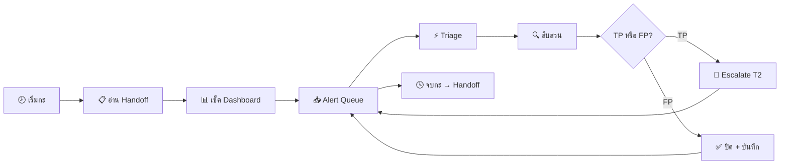
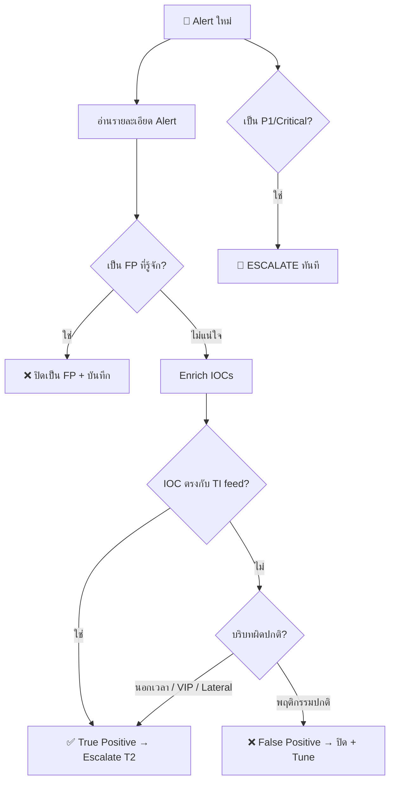
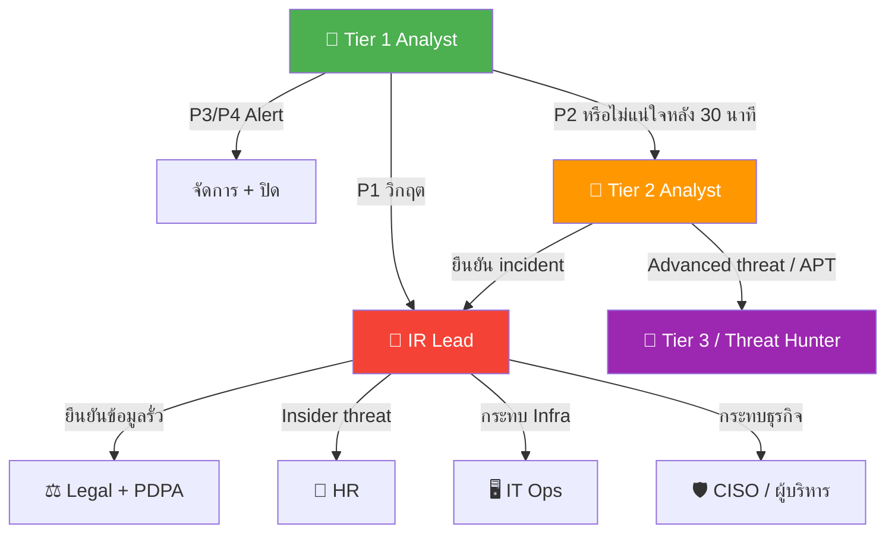

# คู่มือปฏิบัติงาน SOC Tier 1

> **รหัสเอกสาร:** RB-T1-001  
> **เวอร์ชัน:** 2.0  
> **อัปเดตล่าสุด:** 2026-02-16  
> **เจ้าของ:** SOC Manager  
> **กลุ่มเป้าหมาย:** Tier 1 / SOC Analyst มือใหม่

---

## 🆕 วันแรกของคุณ — Checklist เตรียมตัว

ก่อนจะเริ่มดู alert แรก ต้องเตรียมสิ่งนี้ให้ครบ:

```
□ SIEM access (read + search) — Splunk / Elastic / Sentinel
□ EDR console access (read-only ขั้นต่ำ)
□ ระบบ Ticket (สร้าง + อัปเดต)
□ เข้าห้อง chat SOC แล้ว (Slack/Teams #soc-alerts, #soc-general)
□ VPN + jump box ตั้งค่าแล้ว
□ Bookmark เก็บแล้ว:
    - VirusTotal, AbuseIPDB, URLhaus, Shodan
    - Wiki ภายใน / FP runbook
    - Runbook นี้ (เปิดไว้ตลอด!)
□ ดูปฏิทินกะแล้ว — รู้เวลาและ rotation
□ เบอร์ติดต่อฉุกเฉินบันทึกแล้ว (T2 Lead, IR Lead, SOC Manager)
□ อ่านแล้ว: IR Framework, Severity Matrix, Escalation Matrix
□ Shadow analyst รุ่นพี่อย่างน้อย 1 กะเต็ม
```

---

## ขั้นตอนการทำงานประจำวัน

```
08:00  เริ่มกะ → อ่าน handoff notes → เช็ค dashboard
08:15  ตรวจสอบ alert queue → จัดลำดับตามความรุนแรง
08:30  เริ่ม process alerts (เป้าหมาย: 12–15 alerts/ชม.)
       ↓ วนซ้ำ ↓
       Triage → สืบสวน → Escalate หรือ Close
12:00  Review กลางวันกับ T2 lead
16:00  เตรียม handoff notes
16:30  ส่งมอบกะ
```



---

## Alert Triage — 5 นาทีแรก

### ขั้นที่ 1: อ่าน Alert
| ตรวจอะไร | มองหาอะไร |
|:---|:---|
| **แหล่ง** | เครื่องมือไหนแจ้ง? (EDR, SIEM, IDS, email gateway) |
| **ความรุนแรง** | ระบบจัดลำดับอย่างไร? (Critical/High/Medium/Low) |
| **ระบบ** | เครื่องไหนโดน? (server, workstation, cloud) |
| **ผู้ใช้** | ใครเกี่ยวข้อง? (พนักงาน, service account, admin) |
| **เวลา** | เกิดขึ้นเมื่อไร? (ในเวลางาน? วันหยุด?) |

### ขั้นที่ 2: ตรวจบริบท (2 นาที)
```
□ เป็น false positive ที่รู้จักไหม? → เช็ค FP runbook
□ ระบบอยู่ในช่วง maintenance ไหม? → เช็คปฏิทินเปลี่ยนแปลง
□ user/host นี้เคยมี alert คล้ายกันหรือเปล่า? → ดูย้อน 7 วัน
□ ซ้ำกับ incident ที่เปิดอยู่ไหม? → เช็ค ticket
```

### ขั้นที่ 3: ตัดสินใจ



| ตัดสินใจ | ทำอะไร | เวลา |
|:---|:---|:---:|
| ✅ **True Positive** | สร้าง ticket → Escalate T2 | 15 นาที |
| ⚠️ **ต้องสืบเพิ่ม** | Enrich IOC → Pivot → ตัดสินใจ | 30 นาที |
| ❌ **False Positive** | บันทึกเหตุผล → Close → อัปเดต tuning list | 5 นาที |
| 🔴 **P1 วิกฤต** | **Escalate ทันที** ไป T2/IR Lead | 0 นาที |

---

## 🚨 ต้อง Escalate เสมอ เมื่อเจอ:

- สัญญาณ Ransomware (เข้ารหัสไฟล์, ลบ shadow copy)
- ข้อมูลกำลังรั่ว (upload ขนาดใหญ่ไป IP นอก)
- บัญชีผู้บริหารถูกยึด
- หลายเครื่องโดนพร้อมกัน
- Production server ถูกบุกรุก
- Malware ทำงานสำเร็จ
- Alert จาก OT/ICS
- ตรวจพบ C2 beaconing
- เจอเครื่องมือขโมย credential (Mimikatz, secretsdump)
- ไม่เข้าใจ alert หลังจาก 30 นาที

### Escalation Flow



---

## Alert ที่พบบ่อย & วิธีจัดการ

### 🎣 Phishing → PB-01
```
1. ห้ามคลิก link/เปิดไฟล์แนบ
2. ตรวจ email header → ปลอมแปลงไหม? (SPF/DKIM fail?)
3. ตรวจ URL → VirusTotal, URLhaus
4. ค้นหาว่าคนอื่นได้ email เดียวกันไหม
5. ถ้าอันตราย → Block sender + URL → Escalate T2
```

### 🔐 Failed Login (Brute Force) → PB-04
```
1. IP มาจากไหน? — ภายในหรือภายนอก?
2. นับจำนวนครั้งและช่วงเวลา
3. มี login สำเร็จหลังจาก fail หรือเปล่า?
4. ถ้า external + >10 ครั้ง → Block IP
5. ถ้า login สำเร็จหลัง fail → อาจถูก compromise → Escalate
```

### 🦠 Malware / EDR → PB-03
```
1. ตรวจชื่อ detection → malware ประเภทใด?
2. ถูก block หรือทำงานสำเร็จ?
3. ดู process tree → อะไร launch มัน?
4. ถ้า EXECUTE สำเร็จ → Escalate ทันที
5. ถ้า BLOCK → ยืนยัน quarantine → หาเครื่องอื่น
```

### 🌐 Web Attack / WAF → PB-10
```
1. ประเภทโจมตี → SQLi, XSS, RCE?
2. Response code → 200 (อาจสำเร็จ) vs 403 (WAF block)
3. IP ต้นทาง → scanner ทั่วไป หรือโจมตีเฉพาะเจาะจง?
4. ถ้า response=200 + payload ดูสำเร็จ → Escalate T2
5. ถ้า block → Log + monitor
```

### ☁️ Cloud Alert (AWS/Azure) → PB-16
```
1. action อะไรที่ trigger alert?
2. IAM user/role ไหน?
3. จาก IP/region ใด?
4. เป็น admin action ที่รู้จักไหม?
5. ถ้า region ผิดปกติ + privileged action → Escalate T2
```

### 💀 Ransomware → PB-02
```
1. ไฟล์ถูกเข้ารหัสไหม? ตรวจนามสกุลไฟล์
2. Shadow copy ถูกลบ? (vssadmin delete shadows)
3. มี ransom note ไหม?
4. ESCALATE ทันที — อย่ารอ
5. Isolate เครื่องถ้าทำได้ผ่าน EDR
```

### 🔀 Lateral Movement → PB-12
```
1. เครื่องที่โดนกำลังเชื่อมต่อเครื่องอื่นไหม?
2. ตรวจ PsExec, WMI, RDP จากต้นทางผิดปกติ
3. Service account ถูกใช้แบบ interactive ไหม?
4. หลายเครื่อง + IOC เดียวกัน = Escalate ทันที
5. บันทึกเครื่องทั้งหมดที่โดนให้ T2
```

### 📤 Data Exfiltration → PB-08
```
1. ข้อมูลออกปริมาณเท่าไร? ไปที่ไหน?
2. ปลายทางเป็น cloud backup ที่รู้จัก หรือ IP แปลก?
3. เกิดระหว่างเวลาทำงานโดย user ปกติไหม?
4. ตรวจ DLP alert สำหรับ data classification
5. ถ้าข้อมูลสำคัญ + ออกภายนอก → Escalate ทันที
```

### 👤 Insider Threat → PB-14
```
1. พฤติกรรมผิดปกติ — นอกเวลา, ปริมาณมาก
2. เข้าถึงข้อมูลนอกหน้าที่ไหม?
3. ใช้ USB/external storage ไหม?
4. ห้ามแจ้งผู้ต้องสงสัย
5. Escalate T2 + แจ้ง SOC Manager (อาจต้องเกี่ยว HR)
```

### 🌊 DDoS → PB-09
```
1. Service กระทบจริงไหม? ตรวจ uptime monitoring
2. Traffic volume — เกิน baseline เท่าไร?
3. มาจาก IP เดียว หรือกระจาย?
4. แจ้ง NOC/Network team ทันที
5. Escalate T2 เพื่อประสานงาน
```

---

## วิธีแยก False Positive (FP Cheat Sheet)

เรียนรู้ pattern FP ที่พบบ่อย:

| Alert Type | FP ที่พบบ่อย | วิธียืนยัน |
|:---|:---|:---|
| Brute force | Helpdesk reset password | IP + user ตรงกับ helpdesk |
| Malware | AV flag admin tools ปกติ | ตรวจ approved tool list |
| C2 beaconing | Heartbeat ไป SaaS/CDN | ตรวจ domain: Akamai, Cloudflare |
| Data exfil | Backup job, cloud sync | ตรวจ scheduled task + ปลายทาง |
| Impossible travel | VPN + cloud login | ตรวจ VPN session |
| Web attack | Security scanner (Qualys, Nessus) | ตรวจ IP กับรายการ scanner |
| Priv escalation | Admin maintenance ปกติ | ตรวจ change calendar |
| Failed login | Service account rotation | ตรวจ rotation schedule |

### Template บันทึก FP
```
เหตุผล FP: [ทำไมเป็น false positive]
Pattern: [อธิบาย pattern ที่เจอซ้ำ]
แนะนำ: □ Tune alert  □ เพิ่ม exclusion  □ Accept risk
อนุมัติโดย: [ชื่อ T2 analyst]
```

---

## ตัวอย่าง Query SIEM

### Splunk

```spl
# หา alert ทั้งหมดของ host (24 ชม.ล่าสุด)
index=alerts host="HOSTNAME" earliest=-24h | stats count by alert_name, severity

# Failed login จาก IP เฉพาะ
index=auth action=failure src_ip="X.X.X.X" earliest=-7d
| stats count by user, dest, _time | sort -count

# ปริมาณ traffic ขาออกตามปลายทาง
index=network direction=outbound src_ip="INTERNAL_IP" earliest=-24h
| stats sum(bytes_out) as total_bytes by dest_ip
| sort -total_bytes | head 20

# Process ที่รันบน endpoint
index=edr host="HOSTNAME" earliest=-48h
| stats count by process_name, parent_process, user | sort -count

# ค้น email — คนอื่นได้ phishing เดียวกันไหม?
index=email subject="*SUSPICIOUS SUBJECT*" earliest=-7d
| stats count by recipient, src_sender, action
```

### Elastic (KQL)

```
# Alert สำหรับ host
event.kind: "alert" AND host.name: "HOSTNAME"

# Failed login
event.outcome: "failure" AND event.category: "authentication"
  AND source.ip: "X.X.X.X"

# Transfer ขนาดใหญ่
network.direction: "outbound" AND source.bytes > 100000000

# Process execution
event.category: "process" AND host.name: "HOSTNAME"
  AND process.name: ("powershell.exe" OR "cmd.exe" OR "wscript.exe")
```

---

## IOC Enrichment

| ประเภท IOC | ตรวจอะไร | เครื่องมือฟรี |
|:---|:---|:---|
| IP Address | Reputation, Geolocation, ASN | VirusTotal, AbuseIPDB, Shodan |
| Domain | WHOIS, DNS, Reputation | VirusTotal, URLhaus, DomainTools |
| File Hash | Malware database | VirusTotal, MalwareBazaar, Hybrid Analysis |
| URL | Reputation, Redirect chain | VirusTotal, URLScan.io, URLhaus |
| Email | Breach databases, reputation | Have I Been Pwned, EmailRep |

### VirusTotal Quick Check
```
IP:   https://www.virustotal.com/gui/ip-address/{IP}
Hash: https://www.virustotal.com/gui/file/{HASH}
URL:  https://www.virustotal.com/gui/url/{URL}
```

### คำสั่ง CLI ตรวจ IOC
```bash
# VirusTotal IP lookup
curl -s "https://www.virustotal.com/api/v3/ip_addresses/{IP}" \
  -H "x-apikey: $VT_API_KEY" | jq '.data.attributes.last_analysis_stats'

# AbuseIPDB check
curl -s "https://api.abuseipdb.com/api/v2/check?ipAddress={IP}" \
  -H "Key: $ABUSEIPDB_KEY" | jq '.data.abuseConfidenceScore'

# Quick WHOIS
whois {DOMAIN} | grep -E "Registrar|Creation|Name Server"
```

---

## ตาราง Log Source

ดู log อะไร ตอบคำถามอะไร?

| คำถาม | Log Source | อยู่ที่ไหน |
|:---|:---|:---|
| ใครเข้าระบบ? เมื่อไร? | Authentication logs | AD/Azure AD/Okta |
| Process อะไรรัน? | EDR telemetry | CrowdStrike/Defender/SentinelOne |
| เข้าเว็บอะไร? | Proxy/DNS logs | Web proxy, DNS server |
| ดาวน์โหลดไฟล์อะไร? | Proxy + EDR | Web proxy + endpoint |
| ข้อมูลรั่วออกไหม? | Firewall/DLP | Firewall, DLP gateway |
| รับ email อะไร? | Email gateway | Exchange/O365/Proofpoint |
| มีอะไรเปลี่ยนบน server? | Windows Event Log | Event ID 4688, 4624, 4625 |
| API อะไรถูกเรียก? | Cloud audit log | CloudTrail/Azure Activity/GCP |
| Rule อะไร trigger? | IDS/IPS | Suricata/Snort/Palo Alto |
| ช่องโหว่ถูกโจมตีไหม? | WAF + App logs | WAF, application server |

### Windows Event ID สำคัญ
| Event ID | ความหมาย |
|:---|:---|
| 4624 | Login สำเร็จ |
| 4625 | Login ไม่สำเร็จ |
| 4648 | Login ด้วย explicit credentials |
| 4688 | Process ใหม่ถูกสร้าง |
| 4720 | สร้าง user account ใหม่ |
| 4732 | เพิ่ม user เข้า security group |
| 7045 | ติดตั้ง service ใหม่ |
| 1102 | Audit log ถูกล้าง ⚠️ |

---

## Template บันทึก Ticket

ทุก alert ที่ดูต้องบันทึก:

```
## สรุป Alert
- Alert ID: [จาก SIEM]
- เวลา: [alert เกิดเมื่อไร]
- เครื่องมือ: [EDR/SIEM/IDS/อื่นๆ]
- ระบบที่โดน: [hostname/IP]
- ผู้ใช้: [username]
- ประเภท: [phishing/malware/brute-force/อื่นๆ]

## ขั้นตอนสืบสวน
1. [ตรวจอะไรก่อน]
2. [พบอะไร]
3. [บริบทเพิ่มเติม]

## IOC
- IP: x.x.x.x (VT: X/90)
- Hash: abc123... (VT: X/70)
- Domain: evil.com (จดเมื่อวาน)

## ตัดสินใจ
- [x] True Positive → Escalate T2 (ticket #XXX)
- [ ] False Positive → ปิด (เหตุผล: scanner ที่รู้จัก)
- [ ] ต้องสืบเพิ่ม

## สิ่งที่ทำ
- Block IP ที่ firewall
- Quarantine file บน endpoint
- แจ้งผู้ใช้
```

---

## SLA ตาม Severity

| Severity | Response Time | Triage Time | Escalation Deadline |
|:---|:---:|:---:|:---:|
| 🔴 Critical (P1) | ≤ 5 นาที | ≤ 15 นาที | ทันที |
| 🟠 High (P2) | ≤ 10 นาที | ≤ 30 นาที | ≤ 1 ชม. |
| 🟡 Medium (P3) | ≤ 30 นาที | ≤ 60 นาที | ≤ 4 ชม. |
| 🟢 Low (P4) | ≤ 60 นาที | ≤ 4 ชม. | กะถัดไป |

### Alert Source → Severity Mapping

| Alert Source | Severity เริ่มต้น | ทำอะไรก่อน |
|:---|:---|:---|
| EDR — Malware execute | 🔴 Critical | Isolate + Escalate |
| EDR — Malware blocked | 🟡 Medium | ยืนยัน quarantine |
| SIEM — Failed logins (>10) | 🟡 Medium | ตรวจ user + Lock |
| DLP — ข้อมูลสำคัญรั่ว | 🔴 Critical | Block + Escalate |
| Firewall — Port scan | 🟢 Low | Monitor + Log |
| IDS — Exploit attempt | 🟠 High | Block IP + สืบสวน |
| Email — Phishing detected | 🟡 Medium | เช็คขอบเขต + Block |
| Cloud — Root/admin action | 🟠 High | ยืนยันตัวตน + action |

---

## ตัวชี้วัดประสิทธิภาพ (KPIs)

| Metric | เป้าหมาย | วิธีปรับปรุง |
|:---|:---:|:---|
| Alert ที่ดู/ชม. | 12–15 | ใช้ keyboard shortcuts, bookmark tools |
| Mean Time to Triage | ≤ 10 นาที | ทำตาม 5-minute checklist |
| False Positive Rate | < 30% | ศึกษา FP cheat sheet |
| Escalation Accuracy | > 90% | ไม่แน่ใจ → escalate |
| Ticket Documentation | 100% | ใช้ template — ทุกครั้ง |
| SLA Compliance | > 95% | ดู severity → ตั้งนาฬิกา |
| Shift Handoff Completion | 100% | ใช้ handoff template |

---

## Shift Handoff Checklist

ก่อนจบกะ:

```
□ Triage alert ครบ (ไม่มี alert ค้าง >30 นาที)
□ Incident ที่เปิดอยู่ อัปเดตสถานะล่าสุด
□ Escalated items ยืนยันว่า T2 รับแล้ว
□ Handoff notes เขียนแล้ว:
  - จำนวน alert ที่ดูไป
  - Incident ที่ยังดำเนินอยู่
  - สิ่งผิดปกติหรือน่ากังวล
  - ระบบที่กระทบ
□ Screenshot dashboard ถ้าเจอ anomaly
```

### Handoff Notes Template
```
=== Shift Handoff: [วันที่] [กะ] ===
Analyst: [ชื่อ]

✅ ปิดแล้ว: [N] alerts
⏳ ค้าง:   [N] tickets
🔴 Incident ที่กำลังดำเนินอยู่: [รายการ หรือ "ไม่มี"]

📝 สิ่งสำคัญ:
  - [สิ่งที่กะถัดไปต้องรู้]
  - [ระบบที่กระทบ / scan ที่กำลังรัน]

⚠️ ระวัง:
  - [alert ที่คาดว่าจะเกิดซ้ำ]
  - [escalation ที่รอ response]
```

---

## สิ่งที่ควรทำ / ไม่ควรทำ

| ✅ ควรทำ | ❌ ไม่ควรทำ |
|:---|:---|
| ถามเมื่อไม่แน่ใจ | ปล่อย alert ค้าง >30 นาที |
| บันทึกทุกอย่าง | ปิด alert โดยไม่เขียน note |
| Escalate ทันทีถ้าเป็น P1 | พยายามจัดการ P1 คนเดียว |
| ตรวจ alert ที่เกี่ยวข้อง | ดู alert แบบแยกส่วน |
| ใช้ playbook | พึ่งแต่ความจำ |
| อัปเดต status สม่ำเสมอ | เงียบหายระหว่าง incident |
| จำกัดเวลาสืบสวน | ใช้เวลา 2 ชม.กับ alert Low |
| ยืนยัน IOC หลายแหล่ง | เชื่อ VT score ตัวเดียว |
| แจ้ง FP ซ้ำเพื่อ tuning | ปิด FP เดิมซ้ำทุกวัน |

---

## รายชื่อติดต่อ

| บทบาท | ติดต่อเมื่อ |
|:---|:---|
| T2 Analyst | alert ที่แก้ไม่ได้ใน 30 นาที |
| IR Lead | Incident P1/P2 ที่ยืนยันแล้ว |
| SOC Manager | ปัญหา operational, tool ล่ม |
| IT Ops | ปัญหา server/network ระหว่างสืบสวน |
| HR | กรณี insider threat |
| Legal | ยืนยัน data breach, ต้องแจ้ง PDPA |

---

## เอกสารที่เกี่ยวข้อง

- [กรอบ IR](Framework.th.md)
- [ตารางความรุนแรง](Severity_Matrix.th.md)
- [ตาราง Escalation](Escalation_Matrix.th.md)
- [ส่งมอบกะ](../06_Operations_Management/Shift_Handoff.th.md)
- [Playbook ทั้งหมด (PB-01 ถึง PB-50)](Playbooks/)
