# SOC Tier 2 Analyst Runbook

> **Document ID:** RB-T2-001  
> **Version:** 1.0  
> **Last Updated:** 2026-02-16  
> **Owner:** SOC Manager  
> **Audience:** Tier 2 / Senior SOC Analysts

---

## Role Overview

As a Tier 2 analyst, you are the **investigation backbone** of the SOC. You receive escalations from Tier 1, perform deep-dive analysis, coordinate containment, and determine whether events are true incidents requiring IR activation.

```mermaid
graph LR
    T1["👤 T1 Escalation"] --> Receive["📥 Receive & Validate"]
    Receive --> Investigate["🔍 Deep Investigation"]
    Investigate --> Correlate["🔗 Cross-Source Correlation"]
    Correlate --> Decision{Incident?}
    Decision -->|Yes| Contain["🛡️ Contain & Eradicate"]
    Decision -->|No| Return["↩️ Return to T1 with guidance"]
    Contain --> Document["📝 Document & Report"]
    Document --> Handoff["📋 Handoff to T3 or IR"]
```



---

## 🆕 Tier 2 Prerequisites

Before you start, ensure you have:

```
□ Full SIEM access (read + write + saved searches)
□ EDR console access (isolate, collect, remediate capabilities)
□ Threat intelligence platform access (MISP, ThreatConnect, etc.)
□ Forensic tools access (Velociraptor, KAPE, Volatility)
□ Sandbox access (Any.Run, Hybrid Analysis, or internal)
□ Network packet capture (Wireshark, Zeek, tcpdump)
□ Ticketing system — incident management permissions
□ Communication channels: #soc-incidents, #ir-team, bridge call access
□ Understand: IR Framework, all 50 Playbooks, MITRE ATT&CK basics
□ Completed T1 role for minimum 6 months
```

---

## Daily Workflow

```
08:00  Shift start → Review T1 escalation queue
08:15  Check active incidents → Update status
08:30  Process T1 escalations (target: 5–8 investigations/day)
       ↓ Investigation cycle ↓
       Validate → Investigate → Correlate → Contain or Close
11:00  Threat intelligence review — new IOCs, advisories
12:00  Team standup with SOC Manager + T3
14:00  Continue investigations + mentoring T1
16:00  Prepare handoff + update incident timelines
16:30  Handoff to next shift
```

---

## Receiving a T1 Escalation

### Step 1: Validate the Escalation (5 min)

| Check | Action |
|:---|:---|
| Is the ticket complete? | Verify T1 documented: alert ID, IOCs, steps taken |
| Is this actually T2 scope? | Redirect operational issues to IT, false escalations back to T1 |
| Priority correct? | Re-assess severity based on asset criticality + threat context |
| Quick wins? | Can you resolve in < 5 min? (e.g., known FP that T1 missed) |

### Step 2: Classify the Investigation

| Category | Examples | Typical Duration |
|:---|:---|:---:|
| 🔴 **Active Compromise** | Malware executing, data exfil in progress | 1–4 hours |
| 🟠 **Possible Compromise** | Suspicious IOCs, unusual behavior | 2–8 hours |
| 🟡 **Policy Violation** | Unauthorized access, shadow IT | 1–2 hours |
| 🟢 **False Positive Review** | Complex FP needing deeper analysis | 30–60 min |

---

## Deep Investigation Methodology

### Phase 1: Scope Assessment (15 min)

```
□ How many hosts/users affected?
□ What is the business criticality of affected assets?
□ What is the potential data exposure?
□ Is lateral movement occurring?
□ Timeline: When did this start? (earliest evidence)
```

### Phase 2: Evidence Collection (30–60 min)

```mermaid
graph TD
    Start["🔍 Start Investigation"] --> SIEM["SIEM: Alert timeline & correlation"]
    SIEM --> EDR["EDR: Process tree, file activity, network"]
    EDR --> Network["Network: Firewall, proxy, DNS, packet capture"]
    Network --> Auth["Auth: Login history, privilege changes"]
    Auth --> TI["TI: IOC enrichment, campaign matching"]
    TI --> Cloud["Cloud: Audit logs, API calls, config changes"]
    Cloud --> Correlate["🔗 Build Attack Timeline"]
```



#### SIEM Correlation Queries

```spl
# Splunk: All activity from compromised host (48h)
index=* host="COMPROMISED_HOST" earliest=-48h
| stats count by sourcetype, action | sort -count

# Lateral movement detection
index=auth (EventCode=4624 OR EventCode=4648) Logon_Type=3
src_ip="COMPROMISED_IP" earliest=-7d
| stats count dc(dest) as unique_targets by src_ip, user
| where unique_targets > 3

# Process lineage — what spawned what
index=edr host="HOSTNAME" earliest=-48h
| table _time, parent_process, process_name, command_line, user
| sort _time

# DNS queries to rare/new domains
index=dns src_ip="HOST_IP" earliest=-7d
| stats count by query | where count < 5

# Data transfer volume by destination
index=firewall src_ip="HOST_IP" action=allowed earliest=-48h
| stats sum(bytes_out) as MB by dest_ip | eval MB=MB/1048576
| where MB > 100 | sort -MB
```

#### Elastic Queries

```
# All events from compromised host
host.name: "COMPROMISED_HOST" AND @timestamp > "now-48h"

# Suspicious process execution
event.category: "process" AND host.name: "HOSTNAME"
  AND process.name: ("powershell.exe" OR "certutil.exe" OR "mshta.exe"
    OR "regsvr32.exe" OR "rundll32.exe" OR "bitsadmin.exe")

# Network connections to external IPs
event.category: "network" AND source.ip: "INTERNAL_IP"
  AND NOT destination.ip: (10.0.0.0/8 OR 172.16.0.0/12 OR 192.168.0.0/16)
```

### Phase 3: IOC Deep Enrichment

| IOC | Basic (T1 did this) | Deep (T2 does this) |
|:---|:---|:---|
| IP Address | VT reputation | Passive DNS, ASN history, BGP peers |
| Domain | WHOIS lookup | Domain age, registrant, SSL cert history |
| Hash | VT detection | Sandbox detonation, YARA match, family ID |
| URL | Reputation check | Full redirect chain, content analysis |
| Email | Header check | SPF/DKIM/DMARC analysis, similar campaigns |

#### Sandbox Analysis Checklist
```
□ Submit hash/URL to sandbox (Any.Run, Hybrid Analysis, Joe Sandbox)
□ Record: dropped files, registry changes, network callbacks
□ Extract additional IOCs: C2 domains, secondary payloads
□ Check MITRE ATT&CK techniques observed
□ Compare with known malware families
```

---

## Containment Decision Framework

```mermaid
graph TD
    Confirmed["✅ Confirmed Incident"] --> Impact{"Business Impact?"}
    Impact -->|Critical| Immediate["🔴 Immediate Containment"]
    Impact -->|High| Quick["🟠 Quick Containment (< 1h)"]
    Impact -->|Medium| Planned["🟡 Planned Containment"]
    Impact -->|Low| Monitor["🟢 Monitor + Schedule Fix"]

    Immediate --> IsolateHost["Isolate host via EDR"]
    Immediate --> BlockNetwork["Block at firewall/proxy"]
    Immediate --> DisableAccount["Disable compromised account"]
    Immediate --> NotifyIR["Notify IR Lead"]

    Quick --> BlockIOC["Block IOCs (IP/domain/hash)"]
    Quick --> ResetPassword["Force password reset"]
    Quick --> EnhanceMonitor["Enhanced monitoring"]

    Planned --> PatchSchedule["Schedule patching"]
    Planned --> PolicyUpdate["Update security policies"]
```



### Containment Actions Quick Reference

| Action | Tool | When |
|:---|:---|:---|
| Isolate host | EDR (CrowdStrike/Defender) | Active malware, C2, lateral movement |
| Block IP/Domain | Firewall, DNS sinkhole, Proxy | Confirmed C2, malicious infrastructure |
| Disable account | AD/Azure AD/Okta | Confirmed account compromise |
| Block hash | EDR, Email gateway | Confirmed malicious file |
| Reset password | AD/Azure AD | Credential theft suspected |
| Revoke sessions | Azure AD, Okta, AWS IAM | Token theft, session hijacking |
| Kill process | EDR remote shell | Active malware execution |
| Quarantine email | Email gateway | Phishing campaign |

### ⚠️ Containment Rules of Engagement

```
DO:
  ✅ Document every containment action with timestamp
  ✅ Get IR Lead approval before isolating production servers
  ✅ Verify backups exist before destructive actions
  ✅ Notify affected business unit BEFORE containment
  ✅ Preserve evidence — take snapshot/image before wiping

DON'T:
  ❌ Isolate without documenting
  ❌ Delete malware without collecting a sample first
  ❌ Reboot a compromised server (destroys volatile memory)
  ❌ Alert a suspected insider
  ❌ Make containment changes in bulk without approval
```

---

## MITRE ATT&CK Mapping

Map each investigation to ATT&CK techniques for tracking:

| Phase | Common Techniques | What to Look For |
|:---|:---|:---|
| **Initial Access** | T1566 Phishing, T1078 Valid Accounts | Email IOCs, stolen credentials |
| **Execution** | T1059 Command/Script, T1204 User Execution | PowerShell, WScript, macro |
| **Persistence** | T1053 Scheduled Task, T1547 Boot Autostart | Registry, services, crontab |
| **Privilege Escalation** | T1068 Exploitation, T1548 Abuse Elevation | UAC bypass, sudo abuse |
| **Defense Evasion** | T1070 Indicator Removal, T1027 Obfuscation | Log clearing, encoding |
| **Credential Access** | T1003 OS Credential Dumping | Mimikatz, LSASS access |
| **Lateral Movement** | T1021 Remote Services, T1570 Lateral Transfer | RDP, PsExec, WMI |
| **Exfiltration** | T1041 Over C2, T1567 Over Web Service | Cloud upload, DNS tunnel |

---

## Incident Documentation Template

```markdown
## Incident Summary
- Ticket ID: [INCT-XXXX]
- Severity: [P1/P2/P3/P4]
- Status: [Investigating / Contained / Eradicated / Resolved]
- Analyst: [Your Name]
- Start Time: [When first alert fired]
- Detection Time: [When SOC identified]
- Containment Time: [When contained]

## Attack Narrative
[One paragraph: who attacked what, how, when, impact]

## Affected Assets
| Host | IP | Role | Status |
|:---|:---|:---|:---|
| [hostname] | [IP] | [server/workstation] | [isolated/clean/compromised] |

## IOC Summary
| Type | Value | Source | Action Taken |
|:---|:---|:---|:---|
| IP | x.x.x.x | VT (45/90) | Blocked at firewall |
| Hash | abc123 | Sandbox | Blocked in EDR |
| Domain | evil.com | TI feed | DNS sinkholed |

## MITRE ATT&CK
- Initial Access: T1566.001 (Spearphishing Attachment)
- Execution: T1059.001 (PowerShell)
- Persistence: T1053.005 (Scheduled Task)

## Timeline
| Time | Event | Source |
|:---|:---|:---|
| 09:15 | Phishing email received | Email gateway |
| 09:22 | User clicked link | Proxy log |
| 09:23 | Malware downloaded | EDR |
| 09:30 | C2 callback detected | Firewall |
| 09:35 | T1 escalated to T2 | Ticket |
| 09:50 | Host isolated | EDR |

## Containment Actions
1. [Action taken + timestamp + who approved]

## Root Cause
[Brief root cause analysis]

## Recommendations
1. [Tuning recommendation]
2. [Process improvement]
3. [Security control gap]
```

---

## Mentoring T1 Analysts

Part of your role is developing T1 skills:

| Scenario | Mentoring Action |
|:---|:---|
| T1 escalates incorrectly | Explain why, show what they missed, don't punish |
| T1 misses a true positive | Walk through the missed indicators together |
| Repeat false positive | Help T1 write a tuning request, review together |
| T1 asks good questions | Encourage, share resources, give stretch assignments |
| New T1 onboarding | Schedule shadow sessions, review their first 10 tickets |

---

## T2 Performance Metrics

| Metric | Target | Notes |
|:---|:---:|:---|
| Investigations/day | 5–8 | Varies by complexity |
| Mean Time to Investigate (MTTI) | ≤ 2 hours | Start-to-decision |
| Mean Time to Contain (MTTC) | ≤ 4 hours | Decision-to-containment |
| Incident Detection Accuracy | > 95% | Post-review validation |
| IOC Feed Contribution | ≥ 5/week | Share findings with TI team |
| T1 Mentoring Hours | ≥ 2/week | Invested in team growth |
| ATT&CK Technique Coverage | Track monthly | Dashboard metrics |

---

## Shift Handoff — T2

```
=== T2 Shift Handoff: [DATE] [SHIFT] ===
Analyst: [YOUR NAME]

📊 Investigations:
  ✅ Completed: [N] investigations
  ⏳ In Progress: [N] — Details:
    - [INCT-XXX] — [brief status, next steps]
  
🔴 Active Incidents:
  - [INCT-XXX] — [severity, status, who's working on it]

🛡️ Containment Actions Taken:
  - [list any blocks, isolations, or resets done this shift]

📝 T1 Feedback:
  - [any T1 mentoring notes, common mistakes today]

⚠️ Watch For:
  - [expected follow-up, pending results, threat intel advisories]
```

---

## Key Contacts

| Role | When to Contact |
|:---|:---|
| T1 Analyst | Return escalations, provide guidance |
| T3 / Threat Hunter | Advanced threats, APT, malware RE |
| IR Lead | P1 incidents, containment approval |
| SOC Manager | Resource needs, process issues |
| IT Ops / SysAdmin | System access, log collection issues |
| Network Team | Firewall rules, packet captures |
| Cloud Team | Cloud IAM, API investigation |
| Legal / Compliance | Data breach, regulatory notification |

---

## Related Documents

- [IR Framework](Framework.en.md)
- [Severity Matrix](Severity_Matrix.en.md)
- [Escalation Matrix](Escalation_Matrix.en.md)
- [Tier 1 Runbook](Tier1_Runbook.en.md)
- [Forensic Investigation](Forensic_Investigation.en.md)
- [Evidence Collection](Evidence_Collection.en.md)
- [All Playbooks (PB-01 to PB-50)](Playbooks/)
