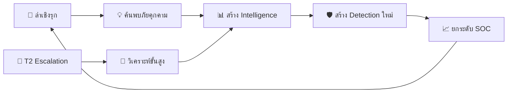
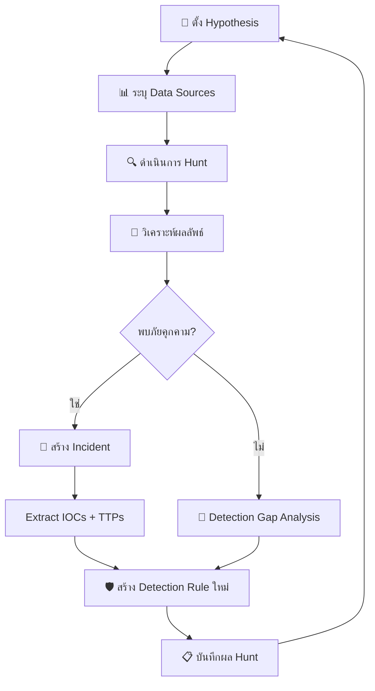
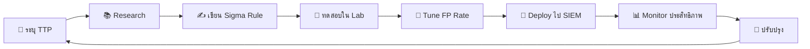

# คู่มือปฏิบัติงาน SOC Tier 3

> **รหัสเอกสาร:** RB-T3-001  
> **เวอร์ชัน:** 1.0  
> **อัปเดตล่าสุด:** 2026-02-16  
> **เจ้าของ:** SOC Manager  
> **กลุ่มเป้าหมาย:** Tier 3 / Threat Hunter / Senior IR Analyst

---

## ภาพรวมบทบาท

ในฐานะ Tier 3 analyst คุณคือ **ทรัพยากรเทคนิคอาวุโสที่สุด** ของ SOC คุณล่าภัยคุกคามเชิงรุก วิเคราะห์ malware ย้อนกลับ นำทีม incident response ที่ซับซ้อน พัฒนา detection content และขับเคลื่อนการปรับปรุง security posture เชิงกลยุทธ์



---

## 🆕 สิ่งที่ Tier 3 ต้องมี

```
□ SIEM ระดับ expert (custom detection rules, advanced SPL/KQL)
□ EDR advanced hunting / threat hunting modules
□ สภาพแวดล้อม malware analysis (RE lab, disassembler, debugger)
□ ชุดเครื่องมือ forensic (KAPE, Volatility, Autopsy, FTK)
□ Network forensics (Wireshark deep analysis, Zeek scripting)
□ Threat intelligence platform — contributor access
□ Detection engineering pipeline (Sigma → deploy SIEM rule)
□ เครื่องมือ Purple team (Atomic Red Team, MITRE Caldera)
□ Programming: Python, PowerShell, Bash (สำหรับ automate)
□ ประสบการณ์ Tier 2 อย่างน้อย 2 ปี + certifications ที่เกี่ยวข้อง
```

---

## ความรับผิดชอบประจำวัน

ต่างจาก T1/T2 ที่มีรูปแบบกะตายตัว — งาน T3 เป็นแบบ project:

| สัดส่วนเวลา | กิจกรรม | ความถี่ |
|:---|:---|:---|
| 30% | **Threat Hunting** — ล่าตาม hypothesis | ต่อเนื่อง |
| 25% | **Advanced IR** — สืบสวน incident ซับซ้อน | ตามเหตุการณ์ |
| 20% | **Detection Engineering** — Sigma/YARA rules ใหม่ | รายสัปดาห์ |
| 15% | **Research & Intelligence** — วิเคราะห์ TTP, threat landscape | ทุกวัน |
| 10% | **Mentor & Knowledge Share** — สอน T1/T2, postmortem | รายสัปดาห์ |

---

## Threat Hunting Framework

### Hypothesis-Driven Hunting Process



### ตัวอย่าง Hypothesis

| แหล่ง | ตัวอย่าง Hypothesis |
|:---|:---|
| **TI Report** | "กลุ่ม APT X ใช้ DLL side-loading ผ่านแอป Y — เราโดนไหม?" |
| **MITRE Gap** | "เราไม่มี detection สำหรับ T1218.011 (Rundll32) — มีคนใช้ไหม?" |
| **Industry Alert** | "สาย Healthcare เจอ Akira ransomware — เรามี precursors ไหม?" |
| **Anomaly** | "DNS query ไป .tk domains เพิ่ม 300% — อะไรทำ?" |
| **Post-Incident** | "Incident ล่าสุดใช้ scheduled tasks — มีตัวอื่นไหม?" |

### Hunt Queries

#### Living-Off-the-Land (LOLBin) Detection

```spl
# PowerShell encoded commands
index=edr process_name="powershell.exe"
  (command_line="*-enc*" OR command_line="*-EncodedCommand*"
   OR command_line="*FromBase64*" OR command_line="*[Convert]*")
| stats count by host, user, command_line | sort -count

# Certutil abuse (download/decode)
index=edr process_name="certutil.exe"
  (command_line="*-urlcache*" OR command_line="*-decode*"
   OR command_line="*-decodehex*")
| stats count by host, user, command_line

# Rundll32 เรียก DLL ผิดปกติ
index=edr process_name="rundll32.exe"
  NOT command_line="*shell32*" NOT command_line="*setupapi*"
  NOT command_line="*ieframe*" NOT command_line="*shdocvw*"
| stats count by host, command_line | where count < 3

# MSHTA เรียก remote content
index=edr process_name="mshta.exe"
  (command_line="*http*" OR command_line="*javascript*"
   OR command_line="*vbscript*")
| stats count by host, user, command_line
```

#### Persistence Hunting

```spl
# Service ใหม่ที่ติดตั้ง
index=wineventlog EventCode=7045
| stats count by host, Service_Name, Service_File_Name
| where count=1 | sort -_time

# Scheduled task ที่สร้างใหม่
index=wineventlog EventCode=4698
| stats count by host, user, TaskName | where count=1

# Registry run key ที่แก้ไข
index=edr registry_path="*\\Run\\*" OR registry_path="*\\RunOnce\\*"
| stats count by host, registry_path, registry_value
```

#### C2 & Beaconing Detection

```spl
# ตรวจ beaconing (เชื่อมต่อ interval คงที่)
index=firewall direction=outbound
| bin _time span=60s
| stats count by dest_ip, _time
| streamstats count as beacon_count range(_time) as time_range by dest_ip
| where beacon_count > 100 AND time_range > 3600
| stats avg(count) stdev(count) by dest_ip
| eval jitter=stdev/avg*100
| where jitter < 15

# DNS tunneling (subdomain entropy สูง)
index=dns query_type=TXT OR query_length > 50
| eval subdomain=replace(query, "\.[^.]+\.[^.]+$", "")
| eval entropy=len(subdomain)
| where entropy > 30
| stats count by query | sort -count

# Long connections (อาจเป็น C2)
index=firewall duration > 28800 direction=outbound
  NOT dest_port IN (443, 80, 53)
| stats count by src_ip, dest_ip, dest_port, duration
```

---

## Malware Analysis

### ขั้นตอน Triage Analysis (30 นาที)

```
ขั้นที่ 1: Static Analysis
  □ File metadata (PE headers, strings, imports)
  □ Hashing (MD5, SHA-256, imphash, ssdeep)
  □ VirusTotal / MalwareBazaar — ระบุ family
  □ YARA signature matching
  □ ตรวจ packer/obfuscation

ขั้นที่ 2: Dynamic Analysis (Sandbox)
  □ Execute ใน sandbox ที่แยกออก
  □ บันทึก: process ที่ spawn, ไฟล์ที่สร้าง/แก้ไข
  □ บันทึก: registry ที่แก้
  □ บันทึก: network connections (IPs, domains, protocols)
  □ บันทึก: API calls ที่น่าสนใจ

ขั้นที่ 3: Behavioral Classification
  □ Map behaviors → MITRE ATT&CK techniques
  □ ระบุ malware family (RAT, loader, stealer, ransomware)
  □ Extract C2 config ถ้าทำได้
  □ Extract IOCs ทั้งหมดสำหรับ block/detect
```

### เครื่องมือ Static Analysis

| เครื่องมือ | ใช้ทำอะไร |
|:---|:---|
| PEStudio | วิเคราะห์ PE file, imports, strings |
| FLOSS | ดึง string ขั้นสูง (deobfuscation) |
| ssdeep / imphash | Fuzzy hashing, เทียบความคล้าย |
| Detect It Easy (DIE) | ระบุ packer/compiler |
| Capa | ระบุ capability (mapped MITRE) |
| Ghidra / IDA | Disassembly และ decompilation |

### เครื่องมือ Dynamic Analysis

| เครื่องมือ | ใช้ทำอะไร |
|:---|:---|
| Any.Run | Interactive sandbox |
| Hybrid Analysis | Automated sandbox |
| Process Monitor | Monitor Windows API |
| Wireshark | จับ packet ระหว่าง execute |
| Regshot | เปรียบเทียบ registry |
| Volatility | Memory forensics |

---

## Detection Engineering

### Sigma Rule Development Workflow



### Sigma Rule Template

```yaml
title: [ชื่อที่อธิบาย]
id: [UUID]
status: experimental
description: >
    ตรวจจับ [สิ่งที่ตรวจ] ซึ่งบ่งชี้ [ภัยคุกคาม]
references:
    - https://attack.mitre.org/techniques/TXXXX/
author: [ชื่อ]
date: 2026/02/16
tags:
    - attack.execution
    - attack.tXXXX.XXX
logsource:
    category: process_creation
    product: windows
detection:
    selection:
        ParentImage|endswith: '\explorer.exe'
        Image|endswith: '\powershell.exe'
        CommandLine|contains:
            - '-enc'
            - '-EncodedCommand'
    condition: selection
falsepositives:
    - Admin scripts ที่ถูกต้อง
level: high
```

### YARA Rule Template

```yara
rule Malware_Family_Variant : malware
{
    meta:
        author      = "[ชื่อ]"
        date        = "2026-02-16"
        description = "ตรวจจับ [malware family] variant"
        reference   = "[URL]"
        hash        = "[sample hash]"

    strings:
        $s1 = "suspicious_string_1" ascii wide
        $s2 = { 4D 5A 90 00 }  // PE header
        $s3 = /https?:\/\/[a-z0-9]+\.(tk|ml|ga)\// nocase

    condition:
        uint16(0) == 0x5A4D and
        filesize < 5MB and
        2 of ($s*)
}
```

---

## Forensic Investigation

### Memory Forensics (Volatility 3)

```bash
# แสดง process ทั้งหมด
python3 vol.py -f memory.dmp windows.pslist

# ตรวจ code injection
python3 vol.py -f memory.dmp windows.malfind

# Network connections ขณะเก็บ memory
python3 vol.py -f memory.dmp windows.netscan

# ประวัติ command
python3 vol.py -f memory.dmp windows.cmdline

# ตรวจ DLL injection
python3 vol.py -f memory.dmp windows.dlllist --pid [PID]

# ดึง registry hive
python3 vol.py -f memory.dmp windows.registry.hivelist
```

### Disk Forensics

```bash
# สร้าง timeline ด้วย KAPE
KAPE.exe --tsource C: --target !SANS_Triage --tdest E:\Evidence

# Super timeline ด้วย plaso
log2timeline.py timeline.plaso /path/to/image
psort.py -o l2tcsv timeline.plaso -w timeline.csv

# Parse Windows event logs
python3 hayabusa -d C:\Windows\System32\winevt\Logs -o results.csv
```

---

## Purple Team & Adversary Simulation

### Atomic Red Team Testing

```powershell
# ติดตั้ง
Install-Module -Name invoke-atomicredteam

# รัน test เฉพาะ technique
Invoke-AtomicTest T1053.005 -TestNumbers 1  # Scheduled Task
Invoke-AtomicTest T1059.001 -TestNumbers 1  # PowerShell
Invoke-AtomicTest T1003.001 -TestNumbers 1  # LSASS Dump

# รัน test ทั้งหมดสำหรับ tactic
Invoke-AtomicTest T1053 -ShowDetailsBrief
```

### Detection Validation Matrix

| Technique | วิธีทดสอบ | Detection ที่คาด | ผล |
|:---|:---|:---|:---|
| T1059.001 | Encoded PowerShell | Sigma rule `proc_powershell_encoded` | ✅/❌ |
| T1003.001 | Mimikatz/LSASS | EDR + SIEM alert | ✅/❌ |
| T1053.005 | Scheduled Task | Event 4698 rule | ✅/❌ |
| T1021.001 | RDP brute force | SIEM multi-fail rule | ✅/❌ |

---

## Threat Intelligence Production

### Template รายงาน TI

```markdown
## TI Report: [ชื่อ Campaign/ภัยคุกคาม]
วันที่: [YYYY-MM-DD]
TLP: [WHITE/GREEN/AMBER/RED]
ความมั่นใจ: [สูง/กลาง/ต่ำ]

### สรุปสำหรับผู้บริหาร
[2-3 ประโยคสำหรับ management]

### การวิเคราะห์เทคนิค
- Attack vector: [มาอย่างไร]
- Malware family: [ชื่อ, ความสามารถ]
- C2 infrastructure: [domains, IPs, protocols]
- MITRE ATT&CK chain: [technique IDs]

### IOCs
| ประเภท | ค่า | บริบท |
|:---|:---|:---|
| [IP/Hash/Domain] | [value] | [ใช้ทำอะไร] |

### ข้อเสนอแนะ
1. [Action สำหรับ block]
2. [Detection rule ที่ต้องสร้าง]
3. [Hunt query ที่ต้องรัน]

### อ้างอิง
- [Source URLs]
```

---

## ตัวชี้วัดประสิทธิภาพ T3

| Metric | เป้าหมาย | หมายเหตุ |
|:---|:---:|:---|
| Threat hunts/เดือน | ≥ 4 | อย่างน้อย 1/สัปดาห์ |
| Detection rules ใหม่/เดือน | ≥ 8 | Sigma + YARA รวม |
| Detection rule FP rate | < 5% | หลัง 30 วัน tuning |
| Malware samples วิเคราะห์/เดือน | ≥ 10 | Triage + deep analysis |
| TI reports/เดือน | ≥ 2 | Intelligence ที่ใช้งานได้ |
| Purple team exercises/ไตรมาส | ≥ 2 | ตรวจสอบ detection gaps |
| Knowledge sharing/เดือน | ≥ 2 | สอน T1/T2 |
| เวลา detect TTP ใหม่ | ≤ 48 ชม. | จาก TI alert → detection rule |

---

## รายชื่อติดต่อ

| บทบาท | ติดต่อเมื่อ |
|:---|:---|
| T2 Analyst | ช่วย case ซับซ้อน, คำแนะนำ |
| IR Lead | ประสานงาน incident ใหญ่ |
| SOC Manager | กลยุทธ์, วางแผน resource |
| CISO | บรรยาย threat landscape, ตัดสินใจ risk |
| Red Team | Purple team exercises, adversary simulation |
| Vendor TAM | TI เฉพาะผลิตภัณฑ์, beta features |
| External TI | ISAC sharing, vendor intelligence feeds |
| Law Enforcement | Attribution, takedown coordination |

---

## เอกสารที่เกี่ยวข้อง

- [กรอบ IR](Framework.th.md)
- [การสืบสวน Forensic](Forensic_Investigation.th.md)
- [การเก็บหลักฐาน](Evidence_Collection.th.md)
- [Threat Hunting Playbook](Threat_Hunting_Playbook.th.md)
- [Tier 1 Runbook](Tier1_Runbook.th.md)
- [Tier 2 Runbook](Tier2_Runbook.th.md)
- [Playbook ทั้งหมด (PB-01 ถึง PB-50)](Playbooks/)
- [Sigma Rules Index](../08_Detection_Engineering/README.th.md)
