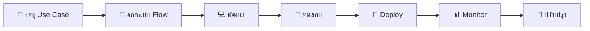
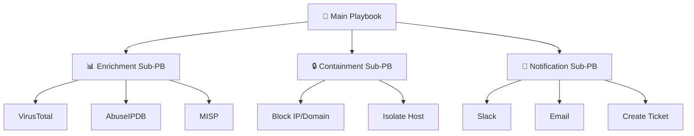
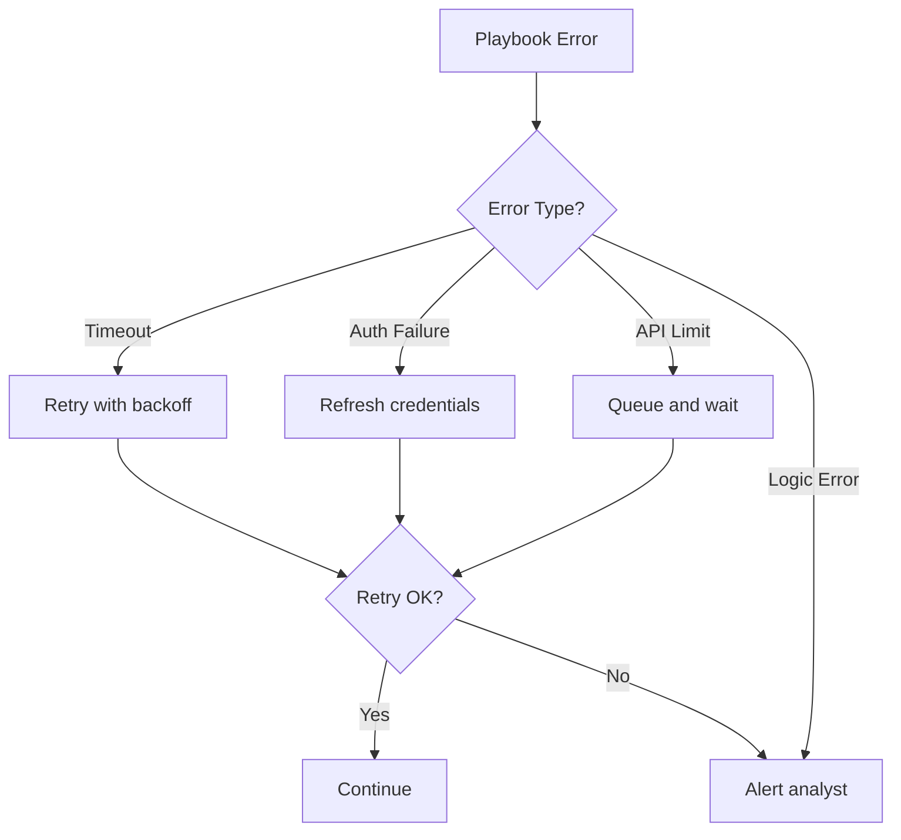

# แม่แบบ SOAR Playbook

> **รหัสเอกสาร:** SOAR-TPL-001  
> **เวอร์ชัน:** 1.0  
> **อัปเดตล่าสุด:** 2026-02-15  
> **เจ้าของ:** SOC Engineer  

---

## วัตถุประสงค์

แม่แบบ workflow อัตโนมัติสำหรับ **SOAR** สามารถ import เข้า:
- **Palo Alto XSOAR** (Cortex)
- **Shuffle** (Open-source)
- **TheHive / Cortex**
- **Tines** / **Splunk SOAR**

---

## ดัชนีแม่แบบ

| # | แม่แบบ | Playbook | ระดับอัตโนมัติ | การดำเนินการหลัก |
|:---:|:---|:---|:---:|:---|
| 1 | Phishing Triage | PB-01 | เต็ม | Extract IOC → Sandbox → Block → แจ้ง |
| 2 | Ransomware Response | PB-02 | กึ่งอัตโนมัติ | Isolate → Snapshot → Escalate |
| 3 | Brute Force Block | PB-04 | เต็ม | ตรวจ threshold → Lock → Alert |
| 4 | Account Compromise | PB-05 | เต็ม | Disable → Reset → Revoke sessions |
| 5 | Malware Quarantine | PB-03 | เต็ม | ค้น hash → Quarantine → Block |
| 6 | IOC Enrichment | ทั้งหมด | เต็ม | Enrichment หลายแหล่ง → Verdict |

---

## 1. Phishing Triage

**Trigger**: User แจ้ง email น่าสงสัย หรือ email gateway alert  
**อัตโนมัติ**: เต็มรูปแบบ (ต้อง approve ก่อน block)

```yaml
name: Phishing Auto Triage
trigger:
  type: email_report
  source: phishing_mailbox OR email_gateway_alert

steps:
  - id: extract_indicators
    action: extract_indicators
    description: "แยก URLs, attachments, sender IP จาก email"

  - id: check_reputation
    action: parallel
    tasks:
      - action: virustotal_lookup
      - action: urlscan_submit
      - action: abuseipdb_check

  - id: sandbox_attachment
    action: sandbox_detonate
    condition: "มี attachment"
    timeout: 300

  - id: calculate_verdict
    action: decision
    rules:
      - "VT ≥ 5 OR sandbox = malicious" → MALICIOUS
      - "VT ≥ 2 OR sandbox = suspicious" → SUSPICIOUS
      - default → CLEAN

  - id: respond_malicious
    condition: "MALICIOUS"
    tasks:
      - block_sender
      - delete_from_mailboxes
      - block_urls (proxy/firewall)
      - block_hashes (EDR)
      - notify_user → "ยืนยัน phishing"
      - create_incident → P2, PB-01
```

---

## 2. Ransomware Response

**Trigger**: EDR alert พฤติกรรม ransomware  
**อัตโนมัติ**: กึ่ง (isolate ทันที, ส่งต่อคน)

```yaml
name: Ransomware Emergency Response
steps:
  - id: immediate_isolate
    action: edr_isolate_host
    auto_execute: true  # ← ตัดเน็ตทันที ไม่ต้องรอ

  - id: snapshot_evidence
    tasks:
      - edr_collect_forensics (memory, processes, network)
      - cloud_snapshot (ถ้าเป็น cloud)

  - id: check_lateral
    action: edr_hunt  # ← ค้นหา IOC เดียวกันทั้งองค์กร

  - id: escalate
    severity: P1, playbook: PB-02
    notify: [soc_lead, incident_commander, ciso]
```

---

## 3. Brute Force Lockout

**Trigger**: SIEM alert ≥ 10 failed logins ใน 5 นาที  
**อัตโนมัติ**: เต็มรูปแบบ

```yaml
name: Brute Force Auto-Lockout
steps:
  - id: enrich_source
    tasks:
      - geoip_lookup
      - abuseipdb_check
      - internal_asset_check

  - id: decide_action
    rules:
      - IP ภายใน → แจ้งเตือนเท่านั้น
      - AbuseIPDB ≥ 80 → block + lock
      - ประเทศไม่อนุญาต → block + lock
      - อื่นๆ → block ชั่วคราว

  - id: execute_block
    tasks:
      - firewall_block_ip (24 ชม.)
      - lock_account (ถ้า login สำเร็จแล้ว)
      - create_incident → P3, PB-04
```

---

## 4. Account Compromise

**Trigger**: Impossible travel, token theft, credential leak  
**อัตโนมัติ**: เต็มรูปแบบ

```yaml
name: Account Compromise Auto-Response
steps:
  - id: disable_account → ทันที
  - id: revoke_sessions → OAuth + active sessions + MFA bypass
  - id: audit_actions → ตรวจ 72 ชม. ย้อนหลัง
  - id: remediate → reset password + re-enroll MFA + ลบ forwarding rules
  - id: notify → แจ้งหัวหน้าผู้ใช้ + สร้าง incident P2
```

---

## 5. Malware Quarantine

**Trigger**: EDR ตรวจพบ malware  
**อัตโนมัติ**: เต็มรูปแบบ

```yaml
name: Malware Auto-Quarantine
steps:
  - id: quarantine_file → กักไฟล์ทันที
  - id: check_hash → VT + MalwareBazaar
  - id: enterprise_block → block hash ทั้งองค์กร (ถ้า VT ≥ 5)
  - id: hunt_enterprise → ค้นหาเครื่องอื่นที่มีไฟล์เดียวกัน
  - id: mass_quarantine → กักทุกเครื่องที่พบ
```

---

## 6. IOC Enrichment (Sub-playbook)

**Trigger**: เรียกโดย playbook อื่น  
**อัตโนมัติ**: เต็มรูปแบบ

```yaml
name: IOC Multi-Source Enrichment
inputs: indicator_type (ip|domain|hash|url), indicator_value

steps:
  - id: enrich (ขนานกัน)
    - virustotal_lookup
    - abuseipdb_check (ถ้า IP)
    - urlscan_lookup (ถ้า URL)
    - urlhaus_lookup
    - threatfox_lookup
    - shodan_lookup (ถ้า IP)
    - whois_lookup (ถ้า domain)

  - id: calculate_score
    rules:
      VT ≥ 10 OR AbuseIPDB ≥ 90 → MALICIOUS (HIGH)
      VT ≥ 3 OR AbuseIPDB ≥ 50 → SUSPICIOUS (MED)
      อื่นๆ → CLEAN (LOW)

outputs: verdict, confidence, enrichment_data
```

---

## คู่มือ Import

### XSOAR (Cortex)
1. แปลง YAML เป็น XSOAR playbook
2. Upload ที่ **Settings → Content → Upload Content Pack**
3. Map integrations ที่ **Settings → Integrations**

### Shuffle
1. Import YAML ที่ **Workflows → Import**
2. ตั้ง app connections
3. ตั้ง triggers จาก webhook/SIEM

### TheHive
1. สร้าง Responders ตามแต่ละ step
2. สร้าง Case Templates ตาม workflow
3. เชื่อม Cortex Analyzers สำหรับ enrichment

---

## Metrics & KPIs สำหรับ SOAR

| ตัวชี้วัด | ก่อน SOAR | หลัง SOAR | เป้าหมาย |
|:---|:---:|:---:|:---:|
| **MTTR** (เวลาตอบสนอง) | 45 นาที | 5 นาที | < 10 นาที |
| **Alert Triage Speed** | 8 นาที/alert | 30 วินาที | < 1 นาที |
| **Analyst Workload** | 200 alerts/วัน | 50 alerts/วัน | < 100 |
| **Automation Rate** | 0% | 65% | > 70% |
| **False Positive Auto-Close** | 0% | 40% | > 50% |

## Best Practices

1. **เริ่มจากง่าย** — อย่าพยายาม automate ทุกอย่างพร้อมกัน เริ่มจาก playbook ที่มี volume สูงสุด
2. **Human-in-the-Loop** — ใส่จุด approval สำหรับ actions ที่มี impact สูง (เช่น block IP, disable account)
3. **ทดสอบใน staging** — รัน playbook ใน test environment ก่อน deploy จริง
4. **บันทึกทุกอย่าง** — ทุก action ที่ SOAR ทำต้องมี audit trail
5. **Review รายเดือน** — ทบทวน playbook performance และ false positive rates
6. **Version Control** — เก็บ playbook definitions ใน Git

## Automation Readiness Checklist

| รายการ | สถานะ |
|:---|:---:|
| API access สำหรับ SIEM, EDR, TI platforms | ☐ |
| Service accounts สำหรับ SOAR integrations | ☐ |
| Network connectivity ระหว่าง SOAR และ tools | ☐ |
| Playbooks ทดสอบใน staging แล้ว | ☐ |
| Escalation path สำหรับ automation failures | ☐ |
| Rollback procedures สำหรับ automated actions | ☐ |

## SOAR Platform Comparison

| คุณสมบัติ | XSOAR | Shuffle | TheHive+Cortex |
|:---|:---:|:---:|:---:|
| **ราคา** | Commercial | ฟรี (OSS) | ฟรี (OSS) |
| **Visual Playbook Builder** | ✅ | ✅ | ❌ (code-based) |
| **Pre-built Integrations** | 700+ | 100+ | 50+ |
| **Case Management** | ✅ | ❌ | ✅ |
| **API** | ✅ | ✅ | ✅ |
| **เหมาะกับ** | Enterprise | SMB, startup | SOC ที่ใช้ TheHive |

## Playbook Development Lifecycle



### แนวทางการพัฒนา Playbook

| ขั้นตอน | กิจกรรม | ผลลัพธ์ |
|:---|:---|:---|
| **1. ระบุ Use Case** | วิเคราะห์ alert volume สูงสุด | รายการ use cases จัดลำดับ |
| **2. ออกแบบ Flow** | วาด flowchart, ระบุ decision points | Playbook diagram |
| **3. กำหนด Integrations** | ระบุ API ที่ต้องเชื่อมต่อ | Integration checklist |
| **4. พัฒนา** | สร้าง playbook ใน SOAR platform | Working playbook |
| **5. ทดสอบ** | รันด้วย test data, edge cases | Test report |
| **6. Deploy** | เปิดใช้งานจริง, อาจเริ่มแบบ semi-auto | Production playbook |
| **7. ปรับปรุง** | Review metrics, tune thresholds | Updated playbook |

## Error Handling Patterns

| Pattern | วิธีการ | ตัวอย่าง |
|:---|:---|:---|
| **Retry** | ลองใหม่ N ครั้งก่อน fail | API timeout → retry 3 ครั้ง |
| **Fallback** | ใช้วิธีสำรองเมื่อ primary fail | VT ล่ม → ใช้ OTX แทน |
| **Human Escalation** | ส่งให้คนเมื่อ automation ไม่มั่นใจ | Confidence < 70% → analyst review |
| **Circuit Breaker** | หยุดเรียก API เมื่อ error สูง | Error rate > 50% → pause 5 min |
| **Timeout** | กำหนดเวลาสูงสุดต่อ step | Step timeout = 30 วินาที |

## Integration Matrix

| Tool | API Endpoint | Auth Method | Actions |
|:---|:---|:---|:---|
| **VirusTotal** | `api.virustotal.com/v3` | API Key | Hash/URL/IP lookup |
| **AbuseIPDB** | `api.abuseipdb.com/v2` | API Key | IP reputation |
| **URLhaus** | `urlhaus-api.abuse.ch` | None | URL check |
| **MISP** | `<misp>/api` | API Key | IoC search/create |
| **TheHive** | `<thehive>:9000/api` | API Key | Case create/update |
| **Jira** | `<jira>/rest/api/2` | Token | Ticket create |
| **Slack** | `hooks.slack.com` | Webhook | Notification |
| **Email** | SMTP | Credentials | Alert notification |

## Testing Checklist

- [ ] ทุก step ทำงานได้กับ test data
- [ ] Error handling ทำงานถูกต้อง (ทดสอบด้วย invalid input)
- [ ] Timeout ทำงาน (ทดสอบด้วย slow/unreachable API)
- [ ] Escalation path ทำงาน (ทดสอบด้วย ambiguous results)
- [ ] ผลลัพธ์ถูกบันทึกใน case management
- [ ] Notification ส่งไปถูกช่องทาง
- [ ] Performance ยอมรับได้ (< 2 นาทีต่อ playbook run)

## Troubleshooting SOAR Playbooks

| ปัญหา | สาเหตุ | วิธีแก้ |
|:---|:---|:---|
| Playbook ไม่ trigger | Trigger condition ไม่ match | ตรวจสอบ filter/regex |
| API call timeout | Service ช้า/ล่ม | เพิ่ม retry + timeout |
| ผลลัพธ์ผิดพลาด | Input format ไม่ถูก | Validate input ก่อน process |
| Notification ไม่ส่ง | Webhook URL เปลี่ยน | อัปเดต config |
| Memory/CPU สูง | Loop ไม่มี limit | เพิ่ม max iterations |

## Sub-Playbook Design Pattern



## Version Control สำหรับ Playbooks

| ฟิลด์ | คำอธิบาย |
|:---|:---|
| **Playbook ID** | SOAR-PB-NNN |
| **Version** | Semantic versioning (1.0.0) |
| **Change Log** | บันทึกการเปลี่ยนแปลง |
| **Tested Date** | วันที่ทดสอบล่าสุด |
| **Approved By** | ผู้อนุมัติ |
| **Next Review** | กำหนดทบทวน |

## ROI Calculator

```
Annual Time Saved = (Alerts/Year × Manual Time/Alert) - (Alerts/Year × Auto Time/Alert)
Cost Saved = Time Saved × Analyst Hourly Rate
ROI = (Cost Saved - SOAR License Cost) / SOAR License Cost × 100%

ตัวอย่าง:
  10,000 alerts/ปี × (15 นาที - 2 นาที) = 2,167 ชั่วโมง/ปี
  2,167 × 500 ฿/ชม. = 1,083,500 ฿ ประหยัดได้
```

## SOAR Performance Optimization

### Playbook Execution Metrics

| Metric | Target | Measurement |
|:---|:---|:---|
| Mean Time to Respond (MTTR) | < 5 นาที | Auto-measured |
| Playbook Success Rate | > 95% | Weekly review |
| False Positive Rate | < 10% | Monthly tuning |
| Human Override Rate | < 15% | Quarterly review |

### Integration Health Dashboard

```
┌──────────────────────────────────────────┐
│  SOAR Integration Status                 │
├──────────┬───────┬───────┬───────────────┤
│ Platform │ Status│ Uptime│ Last Sync     │
├──────────┼───────┼───────┼───────────────┤
│ SIEM     │ ✅    │ 99.9% │ 2 min ago     │
│ EDR      │ ✅    │ 99.5% │ 5 min ago     │
│ Firewall │ ⚠️    │ 98.0% │ 15 min ago    │
│ TI Feed  │ ✅    │ 99.8% │ 1 min ago     │
│ Ticketing│ ✅    │ 99.9% │ 3 min ago     │
└──────────┴───────┴───────┴───────────────┘
```

### Error Handling Framework



### Playbook Versioning Best Practices

| Version | Change Type | Example |
|:---|:---|:---|
| Major (v2.0) | Logic change | เพิ่ม decision branch |
| Minor (v1.1) | Enhancement | ปรับ threshold |
| Patch (v1.0.1) | Bug fix | แก้ typo / syntax |

### SOAR Playbook Naming Convention

```
Format: [Category]_[Action]_[Target]_v[Version]
Examples:
  Phishing_Triage_Email_v2.1
  Malware_Contain_Endpoint_v1.3
  TI_Enrich_IOC_v1.0
```

## เอกสารที่เกี่ยวข้อง

- [IR Playbooks](Playbooks/)
- [ตารางความรุนแรง](Severity_Matrix.th.md)
- [Detection Rules](../07_Detection_Rules/README.md)
