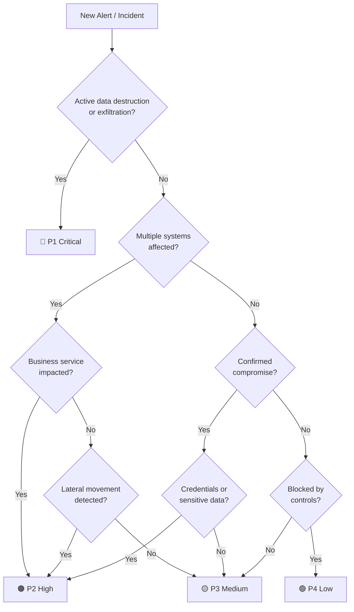

# Incident Severity Matrix

> **Document ID:** SEV-MATRIX-001  
> **Version:** 1.0  
> **Last Updated:** 2026-02-15  
> **Owner:** SOC Manager  

---

## Purpose

This matrix defines the **severity classification** (P1–P4) for all security incidents handled by the SOC. It standardizes response times, escalation paths, and team assignments to ensure consistent and timely incident handling.

---

## Severity Levels Overview

| Priority | Severity | Impact | Examples |
|:---:|:---|:---|:---|
| 🔴 **P1** | **Critical** | Business-stopping, data breach in progress, active ransomware | Ransomware encryption active, confirmed data exfiltration, critical infrastructure compromise, active APT intrusion |
| 🟠 **P2** | **High** | Significant impact, potential data loss, service degradation | Account compromise with lateral movement, malware outbreak (>5 hosts), DDoS affecting production, insider threat confirmed |
| 🟡 **P3** | **Medium** | Limited impact, contained threat, single-system compromise | Single endpoint malware, phishing (credentials entered but reset), unauthorized access attempt blocked, suspicious DNS activity |
| 🟢 **P4** | **Low** | Minimal impact, informational, policy violation | Failed login attempts, policy violation (USB usage), low-confidence alert, vulnerability scan detected |

---

## Service Level Agreements (SLA)

| Metric | 🔴 P1 Critical | 🟠 P2 High | 🟡 P3 Medium | 🟢 P4 Low |
|:---|:---:|:---:|:---:|:---:|
| **Acknowledgment** | ≤ 5 min | ≤ 15 min | ≤ 1 hour | ≤ 4 hours |
| **Initial Triage** | ≤ 15 min | ≤ 30 min | ≤ 2 hours | ≤ 8 hours |
| **Containment Start** | ≤ 30 min | ≤ 1 hour | ≤ 4 hours | Next business day |
| **Status Update Frequency** | Every 30 min | Every 1 hour | Every 4 hours | Daily |
| **Resolution Target** | ≤ 4 hours | ≤ 8 hours | ≤ 24 hours | ≤ 72 hours |
| **Post-Incident Review** | Within 24 hours | Within 48 hours | Within 1 week | Monthly batch review |

---

## Escalation Matrix

### P1 — Critical

```
┌─────────────────────────────────────────────────────────────────┐
│  T+0 min   │ SOC Analyst (Tier 1) detects & acknowledges       │
│  T+5 min   │ Escalate → Tier 2 Analyst + SOC Lead              │
│  T+15 min  │ Escalate → Incident Commander + CISO              │
│  T+30 min  │ Notify → CTO / CEO / Legal / PR (if data breach)  │
│  T+60 min  │ Activate → Full IR Team + External DFIR (if needed)│
└─────────────────────────────────────────────────────────────────┘
```

### P2 — High

```
┌─────────────────────────────────────────────────────────────────┐
│  T+0 min   │ SOC Analyst (Tier 1) detects & acknowledges       │
│  T+15 min  │ Escalate → Tier 2 Analyst                         │
│  T+30 min  │ Escalate → SOC Lead                               │
│  T+2 hours │ Notify → SOC Manager + CISO (if not contained)    │
└─────────────────────────────────────────────────────────────────┘
```

### P3 — Medium

```
┌─────────────────────────────────────────────────────────────────┐
│  T+0 min   │ SOC Analyst (Tier 1) detects & acknowledges       │
│  T+1 hour  │ Triage and investigate                            │
│  T+4 hours │ Escalate → Tier 2 (if complex or unresolved)      │
└─────────────────────────────────────────────────────────────────┘
```

### P4 — Low

```
┌─────────────────────────────────────────────────────────────────┐
│  T+0       │ SOC Analyst (Tier 1) detects & acknowledges       │
│  T+8 hours │ Investigate during normal working hours            │
│  Monthly   │ Batch review with SOC Lead                         │
└─────────────────────────────────────────────────────────────────┘
```

---

## Response Team Composition

| Role | P1 | P2 | P3 | P4 |
|:---|:---:|:---:|:---:|:---:|
| SOC Analyst (Tier 1) | ✅ | ✅ | ✅ | ✅ |
| SOC Analyst (Tier 2) | ✅ | ✅ | On-demand | — |
| SOC Lead | ✅ | ✅ | — | — |
| Incident Commander | ✅ | On-demand | — | — |
| CISO | ✅ | Notify | — | — |
| IT Operations | ✅ | ✅ | On-demand | — |
| Legal / Compliance | ✅ (if PII) | On-demand | — | — |
| PR / Communications | ✅ (if public) | — | — | — |
| External DFIR | On-demand | — | — | — |

---

## Severity Classification Decision Tree



---

## Communication Templates

### P1 Initial Notification (to Management)

```
SUBJECT: [P1-CRITICAL] Security Incident — Immediate Action Required

INCIDENT ID: INC-YYYY-XXXX
SEVERITY: P1 — CRITICAL
TIME DETECTED: [timestamp]
AFFECTED SYSTEMS: [list]
CURRENT STATUS: [Triage | Containment | Eradication]

SUMMARY:
[Brief description of what happened]

IMMEDIATE ACTIONS TAKEN:
1. [Action 1]
2. [Action 2]

NEXT UPDATE: [timestamp — within 30 minutes]

INCIDENT COMMANDER: [Name]
CONTACT: [Phone/Slack]
```

### P2–P4 Status Update

```
SUBJECT: [P2-HIGH] Incident Update — INC-YYYY-XXXX

STATUS: [In Progress | Contained | Resolved]
TIME ELAPSED: [X hours since detection]

PROGRESS:
- [What was done since last update]

NEXT STEPS:
- [Planned actions]

NEXT UPDATE: [timestamp]
```

---

## Severity Reclassification

Incidents may be **upgraded or downgraded** during investigation:

| Trigger | Action |
|:---|:---|
| Lateral movement discovered | Upgrade to P1 or P2 |
| Data exfiltration confirmed | Upgrade to P1 |
| Threat contained, no spread | Downgrade one level |
| False positive confirmed | Close or downgrade to P4 |
| Additional systems compromised | Upgrade one level |
| Regulatory data (PII/PHI) involved | Minimum P2 |

> **Rule:** Any severity change must be documented in the incident ticket with justification.

---

## Related Documents

- [Incident Response Playbooks](../05_Incident_Response/Playbooks/)
- [Shift Handover Template](../templates/shift_handover.en.md)
- [Incident Report Template](../templates/incident_report.en.md)
- [MITRE ATT&CK Coverage Heatmap](../tools/mitre_attack_heatmap.html)

## References

- [NIST SP 800-61r2 — Computer Security Incident Handling Guide](https://csrc.nist.gov/publications/detail/sp/800-61/rev-2/final)
- [SANS Incident Handler's Handbook](https://www.sans.org/white-papers/33901/)
- [FIRST — Common Vulnerability Scoring System (CVSS)](https://www.first.org/cvss/)
