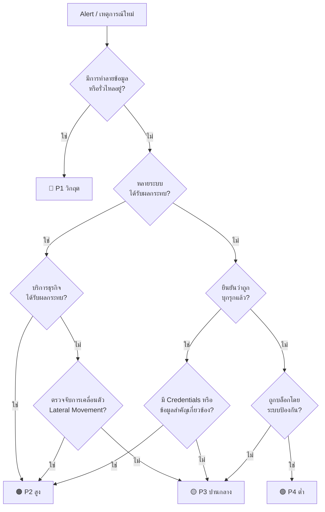

# Incident Severity Matrix — ตารางระดับความรุนแรงของเหตุการณ์

> **รหัสเอกสาร:** SEV-MATRIX-001  
> **เวอร์ชัน:** 1.0  
> **อัปเดตล่าสุด:** 2026-02-15  
> **เจ้าของ:** SOC Manager  

---

## วัตถุประสงค์

ตารางนี้กำหนด **ระดับความรุนแรง** (P1–P4) สำหรับเหตุการณ์ด้านความปลอดภัยทั้งหมดที่ SOC รับผิดชอบ เพื่อให้การตอบสนอง, การ Escalate และการมอบหมายทีมเป็นมาตรฐานเดียวกัน

---

## ภาพรวมระดับความรุนแรง

| ลำดับ | ระดับ | ผลกระทบ | ตัวอย่าง |
|:---:|:---|:---|:---|
| 🔴 **P1** | **วิกฤต (Critical)** | ธุรกิจหยุดชะงัก, กำลังมีข้อมูลรั่วไหล, Ransomware กำลังทำงาน | Ransomware เข้ารหัสไฟล์อยู่, ยืนยันว่ามีข้อมูลรั่วไหล, ระบบโครงสร้างพื้นฐานถูกบุกรุก, APT กำลังทำงาน |
| 🟠 **P2** | **สูง (High)** | ผลกระทบมาก, มีโอกาสสูญเสียข้อมูล, บริการลดลง | บัญชีถูกยึดครองพร้อมเคลื่อนตัว, มัลแวร์ระบาด (>5 เครื่อง), DDoS กระทบ Production, ยืนยัน Insider Threat |
| 🟡 **P3** | **ปานกลาง (Medium)** | ผลกระทบจำกัด, ภัยคุกคามถูกควบคุม, ติดเครื่องเดียว | มัลแวร์ 1 เครื่อง, ฟิชชิ่ง (กรอกรหัสแล้วแต่รีเซ็ตทัน), การเข้าถึงโดยไม่ได้รับอนุญาตถูกบล็อก, DNS น่าสงสัย |
| 🟢 **P4** | **ต่ำ (Low)** | ผลกระทบน้อยมาก, ข้อมูลเสริม, ละเมิดนโยบาย | Login ล้มเหลว, ละเมิดนโยบาย (ใช้ USB), Alert ที่มั่นใจต่ำ, ตรวจจับ Vulnerability Scan |

---

## ข้อตกลงระดับบริการ (SLA)

| เมตริก | 🔴 P1 วิกฤต | 🟠 P2 สูง | 🟡 P3 ปานกลาง | 🟢 P4 ต่ำ |
|:---|:---:|:---:|:---:|:---:|
| **รับทราบ (Acknowledge)** | ≤ 5 นาที | ≤ 15 นาที | ≤ 1 ชั่วโมง | ≤ 4 ชั่วโมง |
| **คัดกรองเบื้องต้น (Triage)** | ≤ 15 นาที | ≤ 30 นาที | ≤ 2 ชั่วโมง | ≤ 8 ชั่วโมง |
| **เริ่มควบคุม (Containment)** | ≤ 30 นาที | ≤ 1 ชั่วโมง | ≤ 4 ชั่วโมง | วันทำการถัดไป |
| **อัปเดตสถานะ** | ทุก 30 นาที | ทุก 1 ชั่วโมง | ทุก 4 ชั่วโมง | รายวัน |
| **เป้าหมายแก้ไข (Resolution)** | ≤ 4 ชั่วโมง | ≤ 8 ชั่วโมง | ≤ 24 ชั่วโมง | ≤ 72 ชั่วโมง |
| **ทบทวนหลังเหตุการณ์ (PIR)** | ภายใน 24 ชั่วโมง | ภายใน 48 ชั่วโมง | ภายใน 1 สัปดาห์ | ทบทวนรวมรายเดือน |

---

## ตาราง Escalation

### P1 — วิกฤต

```
┌─────────────────────────────────────────────────────────────────────┐
│  T+0 นาที   │ SOC Analyst (Tier 1) ตรวจจับ & รับทราบ                │
│  T+5 นาที   │ Escalate → Tier 2 Analyst + SOC Lead                 │
│  T+15 นาที  │ Escalate → Incident Commander + CISO                 │
│  T+30 นาที  │ แจ้ง → CTO / CEO / Legal / PR (ถ้าข้อมูลรั่วไหล)       │
│  T+60 นาที  │ เปิดใช้ → ทีม IR เต็มรูปแบบ + DFIR ภายนอก (ถ้าจำเป็น) │
└─────────────────────────────────────────────────────────────────────┘
```

### P2 — สูง

```
┌─────────────────────────────────────────────────────────────────────┐
│  T+0 นาที     │ SOC Analyst (Tier 1) ตรวจจับ & รับทราบ              │
│  T+15 นาที    │ Escalate → Tier 2 Analyst                           │
│  T+30 นาที    │ Escalate → SOC Lead                                 │
│  T+2 ชั่วโมง  │ แจ้ง → SOC Manager + CISO (ถ้ายังควบคุมไม่ได้)       │
└─────────────────────────────────────────────────────────────────────┘
```

### P3 — ปานกลาง

```
┌─────────────────────────────────────────────────────────────────────┐
│  T+0 นาที     │ SOC Analyst (Tier 1) ตรวจจับ & รับทราบ              │
│  T+1 ชั่วโมง  │ คัดกรองและสืบสวน                                     │
│  T+4 ชั่วโมง  │ Escalate → Tier 2 (ถ้าซับซ้อนหรือแก้ไม่ได้)         │
└─────────────────────────────────────────────────────────────────────┘
```

### P4 — ต่ำ

```
┌─────────────────────────────────────────────────────────────────────┐
│  T+0         │ SOC Analyst (Tier 1) ตรวจจับ & รับทราบ               │
│  T+8 ชั่วโมง │ สืบสวนในเวลาทำการปกติ                                │
│  รายเดือน    │ ทบทวนรวมกับ SOC Lead                                 │
└─────────────────────────────────────────────────────────────────────┘
```

---

## องค์ประกอบทีมตอบสนอง

| บทบาท | P1 | P2 | P3 | P4 |
|:---|:---:|:---:|:---:|:---:|
| SOC Analyst (Tier 1) | ✅ | ✅ | ✅ | ✅ |
| SOC Analyst (Tier 2) | ✅ | ✅ | ตามความจำเป็น | — |
| SOC Lead | ✅ | ✅ | — | — |
| Incident Commander | ✅ | ตามความจำเป็น | — | — |
| CISO | ✅ | แจ้งให้ทราบ | — | — |
| IT Operations | ✅ | ✅ | ตามความจำเป็น | — |
| Legal / Compliance | ✅ (ถ้ามี PII) | ตามความจำเป็น | — | — |
| PR / สื่อสารองค์กร | ✅ (ถ้าเป็นข่าว) | — | — | — |
| DFIR ภายนอก | ตามความจำเป็น | — | — | — |

---

## แผนผังการจำแนกระดับความรุนแรง



---

## เทมเพลตการสื่อสาร

### P1 การแจ้งเตือนเบื้องต้น (ถึงผู้บริหาร)

```
หัวข้อ: [P1-วิกฤต] เหตุการณ์ด้านความปลอดภัย — ต้องดำเนินการทันที

รหัสเหตุการณ์: INC-YYYY-XXXX
ระดับความรุนแรง: P1 — วิกฤต
เวลาตรวจจับ: [timestamp]
ระบบที่ได้รับผลกระทบ: [รายการ]
สถานะปัจจุบัน: [คัดกรอง | ควบคุม | กำจัด]

สรุป:
[คำอธิบายสั้นๆ ว่าเกิดอะไรขึ้น]

การดำเนินการเร่งด่วน:
1. [การดำเนินการ 1]
2. [การดำเนินการ 2]

อัปเดตครั้งถัดไป: [timestamp — ภายใน 30 นาที]

ผู้บัญชาการเหตุการณ์: [ชื่อ]
ติดต่อ: [โทรศัพท์/Slack]
```

---

## การเปลี่ยนระดับความรุนแรง

เหตุการณ์อาจถูก **เลื่อนระดับขึ้นหรือลดลง** ระหว่างการสืบสวน:

| ปัจจัย | การดำเนินการ |
|:---|:---|
| ตรวจจับ Lateral Movement | เลื่อนเป็น P1 หรือ P2 |
| ยืนยันว่ามีข้อมูลรั่วไหล | เลื่อนเป็น P1 |
| ภัยคุกคามถูกควบคุม ไม่แพร่กระจาย | ลดลง 1 ระดับ |
| ยืนยันว่าเป็น False Positive | ปิด หรือลดเป็น P4 |
| พบระบบเพิ่มเติมถูกบุกรุก | เลื่อนขึ้น 1 ระดับ |
| มีข้อมูล PII/PHI ที่อยู่ภายใต้กฎหมาย | ไม่ต่ำกว่า P2 |

> **กฎ:** การเปลี่ยนระดับทุกครั้งต้องบันทึกใน Ticket พร้อมเหตุผล

---

## เอกสารที่เกี่ยวข้อง

- [Incident Response Playbooks](../05_Incident_Response/Playbooks/)
- [แบบฟอร์มส่งมอบกะ](../templates/shift_handover.th.md)
- [แบบฟอร์มรายงานเหตุการณ์](../templates/incident_report.th.md)
- [แผนที่ Coverage MITRE ATT&CK](../tools/mitre_attack_heatmap.html)

## References

- [NIST SP 800-61r2 — Computer Security Incident Handling Guide](https://csrc.nist.gov/publications/detail/sp/800-61/rev-2/final)
- [SANS Incident Handler's Handbook](https://www.sans.org/white-papers/33901/)
- [FIRST — Common Vulnerability Scoring System (CVSS)](https://www.first.org/cvss/)
