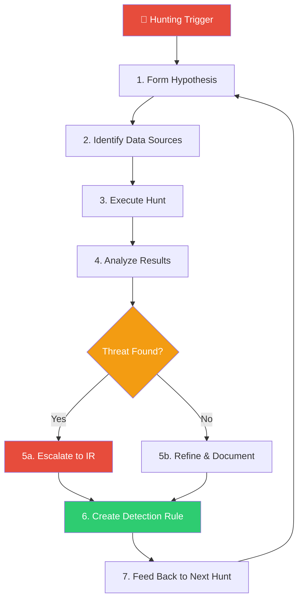
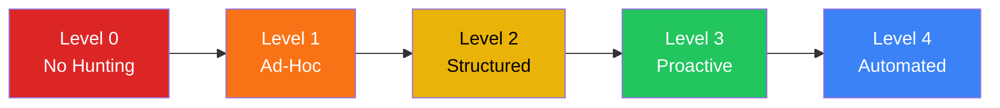

# Threat Hunting Playbook

**Document ID**: TH-SOP-001
**Version**: 1.0
**Classification**: Internal
**Last Updated**: 2026-02-15

> Threat Hunting is the **proactive, iterative search** for adversary activity that has evaded existing detection mechanisms. Unlike reactive alert triage, hunting assumes the adversary is already inside the network.

---

## Process Overview



---

## 1. Hunting Triggers

Hunts are initiated from one of the following triggers:

| Trigger Type | Source | Example |
|:---|:---|:---|
| **Intelligence-Driven** | CTI feed, ISAC alert, vendor advisory | New APT group targeting your sector |
| **Hypothesis-Driven** | Analyst intuition, gap analysis | "Are there signs of credential stuffing?" |
| **Data-Driven** | Anomaly detection, statistical outlier | Spike in DNS queries to new domains |
| **MITRE ATT&CK Gap** | Coverage heatmap | No detection for T1053 (Scheduled Task) |
| **Incident-Driven** | Post-incident review | Hunt for additional compromised hosts |

---

## 2. Hypothesis Development

A good hunting hypothesis follows the **ABLE** framework:

| Component | Description | Example |
|:---|:---|:---|
| **A**ctor / Threat | Who or what are you hunting for? | APT group using Living-off-the-Land |
| **B**ehavior | What behavior would they exhibit? | PowerShell downloading from external URLs |
| **L**og Source | Where would evidence appear? | Windows Event Log (4688), EDR telemetry |
| **E**vidence | What artifacts confirm the hypothesis? | Encoded commands, unusual parent-child process |

### Hypothesis Template

```
IF [ACTOR/THREAT] targets our environment,
THEN we would expect to see [BEHAVIOR]
IN [LOG SOURCE],
EVIDENCED BY [SPECIFIC ARTIFACTS].
```

### Example Hypotheses

| # | Hypothesis | MITRE Technique | Priority |
|:---:|:---|:---|:---:|
| H-01 | Attackers use scheduled tasks for persistence | T1053.005 | High |
| H-02 | Lateral movement via WMI or PsExec | T1047, T1570 | High |
| H-03 | Data staging before exfiltration via DNS | T1560, T1048.003 | Medium |
| H-04 | Credential dumping from LSASS memory | T1003.001 | Critical |
| H-05 | Living-off-the-Land binaries (LOLBins) | T1218 | High |
| H-06 | Cloud SSO token theft / replay | T1550.001 | High |
| H-07 | Rogue service accounts with anomalous behavior | T1078.002 | Medium |
| H-08 | Supply chain compromise via NuGet/npm packages | T1195.002 | Medium |
| H-09 | Email auto-forwarding rules for collection | T1114.003 | Medium |
| H-10 | Reverse proxy / NGROK tunnels for C2 | T1572 | High |

---

## 3. Data Sources & Requirements

### 3.1 Minimum Data Sources

| Data Source | Use Case | Retention |
|:---|:---|:---:|
| **Windows Event Logs** (4688, 4624, 4625, 7045) | Process creation, logon events, service install | 90 days |
| **EDR Telemetry** | Process tree, file writes, network connections | 90 days |
| **DNS Logs** | Domain lookups, tunneling detection | 90 days |
| **Firewall / Proxy Logs** | Outbound connections, blocked traffic | 90 days |
| **Cloud Audit Logs** (CloudTrail, Azure AD) | API calls, sign-in events | 1 year |

### 3.2 Enrichment Sources

| Source | Purpose |
|:---|:---|
| **VirusTotal / OTX** | Hash, domain, IP reputation |
| **MITRE ATT&CK Navigator** | Technique mapping & coverage |
| **Shodan / Censys** | Exposed assets enumeration |
| **Internal Asset DB** | Host ownership, criticality |

---

## 4. Hunt Execution

### 4.1 Hunt Process (Step-by-Step)

-   [ ] **Step 1**: Document hypothesis in the Hunting Log
-   [ ] **Step 2**: Identify relevant data sources and verify data availability
-   [ ] **Step 3**: Build initial queries (SIEM, EDR, or custom scripts)
-   [ ] **Step 4**: Execute queries and collect results
-   [ ] **Step 5**: Investigate anomalies — pivot, correlate, enrich
-   [ ] **Step 6**: Document findings (positive or negative)
-   [ ] **Step 7**: If threat found → Escalate to IR (follow [IR Framework](Framework.en.md))
-   [ ] **Step 8**: Create or improve detection rule → [Detection Rule Testing SOP](../06_Operations_Management/Detection_Rule_Testing.en.md)
-   [ ] **Step 9**: Close hunt and update Hunting Log

### 4.2 Sample Hunt Queries

#### Hunt H-01: Scheduled Task Persistence (T1053.005)

**Windows Event Log (SIEM Query)**:
```
EventID:4698 OR EventID:106
| where TaskName NOT IN ("Microsoft\\*", "\\GoogleUpdate*")
| stats count by ComputerName, TaskName, TaskAuthor
| where count < 3
```

**EDR Query**:
```
process_name:schtasks.exe
AND cmdline:("/create" OR "/change")
AND NOT cmdline:("\\Microsoft\\*")
| rare by cmdline, hostname
```

#### Hunt H-04: LSASS Memory Access (T1003.001)

**EDR Query**:
```
target_process:lsass.exe
AND access_type:PROCESS_VM_READ
AND NOT source_process IN (
    "csrss.exe", "services.exe", "svchost.exe",
    "wininit.exe", "MsMpEng.exe"
)
```

#### Hunt H-06: Cloud SSO Token Anomaly

**Azure AD / CloudTrail Query**:
```
event_name:("ConsoleLogin" OR "GetSessionToken")
| where source_ip != usual_ip_range
| where user_agent CONTAINS "python" OR user_agent CONTAINS "curl"
| stats count by user, source_ip, user_agent
```

#### Hunt H-10: Reverse Proxy / NGROK Tunneling

**DNS + Proxy Log Query**:
```
dns_query:("*.ngrok.io" OR "*.trycloudflare.com" OR "*.serveo.net" OR "*.localhost.run")
OR proxy_url CONTAINS ("ngrok.io" OR "trycloudflare.com")
| stats count by src_ip, hostname, dns_query
```

---

## 5. Hunting Cadence

| Hunt Type | Frequency | Lead | Duration |
|:---|:---:|:---|:---:|
| **Intelligence-driven** (new IOC/TTP) | As needed | Tier 2/3 | 2–4 hours |
| **Hypothesis-driven** (scheduled) | Weekly | Tier 2/3 | 4–8 hours |
| **MITRE gap-driven** | Monthly | Hunt Lead | 1–2 days |
| **Post-incident** | After every P1/P2 | IR Lead | 4–8 hours |
| **Quarterly deep dive** | Quarterly | Hunt Lead | 1 week |

---

## 6. Hunting Maturity Model



| Level | Description | Criteria |
|:---:|:---|:---|
| **0** | No hunting capability | Purely reactive, alert-driven |
| **1** | Ad-hoc hunting | Occasional hunts after major incidents only |
| **2** | Structured hunting | Scheduled hunts, documented hypotheses, basic metrics |
| **3** | Proactive hunting | MITRE-aligned, threat intel-driven, feedback loop to new rules |
| **4** | Automated hunting | ML-assisted anomaly detection, automated hypothesis generation |

### Self-Assessment Checklist

-   [ ] Do we hunt at least **weekly**?
-   [ ] Are hypotheses **documented** before execution?
-   [ ] Do hunts produce **new detection rules**?
-   [ ] Is hunting coverage mapped to **MITRE ATT&CK**?
-   [ ] Do we track **hunting KPIs** (hunts/month, detections created)?
-   [ ] Is there a **dedicated hunter** (not just reactive analysts)?

---

## 7. Hunting KPIs

| KPI | Target | Measurement |
|:---|:---:|:---|
| Hunts completed per month | ≥ 4 | Count of closed hunt tickets |
| Detection rules created from hunts | ≥ 2/month | New Sigma rules from hunting |
| MITRE technique coverage increase | +5% / quarter | ATT&CK Navigator delta |
| Mean time to detect (MTTD) improvement | ↓ 10% / quarter | Before vs after hunt rules |
| True positive rate of new rules | ≥ 70% | TP / (TP + FP) of hunt-created rules |
| Adversary dwell time reduction | ↓ each quarter | Average detection lag |

---

## 8. Hunting Log Template

Every hunt must be documented using this template:

| Field | Value |
|:---|:---|
| **Hunt ID** | TH-YYYY-NNN |
| **Date** | [YYYY-MM-DD] |
| **Hunter** | [Analyst Name] |
| **Hypothesis** | [Describe the hypothesis] |
| **MITRE Technique** | [T-code] |
| **Trigger** | Intelligence / Hypothesis / Data / Gap / Incident |
| **Data Sources Used** | [List logs queried] |
| **Queries Used** | [Paste SIEM/EDR queries] |
| **Findings** | [Positive / Negative / Inconclusive] |
| **Evidence** | [Screenshots, IOCs, timelines] |
| **Action Taken** | [Escalated to IR / New detection rule / None] |
| **Detection Rule Created** | [Sigma file name or "N/A"] |
| **Time Spent** | [Hours] |
| **Status** | Open / In Progress / Closed |

---

## 9. Top 10 Hunt Playbooks (Ready to Execute)

### HP-01: Unauthorized Scheduled Tasks (T1053)
- **Query**: New scheduled tasks created in last 7 days not matching whitelist
- **Indicators**: Task created by non-admin user, unusual binary in action field
- **Escalation**: If found → PB-07 Privilege Escalation

### HP-02: LSASS Credential Dumping (T1003)
- **Query**: Processes accessing lsass.exe memory with read permissions
- **Indicators**: procdump, mimikatz, comsvcs.dll MiniDump
- **Escalation**: If found → PB-05 Account Compromise

### HP-03: DNS Tunneling / DGA (T1048.003)
- **Query**: DNS queries with unusually long subdomains or high entropy
- **Indicators**: Query length > 50 chars, NXDomain ratio > 30%
- **Escalation**: If found → PB-24 DNS Tunneling

### HP-04: Living-off-the-Land (LOLBins) (T1218)
- **Query**: Execution of certutil, mshta, regsvr32, rundll32 with network activity
- **Indicators**: Download flags, encoded parameters, unusual parent process
- **Escalation**: If found → PB-11 Suspicious Script

### HP-05: Lateral Movement via Admin Shares (T1021.002)
- **Query**: SMB connections to C$ or ADMIN$ from non-admin workstations
- **Indicators**: Multiple hosts accessed in short time, off-hours activity
- **Escalation**: If found → PB-12 Lateral Movement

### HP-06: Cloud Identity Anomalies (T1078.004)
- **Query**: Impossible travel, new MFA registration, service principal abuse
- **Indicators**: Login from new country, automated user agent, bulk API calls
- **Escalation**: If found → PB-16 Cloud IAM Anomaly

### HP-07: Email Forwarding Rules (T1114.003)
- **Query**: New inbox rules forwarding to external domains
- **Indicators**: Rule created via API, forwarding to personal email
- **Escalation**: If found → PB-17 BEC

### HP-08: Data Staging / Compression (T1560)
- **Query**: Large archive creation (7z, rar, zip) on servers or DB hosts
- **Indicators**: Archive > 100MB, created at unusual hours, followed by upload
- **Escalation**: If found → PB-08 Data Exfiltration

### HP-09: Reverse Proxy C2 (T1572)
- **Query**: ngrok.io, trycloudflare.com, serveo.net DNS or proxy hits
- **Indicators**: Persistent connections, bidirectional traffic
- **Escalation**: If found → PB-13 C2 Communication

### HP-10: Cryptomining Indicators (T1496)
- **Query**: High CPU processes, connections to mining pools, Stratum protocol
- **Indicators**: xmrig, minergate, pool.* DNS queries
- **Escalation**: If found → PB-23 Cryptomining

---

## Related Documents

-   [IR Framework](Framework.en.md)
-   [Severity Matrix](Severity_Matrix.en.md)
-   [SOAR Playbooks](SOAR_Playbooks.en.md)
-   [Detection Rule Testing SOP](../06_Operations_Management/Detection_Rule_Testing.en.md)
-   [TI Feeds Integration](../06_Operations_Management/TI_Feeds_Integration.en.md)
-   [Threat Intelligence Lifecycle](../06_Operations_Management/Threat_Intelligence_Lifecycle.en.md)
-   [SOC Metrics & KPIs](../06_Operations_Management/SOC_Metrics.en.md)
-   [Atomic Test Map](../08_Simulation_Testing/Atomic_Test_Map.en.md)
-   [MITRE ATT&CK Heatmap](../tools/mitre_attack_heatmap.html)

## References

-   [MITRE ATT&CK](https://attack.mitre.org/)
-   [Sqrrl Threat Hunting Framework](https://www.threathunting.net/sqrrl-archive)
-   [SANS Threat Hunting Survey](https://www.sans.org/white-papers/threat-hunting-survey/)
-   [TaHiTI — Targeted Hunting integrating Threat Intelligence](https://www.betaalvereniging.nl/wp-content/uploads/TaHiTI-Threat-Hunting-Methodology.pdf)
-   [NIST SP 800-61r2 — Computer Security Incident Handling Guide](https://csrc.nist.gov/publications/detail/sp/800-61/rev-2/final)
