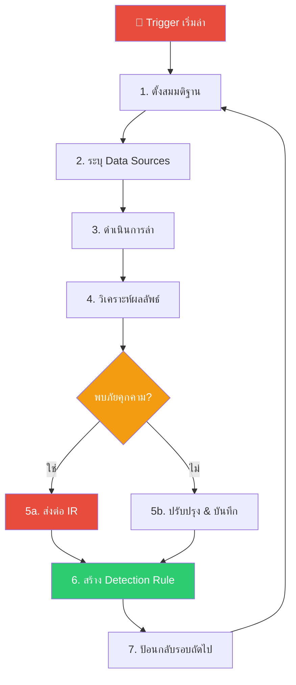

# Threat Hunting Playbook / คู่มือการล่าภัยคุกคาม

**รหัสเอกสาร**: TH-SOP-001
**เวอร์ชัน**: 1.0
**การจัดชั้นความลับ**: ใช้ภายใน
**อัปเดตล่าสุด**: 2026-02-15

> Threat Hunting คือ **การค้นหาเชิงรุก** กิจกรรมของผู้บุกรุกที่หลุดรอดจากระบบตรวจจับที่มีอยู่ ต่างจากการรอดู alert ทั่วไป hunting ตั้งสมมติฐานว่า **ผู้บุกรุกอยู่ในระบบแล้ว**

---

## ภาพรวมกระบวนการ



---

## 1. Trigger (ตัวกระตุ้นการล่า)

| ประเภท Trigger | แหล่งข้อมูล | ตัวอย่าง |
|:---|:---|:---|
| **Intelligence-Driven** | CTI feed, ISAC alert, คำแนะนำจาก vendor | กลุ่ม APT ใหม่โจมตีอุตสาหกรรมของเรา |
| **Hypothesis-Driven** | ความชำนาญของ analyst, gap analysis | "มีสัญญาณ credential stuffing หรือไม่?" |
| **Data-Driven** | anomaly detection, ค่าผิดปกติทางสถิติ | DNS queries ไปยัง domain ใหม่พุ่งสูงผิดปกติ |
| **MITRE ATT&CK Gap** | Coverage heatmap | ไม่มี detection สำหรับ T1053 (Scheduled Task) |
| **Incident-Driven** | บทเรียนหลังเหตุการณ์ | ค้นหาเครื่องอื่นที่อาจถูกบุกรุกเพิ่มเติม |

---

## 2. การพัฒนาสมมติฐาน (ABLE Framework)

สมมติฐานที่ดีใช้กรอบ **ABLE**:

| องค์ประกอบ | คำอธิบาย | ตัวอย่าง |
|:---|:---|:---|
| **A**ctor / ภัยคุกคาม | ใครหรืออะไรที่กำลังล่า? | กลุ่ม APT ใช้ Living-off-the-Land |
| **B**ehavior / พฤติกรรม | พวกเขาจะทำอะไร? | PowerShell ดาวน์โหลดจาก URL ภายนอก |
| **L**og Source / แหล่งข้อมูล | หลักฐานจะปรากฏที่ไหน? | Windows Event Log (4688), EDR telemetry |
| **E**vidence / หลักฐาน | อะไรยืนยันสมมติฐาน? | คำสั่ง encoded, parent-child process ผิดปกติ |

### Template สมมติฐาน

```
ถ้า [ภัยคุกคาม] โจมตีระบบของเรา
เราจะเห็น [พฤติกรรม]
ใน [แหล่งข้อมูล]
โดยมีหลักฐานคือ [สิ่งที่ค้นพบ]
```

### ตัวอย่างสมมติฐาน

| # | สมมติฐาน | MITRE Technique | ระดับความสำคัญ |
|:---:|:---|:---|:---:|
| H-01 | ผู้โจมตีใช้ scheduled tasks เพื่อ persistence | T1053.005 | สูง |
| H-02 | Lateral movement ผ่าน WMI หรือ PsExec | T1047, T1570 | สูง |
| H-03 | Data staging ก่อน exfiltration ผ่าน DNS | T1560, T1048.003 | ปานกลาง |
| H-04 | Credential dumping จาก LSASS memory | T1003.001 | วิกฤต |
| H-05 | ใช้ LOLBins (certutil, mshta, regsvr32) | T1218 | สูง |
| H-06 | Cloud SSO token theft / replay | T1550.001 | สูง |
| H-07 | Service account ที่มีพฤติกรรมผิดปกติ | T1078.002 | ปานกลาง |
| H-08 | Supply chain compromise ผ่าน NuGet/npm | T1195.002 | ปานกลาง |
| H-09 | Email auto-forwarding rules | T1114.003 | ปานกลาง |
| H-10 | Reverse proxy / NGROK tunnels สำหรับ C2 | T1572 | สูง |

---

## 3. Data Sources & ข้อกำหนด

### 3.1 Data Sources ขั้นต่ำ

| Data Source | กรณีใช้งาน | ระยะเก็บ |
|:---|:---|:---:|
| **Windows Event Logs** (4688, 4624, 4625, 7045) | Process creation, logon, service install | 90 วัน |
| **EDR Telemetry** | Process tree, file writes, network connections | 90 วัน |
| **DNS Logs** | Domain lookups, tunneling detection | 90 วัน |
| **Firewall / Proxy Logs** | Outbound connections, blocked traffic | 90 วัน |
| **Cloud Audit Logs** (CloudTrail, Azure AD) | API calls, sign-in events | 1 ปี |

### 3.2 แหล่ง Enrichment

| แหล่ง | วัตถุประสงค์ |
|:---|:---|
| **VirusTotal / OTX** | ตรวจสอบชื่อเสียง hash, domain, IP |
| **MITRE ATT&CK Navigator** | แมป technique & coverage |
| **Shodan / Censys** | ค้นหา asset ที่เปิดเผย |
| **Internal Asset DB** | เจ้าของเครื่อง, ระดับความสำคัญ |

---

## 4. การดำเนินการล่า

### 4.1 ขั้นตอน (ทีละขั้น)

-   [ ] **ขั้นที่ 1**: บันทึกสมมติฐานใน Hunting Log
-   [ ] **ขั้นที่ 2**: ระบุ data sources ที่เกี่ยวข้อง ตรวจสอบว่ามีข้อมูลพร้อมใช้
-   [ ] **ขั้นที่ 3**: สร้าง queries เบื้องต้น (SIEM, EDR, หรือ scripts)
-   [ ] **ขั้นที่ 4**: รัน queries และเก็บผลลัพธ์
-   [ ] **ขั้นที่ 5**: สืบสวน anomalies — pivot, correlate, enrich
-   [ ] **ขั้นที่ 6**: บันทึกผลการค้นพบ (พบ / ไม่พบ)
-   [ ] **ขั้นที่ 7**: ถ้าพบภัยคุกคาม → ส่งต่อ IR (ตาม [IR Framework](Framework.en.md))
-   [ ] **ขั้นที่ 8**: สร้างหรือปรับปรุง detection rule → [Detection Rule Testing SOP](../06_Operations_Management/Detection_Rule_Testing.en.md)
-   [ ] **ขั้นที่ 9**: ปิด hunt และอัปเดต Hunting Log

### 4.2 ตัวอย่าง Hunt Queries

#### Hunt H-01: Scheduled Task Persistence (T1053.005)

**Windows Event Log (SIEM Query)**:
```
EventID:4698 OR EventID:106
| where TaskName NOT IN ("Microsoft\\*", "\\GoogleUpdate*")
| stats count by ComputerName, TaskName, TaskAuthor
| where count < 3
```

**EDR Query**:
```
process_name:schtasks.exe
AND cmdline:("/create" OR "/change")
AND NOT cmdline:("\\Microsoft\\*")
| rare by cmdline, hostname
```

#### Hunt H-04: LSASS Memory Access (T1003.001)

```
target_process:lsass.exe
AND access_type:PROCESS_VM_READ
AND NOT source_process IN (
    "csrss.exe", "services.exe", "svchost.exe",
    "wininit.exe", "MsMpEng.exe"
)
```

#### Hunt H-10: Reverse Proxy / NGROK Tunneling

```
dns_query:("*.ngrok.io" OR "*.trycloudflare.com" OR "*.serveo.net")
OR proxy_url CONTAINS ("ngrok.io" OR "trycloudflare.com")
| stats count by src_ip, hostname, dns_query
```

---

## 5. ความถี่ในการล่า

| ประเภทการล่า | ความถี่ | ผู้รับผิดชอบ | ระยะเวลา |
|:---|:---:|:---|:---:|
| **Intelligence-driven** (IOC/TTP ใหม่) | ตามเหตุการณ์ | Tier 2/3 | 2–4 ชม. |
| **Hypothesis-driven** (ตามกำหนด) | สัปดาห์ละครั้ง | Tier 2/3 | 4–8 ชม. |
| **MITRE gap-driven** | เดือนละครั้ง | Hunt Lead | 1–2 วัน |
| **Post-incident** | หลังทุก P1/P2 | IR Lead | 4–8 ชม. |
| **Quarterly deep dive** | ไตรมาสละครั้ง | Hunt Lead | 1 สัปดาห์ |

---

## 6. ระดับความสมบูรณ์ (Maturity Model)


| ระดับ | คำอธิบาย | เกณฑ์ |
|:---:|:---|:---|
| **0** | ไม่มีความสามารถในการล่า | ตอบสนองเฉพาะ alert เท่านั้น |
| **1** | ล่าเป็นครั้งคราว | ล่าเฉพาะหลังเหตุการณ์ร้ายแรง |
| **2** | มีโครงสร้าง | ล่าตามกำหนดการ, มีสมมติฐาน, มี metrics เบื้องต้น |
| **3** | เชิงรุก | สอดคล้อง MITRE, ขับเคลื่อนด้วย threat intel, ป้อนกลับเป็น rule ใหม่ |
| **4** | อัตโนมัติ | ใช้ ML ตรวจจับ anomaly, สร้างสมมติฐานอัตโนมัติ |

### แบบประเมินตนเอง

-   [ ] เราล่าอย่างน้อย **สัปดาห์ละครั้ง** หรือไม่?
-   [ ] สมมติฐานถูก **บันทึก** ก่อนดำเนินการหรือไม่?
-   [ ] การล่าสร้าง **detection rule ใหม่** หรือไม่?
-   [ ] coverage ถูกแมปกับ **MITRE ATT&CK** หรือไม่?
-   [ ] เราติดตาม **Hunting KPIs** หรือไม่?
-   [ ] มี **นักล่าเฉพาะทาง** (ไม่ใช่แค่ reactive analyst) หรือไม่?

---

## 7. ตัวชี้วัด (KPIs)

| KPI | เป้าหมาย | วิธีวัด |
|:---|:---:|:---|
| จำนวนการล่าต่อเดือน | ≥ 4 | นับ hunt tickets ที่ปิดแล้ว |
| Detection rules ที่สร้างจากการล่า | ≥ 2/เดือน | Sigma rules ใหม่จาก hunting |
| MITRE technique coverage เพิ่มขึ้น | +5% / ไตรมาส | ATT&CK Navigator delta |
| MTTD ลดลง | ↓ 10% / ไตรมาส | เปรียบเทียบก่อน-หลังมี hunt rules |
| True positive rate ของ rules ใหม่ | ≥ 70% | TP / (TP + FP) |
| ระยะเวลาที่ผู้บุกรุกอยู่ในระบบลดลง | ↓ ทุกไตรมาส | ค่าเฉลี่ย detection lag |

---

## 8. Template บันทึกการล่า (Hunting Log)

ทุกการล่าต้องบันทึกด้วย template นี้:

| ฟิลด์ | ค่า |
|:---|:---|
| **Hunt ID** | TH-YYYY-NNN |
| **วันที่** | [YYYY-MM-DD] |
| **ผู้ล่า** | [ชื่อ Analyst] |
| **สมมติฐาน** | [อธิบายสมมติฐาน] |
| **MITRE Technique** | [T-code] |
| **Trigger** | Intelligence / Hypothesis / Data / Gap / Incident |
| **Data Sources ที่ใช้** | [รายชื่อ logs] |
| **Queries ที่ใช้** | [แนบ SIEM/EDR queries] |
| **ผลการค้นพบ** | พบ / ไม่พบ / ไม่แน่ชัด |
| **หลักฐาน** | [screenshots, IOCs, timelines] |
| **การดำเนินการ** | ส่งต่อ IR / สร้าง detection rule / ไม่มี |
| **Detection Rule ที่สร้าง** | [ชื่อไฟล์ Sigma หรือ "N/A"] |
| **เวลาที่ใช้** | [ชั่วโมง] |
| **สถานะ** | เปิด / กำลังดำเนินการ / ปิด |

---

## 9. Hunt Playbooks 10 อันดับแรก (พร้อมใช้งาน)

### HP-01: Unauthorized Scheduled Tasks (T1053)
- **Query**: scheduled tasks ใหม่ใน 7 วันที่ไม่ตรง whitelist
- **ตัวบ่งชี้**: task สร้างโดย non-admin, binary ผิดปกติ
- **ส่งต่อ**: ถ้าพบ → PB-07 Privilege Escalation

### HP-02: LSASS Credential Dumping (T1003)
- **Query**: process ที่เข้าถึง lsass.exe memory
- **ตัวบ่งชี้**: procdump, mimikatz, comsvcs.dll MiniDump
- **ส่งต่อ**: ถ้าพบ → PB-05 Account Compromise

### HP-03: DNS Tunneling / DGA (T1048.003)
- **Query**: DNS queries ที่มี subdomain ยาวผิดปกติหรือ entropy สูง
- **ตัวบ่งชี้**: Query ยาว > 50 ตัวอักษร, NXDomain ratio > 30%
- **ส่งต่อ**: ถ้าพบ → PB-24 DNS Tunneling

### HP-04: Living-off-the-Land / LOLBins (T1218)
- **Query**: certutil, mshta, regsvr32, rundll32 ที่มี network activity
- **ตัวบ่งชี้**: download flags, encoded parameters, parent process ผิดปกติ
- **ส่งต่อ**: ถ้าพบ → PB-11 Suspicious Script

### HP-05: Lateral Movement ผ่าน Admin Shares (T1021.002)
- **Query**: SMB connections ไปยัง C$ หรือ ADMIN$ จาก workstation ที่ไม่ใช่ admin
- **ตัวบ่งชี้**: เข้าถึงหลายเครื่องในเวลาสั้น, off-hours
- **ส่งต่อ**: ถ้าพบ → PB-12 Lateral Movement

### HP-06: Cloud Identity Anomalies (T1078.004)
- **Query**: Impossible travel, MFA registration ใหม่, service principal abuse
- **ตัวบ่งชี้**: login จากประเทศใหม่, user agent อัตโนมัติ
- **ส่งต่อ**: ถ้าพบ → PB-16 Cloud IAM Anomaly

### HP-07: Email Forwarding Rules (T1114.003)
- **Query**: inbox rules ใหม่ที่ forward ไปยัง domain ภายนอก
- **ตัวบ่งชี้**: rule สร้างผ่าน API, forward ไป email ส่วนตัว
- **ส่งต่อ**: ถ้าพบ → PB-17 BEC

### HP-08: Data Staging / Compression (T1560)
- **Query**: สร้าง archive ขนาดใหญ่ (7z, rar, zip) บน servers
- **ตัวบ่งชี้**: archive > 100MB, สร้างนอกเวลาทำงาน
- **ส่งต่อ**: ถ้าพบ → PB-08 Data Exfiltration

### HP-09: Reverse Proxy C2 (T1572)
- **Query**: ngrok.io, trycloudflare.com DNS / proxy hits
- **ตัวบ่งชี้**: connections ต่อเนื่อง, traffic สองทิศทาง
- **ส่งต่อ**: ถ้าพบ → PB-13 C2 Communication

### HP-10: Cryptomining (T1496)
- **Query**: process CPU สูง, connections ไปยัง mining pools
- **ตัวบ่งชี้**: xmrig, minergate, pool.* DNS queries
- **ส่งต่อ**: ถ้าพบ → PB-23 Cryptomining

---

## เอกสารที่เกี่ยวข้อง

-   [IR Framework](Framework.en.md)
-   [Severity Matrix](Severity_Matrix.en.md)
-   [SOAR Playbooks](SOAR_Playbooks.en.md)
-   [Detection Rule Testing SOP](../06_Operations_Management/Detection_Rule_Testing.en.md)
-   [TI Feeds Integration](../06_Operations_Management/TI_Feeds_Integration.en.md)
-   [Threat Intelligence Lifecycle](../06_Operations_Management/Threat_Intelligence_Lifecycle.en.md)
-   [SOC Metrics & KPIs](../06_Operations_Management/SOC_Metrics.en.md)
-   [Atomic Test Map](../08_Simulation_Testing/Atomic_Test_Map.en.md)

### Hunt Hypothesis Template

| Field | Content |
|:---|:---|
| Hypothesis | [สมมติฐาน] |
| Data Sources | [log sources ที่ต้องใช้] |
| Tools | [เครื่องมือ] |
| Timeframe | [ช่วงเวลา] |
| Success Criteria | [เกณฑ์ที่บ่งชี้การพบภัย] |

### Hunt Priority

| Level | Trigger |
|:---|:---|
| P1 | Active threat intel |
| P2 | Gap in coverage |

## อ้างอิง

-   [MITRE ATT&CK](https://attack.mitre.org/)
-   [Sqrrl Threat Hunting Framework](https://www.threathunting.net/sqrrl-archive)
-   [SANS Threat Hunting Survey](https://www.sans.org/white-papers/threat-hunting-survey/)
-   [TaHiTI — Targeted Hunting integrating Threat Intelligence](https://www.betaalvereniging.nl/wp-content/uploads/TaHiTI-Threat-Hunting-Methodology.pdf)
-   [NIST SP 800-61r2](https://csrc.nist.gov/publications/detail/sp/800-61/rev-2/final)
