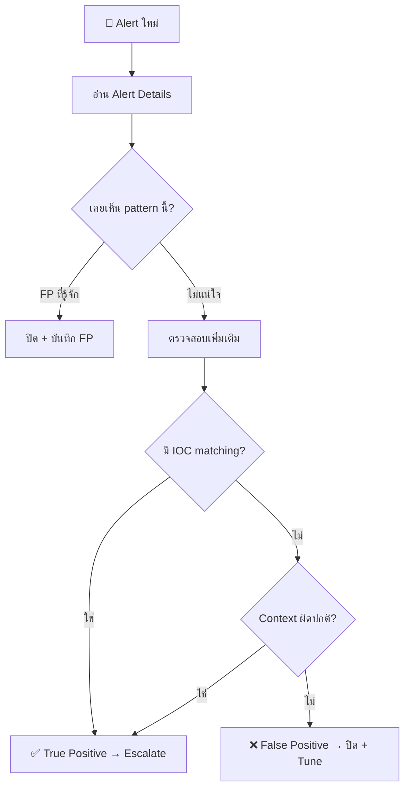
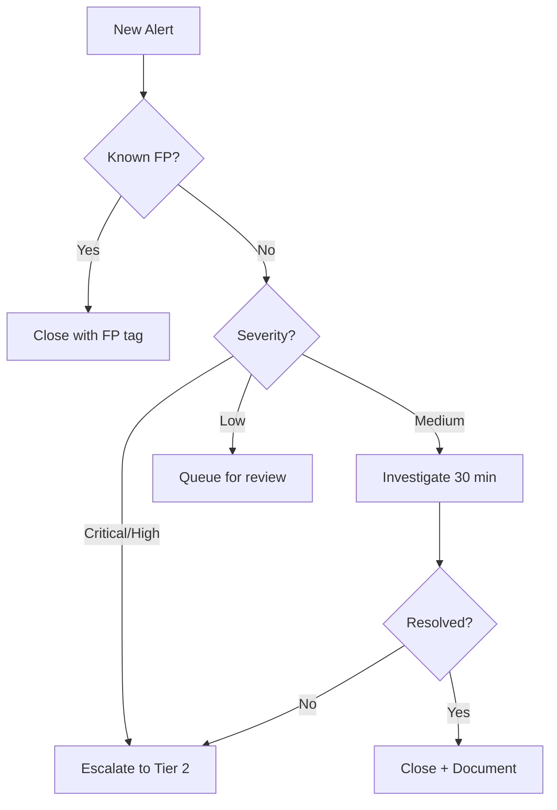

# คู่มือปฏิบัติงาน SOC Tier 1

> **รหัสเอกสาร:** RB-T1-001  
> **เวอร์ชัน:** 1.0  
> **อัปเดตล่าสุด:** 2026-02-15  
> **เจ้าของ:** SOC Manager  
> **กลุ่มเป้าหมาย:** Tier 1 / SOC Analyst มือใหม่

---

## ขั้นตอนการทำงานประจำวัน

```
08:00  เริ่มกะ → อ่าน handoff notes → เช็ค dashboard
08:15  ตรวจสอบ alert queue → จัดลำดับตามความรุนแรง
08:30  เริ่ม process alerts (เป้าหมาย: 12–15 alerts/ชม.)
       ↓ วนซ้ำ ↓
       Triage → สืบสวน → Escalate หรือ Close
12:00  Review กลางวันกับ T2 lead
16:00  เตรียม handoff notes
16:30  ส่งมอบกะ
```

---

## Alert Triage — 5 นาทีแรก

### ขั้นที่ 1: อ่าน Alert
| ตรวจอะไร | มองหาอะไร |
|:---|:---|
| **แหล่ง** | เครื่องมือไหนแจ้ง? (EDR, SIEM, IDS, email gateway) |
| **ความรุนแรง** | ระบบจัดลำดับอย่างไร? |
| **ระบบ** | เครื่องไหนโดน? (server, workstation, cloud) |
| **ผู้ใช้** | ใครเกี่ยวข้อง? (พนักงาน, service account, admin) |

### ขั้นที่ 2: ตรวจบริบท (2 นาที)
```
□ เป็น false positive ที่รู้จักไหม?
□ ระบบอยู่ในช่วง maintenance ไหม?
□ user/host นี้เคยมี alert คล้ายกันหรือเปล่า? (ดูย้อน 7 วัน)
□ ซ้ำกับ incident ที่เปิดอยู่ไหม?
```

### ขั้นที่ 3: ตัดสินใจ
| ตัดสินใจ | ทำอะไร | เวลา |
|:---|:---|:---:|
| ✅ True Positive | สร้าง ticket → Escalate T2 | 15 นาที |
| ⚠️ ต้องสืบเพิ่ม | Enrich IOC → Pivot → ตัดสินใจ | 30 นาที |
| ❌ False Positive | บันทึกเหตุผล → Close | 5 นาที |
| 🔴 P1 วิกฤต | **Escalate ทันที** | 0 นาที |

---

## 🚨 ต้อง Escalate เสมอ เมื่อเจอ:

- สัญญาณ Ransomware (เข้ารหัสไฟล์, ลบ shadow copy)
- ข้อมูลกำลังรั่ว (upload ขนาดใหญ่ไป IP นอก)
- บัญชีผู้บริหารถูกยึด
- หลายเครื่องโดนพร้อมกัน
- Production server ถูกบุกรุก
- Malware ทำงานสำเร็จ
- Alert จาก OT/ICS
- ไม่เข้าใจ alert หลังจาก 30 นาที

---

## Alert ที่พบบ่อย

### 🎣 Phishing → PB-01
```
1. ห้ามคลิก link/เปิดไฟล์แนบ
2. ตรวจ email header → ปลอมแปลงไหม?
3. ตรวจ URL → VirusTotal, URLhaus
4. ค้นหาว่าคนอื่นได้ email เดียวกันไหม
5. ถ้าอันตราย → Block sender + URL → Escalate T2
```

### 🔐 Failed Login → PB-04
```
1. IP มาจากไหน?
2. นับจำนวนครั้งและช่วงเวลา
3. มี login สำเร็จหลังจาก fail หรือเปล่า?
4. ถ้า external + >10 ครั้ง → Block IP
5. ถ้า login สำเร็จหลัง fail → อาจถูก compromise → Escalate
```

### 🦠 Malware → PB-03
```
1. ตรวจชื่อ detection → malware ประเภทใด?
2. ถูก block หรือทำงานสำเร็จ?
3. ดู process tree → อะไร launch มัน?
4. ถ้า EXECUTE สำเร็จ → Escalate ทันที
5. ถ้า BLOCK → ยืนยัน quarantine → หาเครื่องอื่น
```

---

## IOC Enrichment

| ประเภท | ใช้เครื่องมือ |
|:---|:---|
| IP | VirusTotal, AbuseIPDB, Shodan |
| Domain | VirusTotal, URLhaus, WHOIS |
| Hash | VirusTotal, MalwareBazaar |
| URL | URLScan.io, URLhaus |

---

## Template บันทึก Ticket

```
## สรุป Alert
- Alert ID: [จาก SIEM]
- เวลา: [เมื่อไหร่]
- เครื่องมือ: [EDR/SIEM/IDS]
- ระบบที่โดน: [hostname/IP]
- ผู้ใช้: [username]

## สิ่งที่ตรวจสอบ
1. [ตรวจอะไรก่อน]
2. [พบอะไร]
3. [บริบทเพิ่มเติม]

## IOC
- IP: x.x.x.x (VT: X/90)
- Hash: abc123...

## ตัดสินใจ
- [x] True Positive → Escalate T2
- [ ] False Positive → Close

## สิ่งที่ทำ
- Block IP
- Quarantine file
- แจ้งผู้ใช้
```

---

## Quick Reference: การจำแนก Alert

| สัญญาณ | True Positive มักจะ... | False Positive มักจะ... |
|:---|:---|:---|
| **Source IP** | Internal host ที่ไม่ใช่ admin | Scanner, vulnerability test |
| **Destination** | C2 domain, known bad IP | CDN, cloud service |
| **User** | คนจริง, มี login history | Service account, bot |
| **เวลา** | นอกเวลาทำงาน | ระหว่าง maintenance window |
| **Frequency** | เกิดครั้งเดียว | ซ้ำ ๆ ตามรูปแบบ |

## Triage Decision Tree



## คำสั่ง Investigation ที่ใช้บ่อย

### ตรวจสอบ IP Reputation

```bash
# VirusTotal
curl -s "https://www.virustotal.com/api/v3/ip_addresses/{IP}"   -H "x-apikey: $VT_API_KEY" | jq '.data.attributes.last_analysis_stats'

# AbuseIPDB
curl -s "https://api.abuseipdb.com/api/v2/check?ipAddress={IP}"   -H "Key: $ABUSEIPDB_KEY" | jq '.data.abuseConfidenceScore'
```

## SLA ตาม Severity

| Severity | Response Time | Triage Time | Escalation Time |
|:---|:---:|:---:|:---:|
| 🔴 Critical | ≤ 5 นาที | ≤ 15 นาที | ทันที |
| 🟠 High | ≤ 10 นาที | ≤ 30 นาที | ≤ 1 ชม. |
| 🟡 Medium | ≤ 30 นาที | ≤ 60 นาที | ≤ 4 ชม. |
| 🟢 Low | ≤ 60 นาที | ≤ 4 ชม. | Next shift |

## Shift Handoff Quick Notes Template

```
=== Shift Handoff: [วันที่] ===
✅ Closed: [จำนวน] alerts
⏳ Open:   [จำนวน] ตั๋ว
🔴 Active Incidents: [รายการ]
📝 Notes: [สิ่งที่ต้องส่งต่อ]
```

### Quick Reference: Alert Severity Mapping

| Alert Source | Severity Mapping | Initial Action |
|:---|:---|:---|
| EDR - Malware detected | High | Isolate + Investigate |
| SIEM - Failed logins (>10) | Medium | Verify user + Lock |
| Firewall - Port scan | Low | Monitor + Log |
| DLP - Data exfiltration | Critical | Block + Escalate |
| IDS - Exploit attempt | High | Block IP + Investigate |

### Tier 1 Decision Quick Guide



## เอกสารที่เกี่ยวข้อง

- [กรอบ IR](Framework.th.md)
- [ตารางความรุนแรง](Severity_Matrix.th.md)
- [ส่งมอบกะ](../06_Operations_Management/Shift_Handoff.th.md)
- [Playbook ทั้งหมด](Playbooks/)
